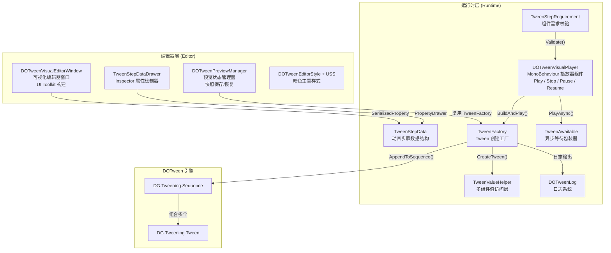

**DOTween Visual Editor** 是一个面向 Unity 开发者的可视化 Tween 动画编辑工具。它基于成熟的 [DOTween](http://dotween.demigiant.com/) 动画库构建，将原本需要大量手写代码的动画编排过程，转化为 Inspector 面板中的数据配置和专属编辑器窗口中的可视化操作。开发者无需记忆 DOTween 的 API 细节，只需在编辑器中"点选 → 配置 → 预览"，即可完成从简单位移到复杂路径动画的全部编排工作。

Sources: [README.md](README.md#L1-L3), [package.json](package.json#L1-L7)

## 核心设计理念

DOTween Visual Editor 的架构围绕一个关键设计决策展开：**组件绑定模式**。每一个 `DOTweenVisualPlayer` 组件直接挂载在需要播放动画的 GameObject 上，步骤数据通过 Unity 序列化系统与该 GameObject 一对一绑定。这意味着你不需要全局管理器、不需要额外的配置文件——动画数据就"长"在物体身上，拖拽预制体时数据自然跟随， inspectors 中的修改即时生效。这种设计大幅降低了开发者的心智负担。

Sources: [DOTweenVisualPlayer.cs](Runtime/Components/DOTweenVisualPlayer.cs#L9-L14), [README.md](README.md#L7)

## 整体架构概览

项目采用经典的 **Runtime / Editor 分层架构**，运行时代码与编辑器代码通过 Assembly Definition 严格隔离。下面的 Mermaid 图展示了从用户操作到动画执行的完整数据流向：



Sources: [架构设计.md](Documentation~/架构设计.md#L1-L61), [DOTweenVisualPlayer.cs](Runtime/Components/DOTweenVisualPlayer.cs#L290-L354)

## 项目结构

```
DOTweenVisualEditor/
├── Runtime/                          # 运行时程序集
│   ├── Components/
│   │   ├── DOTweenVisualPlayer.cs    # ⭐ 主播放器组件 — 动画生命周期管理
│   │   └── TweenAwaitable.cs         # 异步等待包装器 — 协程/UniTask 支持
│   └── Data/
│       ├── TweenStepData.cs          # ⭐ 动画步骤数据结构 — 多值组设计
│       ├── TweenStepType.cs          # 14 种动画类型枚举
│       ├── ExecutionMode.cs          # Append / Join / Insert 执行模式
│       ├── TransformTarget.cs        # 坐标空间与特效目标枚举
│       ├── TweenFactory.cs           # ⭐ Tween 创建工厂 — 运行时与预览共用
│       ├── TweenStepRequirement.cs   # 组件需求校验系统
│       ├── TweenValueHelper.cs       # 多组件适配值访问层
│       └── DOTweenLog.cs             # 四级日志系统
├── Editor/                           # 编辑器程序集
│   ├── DOTweenVisualEditorWindow.cs  # ⭐ 可视化编辑器主窗口
│   ├── DOTweenPreviewManager.cs      # 预览状态管理器
│   ├── DOTweenEditorStyle.cs         # 样式配置
│   ├── TweenStepDataDrawer.cs        # Inspector 自定义绘制器
│   └── USS/
│       └── DOTweenVisualEditor.uss   # 暗色主题样式表
└── package.json                      # 包描述 (com.cnoom.dotweenvisual)
```

Sources: [README.md](README.md#L70-L94)

## 功能特性一览

| 特性 | 说明 | 适用场景 |
|------|------|----------|
| **14 种动画类型** | Move、Rotate、Scale、Color、Fade、AnchorMove、SizeDelta、Jump、Punch、Shake、FillAmount、DOPath、Delay、Callback | 覆盖 UI、3D 物体、特效等常见需求 |
| **三种执行模式** | Append（顺序追加）、Join（与上一步并行）、Insert（定点时间插入） | 灵活编排动画序列时序 |
| **可视化编辑器** | 基于 UI Toolkit 的专用编辑器窗口，左侧步骤列表 + 右侧详情面板 + 内联时间轴 | 批量管理复杂动画序列 |
| **实时预览** | 编辑器内即时预览，支持暂停、重播、重置，预览前自动保存快照 | 无需运行游戏即可调试动画 |
| **Inspector 编辑** | 自定义 PropertyDrawer，按动画类型条件显示字段，支持一键同步当前值 | 快速修改单个步骤参数 |
| **路径动画** | DOPath 支持 Linear / CatmullRom / CubicBezier 路径，可视化编辑路径点 | 角色巡游、物体轨迹动画 |
| **异步等待** | `PlayAsync()` 返回 TweenAwaitable，支持协程 yield 和 UniTask await | UI 流程控制、过场动画编排 |
| **链式回调** | `OnStart` / `OnComplete` / `OnUpdate` / `OnDone` 链式 API | 动画事件驱动的游戏逻辑 |
| **组件校验** | 自动检测目标物体是否满足动画类型的组件需求（如 Fade 需要 Graphic） | 提前发现配置错误 |
| **DOTween 版本适配** | 自动适配 DOTween Free / Pro 版本及 TextMeshPro | 无需手动处理条件编译 |

Sources: [README.md](README.md#L5-L18), [TweenStepType.cs](Runtime/Data/TweenStepType.cs#L1-L48), [ExecutionMode.cs](Runtime/Data/ExecutionMode.cs#L1-L15)

## 14 种动画类型分类

`TweenStepType` 枚举定义了所有支持的动画类型，按功能领域分为五大类：

| 分类 | 动画类型 | 描述 |
|------|----------|------|
| **Transform** | `Move` | 位移动画，支持世界/本地坐标空间 |
| | `Rotate` | 旋转动画，内部四元数插值，编辑器以欧拉角呈现 |
| | `Scale` | 缩放动画 |
| **视觉** | `Color` | 颜色渐变动画，适配 Graphic / Renderer / SpriteRenderer / TMP |
| | `Fade` | 透明度动画，同上组件适配 |
| **UI** | `AnchorMove` | 锚点位置动画（RectTransform.anchoredPosition） |
| | `SizeDelta` | UI 尺寸动画（RectTransform.sizeDelta） |
| **特效** | `Jump` | 跳跃移动动画，可配置跳跃高度和次数 |
| | `Punch` | 冲击弹性动画，目标可选 Position / Rotation / Scale |
| | `Shake` | 震动动画，目标同上，可配置随机性和回弹 |
| | `FillAmount` | Image 填充量动画（血条、进度条） |
| **路径** | `DOPath` | 路径移动动画，支持三种路径插值类型 |
| **流程控制** | `Delay` | 纯延迟等待，不产生 Tween |
| | `Callback` | 回调调用，触发 UnityEvent |

Sources: [TweenStepType.cs](Runtime/Data/TweenStepType.cs#L1-L48)

## 运行时 API 速览

`DOTweenVisualPlayer` 提供了简洁直观的播放控制 API，同时支持同步和异步两种使用模式：

```csharp
var player = GetComponent<DOTweenVisualPlayer>();

// 基础播放控制
player.Play();        // 播放
player.Stop();         // 停止（属性回滚到起始状态）
player.Pause();        // 暂停
player.Resume();       // 恢复
player.Restart();      // 停止后重新播放
player.Complete();     // 跳到动画末尾

// 异步等待
yield return player.PlayAsync();                    // 协程
await player.PlayAsync().ToUniTask();               // UniTask
player.PlayAsync().OnDone(completed => { ... });    // 回调

// 链式回调
player.OnStart(() => Debug.Log("开始"))
      .OnComplete(() => Debug.Log("完成"))
      .OnDone(completed => Debug.Log($"结束: {completed}"))
      .Play();
```

Sources: [DOTweenVisualPlayer.cs](Runtime/Components/DOTweenVisualPlayer.cs#L137-L228), [README.md](README.md#L42-L68)

## 前置要求

在安装 DOTween Visual Editor 之前，请确认你的项目满足以下条件：

| 依赖项 | 最低版本 | 说明 |
|--------|----------|------|
| Unity | 2021.3 LTS | 使用了 UI Toolkit 等 2021.3+ API |
| DOTween | ≥ 1.2.765 | 需在 DOTween Utility Panel 中生成 ASMDEF 文件 |

> **特别提示**：安装 DOTween 后，务必打开 `Tools > Demigiant > DOTween Utility Panel`，点击「Create ASMDEF」按钮，为 DOTween 生成程序集定义文件。DOTween Visual Editor 通过 Assembly Definition 引用 DOTween，缺少此文件将导致编译错误。

Sources: [README.md](README.md#L29-L31)

## 推荐阅读路径

作为入门概述，本文档旨在建立对 DOTween Visual Editor 的全局认知。接下来的学习路径按照"从实践到原理"的逻辑组织：

**第一步：动手实践** — 跳转到 [快速上手：安装配置与第一个动画](2-kuai-su-shang-shou-an-zhuang-pei-zhi-yu-di-ge-dong-hua)，通过一个完整的安装和创建流程快速体验工具能力。

**第二步：了解全貌** — 完成上手后，阅读 [动画类型一览：14 种 TweenStepType 详解](3-dong-hua-lei-xing-lan-14-chong-tweensteptype-xiang-jie) 掌握所有动画类型的参数细节，再阅读 [编辑器窗口使用指南](4-bian-ji-qi-chuang-kou-shi-yong-zhi-nan) 熟练使用编辑器。

**第三步：深入理解** — 当你需要自定义集成或排查问题时，进入"深入理解"章节，从 [整体架构设计：分层与模块职责](5-zheng-ti-jia-gou-she-ji-fen-ceng-yu-mo-kuai-zhi-ze) 开始逐步深入每个模块的设计原理。