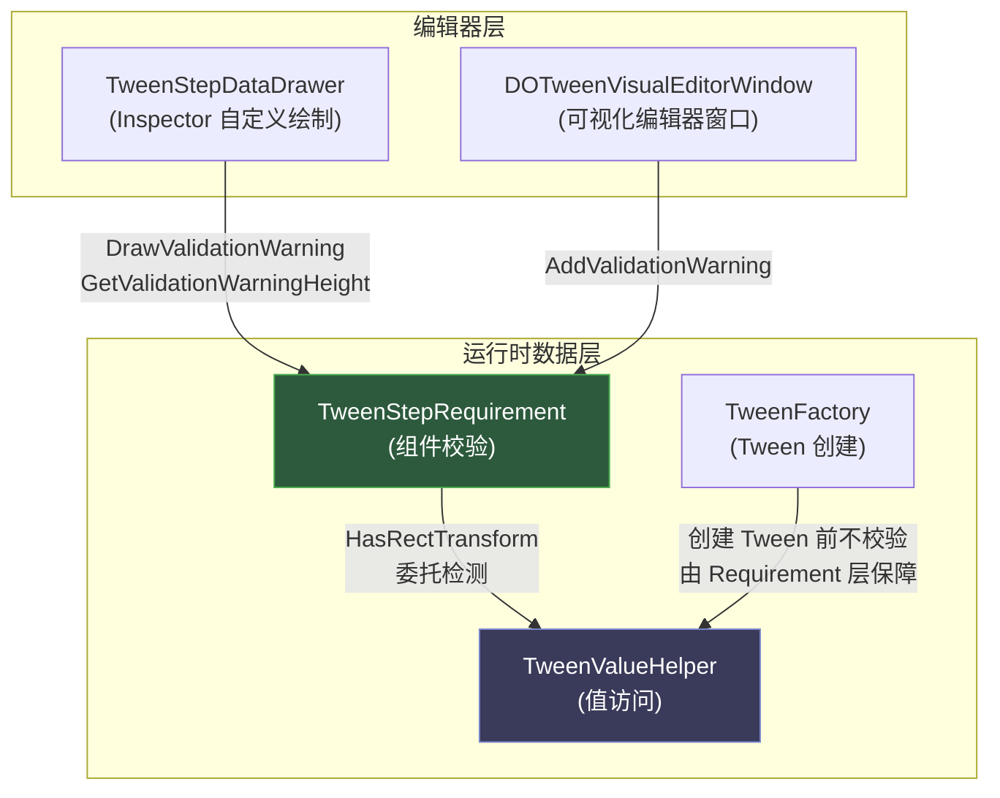

**TweenStepRequirement** 是 DOTween Visual Editor 运行时架构中的**前置校验层**，负责在动画创建之前判定目标 GameObject 是否具备所需的组件能力。作为一个纯静态工具类，它以 `TweenStepType → 组件需求 → 校验结果` 的映射模式，为编辑器 Inspector 绘制器和可视化编辑器窗口提供统一的组件兼容性检测服务，确保 Color、Fade、AnchorMove 等类型动画不会因缺少必要组件而在运行时静默失败。

Sources: [TweenStepRequirement.cs](Runtime/Data/TweenStepRequirement.cs#L1-L153)

## 设计定位：校验与值访问的职责分离

在 DOTween Visual Editor 的数据层中，`TweenStepRequirement` 和 `TweenValueHelper` 构成了一对互补的静态工具类。**TweenStepRequirement 只回答"能不能做"**——目标物体是否具备执行某种动画类型的组件前提；**TweenValueHelper 则负责"怎么做"**——实际读写颜色、透明度等属性值并创建 Tweener。这种分离使得校验逻辑可以在编辑器 UI 层独立调用，无需触发任何实际的 Tween 创建或属性修改。

`TweenStepRequirement` 内部仅在一个点上依赖 `TweenValueHelper`：`HasRectTransform` 方法委托给 `TweenValueHelper.TryGetRectTransform` 进行 RectTransform 检测，避免了 RectTransform 获取逻辑的重复实现。

Sources: [TweenStepRequirement.cs](Runtime/Data/TweenStepRequirement.cs#L146-L149), [TweenValueHelper.cs](Runtime/Data/TweenValueHelper.cs#L18-L23)

## 架构关系总览



Sources: [TweenStepDataDrawer.cs](Editor/TweenStepDataDrawer.cs#L619-L649), [DOTweenVisualEditorWindow.cs](Editor/DOTweenVisualEditorWindow.cs#L1504-L1539)

## 核心 API：三层公共接口

TweenStepRequirement 暴露三层公共接口，分别服务于不同的调用场景。

### Validate —— 主校验入口

```csharp
public static bool Validate(Transform target, TweenStepType type, out string errorMessage)
```

接收目标 Transform 和动画类型，返回校验结果及人类可读的错误描述。这是唯一会在编辑器 UI 中直接调用的校验方法，其内部逻辑按动画类型分为五个校验分支：

| 分支 | 动画类型 | 校验逻辑 | 失败时错误信息 |
|------|---------|---------|--------------|
| **Transform 基础** | Move / Rotate / Scale / Jump / Punch / Shake / DOPath | 无额外要求，始终通过 | — |
| **颜色控制** | Color | `HasColorTarget()` | "该物体不包含可着色组件（需要 Graphic / Renderer / SpriteRenderer）" |
| **透明度控制** | Fade | `HasFadeTarget()` | "该物体不包含可透明组件（需要 CanvasGroup / Graphic / Renderer / SpriteRenderer）" |
| **UI 布局** | AnchorMove / SizeDelta | `HasRectTransform()` | "该物体不是 UI 物体（需要 RectTransform）" |
| **填充量** | FillAmount | `GetComponent<Image>()` | "该物体不包含 Image 组件" |
| **流程控制** | Delay / Callback | 无目标需求，始终通过 | — |

方法在入口处首先检查 `target == null`，若为空则直接返回 `"目标物体为空"` 并终止后续所有校验。

Sources: [TweenStepRequirement.cs](Runtime/Data/TweenStepRequirement.cs#L22-L85)

### GetRequirementDescription —— 编辑器提示信息

```csharp
public static string GetRequirementDescription(TweenStepType type)
```

返回指定动画类型的需求描述文本，仅对**有组件需求的类型**返回非 null 值。该方法被可视化编辑器窗口用于在步骤添加菜单等场景中提前展示需求提示，无需实际传入目标物体。

| 动画类型 | 返回值 |
|---------|--------|
| Color | `"需要可着色组件：Graphic / Renderer / SpriteRenderer"` |
| Fade | `"需要可透明组件：CanvasGroup / Graphic / Renderer / SpriteRenderer"` |
| AnchorMove / SizeDelta | `"需要 UI 物体（RectTransform）"` |
| FillAmount | `"需要 Image 组件"` |
| 其他所有类型 | `null` |

Sources: [TweenStepRequirement.cs](Runtime/Data/TweenStepRequirement.cs#L90-L100)

### 能力检测方法

三个独立的布尔检测方法构成了校验系统的原子操作层，被 `Validate` 内部调用，也可供外部直接使用：

**HasColorTarget** 检测物体是否具备颜色控制能力，按 `Graphic → Renderer → SpriteRenderer → TMP_Text` 的优先级依次探测。TMP_Text 的检测被 `#if DOTWEEN_TMP || TMP_PRESENT` 条件编译包裹，仅在项目引入 TextMeshPro 包时生效。

**HasFadeTarget** 检测物体是否具备透明度控制能力，探测链为 `CanvasGroup → Graphic → Renderer → SpriteRenderer → TMP_Text`。与 `HasColorTarget` 相比多了一个 `CanvasGroup` 分支——这是 Unity UI 中批量控制子物体透明度的标准方式。

**HasRectTransform** 委托给 `TweenValueHelper.TryGetRectTransform`，先尝试将 Transform 直接转型为 RectTransform，失败后再通过 `GetComponent` 查找。

Sources: [TweenStepRequirement.cs](Runtime/Data/TweenStepRequirement.cs#L109-L151)

## TextMeshPro 条件编译适配

`HasColorTarget` 和 `HasFadeTarget` 都包含条件编译分支：

```csharp
#if DOTWEEN_TMP || TMP_PRESENT
    if (target.GetComponent<TMPro.TMP_Text>() != null) return true;
#endif
```

这里使用了 `DOTWEEN_TMP || TMP_PRESENT` 双符号检测。`DOTWEEN_TMP` 是 DOTween Pro 提供的编译符号，`TMP_PRESENT` 是 TextMeshPro 包自身定义的符号。这种双符号策略确保无论用户使用的是 DOTween Free（需手动定义符号）还是 DOTween Pro（自动定义），只要项目中存在 TMP 包，校验系统就能正确识别 TMP_Text 组件。这体现了校验层与[DOTween Free / Pro 版本自动适配](22-dotween-free-pro-ban-ben-zi-dong-gua-pei-yu-tiao-jian-bian-yi)体系的一致性。

Sources: [TweenStepRequirement.cs](Runtime/Data/TweenStepRequirement.cs#L117-L119), [TweenStepRequirement.cs](Runtime/Data/TweenStepRequirement.cs#L136-L138)

## 编辑器集成：双通道校验警告

TweenStepRequirement 的校验结果在编辑器中以**黄色警告标签**的形式呈现，通过两个独立的编辑器组件实现：

### Inspector 绘制器通道（TweenStepDataDrawer）

在 Inspector 的自定义属性绘制器中，`Color` 和 `Fade` 类型的步骤会通过 `DrawValidationWarning` 方法在目标物体字段下方显示校验结果。该方法以橙色高亮（`RGB 1.0, 0.7, 0.2`）的 `⚠` 前缀标签呈现错误信息，并通过配套的 `GetValidationWarningHeight` 动态计算高度——仅在校验不通过时才占用布局空间。

Sources: [TweenStepDataDrawer.cs](Editor/TweenStepDataDrawer.cs#L619-L649)

### 可视化编辑器窗口通道（DOTweenVisualEditorWindow）

在可视化编辑器的步骤详情面板中，`AddValidationWarning` 方法为 `Color`、`Fade`、`AnchorMove`、`SizeDelta`、`FillAmount` 五种类型创建独立的警告 VisualElement。该警告区域使用暗红色半透明背景（`RGBA 0.6, 0.15, 0.15, 0.5`）搭配黄色文字，与 Inspector 通道的视觉风格保持一致但通过 UI Toolkit 原生样式实现。

窗口通道还额外调用了 `GetRequirementDescription` 进行前置判断：若该动画类型本身无组件需求（返回 null），则跳过整个校验流程，避免了不必要的 `Validate` 调用。

Sources: [DOTweenVisualEditorWindow.cs](Editor/DOTweenVisualEditorWindow.cs#L1504-L1539)

## 校验触发时机与数据流

```mermaid
sequenceDiagram
    participant User as 开发者
    participant Editor as 编辑器窗口 / Inspector
    participant Req as TweenStepRequirement
    participant Helper as TweenValueHelper

    User->>Editor: 选择/修改步骤的目标物体
    Editor->>Req: GetRequirementDescription(type)
    Req-->>Editor: 返回需求描述或 null
    alt 需求描述非 null 且目标非空
        Editor->>Req: Validate(target, type, out error)
        Req->>Req: switch(type) 路由到对应分支
        alt Color / Fade 类型
            Req->>Req: HasColorTarget / HasFadeTarget
        else AnchorMove / SizeDelta 类型
            Req->>Helper: TryGetRectTransform(target, out _)
            Helper-->>Req: bool 结果
        else FillAmount 类型
            Req->>Req: GetComponent&lt;Image&gt;()
        end
        Req-->>Editor: 返回校验结果 + 错误信息
        alt 校验失败
            Editor-->>User: 显示 ⚠ 黄色警告
        end
    end
```

Sources: [TweenStepRequirement.cs](Runtime/Data/TweenStepRequirement.cs#L22-L85), [DOTweenVisualEditorWindow.cs](Editor/DOTweenVisualEditorWindow.cs#L914-L949), [TweenStepDataDrawer.cs](Editor/TweenStepDataDrawer.cs#L626-L648)

## 测试覆盖策略

TweenStepRequirement 的测试分为两个独立的测试类，分别覆盖**描述信息**和**校验逻辑**两个维度：

**TweenStepRequirementTests** 专注于 `GetRequirementDescription` 的返回值验证。对有需求的类型（Color、Fade、AnchorMove、SizeDelta、FillAmount）断言返回值非 null 且包含关键组件名；对无需求的类型（Move、Rotate、Scale、Jump、Punch、Shake、DOPath、Delay、Callback）断言返回 null。

**TweenStepRequirementValidateTests** 通过动态创建 GameObject 并按需添加组件来验证 `Validate` 的完整分支覆盖：空目标拒绝、无额外组件的 Transform 类型通过、Color 类型在添加 Image 或 SpriteRenderer 后通过、Fade 类型在添加 CanvasGroup 或 Image 后通过、AnchorMove 在 Canvas 层级下通过、FillAmount 在添加 Image 后通过。测试还覆盖了三个能力检测方法在 null 目标和普通 Transform 上的边界行为。

Sources: [TweenStepRequirementTests.cs](Runtime/Tests/TweenStepRequirementTests.cs#L1-L128), [TweenStepRequirementValidateTests.cs](Runtime/Tests/TweenStepRequirementValidateTests.cs#L1-L300)

## 与动画创建流程的关系

值得注意的设计决策是：`TweenFactory.CreateTween` 和 `DOTweenVisualPlayer.BuildAndPlay` **不调用** TweenStepRequirement 进行运行时校验。这意味着校验仅在编辑器阶段生效，运行时依赖编辑器阶段的配置正确性。这种设计遵循了"编辑器守门、运行时信任"的模式——避免在每次播放动画时重复执行 GetComponent 查询，将性能影响限制在编辑器交互中。

Sources: [TweenFactory.cs](Runtime/Data/TweenFactory.cs#L21-L42), [DOTweenVisualPlayer.cs](Runtime/Components/DOTweenVisualPlayer.cs#L290-L355)

---

**相关阅读**：
- 了解校验通过后值读写的完整组件适配策略：[TweenValueHelper 值访问层](9-tweenvaluehelper-zhi-fang-wen-ceng-duo-zu-jian-gua-pei-ce-lue-graphic-renderer-spriterenderer-tmp)
- 了解 Inspector 中校验警告的渲染实现：[Inspector 自定义绘制器](16-inspector-zi-ding-yi-hui-zhi-qi-tweenstepdatadrawer-an-lei-xing-tiao-jian-xuan-ran-zi-duan)
- 了解可视化编辑器窗口中校验警告的 UI Toolkit 实现：[可视化编辑器窗口](14-ke-shi-hua-bian-ji-qi-chuang-kou-dotweenvisualeditorwindow-ui-toolkit-bu-ju-yu-jiao-hu)