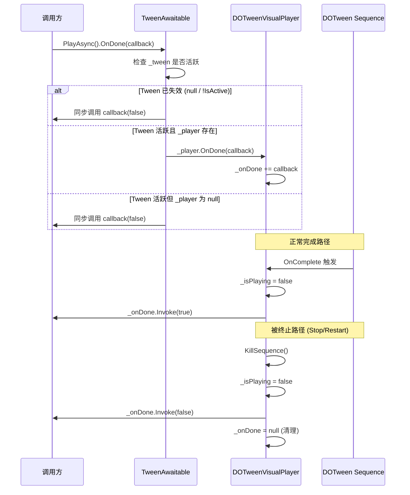

**TweenAwaitable** 是 DOTween Visual Editor 运行时架构中的**异步等待门面**——它以一只只读包装器的手，将 DOTween 底层 `Tween` 对象的复杂性封入黑盒，同时向调用方暴露三种干净的异步消费范式：**协程 yield**、**UniTask await** 和**链式回调 OnDone**。本文将从设计动机、类结构剖析、三种集成模式的内部机制、与 [DOTweenVisualPlayer 播放器组件](6-dotweenvisualplayer-bo-fang-qi-zu-jian-sheng-ming-zhou-qi-yu-bo-fang-kong-zhi) 的事件协作流程，以及测试策略等五个维度，全面拆解这一机制。

Sources: [TweenAwaitable.cs](Runtime/Components/TweenAwaitable.cs#L1-L94), [DOTweenVisualPlayer.cs](Runtime/Components/DOTweenVisualPlayer.cs#L1-L407)

---

## 设计动机：为何需要一层包装？

DOTween 的 `Tween`/`Sequence` 对象本身提供了 `OnComplete`、`OnKill` 等回调注册能力，也支持通过 `DOTween.To` 等 API 配合 `AsyncOperation` 进行等待。然而直接将内部 `Sequence` 暴露给外部调用方存在两个核心问题：

**封装破坏风险**——外部拿到 `Sequence` 引用后，可以调用 `Kill()`、`Restart()`、`Append()` 等修改方法，直接干扰 [DOTweenVisualPlayer](6-dotweenvisualplayer-bo-fang-qi-zu-jian-sheng-ming-zhou-qi-yu-bo-fang-kong-zhi) 的生命周期管理。`DOTweenVisualPlayer` 的 `BuildAndPlay()` 方法通过 `OnComplete` 和 `OnKill` 回调维护 `_isPlaying` 状态标志和 `_onDone` 事件分发，外部对 Tween 的直接操作会导致状态不一致。

**回调劫持问题**——`DOTweenVisualPlayer` 在构建 Sequence 时将用户注册的 `_onStart`、`_onComplete`、`_onUpdate` 回调绑定到 DOTween 的原生事件上。如果外部再次注册 `OnComplete`，会覆盖或干扰内部的完成状态管理逻辑。TweenAwaitable 的 `OnDone` 通过路由到 `DOTweenVisualPlayer` 的事件系统来避免这一问题。

TweenAwaitable 的设计遵循**最小知识原则**：调用方只知道"动画是否完成"和"完成方式（正常/被终止）"，不持有也不需要持有 Tween 的任何可变能力。

Sources: [TweenAwaitable.cs](Runtime/Components/TweenAwaitable.cs#L7-L11), [DOTweenVisualPlayer.cs](Runtime/Components/DOTweenVisualPlayer.cs#L290-L355)

---

## 类结构剖析

### 继承体系与核心字段

```
CustomYieldInstruction (Unity 引擎)
  └── TweenAwaitable
        ├── _tween : Tween        (只读，被包装的 DOTween Tween)
        └── _player : DOTweenVisualPlayer  (只读，生命周期管理者，可为 null)
```

TweenAwaitable 继承自 Unity 的 `CustomYieldInstruction`，这是协程等待的标准扩展点。`CustomYieldInstruction` 要求子类实现 `keepWaiting` 属性——返回 `true` 表示继续挂起协程，返回 `false` 表示恢复协程执行。TweenAwaitable 将此属性映射为 `!IsDone`，即当动画完成或被杀死时自动恢复等待中的协程。

两个私有字段均为 `readonly`，在构造时一次性注入，后续不可变更。`_tween` 是状态查询的唯一数据源；`_player` 是 `OnDone` 回调路由的通道，当为 `null` 时 OnDone 退化为同步调用并传入 `false`。

Sources: [TweenAwaitable.cs](Runtime/Components/TweenAwaitable.cs#L12-L53)

### 四大只读状态属性

| 属性 | 实现逻辑 | Null Tween 行为 | 语义 |
|------|----------|-----------------|------|
| `IsDone` | `_tween == null \|\| !_tween.IsActive()` | `true` | 动画已结束（完成或被杀死） |
| `IsCompleted` | `_tween != null && _tween.IsComplete()` | `false` | 动画正常播放到末尾 |
| `IsPlaying` | `_tween != null && _tween.IsPlaying()` | `false` | 动画当前正在播放 |
| `IsActive` | `_tween != null && _tween.IsActive()` | `false` | Tween 对象已激活 |

这四个属性构成了一个**正交状态观测面**。值得注意的是 `IsDone` 和 `IsCompleted` 的区别：`IsDone` 为 `true` 不代表动画正常完成——被 `Kill()` 杀死的 Tween 同样满足 `!IsActive()` 条件；而 `IsCompleted` 严格检查 DOTween 的 `IsComplete()` 状态，只有播放到最后一帧时才为 `true`。所有属性都采用 null-coalescing 防御，当 `_tween` 为 `null` 时返回安全的默认值。

Sources: [TweenAwaitable.cs](Runtime/Components/TweenAwaitable.cs#L23-L39)

### 协程入口：keepWaiting 与 WaitForCompletion

```csharp
public override bool keepWaiting => !IsDone;

public CustomYieldInstruction WaitForCompletion()
{
    return this;
}
```

`keepWaiting` 是 `CustomYieldInstruction` 的核心抽象——Unity 协程调度器每帧检查此属性，决定是否继续挂起。TweenAwaitable 将其定义为 `!IsDone` 的计算属性，实现零开销的帧级轮询。`WaitForCompletion()` 方法是一个**语义糖**，返回 `this` 自身，使调用方可以写出更自文档化的代码：`yield return awaitable.WaitForCompletion()` 比 `yield return awaitable` 意图更清晰。

Sources: [TweenAwaitable.cs](Runtime/Components/TweenAwaitable.cs#L39-L66)

---

## 三种异步消费范式

### 范式一：协程 yield return

```csharp
// 基本用法：yield return 直接等待
public IEnumerator PlayAndNext()
{
    var awaitable = player.PlayAsync();
    yield return awaitable;            // 协程挂起，直到 IsDone == true
    Debug.Log($"动画完成，正常结束：{awaitable.IsCompleted}");
}

// 语义化写法
public IEnumerator PlayWithExplicitWait()
{
    yield return player.PlayAsync().WaitForCompletion();
    Debug.Log("动画播放完毕");
}
```

协程模式的工作原理：Unity 的协程调度器在每帧的 `WaitForEndOfFrame` 或 `WaitForFixedUpdate` 阶段（取决于协程启动时机）检查 `keepWaiting` 属性。当 DOTween 动画完成（`OnComplete` 触发）或被杀死（`OnKill` 触发）后，`_tween.IsActive()` 返回 `false`，`IsDone` 变为 `true`，`keepWaiting` 返回 `false`，协程恢复执行。

**关键约束**：此模式仅在 Unity 协程上下文中生效。在普通 C# `async` 方法中 `yield return` 不可用——需要使用下文的 UniTask 模式或回调模式。

Sources: [TweenAwaitable.cs](Runtime/Components/TweenAwaitable.cs#L36-L66)

### 范式二：UniTask await

```csharp
// 需引入 Cysharp.Threading.Tasks 及 UniTask 对 CustomYieldInstruction 的扩展
public async UniTaskVoid PlayAndContinue()
{
    await player.PlayAsync().ToUniTask();
    Debug.Log("动画完成");
}
```

UniTask 提供了 `CustomYieldInstruction.ToUniTask()` 扩展方法，将 `keepWaiting` 的轮询语义转换为 `await` 的异步语义。这层转换对 TweenAwaitable 完全透明——TweenAwaitable 不依赖 UniTask，也不包含任何 UniTask 相关的编译指令，实现了**零耦合的下游兼容**。

这意味着即使项目中未安装 UniTask，TweenAwaitable 的协程模式和回调模式仍然正常工作。UniTask 集成是调用方侧的适配，而非框架侧的依赖。

Sources: [DOTweenVisualPlayer.cs](Runtime/Components/DOTweenVisualPlayer.cs#L155-L175)

### 范式三：链式回调 OnDone

```csharp
player.PlayAsync()
    .OnDone(completed =>
    {
        if (completed)
            Debug.Log("动画正常播放完成");
        else
            Debug.Log("动画被终止");
    });
```

OnDone 是三种范式中最轻量的——不依赖协程调度器，不依赖 UniTask，适合在事件驱动的架构中使用。回调参数 `bool completed` 的语义由 [DOTweenVisualPlayer](6-dotweenvisualplayer-bo-fang-qi-zu-jian-sheng-ming-zhou-qi-yu-bo-fang-kong-zhi) 的事件分发逻辑决定。

Sources: [TweenAwaitable.cs](Runtime/Components/TweenAwaitable.cs#L68-L90)

---

## OnDone 回调路由机制

OnDone 是 TweenAwaitable 中最复杂的部分——它不直接在 Tween 上注册回调，而是通过 `_player` 中转到 DOTweenVisualPlayer 的事件系统。理解这一路由机制对于正确使用异步等待至关重要。

### 路由流程图



### 三条路由路径详解

**路径 A — Tween 已失效**：当 `_tween` 为 `null` 或 `!_tween.IsActive()` 时，OnDone 立即同步调用 `callback(false)`。这覆盖了 PlayAsync 在无可用步骤时返回的空包装器场景。

**路径 B — 正常完成**：回调通过 `_player.OnDone()` 注册到 DOTweenVisualPlayer 的 `_onDone` 事件。当 Sequence 正常播放完成时，DOTween 触发 `OnComplete`，DOTweenVisualPlayer 在回调中执行 `_onDone?.Invoke(true)`。

**路径 C — 被终止**：当调用 `Stop()` 或 `Restart()` 时，DOTweenVisualPlayer 的 `KillSequence()` 方法直接执行 `_onDone?.Invoke(false)` 并清空事件引用。此时 DOTween 的 `OnKill` 回调虽然也会触发，但 `KillSequence()` 在调用 `Kill()` 前已将 `_isPlaying` 设为 `false`，因此 `OnKill` 回调中的 `if (_isPlaying)` 判断不会重复触发。

Sources: [TweenAwaitable.cs](Runtime/Components/TweenAwaitable.cs#L68-L90), [DOTweenVisualPlayer.cs](Runtime/Components/DOTweenVisualPlayer.cs#L327-L381)

### 防重复触发保护

`DOTweenVisualPlayer.KillSequence()` 中的防重复设计是一个容易被忽略但至关重要的细节：

```csharp
private void KillSequence()
{
    if (_currentSequence != null)
    {
        bool wasPlaying = _isPlaying;
        _isPlaying = false;              // ← 先标记，防止 OnKill 回调重复触发

        if (_currentSequence.IsActive())
            _currentSequence.Rewind();
        _currentSequence.Kill();         // ← 触发 OnKill，但 _isPlaying 已为 false
        _currentSequence = null;

        if (wasPlaying)
            _onDone?.Invoke(false);      // ← 显式触发，不依赖 DOTween 回调
        _onDone = null;                  // ← 清理事件引用
    }
    _isPlaying = false;
}
```

这确保了 `_onDone` 回调只被调用一次。`KillSequence()` 采用"先标记、后操作、再通知"的三段式流程，而非依赖 DOTween 的 `OnKill` 回调来触发通知——这是一个关键的可靠性设计，因为 `OnKill` 的触发时机和行为在不同 DOTween 版本中可能存在差异。

Sources: [DOTweenVisualPlayer.cs](Runtime/Components/DOTweenVisualPlayer.cs#L357-L381)

---

## PlayAsync 与 Play 的差异化行为

| 维度 | `Play()` | `PlayAsync()` |
|------|----------|---------------|
| 返回类型 | `void` | `TweenAwaitable` |
| 重复调用保护 | 直接忽略，不产生任何返回 | 返回当前播放中的 Tween 的包装器 |
| 协程支持 | ❌ | ✅ `yield return` |
| UniTask 支持 | ❌ | ✅ `.ToUniTask()` |
| OnDone 回调 | 仅通过 `player.OnDone()` 预注册 | 通过 `awaitable.OnDone()` 即时注册 |
| 典型场景 | 事件驱动、自动播放、fire-and-forget | 流程编排、动画序列等待 |

`PlayAsync()` 在播放中再次调用时不会返回 `null`，而是用当前的 `_currentSequence` 构造一个新的 `TweenAwaitable`。这意味着调用方始终可以拿到有效的等待句柄，即使动画已在播放中途。

Sources: [DOTweenVisualPlayer.cs](Runtime/Components/DOTweenVisualPlayer.cs#L142-L175)

---

## 范式选择决策矩阵

面对三种异步消费范式，选择依据不仅仅是"哪个更方便"——不同的范式在**帧开销**、**异常传播**、**取消支持**和**上下文要求**上存在实质差异。

| 评估维度 | 协程 yield | UniTask await | OnDone 回调 |
|----------|-----------|---------------|-------------|
| 每帧 GC 开销 | 属性查询（零分配） | PlayerLoop 轮询（低分配） | 一次委托调用 |
| 异常传播 | 吞没（需 try-catch） | 自然向上冒泡 | 吞没（需 try-catch） |
| 取消支持 | `StopCoroutine` | `CancellationToken` | 无内置取消 |
| 上下文要求 | MonoBehaviour 协程 | async 方法 | 无限制 |
| 多回调注册 | 不支持 | 不支持 | 支持（+= 委托合并） |
| 代码可读性 | 中等（yield 散布） | 最高（线性流） | 中等（回调嵌套） |

**推荐策略**：在需要线性流程编排（如过场动画、UI 状态机）时优先使用 UniTask 模式；在已有协程基础设施的项目中使用协程模式；在简单的事件响应场景中使用 OnDone 回调。三种范式可以混合使用——例如主流程用 UniTask await，同时通过 OnDone 注册日志/统计回调。

Sources: [TweenAwaitable.cs](Runtime/Components/TweenAwaitable.cs#L57-L92)

---

## 测试策略：边界验证与不测薄封装

TweenAwaitable 的测试套件体现了精确的测试边界意识。测试集中在**可验证的业务逻辑**上，而非对 DOTween API 的薄封装进行冗余测试。

### 测试覆盖矩阵

| 测试类别 | 测试内容 | 不测内容 | 原因 |
|----------|----------|----------|------|
| Null Tween 状态 | `IsDone`/`IsCompleted`/`IsPlaying`/`IsActive`/`keepWaiting` 全部返回安全默认值 | — | 验证防御性编程的正确性 |
| WaitForCompletion | 返回 `this` 引用同一性 | — | 保证语义糖的契约 |
| OnDone + Null Tween | 同步调用 `callback(false)` | — | 边界条件：构造失败或无步骤 |
| OnDone + Player 正常完成 | 回调收到 `true` | DOTween 内部状态变更 | 使用 `ManualUpdate` 同步驱动 |
| OnDone + Player 被停止 | 回调收到 `false` | — | KillSequence 路径验证 |
| OnDone 链式返回 | 返回 `this` | — | API 流畅性契约 |
| — | 活跃 Tween 的 `IsDone`/`IsPlaying`/`IsCompleted`/`IsActive` | 这些是 DOTween API 的**一行委托调用**，测试它们等于测试 DOTween 自身。且 DOTween 在 EditMode 下内部状态属性不可靠 |

测试基础设施使用 `DOTween.ManualUpdate` 同步驱动模式，避免了异步测试的不确定性。每个测试在 `SetUp` 中初始化 DOTween（`AutoPlay.None` + `UpdateType.Manual`），在 `TearDown` 中 `KillAll()` 并恢复默认设置。

Sources: [TweenAwaitableTests.cs](Runtime/Tests/TweenAwaitableTests.cs#L1-L194)

---

## 架构定位与扩展性

TweenAwaitable 在整体架构中位于 DOTweenVisualPlayer 的**正下方**，作为播放器对外暴露异步能力的唯一出口：

```
DOTweenVisualPlayer (生命周期管理)
    │
    ├── Play()          → void (fire-and-forget)
    ├── PlayAsync()     → TweenAwaitable (异步等待门面)
    │                        ├── 协程 yield (CustomYieldInstruction)
    │                        ├── UniTask await (下游适配，零耦合)
    │                        └── OnDone 回调 (事件路由)
    ├── Stop/Pause/Resume/Restart → 直接操作 Sequence
    └── OnStart/OnComplete/OnUpdate/OnDone → 链式事件 API
```

由于 TweenAwaitable 不持有任何对 UniTask 的编译时引用，未来若需要支持其他异步框架（如 .NET 5+ 的 `Task`、Unity 2023+ 的 `Awaitable`），只需在调用侧提供对应的转换扩展方法，框架核心无需任何变更。

Sources: [TweenAwaitable.cs](Runtime/Components/TweenAwaitable.cs#L1-L94), [DOTweenVisualPlayer.cs](Runtime/Components/DOTweenVisualPlayer.cs#L1-L407)

---

## 相关页面

- **上游**：[DOTweenVisualPlayer 播放器组件：生命周期与播放控制](6-dotweenvisualplayer-bo-fang-qi-zu-jian-sheng-ming-zhou-qi-yu-bo-fang-kong-zhi) — PlayAsync 的发起者与事件分发者
- **上游**：[链式回调 API 设计：OnStart / OnComplete / OnUpdate / OnDone](24-lian-shi-hui-diao-api-she-ji-onstart-oncomplete-onupdate-ondone) — OnDone 回调路由的终点设计
- **同层**：[ExecutionMode 执行模式：Append / Join / Insert 编排策略](12-executionmode-zhi-xing-mo-shi-append-join-insert-bian-pai-ce-lue) — 影响 Sequence 内部 Tween 编排方式
- **测试**：[Runtime 测试策略：DOTween.ManualUpdate 同步驱动模式](20-runtime-ce-shi-ce-lue-dotween-manualupdate-tong-bu-qu-dong-mo-shi) — ManualUpdate 测试基础设施详解