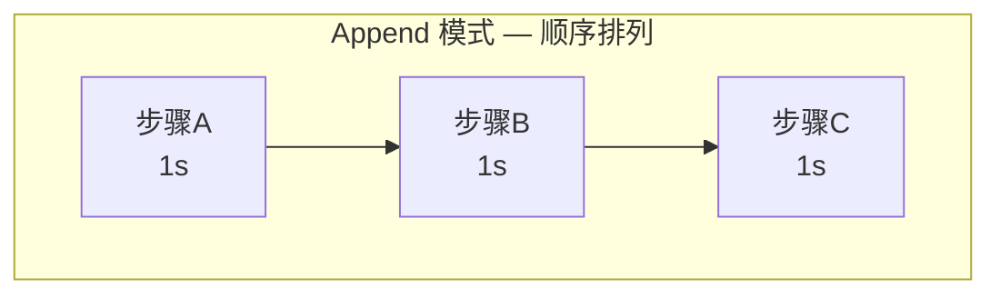
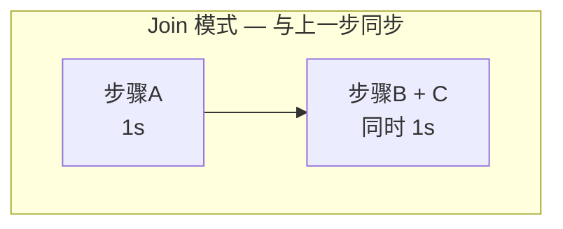
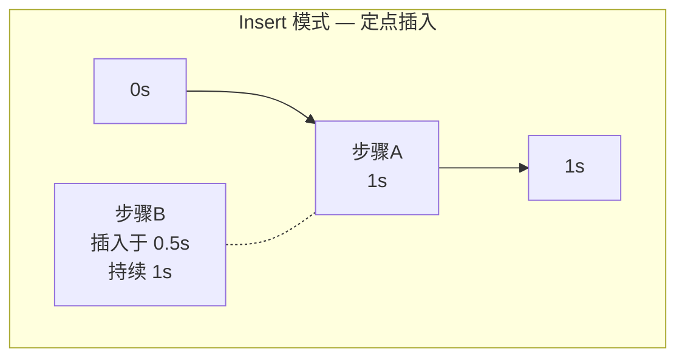
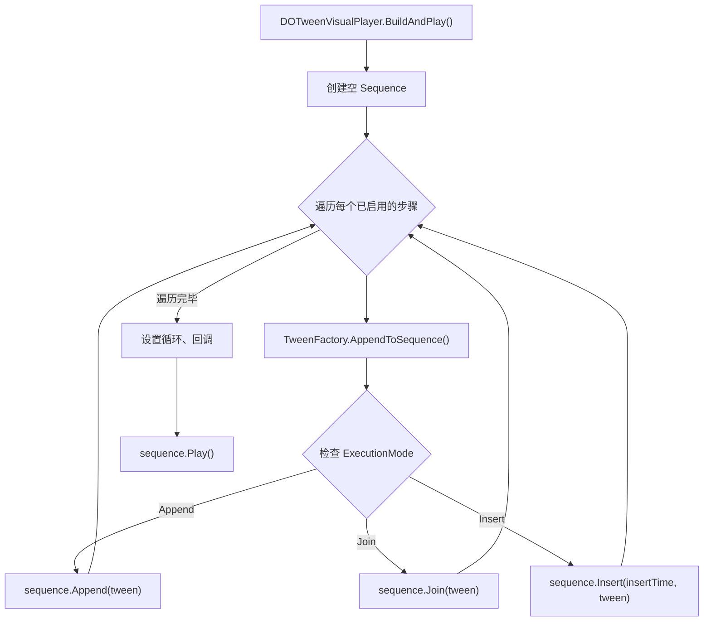

ExecutionMode 是 DOTween Visual Editor 中控制**多个动画步骤之间时间关系**的核心机制。它决定了每个动画步骤被添加到 DOTween Sequence 时采用的时间编排策略——是排队等候、同步并行、还是在指定时刻精确插入。理解这三种模式的工作原理，是从"能做出动画"迈向"能编排复杂动画序列"的关键一步。

Sources: [ExecutionMode.cs](Runtime/Data/ExecutionMode.cs#L1-L15), [TweenStepData.cs](Runtime/Data/TweenStepData.cs#L159-L168)

## 三种执行模式速览

ExecutionMode 枚举定义了三种值，每种对应 DOTween Sequence 的一个 API：

| 模式 | 语义 | DOTween API | 时间行为 |
|------|------|-------------|----------|
| **Append** | 顺序追加 | `Sequence.Append()` | 在序列当前末尾追加，总时长增加 |
| **Join** | 加入并行 | `Sequence.Join()` | 与上一个 Tween 同时开始，总时长不变 |
| **Insert** | 定点插入 | `Sequence.Insert(time, ...)` | 在指定的绝对时间点插入 |

**默认值**：每个新建的动画步骤默认使用 `ExecutionMode.Append`，即顺序排列。这意味着如果你不修改执行模式，所有步骤会依次播放——先完成第一步，再开始第二步。

Sources: [ExecutionMode.cs](Runtime/Data/ExecutionMode.cs#L6-L14), [TweenStepData.cs](Runtime/Data/TweenStepData.cs#L161-L162)

## 概念模型：时间线视角

将 Sequence 想象成一条向右延伸的时间线，每个动画步骤是时间线上的一个色块。三种模式决定了色块放在哪里：

上面的示意图揭示了核心区别：**Append 让时间线变长，Join 让时间线上同一位置叠放更多动画，Insert 让你自由决定动画出现在时间线的哪个位置**。

## Append：顺序追加

Append 是最直觉的模式。当你将一个步骤设为 Append 时，它会被追加到 Sequence 的**当前末尾时间点**，这意味着序列的总时长会增加这个步骤的 Duration。

**典型场景**：角色依次执行"移动 → 旋转 → 缩放"三段动画，每段必须等前一段完成才开始。

**运行时实现**：TweenFactory 通过 `sequence.Append(tween)` 调用 DOTween 的 Append 方法，tween 将在序列末尾开始播放。

Sources: [TweenFactory.cs](Runtime/Data/TweenFactory.cs#L90-L94)

## Join：同步并行

Join 模式让当前步骤与 Sequence 中**最近添加的那个 Tween** 同时开始。序列的总时长不会因此增加（除非当前步骤比上一步更长）。

**典型场景**：一个物体同时移动和渐隐（Fade），两者同步进行。你只需要把第一个步骤设为 Append，第二个步骤设为 Join 即可。

**关键要点**：Join 是相对于"上一个 Tween"的，而不是相对于序列起始点。如果你连续设置三个步骤为 Join，它们都会与同一个"上一步"同时开始。

**运行时实现**：通过 `sequence.Join(tween)` 实现。

Sources: [TweenFactory.cs](Runtime/Data/TweenFactory.cs#L95-L97)

## Insert：定点插入

Insert 模式提供了最精确的时间控制。你需要指定一个 `InsertTime`（插入时间点，单位为秒），动画会在 Sequence 的这个**绝对时间位置**开始播放。

**典型场景**：一个 3 秒的移动动画中，你希望在 1.5 秒时开始播放一个音效震动动画。将震动步骤设为 Insert 模式，InsertTime 设为 1.5 即可。

**配套字段**：`InsertTime` 仅在 ExecutionMode 为 Insert 时才会在编辑器 Inspector 中显示，这是一个条件渲染的设计——避免了无关字段干扰用户。

**运行时实现**：通过 `sequence.Insert(Mathf.Max(0f, step.InsertTime), tween)` 实现。注意 InsertTime 被限制为非负值，确保不会在负时间插入。

Sources: [TweenFactory.cs](Runtime/Data/TweenFactory.cs#L98-L101), [TweenStepData.cs](Runtime/Data/TweenStepData.cs#L164-L166)

## 运行时调度流程

当 `DOTweenVisualPlayer` 调用 `Play()` 时，内部的 `BuildAndPlay()` 方法会遍历所有已启用的步骤，逐个调用 `TweenFactory.AppendToSequence()`。这是 ExecutionMode 真正生效的时刻：

值得注意的是，**ExecutionMode 对 Delay 和 Callback 类型步骤不生效**。这两种特殊类型在进入 switch 分支前就被提前处理了：Delay 转化为 `AppendInterval`，Callback 转化为 `AppendCallback`——它们始终采用追加语义。

Sources: [DOTweenVisualPlayer.cs](Runtime/Components/DOTweenVisualPlayer.cs#L290-L354), [TweenFactory.cs](Runtime/Data/TweenFactory.cs#L48-L102)

## 编辑器中的条件渲染

在编辑器 Inspector 中，ExecutionMode 的 UI 呈现采用**条件显示**策略：

- **Append / Join 模式**：仅显示 ExecutionMode 枚举选择器，无需额外参数。
- **Insert 模式**：在枚举选择器下方额外显示 `InsertTime` 字段，让你指定插入时间点。

这个条件渲染逻辑同时体现在高度计算方法 `GetCommonFieldsHeight()` 和绘制方法 `DrawCommonFields()` 中——当 ExecutionMode 为 Insert 时，高度和绘制都多出一个 `InsertTime` 行，确保布局精确无多余空白。

Sources: [TweenStepDataDrawer.cs](Editor/TweenStepDataDrawer.cs#L281-L309), [TweenStepDataDrawer.cs](Editor/TweenStepDataDrawer.cs#L598-L615)

## 三种模式的对比与选择

| 维度 | Append | Join | Insert |
|------|--------|------|--------|
| **时间基准** | 序列当前末尾 | 上一个 Tween 的起始点 | 绝对时间轴上的指定点 |
| **对总时长影响** | 增加 Duration | 不增加（除非更长） | 取决于插入位置和 Duration |
| **配置参数** | 无额外参数 | 无额外参数 | InsertTime（秒） |
| **使用频率** | ⭐⭐⭐ 最高 | ⭐⭐ 常用 | ⭐ 进阶 |
| **适用场景** | 严格串行的动画序列 | 同步播放的多属性动画 | 精确时间编排、重叠动画 |
| ** newcomers 友好度** | 最直觉 | 需理解"上一个"概念 | 需理解绝对时间线 |

**选择建议**：

- **默认使用 Append**：90% 的简单动画序列用 Append 就够了。先做出来，再优化编排。
- **需要同步时切 Join**：当一个物体需要同时改变多个属性（如边移动边旋转边缩放），只有第一步用 Append，其余全用 Join。
- **需要精确时间重叠时用 Insert**：当你需要在某个特定时刻触发动画，而不依赖步骤的排列顺序时。

Sources: [ExecutionMode.cs](Runtime/Data/ExecutionMode.cs#L1-L15)

## 实战编排示例

下面通过一个具体场景演示三种模式的组合使用。假设你要为一个按钮设计"入场动画"：

**目标效果**：按钮从屏幕外滑入（1 秒），同时从透明渐显到不透明（0.5 秒），到达目标位置后弹跳缩放一下（0.3 秒）。

| 步骤 | 类型 | ExecutionMode | 说明 |
|------|------|---------------|------|
| 1 | AnchorMove（移动到目标位置） | Append | 第一个步骤，从序列起始开始 |
| 2 | Fade（透明度 0 → 1） | Join | 与步骤 1 同时开始，0.5 秒完成 |
| 3 | Scale（缩放弹跳效果） | Append | 等步骤 1 完成后开始 |

最终时间线：步骤 1 和 2 在第 0 秒同时开始，步骤 1 用 1 秒完成，步骤 2 用 0.5 秒完成（提前结束），步骤 3 在第 1 秒开始。

如果你改用 Insert 模式来实现同样的效果，可以让步骤 3 的 InsertTime 设为 1.0——效果相同，但编排思路从"相对顺序"变成了"绝对时间表"。

Sources: [TweenFactory.cs](Runtime/Data/TweenFactory.cs#L48-L102)

## 延伸阅读

- 了解 Sequence 的完整构建生命周期，请参阅 [Sequence 构建流程：从步骤数据到 DOTween Sequence 的完整生命周期](25-sequence-gou-jian-liu-cheng-cong-bu-zou-shu-ju-dao-dotween-sequence-de-wan-zheng-sheng-ming-zhou-qi)
- 了解动画步骤数据的全貌，请参阅 [TweenStepData 数据结构：多值组设计模式](7-tweenstepdata-shu-ju-jie-gou-duo-zhi-zu-she-ji-mo-shi)
- 了解 Tween 如何被创建和配置，请参阅 [TweenFactory 工厂模式：统一运行时与编辑器预览的 Tween 创建](8-tweenfactory-gong-han-mo-shi-tong-yun-xing-shi-yu-bian-ji-qi-yu-lan-de-tween-chuang-jian)