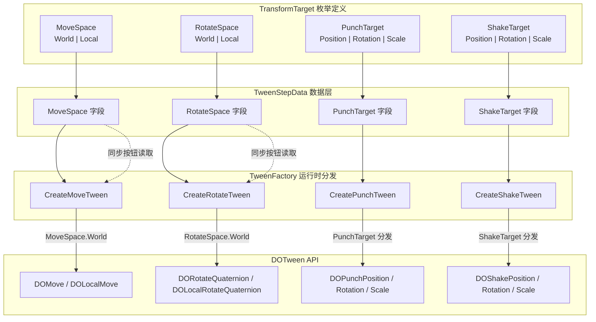

当你创建一个移动动画时，物体应该沿世界坐标移动，还是相对于父物体的本地坐标移动？当你需要一个冲击效果时，它应该影响位置、旋转还是缩放？**TransformTarget 枚举体系**正是为了回答这些问题而存在的一组轻量配置类型。它们定义在同一个文件中，以各自的枚举类型服务于不同的动画场景，共同构成了 DOTween Visual Editor 中 **"数据驱动的动画行为分支"** 这一设计理念的基础层。

Sources: [TransformTarget.cs](Runtime/Data/TransformTarget.cs#L1-L50)

## 四个枚举，两种职责

[TransformTarget.cs](Runtime/Data/TransformTarget.cs) 文件中定义了四个枚举类型。按照它们所承担的职责，可以清晰地划分为两组：

| 职责 | 枚举名 | 服务的动画类型 | 成员 |
|------|--------|---------------|------|
| **坐标空间选择** | `MoveSpace` | Move | `World`、`Local` |
| **坐标空间选择** | `RotateSpace` | Rotate | `World`、`Local` |
| **特效目标选择** | `PunchTarget` | Punch | `Position`、`Rotation`、`Scale` |
| **特效目标选择** | `ShakeTarget` | Shake | `Position`、`Rotation`、`Scale` |

**坐标空间选择**解决的问题是"值在哪个参考系下生效"。`MoveSpace.World` 对应 Unity 的 `Transform.position`（世界坐标），`MoveSpace.Local` 对应 `Transform.localPosition`（相对于父物体的本地坐标）。`RotateSpace` 同理，只是操作的是旋转属性。

**特效目标选择**解决的是"同一个特效类型作用于 Transform 的哪个属性"。Punch（冲击弹性）和 Shake（震动）本质上都是一种振荡特效，但它们可以分别作用于位置、旋转或缩放——这个选择权交给配置者。

Sources: [TransformTarget.cs](Runtime/Data/TransformTarget.cs#L1-L50)

## 枚举与数据模型的绑定

四个枚举不是孤立存在的——它们作为字段声明在 [TweenStepData](Runtime/Data/TweenStepData.cs) 的 **"Transform 值组"** 区域中，与动画类型形成一一对应的配置关系：

```csharp
// TweenStepData.cs 中的 Transform 值组区域
[Tooltip("移动坐标空间（Move 使用）")]
public MoveSpace MoveSpace = MoveSpace.World;

[Tooltip("旋转坐标空间（Rotate 使用）")]
public RotateSpace RotateSpace = RotateSpace.World;

[Tooltip("冲击属性目标（Punch 使用）")]
public PunchTarget PunchTarget = PunchTarget.Position;

[Tooltip("震动属性目标（Shake 使用）")]
public ShakeTarget ShakeTarget = ShakeTarget.Position;
```

值得注意的是默认值的设计策略：**坐标空间默认为 World**，特效目标默认为 Position。这两组默认值都是最直觉、最高频的选择——大多数情况下物体在世界空间中移动、冲击/震动首先影响位置。这种"默认即合理"的取值降低了初学者的配置门槛。

Sources: [TweenStepData.cs](Runtime/Data/TweenStepData.cs#L54-L83)

## 坐标空间的运行时分发

当 `TweenFactory` 收到一个 `Move` 类型的 `TweenStepData` 后，`MoveSpace` 枚举值会直接决定调用 DOTween 的哪个 API。以下是 `CreateMoveTween` 方法中的核心分支逻辑：

```csharp
if (step.MoveSpace == MoveSpace.Local)
{
    var tween = target.DOLocalMove(step.TargetVector, duration);
    // ...
}
else
{
    var moveTween = target.DOMove(step.TargetVector, duration);
    // ...
}
```

`RotateSpace` 的处理更为细致——它不仅决定调用 `DOLocalRotateQuaternion` 还是 `DORotateQuaternion`，还影响**起始四元数的读取来源**。在未指定起始值时，系统会根据 `RotateSpace` 从 `target.localRotation` 或 `target.rotation` 读取当前旋转作为插值起点，确保空间上下文的一致性。旋转始终使用四元数插值以避免万向锁问题。

Sources: [TweenFactory.cs](Runtime/Data/TweenFactory.cs#L192-L243)

工具方法 `ApplyMoveValue` 和 `ApplyRotationValue` 同样按照这个枚举值进行分发，用于在动画播放前将物体强制设置到起始值：

```csharp
private static void ApplyMoveValue(Transform target, MoveSpace moveSpace, Vector3 value)
{
    switch (moveSpace)
    {
        case MoveSpace.World:  target.position = value;     break;
        case MoveSpace.Local:  target.localPosition = value; break;
    }
}
```

Sources: [TweenFactory.cs](Runtime/Data/TweenFactory.cs#L403-L427)

## 特效目标的运行时分发

`PunchTarget` 和 `ShakeTarget` 的分发逻辑使用 C# 8.0 的 **switch 表达式**，代码极为简洁。以 `CreatePunchTween` 为例：

```csharp
return step.PunchTarget switch
{
    PunchTarget.Rotation => target.DOPunchRotation(step.Intensity, duration, vibrato, elasticity),
    PunchTarget.Scale    => target.DOPunchScale(step.Intensity, duration, vibrato, elasticity),
    _                    => target.DOPunchPosition(step.Intensity, duration, vibrato, elasticity)
};
```

`ShakeTarget` 的结构完全相同，只是调用的是 `DOShakePosition`、`DOShakeRotation`、`DOShakeScale` 系列 API。两个枚举的成员结构一致（Position / Rotation / Scale），但被设计为独立的枚举类型而非共享枚举，原因在于它们分别存储在 `TweenStepData` 的不同字段中，在编辑器绘制时需要通过不同的属性名（`PunchTarget` vs `ShakeTarget`）访问，独立枚举让类型系统保证了不会将 Punch 的目标值误赋给 Shake。

Sources: [TweenFactory.cs](Runtime/Data/TweenFactory.cs#L340-L366)

## 编辑器中的条件渲染

枚举值不仅驱动运行时行为，还控制着编辑器 Inspector 中哪些字段被显示。`TweenStepDataDrawer` 作为 `TweenStepData` 的自定义 PropertyDrawer，根据当前动画类型决定渲染哪些枚举字段：

- **Move 类型**：显示 `MoveSpace` 下拉框（"移动坐标空间"）
- **Rotate 类型**：显示 `RotateSpace` 下拉框（"旋转坐标空间"）
- **Punch 类型**：显示 `PunchTarget` 下拉框（"冲击目标"）
- **Shake 类型**：显示 `ShakeTarget` 下拉框（"震动目标"）
- **其他类型**（Scale、Jump 等）：不显示任何枚举选择器

这意味着 Scale 动画永远只操作 `localScale`（不需要空间选择），Jump 动画永远在世界坐标下跳跃——枚举只在"确实有多种合理选择"的场景下才出现。这种**按需暴露**的设计避免了对用户造成不必要的认知负担。

Sources: [TweenStepDataDrawer.cs](Editor/TweenStepDataDrawer.cs#L315-L331), [TweenStepDataDrawer.cs](Editor/TweenStepDataDrawer.cs#L474-L506)

## "同步当前值"按钮与坐标空间联动

编辑器中 Move 和 Rotate 类型都提供了一个"同步当前值"按钮，它会读取目标物体的当前 Transform 状态并填入 `TargetVector` 字段。这里的关键细节是：**同步时必须参考当前的坐标空间枚举值**。

```csharp
case TweenStepType.Move:
    switch (moveSpace)
    {
        case MoveSpace.Local: currentValue = target.localPosition; break;
        default:              currentValue = target.position;       break;
    }
    break;
```

如果用户选择了 `MoveSpace.Local`，同步按钮就会读取 `localPosition`；如果选择了 `MoveSpace.World`，就读取 `position`。这确保了"所见即所得"——编辑器中显示的坐标值与动画实际使用的坐标系完全匹配。

Sources: [TweenStepDataDrawer.cs](Editor/TweenStepDataDrawer.cs#L654-L737)

## 架构关系总览

下面的关系图展示了 TransformTarget 枚举体系在整个数据流中的位置：



Sources: [TransformTarget.cs](Runtime/Data/TransformTarget.cs#L1-L50), [TweenStepData.cs](Runtime/Data/TweenStepData.cs#L54-L83), [TweenFactory.cs](Runtime/Data/TweenFactory.cs#L192-L243), [TweenFactory.cs](Runtime/Data/TweenFactory.cs#L340-L366)

## 设计总结

| 设计维度 | 体现 |
|----------|------|
| **职责分离** | 四个独立枚举各自对应一个动画类型，避免共享枚举带来的字段歧义 |
| **默认即合理** | World 和 Position 作为默认值，覆盖最高频使用场景 |
| **按需暴露** | 编辑器只在确实存在多选项时才显示枚举选择器 |
| **数据驱动分支** | 运行时行为完全由枚举字段值决定，TweenFactory 中无硬编码逻辑 |
| **端到端一致性** | 枚举值从数据定义、编辑器同步、运行时分发到 DOTween API 调用始终保持一致 |

如果你已经理解了枚举如何驱动动画行为的分支选择，接下来可以深入了解 [TweenFactory 工厂模式：统一运行时与编辑器预览的 Tween 创建](8-tweenfactory-gong-han-mo-shi-tong-yun-xing-shi-yu-bian-ji-qi-yu-lan-de-tween-chuang-jian) 中这些枚举在完整工厂流程中的位置，或者回到 [TweenStepData 数据结构：多值组设计模式](7-tweenstepdata-shu-ju-jie-gou-duo-zhi-zu-she-ji-mo-shi) 查看这些枚举字段如何融入整体的数据结构设计。