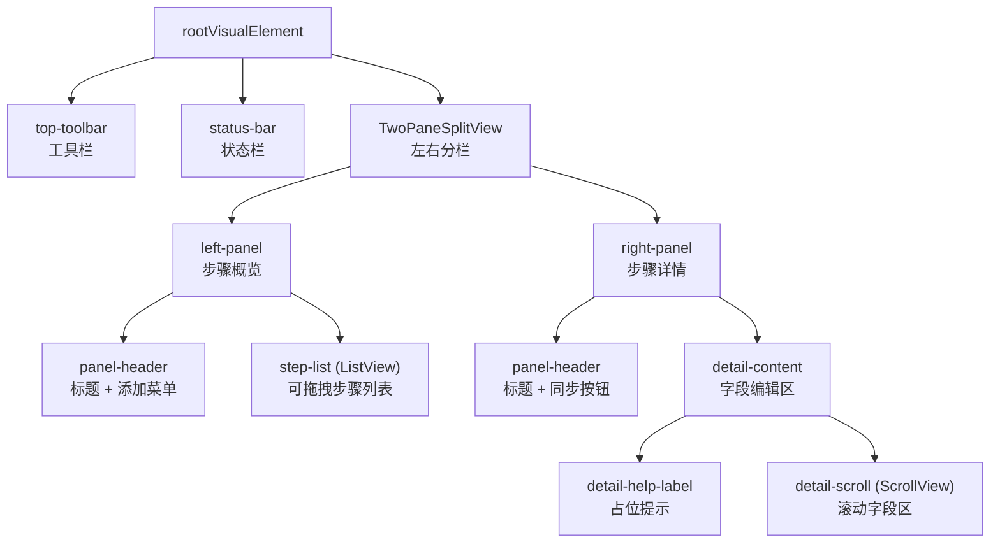

DOTweenVisualEditorWindow 是 DOTween Visual Editor 插件的编辑器入口与交互中枢，基于 Unity **UI Toolkit**（UIElements）构建了一套完整的可视化动画编排界面。该窗口采用经典的「工具栏 → 状态栏 → 左右分栏」三段式布局：左侧以 `ListView` 呈现步骤概览（含拖拽排序与时间轴可视化），右侧以动态生成的字段面板展示选中步骤的完整属性编辑器。其核心设计哲学是**职责分离**——窗口仅负责 UI 构建与交互响应，预览逻辑委托给 `DOTweenPreviewManager`，样式配置委托给 `DOTweenEditorStyle`，从而保持自身作为"纯视图层"的清晰边界。

Sources: [DOTweenVisualEditorWindow.cs](Editor/DOTweenVisualEditorWindow.cs#L17-L27)

## 整体布局架构

窗口的视觉结构可以用三层嵌套来概括：



**工具栏**横向排列 `ObjectField`（目标物体选择器）、弹性间隔、以及四个预览控制按钮（预览/暂停、停止、重播、重置），固定高度 28px。**状态栏**紧随其后，左侧显示预览状态指示器（带颜色编码的 `●` 符号），右侧显示时间进度 `MM:SS.d / MM:SS.d`，高度由 padding 撑开。下方的主内容区使用 `TwoPaneSplitView` 以水平方向分割，初始左面板宽度为 `LeftPanelMinWidth + 80`（即 300px），支持用户手动拖拽调整分栏位置。

Sources: [DOTweenVisualEditorWindow.cs](Editor/DOTweenVisualEditorWindow.cs#L287-L421), [DOTweenVisualEditor.uss](Editor/USS/DOTweenVisualEditor.uss#L1-L59)

## 生命周期管理

窗口的生命周期钩子编排了完整的初始化与清理链路，确保编辑器在各种状态转换中保持一致。

**初始化阶段**（`OnEnable`）：

| 订阅事件 | 用途 |
|---|---|
| `EditorApplication.update` | 驱动时间显示更新与键盘快捷键检测 |
| `EditorApplication.playModeStateChanged` | 进入播放模式前停止预览并重置状态 |
| `Undo.undoRedoPerformed` | 撤销/重做后刷新列表与详情面板 |
| `_previewManager.StateChanged` | 预览状态变更时更新按钮与步骤高亮 |
| `_previewManager.ProgressUpdated` | 预览进度更新时高亮当前执行步骤 |

**清理阶段**（`OnDisable`）：逐一解除所有事件订阅，`Dispose` 预览管理器，并调用 `rootVisualElement.Clear()` 释放 UI 元素树。此外，`[InitializeOnLoad]` 标记的静态构造函数注册了 `CompilationPipeline.compilationStarted` 回调，确保脚本编译开始时立即停止所有活跃预览，避免序列化状态冲突。

`CreateGUI` 是 UI Toolkit 的入口方法，它在 `OnEnable` 之后被 Unity 调用，负责构建完整的 UI 树并通过 `DOTweenEditorStyle.FindStyleSheet()` 加载 USS 样式表。若加载失败，通过 `DOTweenLog.Error` 输出诊断信息。

Sources: [DOTweenVisualEditorWindow.cs](Editor/DOTweenVisualEditorWindow.cs#L99-L285)

## 数据绑定层：SerializedPropertyArray

DOTweenVisualEditorWindow 的数据源是一个核心适配器模式——**`SerializedPropertyArray`**。Unity 的 `ListView` 要求 `itemsSource` 实现 `IList` 接口，但 `SerializedProperty` 本身并非集合类型。`SerializedPropertyArray` 作为中间桥接层，将 `SerializedProperty`（指向 `_steps` 数组字段）包装为 `IList`，通过 `GetArrayElementAtIndex` 实现索引访问。

```csharp
private class SerializedPropertyArray : IList
{
    private readonly SerializedProperty _property;
    public int Count => _property.isArray ? _property.arraySize : 0;
    public object this[int index] => _property.GetArrayElementAtIndex(index);
    // ... 其余 IList 成员为只读空实现
}
```

该设计的关键决策是**写操作全部通过 `stepsProperty` 直接进行**——`IList` 的 `Add`、`Remove`、`Insert` 等方法均返回空操作，因为实际的增删改由 `Undo.RecordObject` + `SerializedProperty` 操作 + `ApplyModifiedProperties` 三步完成。这保证了所有数据变更都进入 Unity 撤销栈，同时 `ListView` 通过 `Rebuild()` 重新拉取最新数据。

Sources: [DOTweenVisualEditorWindow.cs](Editor/DOTweenVisualEditorWindow.cs#L774-L815)

## 步骤列表（ListView）

### ListView 配置

步骤列表使用 Unity UI Toolkit 的 `ListView` 组件，配置为以下关键参数：

| 参数 | 值 | 作用 |
|---|---|---|
| `selectionType` | `Single` | 单选模式，一次只选中一个步骤 |
| `reorderable` | `true` | 启用内置拖拽排序 |
| `showAddRemoveFooter` | `false` | 隐藏默认底部增删按钮（自定义 UI） |
| `virtualizationMethod` | `DynamicHeight` | 动态高度虚拟化，适配不同步骤行的可变高度 |

ListView 通过四个核心回调实现完整的渲染生命周期：

1.  **`makeItem`** → `MakeStepItem()`：创建步骤行模板，包含色块、Toggle 开关、标题 Label、删除按钮、摘要行和时间轴条
2.  **`bindItem`** → `BindStepItem()`：将 `SerializedProperty` 数据绑定到模板元素
3.  **`unbindItem`** → `UnbindStepItem()`：清除 `userData`
4.  **`destroyItem`** → `DestroyStepItem()`：释放 `userData` 引用

### 步骤行模板结构

每个步骤行的可视化元素层级如下：

```
step-item (VisualElement) ← 执行模式色块应用于 border-left-color
├── step-row (VisualElement)
│   ├── step-type-dot (VisualElement)   // 6×6 圆形色块，类型颜色
│   ├── step-enable-toggle (Toggle)     // 启用/禁用开关
│   ├── step-title (Label)              // "1. [目标名] Move"
│   └── step-delete-button (Button)     // "✕" 删除按钮
├── step-summary-row (VisualElement)
│   └── step-summary (Label)            // "1.0s | OutQuad"
└── step-timeline-track (VisualElement)
    └── step-timeline-bar (VisualElement) // 执行模式色彩的时间轴条
```

`BindStepItem` 在绑定时通过 `element.ClearClassList()` 完全重置 CSS 类，然后重新添加 `step-item` 基础类和条件类（如 `step-disabled`）。这种「清除-重建」策略确保元素被 ListView 回收复用时不会残留前一次绑定的状态。每个元素的 `userData` 存储一个 `StepItemData` 对象，包含对 `SerializedProperty` 的引用和原始索引，供 Toggle 和删除按钮的回调使用。

Sources: [DOTweenVisualEditorWindow.cs](Editor/DOTweenVisualEditorWindow.cs#L425-L770)

### 时间轴可视化

每个步骤行底部绘制一条**时间轴条**，直观展示该步骤在整个 Sequence 时间轴上的位置和持续时间。`CalculateStepTimings()` 方法遍历所有步骤，根据各自的 `ExecutionMode` 计算：

```mermaid
flowchart TD
    Start["遍历每个步骤"] -> CheckType{步骤类型?}
    CheckType -->|"Callback"| CB["startTime = sequenceEndTime"]
    CheckType -->|"Delay"| DL["startTime = sequenceEndTime<br/>sequenceEndTime += duration"]
    CheckType -->|"Tween"| CheckMode{ExecutionMode?}
    CheckMode -->|"Append"| A["startTime = sequenceEndTime<br/>sequenceEndTime += duration"]
    CheckMode -->|"Join"| J["startTime = lastTweenStartTime<br/>更新 sequenceEndTime（如需）"]
    CheckMode -->|"Insert"| I["startTime = InsertTime<br/>更新 sequenceEndTime（如需）"]
```

计算结果存入 `stepStartTimes[]` 数组和 `totalSequenceDuration` 字段。`BindStepItem` 中据此设置时间轴条的 `left`（起始位置百分比）和 `width`（持续时间百分比），最小宽度保证 3% 以确保可见。条的颜色由执行模式决定（Append → 蓝色 #4A90D9，Join → 绿色 #4AD94A，Insert → 橙色 #D99A4A），Delay 和 Callback 使用灰色。

Sources: [DOTweenVisualEditorWindow.cs](Editor/DOTweenVisualEditorWindow.cs#L460-L527), [DOTweenVisualEditorWindow.cs](Editor/DOTweenVisualEditorWindow.cs#L656-L687), [DOTweenVisualEditor.uss](Editor/USS/DOTweenVisualEditor.uss#L186-L212)

### 拖拽排序与索引同步

`ListView` 的 `reorderable: true` 启用了内置拖拽排序，但拖拽操作只改变了 `itemsSource` 的排列顺序，并未自动同步到底层的 `SerializedProperty`。`OnStepIndexChanged(int from, int to)` 回调完成了这一同步：

1.  调用 `Undo.RecordObject` 记录撤销点
2.  通过 `stepsProperty.MoveArrayElement(from, to)` 移动序列化数组元素
3.  重新计算时间轴（`CalculateStepTimings()`）
4.  调整 `selectedStepIndex` 以保持对当前选中步骤的追踪

Sources: [DOTweenVisualEditorWindow.cs](Editor/DOTweenVisualEditorWindow.cs#L721-L739)

## 步骤详情面板（Detail Panel）

### 条件渲染策略

右侧详情面板采用**按类型条件渲染**策略。`BuildDetailFields(SerializedProperty stepProperty)` 方法首先提取步骤的全部 `SerializedProperty` 字段引用（约 30 个），然后根据 `TweenStepType` 枚举值决定渲染哪些字段组：

| TweenStepType | 渲染的字段组 | 特殊处理 |
|---|---|---|
| Move / Rotate / Scale | 坐标空间 + 目标物体 + 相对模式 + 起始/目标 Vector3 | Move 用 MoveSpace，Rotate 用 RotateSpace |
| AnchorMove / SizeDelta | 目标物体 + 组件校验警告 + 相对模式 + 起始/目标 Vector3 | 校验 RectTransform 组件 |
| Color | 目标物体 + 组件校验 + 起始/目标 Color | 校验 Graphic/Renderer/SpriteRenderer/TMP |
| Fade | 目标物体 + 组件校验 + 起始/目标 Float | 校验同 Color |
| Jump | 目标物体 + 起始/目标 Vector3 + 跳跃高度/次数 | — |
| Punch | 目标物体 + 冲击目标 + 强度/震荡/弹性 | 不显示缓动设置 |
| Shake | 目标物体 + 震动目标 + 强度/震荡/弹性/随机性 | 不显示缓动设置 |
| FillAmount | 目标物体 + 组件校验 + 起始/目标 Float | 校验 UnityEngine.UI.Image |
| DOPath | 目标物体 + 路径点编辑器 + 路径类型/模式/分辨率 | 自定义路径点列表 UI |
| Delay | 执行模式 + 插入时间 | 不显示缓动和回调 |
| Callback | 仅 OnComplete 事件 | 不显示时长/缓动等 |

所有类型共享的**尾部字段**包括执行模式（ExecutionMode）、缓动（Ease）、自定义曲线开关、以及 OnComplete 回调事件，但 Callback、Delay、Punch、Shake 类型有条件跳过部分尾部字段。

Sources: [DOTweenVisualEditorWindow.cs](Editor/DOTweenVisualEditorWindow.cs#L819-L1111)

### 字段工厂模式

详情面板的每个输入字段都通过统一的**工厂方法**创建，封装了「创建 UI 元素 → 设置初始值 → 注册变更回调 → 写回 SerializedProperty」的完整流程：

```csharp
// 工厂方法签名
Toggle CreateToggle(SerializedProperty prop, Action onChanged = null)
FloatField CreateFloatField(SerializedProperty prop, Action onChanged = null)
Vector3Field CreateVector3Field(SerializedProperty prop)
ColorField CreateColorField(SerializedProperty prop)
EnumField CreateEnumField(SerializedProperty prop, Type enumType, Action onChanged = null)
ObjectField CreateObjectField(SerializedProperty prop, Type objType)
CurveField CreateCurveField(SerializedProperty prop)
IntegerField CreateIntegerField(SerializedProperty prop)
```

每个工厂方法内都调用了 `IsValidProperty(prop)` 进行防御性检查——该方法通过 try-catch 访问 `prop.type` 来兼容 Unity 2021.3（`isValid` 属性在 2022.1 才引入），避免在 SerializedProperty 失效（如对象被销毁）时抛出异常。

工厂方法的 `onChanged` 回调用于触发不同级别的 UI 刷新：

| 回调 | 触发场景 | 刷新范围 |
|---|---|---|
| `OnTypeChanged` | 步骤类型枚举变更 | 完全重建列表 + 详情 |
| `OnEnumRebuild` | ExecutionMode 等影响布局的枚举变更 | 完全重建列表 + 详情 |
| `OnTimingChanged` | 时长 / 插入时间变更 | 重算时间轴 + 重建列表 |
| `OnToggleRebuild` | 「使用起始值」开关变更 | 仅重建详情面板 |

Sources: [DOTweenVisualEditorWindow.cs](Editor/DOTweenVisualEditorWindow.cs#L1113-L1333)

### 路径点编辑器（DOPath）

DOPath 类型拥有一个自定义的路径点编辑器，嵌入在详情面板中。`AddPathWaypointsEditor` 方法动态构建一个包含以下元素的容器：

- **标题行**：显示路径点数量 + 「＋ 添加」按钮
- **路径点列表**：每个路径点渲染为一行，包含序号标签、三个紧凑 `FloatField`（X/Y/Z，各占 32% 宽度）和删除按钮

添加新路径点时，默认位置取最后一个路径点偏移 `(1, 0, 0)`。删除操作有最小数量保护（至少保留 1 个路径点）。每个坐标字段的 `FloatField` 通过 `CreatePathCoordFloatField` 创建，标签使用紧凑样式（字号 9、宽度 14px），视觉上呈现为 `X: [___] Y: [___] Z: [___] ✕` 的紧凑排列。

路径类型和路径模式使用 `PopupField<string>` 而非 `EnumField`，因为它们在 `TweenStepData` 中以 `int` 存储（而非枚举），需要手动映射：Linear / CatmullRom / CubicBezier 和 3D / TopDown2D / SideScroll2D。

Sources: [DOTweenVisualEditorWindow.cs](Editor/DOTweenVisualEditorWindow.cs#L1237-L1502)

## 添加步骤菜单（BuildAddStepMenu）

「＋ 添加」下拉菜单通过 `ToolbarMenu` 实现，使用 `menu.AppendAction` 按分组注册菜单项。菜单结构按动画类型的逻辑分组排列：

```
Move (World)      Move (Local)
Rotate (World)    Rotate (Local)
Scale
────────────────
Color             Fade
────────────────
Anchor Move       Size Delta
────────────────
Jump
Punch (Position)  Punch (Rotation)  Punch (Scale)
Shake (Position)  Shake (Rotation)  Shake (Scale)
Fill Amount       DOPath (路径移动)
────────────────
Delay             Callback
```

每个菜单项调用 `AddStep()` 方法，传入预设的枚举参数。`AddStep` 方法在 `stepsProperty` 末尾插入新元素，设置默认值（默认时长 1s，缓动 `OutQuad`），并根据类型设置特定字段的初始值（如 Color → 白色，Punch → 强度 (1,1,1) / 振荡 10 / 弹性 1）。

Sources: [DOTweenVisualEditorWindow.cs](Editor/DOTweenVisualEditorWindow.cs#L1777-L1880)

## 复制粘贴系统

编辑器窗口实现了一个轻量级的步骤复制粘贴系统，基于管道分隔的文本格式（而非 JSON），以 `static string _clipboardJson` 作为进程内剪贴板。

**复制流程**（`CopySelectedStep`）：遍历步骤的约 30 个字段，将每个字段序列化为字符串片段，以 `|` 分隔拼接。`Vector3` 序列化为 `x,y,z`（使用 `CultureInfo.InvariantCulture` 的 `"R"` 往返格式），`Color` 序列化为 `r,g,b,a`，布尔值序列化为 `1` / `0`，路径点数据追加在末尾，以 `;` 分隔各点坐标。

**粘贴流程**（`PasteStep`）：在数组末尾插入新元素，按 `|` 分割后逐字段解析回 `SerializedProperty`。路径点数据采用兼容性设计——若剪贴板缺少路径点段（旧格式），直接跳过。

**快捷键绑定**：通过 `HandleKeyboardShortcuts()` 在 `EditorApplication.update` 中检测 `Ctrl+C`（复制）、`Ctrl+V`（粘贴）、`Ctrl+D`（复制+粘贴=Duplicate），仅在窗口获得焦点时响应。

Sources: [DOTweenVisualEditorWindow.cs](Editor/DOTweenVisualEditorWindow.cs#L192-L227), [DOTweenVisualEditorWindow.cs](Editor/DOTweenVisualEditorWindow.cs#L1605-L1771)

## 预览交互与步骤高亮

窗口通过事件订阅与 `DOTweenPreviewManager` 建立单向观察者关系：

- **`StateChanged`** → `OnPreviewStateChanged()`：更新工具栏按钮的启用状态和文本（预览/暂停/继续），以及状态栏的颜色编码指示
- **`ProgressUpdated`** → `OnPreviewProgressUpdated(float progress)`：将归一化进度转换为时间，遍历所有步骤行，为当前正在执行的步骤添加 `step-active` CSS 类（蓝色半透明背景 + 蓝色边框 + 亮蓝色标题文字），其余步骤清除该类

`UpdateButtonStates()` 方法根据预览状态矩阵控制按钮可见性：

| 状态 | 预览按钮 | 停止 | 重播 | 重置 | 添加菜单 |
|---|---|---|---|---|---|
| None | "预览" (需有步骤) | 禁用 | 禁用 | 禁用 | 启用 |
| Playing | "暂停" | 启用 | 禁用 | 禁用 | 禁用 |
| Paused | "继续" | 启用 | 禁用 | 禁用 | 禁用 |
| Completed | 禁用 | 禁用 | 启用 | 启用 | 启用 |

Sources: [DOTweenVisualEditorWindow.cs](Editor/DOTweenVisualEditorWindow.cs#L1882-L2030), [DOTweenVisualEditor.uss](Editor/USS/DOTweenVisualEditor.uss#L304-L312)

## 组件校验警告

详情面板中对特定动画类型（Color、Fade、AnchorMove、SizeDelta、FillAmount）会在「目标物体」字段下方插入实时校验警告。`AddValidationWarning()` 调用 `TweenStepRequirement.Validate()` 检查目标 Transform 上是否挂载了必需的组件（如 `Graphic`、`Image`、`RectTransform` 等），若校验失败则显示黄色文字的红色半透明警告条，告知用户缺少的组件类型。

Sources: [DOTweenVisualEditorWindow.cs](Editor/DOTweenVisualEditorWindow.cs#L1507-L1539)

## 同步当前值机制

右侧面板标题栏的「同步当前值」按钮（`OnSyncClicked`）实现了**从运行时状态反向写回编辑器数据**的能力。它根据当前选中步骤的类型，从目标 Transform（或其组件）上读取实时值并写入 `TargetVector` / `TargetColor` / `TargetFloat` 字段。例如 Move 类型读取 `localPosition` 或 `position`（取决于坐标空间），Color 类型通过 `TweenValueHelper.TryGetColor()` 跨组件读取颜色值。这使工作流「拖拽对象到目标位置 → 同步 → 预览」成为可能。

Sources: [DOTweenVisualEditorWindow.cs](Editor/DOTweenVisualEditorWindow.cs#L1541-L1601)

## 架构边界与跨页关联

DOTweenVisualEditorWindow 作为**纯视图层**，严格遵循以下边界：

| 职责 | 本窗口 | 委托外部 |
|---|---|---|
| UI 构建与事件响应 | ✅ | — |
| 预览生命周期 | — | [预览系统（DOTweenPreviewManager）](15-yu-lan-xi-tong-dotweenpreviewmanager-kuai-zhao-bao-cun-zhuang-tai-guan-li-yu-bian-ji-qi-yu-lan-zhi-xing) |
| 样式常量与 CSS 类名映射 | — | [编辑器样式系统（DOTweenEditorStyle）](17-bian-qi-yang-shi-xi-tong-dotweeneditorstyle-yu-uss-an-se-zhu-ti) |
| 组件校验逻辑 | — | [TweenStepRequirement 组件校验系统](10-tweensteprequirement-zu-jian-xiao-yan-xi-tong) |
| 跨组件值读取 | — | [TweenValueHelper 值访问层](9-tweenvaluehelper-zhi-fang-wen-ceng-duo-zu-jian-gua-pei-ce-lue-graphic-renderer-spriterenderer-tmp) |
| Inspector 绘制（非窗口场景） | — | [Inspector 自定义绘制器（TweenStepDataDrawer）](16-inspector-zi-ding-yi-hui-zhi-qi-tweenstepdatadrawer-an-lei-xing-tiao-jian-xuan-ran-zi-duan) |
| 键盘快捷键详解 | 详见本文 | [键盘快捷键与复制粘贴系统](18-jian-pan-kuai-jie-jian-yu-fu-zhi-nian-tie-xi-tong) |

值得注意的是，TweenStepDataDrawer 是窗口详情面板的「IMGUI 平行实现」——两者独立实现了相同的按类型条件渲染逻辑，但分别基于 UI Toolkit 和 IMGUI。当用户在 Inspector 中直接展开 `_steps` 数组时，TweenStepDataDrawer 提供等效的字段编辑体验。