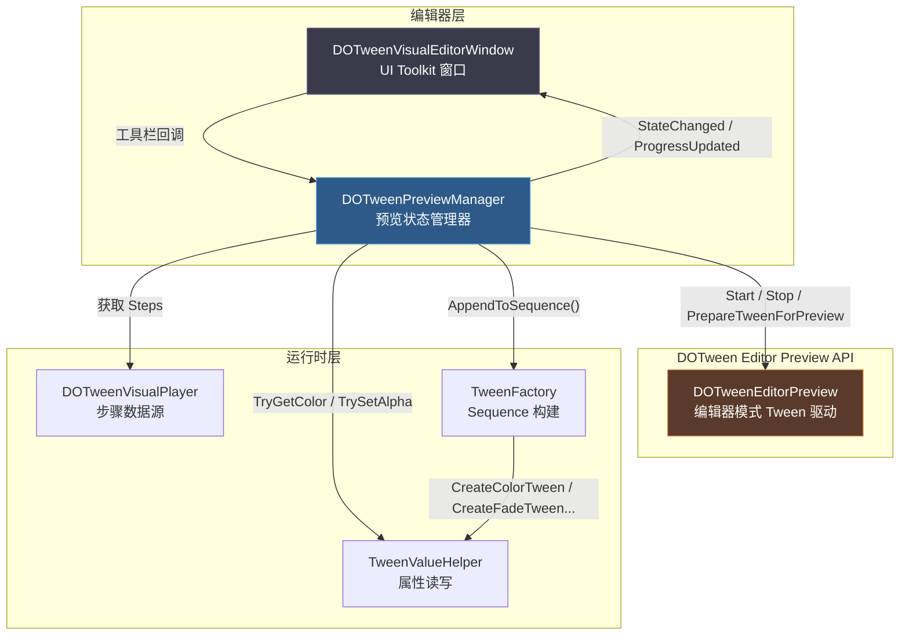
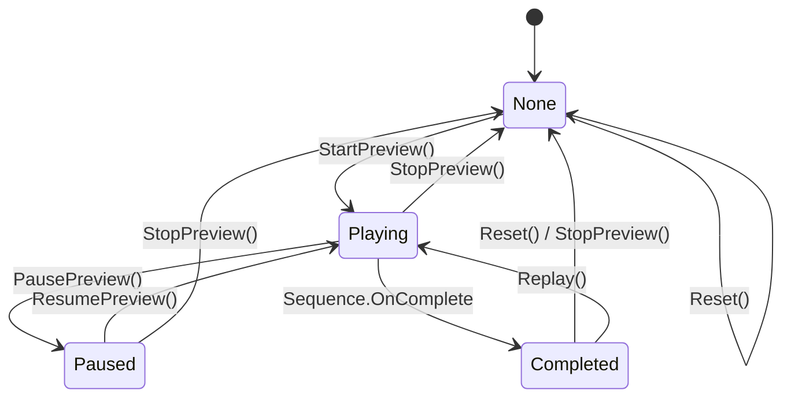
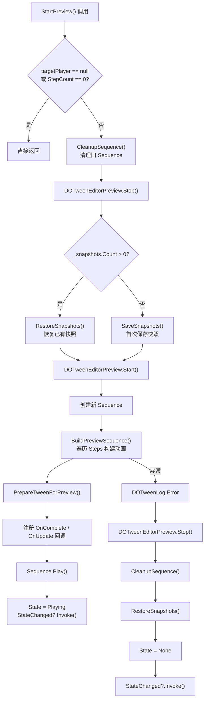

`DOTweenPreviewManager` 是 DOTween Visual Editor 编辑器层的核心子系统，承担三项不可分割的职责：**预览前对目标物体所有可变属性进行快照保存**、**管理预览生命周期中 None / Playing / Paused / Completed 四种状态的精确转换**、以及**预览结束后将物体状态无损恢复至快照点**。它被设计为与 `DOTweenVisualEditorWindow` 完全解耦的独立类，通过 `StateChanged` 和 `ProgressUpdated` 两个事件向 UI 层推送变更，使预览逻辑可以被独立测试和替换，而窗口类仅负责按钮状态、进度条与步骤高亮等视觉反馈。整个预览系统深度依赖 DOTween 官方提供的 `DOTweenEditorPreview` API 来驱动编辑器模式下的 Tween 播放，同时通过共享的 `TweenFactory.AppendToSequence()` 方法保证编辑器预览与运行时播放行为的一致性。

Sources: [DOTweenPreviewManager.cs](Editor/DOTweenPreviewManager.cs#L14-L19), [DOTweenVisualEditorWindow.cs](Editor/DOTweenVisualEditorWindow.cs#L109-L117)

## 架构定位与模块关系

在整体分层架构中，`DOTweenPreviewManager` 处于**编辑器层与运行时层的桥梁位置**。它消费运行时的 `DOTweenVisualPlayer`（获取步骤数据）、`TweenFactory`（构建 Sequence）和 `TweenValueHelper`（读写颜色/透明度/UI 属性），同时向上仅通过事件接口向 `DOTweenVisualEditorWindow` 输出状态信号。这种单向依赖的设计意味着：运行时层对编辑器层一无所知，而编辑器层可以在不影响运行时行为的前提下自由演化预览策略。

上图揭示了三个关键依赖路径：**预览控制路径**（Window → PreviewManager → DOTweenEditorPreview）、**数据获取路径**（PreviewManager → Player → Steps）和**序列构建路径**（PreviewManager → TweenFactory → TweenValueHelper）。值得注意的是，`DOTweenEditorPreview` 作为 DOTween 官方编辑器模块，提供了 `Start()` / `Stop()` / `PrepareTweenForPreview()` 三个核心方法，使得 Sequence 能够在编辑器帧循环中被正确驱动，而不是依赖 `MonoBehaviour.Update`。

Sources: [DOTweenPreviewManager.cs](Editor/DOTweenPreviewManager.cs#L1-L11), [DOTweenVisualEditorWindow.cs](Editor/DOTweenVisualEditorWindow.cs#L93-L97)

## 状态机设计：四态转换模型

`DOTweenPreviewManager` 使用一个简洁而完备的 `PreviewState` 枚举定义了四种预览状态，每种状态对应明确的按钮可用性与行为语义。

| 状态 | 含义 | 触发操作 | 按钮状态 |
|------|------|----------|----------|
| **None** | 未进入预览，物体处于原始状态 | `StopPreview()` / `Reset()` / 初始状态 | 预览✓ 停止✗ 重播✗ 重置✗ |
| **Playing** | 预览正在播放 | `StartPreview()` / `ResumePreview()` | 暂停✓ 停止✓ 重播✗ 重置✗ |
| **Paused** | 预览已暂停 | `PausePreview()` | 继续✓ 停止✓ 重播✗ 重置✗ |
| **Completed** | 预览播放完毕 | Sequence `OnComplete` 回调 | 预览✗ 停止✗ 重播✓ 重置✓ |

状态转换的关键设计原则是**状态变更后立即触发 `StateChanged` 事件**，确保 UI 层始终与预览状态同步。每个状态变更方法（`StartPreview`、`PausePreview`、`ResumePreview`、`StopPreview`、`Reset`）在完成核心逻辑后都会调用 `StateChanged?.Invoke()`，而 `DOTweenVisualEditorWindow` 在 `OnEnable` 中订阅此事件来驱动 `UpdateButtonStates()` 和 `UpdateStatusBar()` 两个 UI 更新方法。

Sources: [DOTweenPreviewManager.cs](Editor/DOTweenPreviewManager.cs#L26-L32), [DOTweenPreviewManager.cs](Editor/DOTweenPreviewManager.cs#L148-L150), [DOTweenVisualEditorWindow.cs](Editor/DOTweenVisualEditorWindow.cs#L1919-L1928), [DOTweenVisualEditorWindow.cs](Editor/DOTweenVisualEditorWindow.cs#L1980-L2030)

## 快照系统：TransformSnapshot 的属性覆盖范围

预览系统的核心保障机制是**快照（Snapshot）**——在首次启动预览时，对参与动画的所有 Transform 节点进行完整属性捕获，并在预览停止或重置时无损恢复。`TransformSnapshot` 结构体定义了以下十项属性，覆盖了所有 DOTween Visual Editor 支持的动画维度。

| 属性 | 类型 | 对应动画类型 | 说明 |
|------|------|-------------|------|
| `Position` | `Vector3` | Move (World) | 世界坐标位置 |
| `Rotation` | `Quaternion` | Rotate (World) | 世界旋转 |
| `LocalPosition` | `Vector3` | Move (Local) | 本地坐标位置 |
| `LocalRotation` | `Quaternion` | Rotate (Local) | 本地旋转 |
| `LocalScale` | `Vector3` | Scale / Punch(Scale) / Shake(Scale) | 本地缩放 |
| `Color` | `Color` | Color | 通过 `TweenValueHelper` 多组件适配 |
| `Alpha` | `float` | Fade | 通过 `TweenValueHelper` 多组件适配 |
| `AnchoredPosition` | `Vector2` | AnchorMove | RectTransform 锚点位置 |
| `SizeDelta` | `Vector2` | SizeDelta | RectTransform 尺寸 |
| `FillAmount` | `float` | FillAmount | Image 填充量 |

快照的采集范围不仅限于 `DOTweenVisualPlayer` 所在物体自身，还**遍历所有步骤的 `TargetTransform` 字段**。当某个步骤指定了独立的目标 Transform（而非使用播放器默认目标）时，该目标也会被纳入快照管理。`SaveSnapshots()` 方法首先保存播放器 Transform，随后遍历 `_targetPlayer.Steps` 中所有步骤引用的外部目标，每个 Transform 只保存一次（通过 `Dictionary.ContainsKey` 去重）。

Sources: [DOTweenPreviewManager.cs](Editor/DOTweenPreviewManager.cs#L37-L49), [DOTweenPreviewManager.cs](Editor/DOTweenPreviewManager.cs#L249-L261)

## 快照保存与恢复的完整流程

**保存阶段**（`SaveTransformSnapshot`）对每个目标 Transform 执行以下操作：调用 `TweenValueHelper.TryGetColor()` 和 `TryGetAlpha()` 获取多组件适配后的颜色与透明度值；通过 `TryGetRectTransform()` 检测是否存在 RectTransform 组件，若有则额外记录 `anchoredPosition` 和 `sizeDelta`；直接访问 `Image.fillAmount` 记录填充量。所有值被打包为一个 `TransformSnapshot` 结构体，以 Transform 引用为键存入 `_snapshots` 字典。

**恢复阶段**（`RestoreSnapshots`）遍历字典中的每个条目，对仍然有效的 Transform 引用执行反向写入。恢复过程有三个关键细节值得注意：第一，恢复前调用 `Undo.RecordObject(target, "Reset Preview State")`，使恢复操作本身可被 Undo 系统追踪；第二，对可能已被销毁的目标使用 `try-catch (MissingReferenceException)` 容错处理；第三，颜色和透明度的恢复同样通过 `TweenValueHelper.TrySetColor()` / `TrySetAlpha()` 间接写入，保证组件适配的一致性。恢复完成后立即清空 `_snapshots` 字典。

Sources: [DOTweenPreviewManager.cs](Editor/DOTweenPreviewManager.cs#L263-L338)

## 预览启动的完整流程与异常处理

`StartPreview()` 方法是整个预览生命周期中最复杂的操作，其执行流程可以分解为以下阶段：

一个精妙的设计在于**快照的首次保存与后续重用**：当 `_snapshots.Count > 0` 时（意味着之前已经保存过快照，例如在上一次 Preview 结束后没有调用 `Reset()`），`StartPreview()` 会先恢复快照再启动新预览，而不是重新保存。这保证了多次连续预览时物体始终从同一初始状态开始。仅当 `_snapshots` 为空（即首次预览或 `Reset()` 后）才执行 `SaveSnapshots()`。

异常处理采用 `try-catch` 包裹整个 Sequence 创建与构建过程。一旦任何步骤抛出异常，系统会执行完整的清理链路：停止 DOTweenEditorPreview → 清理 Sequence → 恢复快照 → 重置状态为 None → 通知 UI。这确保了即使在步骤数据异常（如空引用、无效参数）的情况下，编辑器状态也能保持一致。

Sources: [DOTweenPreviewManager.cs](Editor/DOTweenPreviewManager.cs#L108-L161)

## Sequence 构建与运行时一致性保证

`BuildPreviewSequence()` 方法遍历 `_targetPlayer.Steps` 中所有 `IsEnabled == true` 的步骤，逐一调用 `TweenFactory.AppendToSequence(_previewSequence, step, _targetPlayer.transform)`。这里的设计决策极为关键：**编辑器预览与运行时播放共享完全相同的 Sequence 构建代码路径**。

在运行时，`DOTweenVisualPlayer.BuildAndPlay()` 方法同样调用 `TweenFactory.AppendToSequence()` 来构建 Sequence。这意味着缓动函数、延迟设置、执行模式（Append / Join / Insert）、自定义曲线——所有影响动画行为的配置在编辑器预览和运行时播放中都完全一致。开发者可以信赖"所见即所得"的预览效果，无需担心预览与实际运行之间存在行为差异。

Sources: [DOTweenPreviewManager.cs](Editor/DOTweenPreviewManager.cs#L236-L243), [DOTweenVisualPlayer.cs](Runtime/Components/DOTweenVisualPlayer.cs#L46-L47)

## 进度追踪与步骤高亮

预览播放期间，`DOTweenPreviewManager` 通过 Sequence 的 `OnUpdate` 回调实时计算归一化进度值（0~1），并通过 `ProgressUpdated` 事件推送给 UI 层。进度计算使用 `Elapsed(false) / Duration(false)` 的比值，其中 `false` 参数表示不包含循环的已用时间。为防止除零错误，Duration 使用 `Mathf.Max(0.001f, ...)` 进行下界保护。

`DOTweenVisualEditorWindow` 在接收到 `ProgressUpdated` 回调后，调用 `HighlightCurrentStep(progress)` 方法，将归一化进度乘以 `totalSequenceDuration` 得到当前绝对时间，然后与每个步骤的 `stepStartTimes[i] + step.Duration` 区间进行比较，为当前正在执行的步骤添加 `step-active` CSS 类名，从而实现列表中的实时高亮效果。

Sources: [DOTweenPreviewManager.cs](Editor/DOTweenPreviewManager.cs#L138-L146), [DOTweenVisualEditorWindow.cs](Editor/DOTweenVisualEditorWindow.cs#L1933-L1961)

## Sequence 清理策略：Rewind + Kill

`CleanupSequence()` 方法展示了对 DOTween Sequence 生命周期的精确控制。在销毁 Sequence 之前，它先检查 `_previewSequence.IsActive()`——如果 Sequence 仍处于活跃状态，则先调用 `Rewind()` 将所有被动画修改的属性回滚到动画开始前的值，然后再调用 `Kill()` 彻底销毁。这个两步清理策略是必要的，因为 DOTween 的 `Kill()` 方法只会停止并回收 Tween，但不会自动回滚属性到初始状态。如果不先 `Rewind()`，被动画修改过的属性会停留在中间帧的值，导致物体状态残留。

Sources: [DOTweenPreviewManager.cs](Editor/DOTweenPreviewManager.cs#L344-L356)

## 生命周期安全网：编辑器事件联动

`DOTweenVisualEditorWindow` 为预览系统设置了三道**生命周期安全网**，确保在各种编辑器状态切换时预览不会泄漏到异常状态：

**编译重置**：通过 `CompilationPipeline.compilationStarted` 事件监听，当 Unity 开始重新编译脚本时，遍历所有打开的编辑器窗口实例，对处于非 None 状态的预览管理器调用 `Reset()`。这避免了编译期间 DOTweenEditorPreview 和 Sequence 引用失效导致的异常。

**Play Mode 退出**：通过 `EditorApplication.playModeStateChanged` 事件，在 `ExitingEditMode` 阶段（即即将进入 Play Mode 时）强制重置预览。这确保了编辑器预览的临时状态不会污染运行时场景。

**窗口关闭**：在 `OnDisable` 中取消所有事件订阅，并调用 `_previewManager.Dispose()`，后者内部调用 `Reset()` 后将 `_targetPlayer` 置空，完成资源释放。

Sources: [DOTweenVisualEditorWindow.cs](Editor/DOTweenVisualEditorWindow.cs#L30-L46), [DOTweenVisualEditorWindow.cs](Editor/DOTweenVisualEditorWindow.cs#L119-L129), [DOTweenVisualEditorWindow.cs](Editor/DOTweenVisualEditorWindow.cs#L131-L140)

## 按钮状态矩阵与 UI 交互模式

`DOTweenVisualEditorWindow.UpdateButtonStates()` 方法根据当前预览状态和目标数据，精确控制四个工具栏按钮和一个下拉菜单的可用性与文本。以下矩阵展示了所有状态下的完整按钮配置：

| 状态 | 预览按钮 | 停止按钮 | 重播按钮 | 重置按钮 | 添加步骤菜单 |
|------|----------|----------|----------|----------|-------------|
| None | ✓ "预览" | ✗ | ✗ | ✗ | ✓ |
| Playing | ✓ "暂停" | ✓ | ✗ | ✗ | ✗ |
| Paused | ✓ "继续" | ✓ | ✗ | ✗ | ✗ |
| Completed | ✗ | ✗ | ✓ | ✓ | ✓ |

预览按钮在不同状态下承担了**三种不同的语义**（预览 → 暂停 → 继续），这是通过 `OnPreviewClicked()` 方法中的条件分支实现的：如果当前正在播放则暂停，如果已暂停则恢复，否则启动新预览。这种复用设计减少了 UI 元素数量，同时通过按钮文本变化和颜色差异保证了操作语义的清晰传达。

状态栏的视觉反馈同样随状态切换：灰色（● 未播放）、绿色（● 播放中）、橙色（● 已暂停）、蓝色（● 播放完成），每种颜色通过 `stateLabel.style.color` 动态设置。

Sources: [DOTweenVisualEditorWindow.cs](Editor/DOTweenVisualEditorWindow.cs#L1980-L2030), [DOTweenVisualEditorWindow.cs](Editor/DOTweenVisualEditorWindow.cs#L1882-L1910)

## StopPreview() 与 Reset() 的语义区分

`StopPreview()` 和 `Reset()` 两个方法都执行"停止动画 + 恢复快照 + 状态置 None"，但存在一个关键差异：**`Reset()` 额外执行了 `_snapshots.Clear()`**。这意味着：

- `StopPreview()` 停止预览并恢复物体到原始状态，但**保留快照数据**。下次调用 `StartPreview()` 时，由于 `_snapshots.Count > 0`，会先恢复快照再重新播放——这是"停止后可重播"语义的基础。
- `Reset()` 不仅恢复物体状态，还**彻底清除快照缓存**。下次调用 `StartPreview()` 时会重新保存当前状态为新快照——这是"完全重置到干净状态"的语义。

`Replay()` 方法则是 `RestoreSnapshots() + StartPreview()` 的组合，它利用了快照尚未清除的特性，先恢复到原始状态再立即重新播放，实现"从起点重新开始"的用户体验。

Sources: [DOTweenPreviewManager.cs](Editor/DOTweenPreviewManager.cs#L192-L221)

## Dispose 模式与资源释放

`DOTweenPreviewManager` 实现了 `IDisposable` 接口，`Dispose()` 方法执行完整的资源释放链路：先调用 `Reset()`（清理 Sequence + 停止 DOTweenEditorPreview + 恢复快照 + 清空快照），然后将 `_targetPlayer` 置空，断开与运行时数据源的引用。`DOTweenVisualEditorWindow.OnDisable()` 中调用 `_previewManager.Dispose()` 并将字段置 null，确保窗口关闭时无资源泄漏。

由于 `DOTweenPreviewManager` 不持有任何非托管资源（没有文件句柄、网络连接或原生内存），`Dispose()` 的主要价值在于提供确定性的清理时机和语义上的完整性。在实际运行中，`Reset()` 中对 Sequence 的 `Rewind()` + `Kill()` 和 `DOTweenEditorPreview.Stop()` 调用才是真正释放 DOTween 内部资源的操作。

Sources: [DOTweenPreviewManager.cs](Editor/DOTweenPreviewManager.cs#L226-L230), [DOTweenVisualEditorWindow.cs](Editor/DOTweenVisualEditorWindow.cs#L124-L128)

## 设计总结与扩展考量

`DOTweenPreviewManager` 的架构体现了三个核心设计原则：**解耦**（事件驱动而非回调注入，PreviewManager 不依赖任何 UI 类型）、**一致性**（与运行时共享 TweenFactory 构建路径）、**安全性**（多重生命周期安全网 + 异常处理 + Undo 支持）。这些原则使得系统在以下场景中表现出良好的健壮性：

- 多窗口实例同时运行时，每个窗口拥有独立的 PreviewManager 实例，互不干扰
- 编辑器编译或 Play Mode 切换时，预览状态被可靠清理
- 步骤数据存在异常时，系统通过 catch 块安全恢复，不会留下中间状态

对于希望扩展预览功能的开发者，关键扩展点是 `TransformSnapshot` 结构体——如果新增动画类型涉及未被当前快照覆盖的属性（例如 Material 属性、TMP 字体大小等），需要同步扩展快照的保存与恢复逻辑。另一个扩展点是 `BuildPreviewSequence()` 方法，当前实现仅遍历已启用的步骤，若需要支持步骤级别的单独预览或范围预览，可在该方法中添加过滤逻辑。

---

**相关阅读**：
- 了解编辑器窗口如何消费预览事件并渲染 UI：[可视化编辑器窗口（DOTweenVisualEditorWindow）：UI Toolkit 布局与交互](14-ke-shi-hua-bian-ji-qi-chuang-kou-dotweenvisualeditorwindow-ui-toolkit-bu-ju-yu-jiao-hu)
- 理解预览与运行时共享的 Sequence 构建机制：[TweenFactory 工厂模式：统一运行时与编辑器预览的 Tween 创建](8-tweenfactory-gong-han-mo-shi-tong-yun-xing-shi-yu-bian-ji-qi-yu-lan-de-tween-chuang-jian)
- 快照系统使用的属性访问层：[TweenValueHelper 值访问层：多组件适配策略（Graphic / Renderer / SpriteRenderer / TMP）](9-tweenvaluehelper-zhi-fang-wen-ceng-duo-zu-jian-gua-pei-ce-lue-graphic-renderer-spriterenderer-tmp)
- Sequence 从数据到播放的完整生命周期：[Sequence 构建流程：从步骤数据到 DOTween Sequence 的完整生命周期](25-sequence-gou-jian-liu-cheng-cong-bu-zou-shu-ju-dao-dotween-sequence-de-wan-zheng-sheng-ming-zhou-qi)