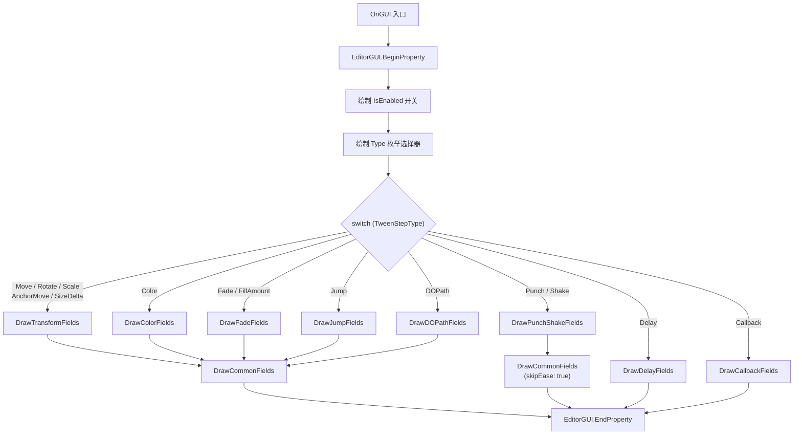
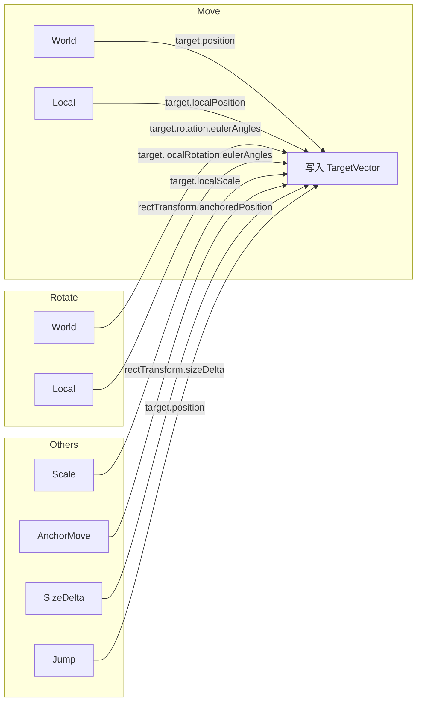

`TweenStepDataDrawer` 是 DOTween Visual Editor 编辑器层的核心基础设施之一。它继承自 Unity 的 `PropertyDrawer`，通过 `[CustomPropertyDrawer(typeof(TweenStepData))]` 特性注册，接管了 `TweenStepData` 在 Inspector 中的全部绘制逻辑。其核心职责是：**根据用户选择的 `TweenStepType`，动态决定哪些字段应当渲染、哪些应当隐藏**——将一个包含 14 种动画类型全部字段的"胖"数据结构，转化为在任何时刻只展示与当前类型相关字段的精简 Inspector 界面。

Sources: [TweenStepDataDrawer.cs](Editor/TweenStepDataDrawer.cs#L1-L16), [TweenStepData.cs](Runtime/Data/TweenStepData.cs#L1-L13)

## 架构定位与设计动机

在 [TweenStepData 数据结构：多值组设计模式](7-tweenstepdata-shu-ju-jie-gou-duo-zhi-zu-she-ji-mo-shi) 中我们了解到，`TweenStepData` 采用"多值组方案"——将 Transform 值组（`StartVector`/`TargetVector`）、Color 值组（`StartColor`/`TargetColor`）、Float 值组（`StartFloat`/`TargetFloat`）等所有类型的字段平铺在一个类中。这种设计在运行时带来了序列化简洁性和零分配的优势，但代价是：**如果不加处理，Inspector 会同时暴露所有字段**，导致用户面对大量与当前动画类型无关的配置项。

`TweenStepDataDrawer` 正是解决这一问题的关键组件。它充当 **"多值组"数据模型与"单类型"用户界面之间的桥梁**，通过条件渲染策略，确保 Inspector 在任何时刻只展示当前 `TweenStepType` 所需要的字段子集。

```
┌─────────────────────────────────────────────────────────────────────┐
│                      TweenStepData (数据层)                         │
│  ┌─────────┐ ┌─────────┐ ┌─────────┐ ┌─────────┐ ┌──────────┐    │
│  │Transform │ │  Color  │ │  Float  │ │  Path   │ │  Common  │    │
│  │ 值组     │ │  值组   │ │  值组   │ │  值组   │ │  字段    │    │
│  └─────────┘ └─────────┘ └─────────┘ └─────────┘ └──────────┘    │
│       ↑             ↑           ↑           ↑          ↑           │
│       └─────────────┴───────────┴───────────┴──────────┘           │
│                          条件过滤                                    │
│                            ↓                                        │
│  ┌──────────────────────────────────────────────────────────────┐  │
│  │             TweenStepDataDrawer (绘制层)                     │  │
│  │   switch (TweenStepType) ──→ 选择对应值组的绘制方法          │  │
│  └──────────────────────────────────────────────────────────────┘  │
│                            ↓                                        │
│                   Inspector 精简界面                                │
│            (仅显示当前类型所需字段)                                  │
└─────────────────────────────────────────────────────────────────────┘
```

Sources: [TweenStepDataDrawer.cs](Editor/TweenStepDataDrawer.cs#L15-L16), [TweenStepData.cs](Runtime/Data/TweenStepData.cs#L54-L168)

## 双方法同步架构：GetPropertyHeight 与 OnGUI

Unity 的 `PropertyDrawer` 要求子类重写两个方法：`GetPropertyHeight` 负责计算属性区域的总高度，`OnGUI` 负责实际绘制。这两个方法必须严格同步——如果 `GetPropertyHeight` 返回的高度小于 `OnGUI` 实际绘制所需的高度，内容会被裁剪；反之则会留下空白。

`TweenStepDataDrawer` 通过 **完全相同的 switch-case 结构** 来保证两者同步。两个方法都根据 `TweenStepType` 枚举值走同一组分枝，每个分枝调用配对的 "Height" 和 "Draw" 方法：

| TweenStepType | 高度方法 | 绘制方法 | 值组 |
|---|---|---|---|
| Move / Rotate / Scale / AnchorMove / SizeDelta | `GetTransformFieldsHeight` | `DrawTransformFields` | Transform 值组 |
| Color | `GetColorFieldsHeight` | `DrawColorFields` | Color 值组 |
| Fade / FillAmount | `GetFadeFieldsHeight` | `DrawFadeFields` | Float 值组 |
| Jump | `GetJumpFieldsHeight` | `DrawJumpFields` | Transform + 跳跃参数 |
| Punch / Shake | `GetPunchShakeFieldsHeight` | `DrawPunchShakeFields` | 特效参数值组 |
| DOPath | `GetDOPathFieldsHeight` | `DrawDOPathFields` | 路径动画值组 |
| Delay | `GetDelayFieldsHeight` | `DrawDelayFields` | 仅 Duration |
| Callback | `GetCallbackFieldsHeight` | `DrawCallbackFields` | 仅 OnComplete |

此外，绝大多数类型在绘制完特有字段后，还会追加一组 **公共字段**（`DrawCommonFields` / `GetCommonFieldsHeight`），包含 Duration、Delay、Ease、ExecutionMode 和 OnComplete 回调。Delay 和 Callback 是仅有的两个不走公共字段路径的类型——Delay 只需要 Duration，Callback 只需要 OnComplete 事件。

Sources: [TweenStepDataDrawer.cs](Editor/TweenStepDataDrawer.cs#L26-L148)

## 条件渲染的三层动态性

`TweenStepDataDrawer` 的条件渲染并非简单的"按类型显示/隐藏固定字段"。在类型级别的分流之下，还存在 **两层嵌套的条件逻辑**，使 Inspector 界面能够响应用户的实时操作进行动态折叠：

**第一层：类型级分流（switch-case）**。如上表所示，14 种 `TweenStepType` 被归并为 8 个渲染路径。这种归并并非随意分组——共享同一渲染路径的类型，在 `TweenStepData` 中确实使用同一组字段。例如 Move、Rotate、Scale 都使用 `StartVector`/`TargetVector` 组，只是字段标签和坐标空间选择器不同。

**第二层：开关级折叠（布尔驱动）**。在类型级分流内部，若干布尔开关控制子字段的显隐：

| 布尔开关 | 作用域 | 控制的字段 |
|---|---|---|
| `UseStartValue` | Transform / Jump / DOPath | 起始 Vector3 输入框 |
| `UseStartColor` | Color | 起始颜色选择器 |
| `UseStartFloat` | Fade / FillAmount | 起始浮点值滑块 |
| `UseCustomCurve` | 公共字段（所有含 Ease 的类型） | AnimationCurve 编辑器 |
| `ExecutionMode == Insert` | 公共字段 | InsertTime 插入时间输入框 |

**第三层：校验级警告（组件依赖）**。对于 Color、Fade 等有组件依赖的类型，Drawer 会调用 `TweenStepRequirement.Validate` 检测目标物体是否具备所需组件，在不满足时渲染一条橙色警告信息，并且这条警告本身也参与高度计算——它只在"目标物体不为 null 且校验失败"时才占用空间。

Sources: [TweenStepDataDrawer.cs](Editor/TweenStepDataDrawer.cs#L150-L309), [TweenStepDataDrawer.cs](Editor/TweenStepDataDrawer.cs#L619-L648), [TweenStepRequirement.cs](Runtime/Data/TweenStepRequirement.cs#L22-L85)

## 渲染流程详解

以下流程图展示了 `OnGUI` 的完整执行路径。从顶部开始，`IsEnabled` 开关和 `Type` 枚举始终渲染，随后根据枚举值进入不同的字段组合：



注意 Punch 和 Shake 走的是 `skipEase: true` 的公共字段路径，这是因为 DOTween 的 `DOPunch`/`DOShake` 系列方法内置了振荡缓动，不允许用户自定义 Ease 曲线。

Sources: [TweenStepDataDrawer.cs](Editor/TweenStepDataDrawer.cs#L82-L148)

## 类型特化：标签自适应与坐标空间选择

同一渲染路径内的不同类型并非完全相同。`DrawTransformFields` 方法通过 `type` 参数进行二次分化，实现**字段标签和辅助选择器的自适应**：

**标签自适应**。同一个 `TargetVector` 字段，在不同类型下显示不同的标签文本，帮助用户理解其语义：

| TweenStepType | 起始值标签 | 目标值标签 |
|---|---|---|
| Move | "起始值" | "目标值" |
| Rotate | "起始旋转 (欧拉角)" | "目标旋转 (欧拉角)" |
| AnchorMove | "起始锚点位置" | "目标锚点位置" |
| SizeDelta | "起始尺寸" | "目标尺寸" |
| Scale | "起始值" | "目标值" |

**坐标空间选择器**。Move 和 Rotate 各自需要不同的坐标空间选择器：Move 显示 `MoveSpace`（World / Local），Rotate 显示 `RotateSpace`（World / Local），而 Scale、AnchorMove、SizeDelta 则不需要任何空间选择器。这种差异通过 `if (type == TweenStepType.Move)` / `else if (type == TweenStepType.Rotate)` 的条件判断实现。

Sources: [TweenStepDataDrawer.cs](Editor/TweenStepDataDrawer.cs#L315-L374), [TransformTarget.cs](Runtime/Data/TransformTarget.cs#L1-L50)

## 校验警告系统：编辑器内的实时组件检查

对于有组件依赖的动画类型（Color 需要 Graphic/Renderer/SpriteRenderer，Fade 需要 CanvasGroup/Graphic/Renderer/SpriteRenderer，AnchorMove/SizeDelta 需要 RectTransform，FillAmount 需要 Image），Drawer 在绘制特有字段之前会执行一次校验。校验逻辑委托给 [TweenStepRequirement 组件校验系统](10-tweensteprequirement-zu-jian-xiao-yan-xi-tong) 的静态方法 `Validate`。

当校验失败时，Drawer 在 Inspector 中渲染一条橙色警告文本（`⚠ 该物体不包含可着色组件...`），提醒用户当前指定的目标物体不满足动画要求。这条警告的高度计算也需要同步处理——`GetValidationWarningHeight` 在目标为 null 或校验通过时返回 0，校验失败时返回 `WarningHeight + Spacing`，确保与 `DrawValidationWarning` 的实际绘制高度一致。

Sources: [TweenStepDataDrawer.cs](Editor/TweenStepDataDrawer.cs#L619-L648)

## 一键同步机制

Transform 类路径（Move/Rotate/Scale/AnchorMove/SizeDelta）、Jump 和 DOPath 的渲染区域底部都包含一个 **"同步当前值"** 按钮。该功能读取目标物体在 Scene 中的实时状态（世界位置、本地旋转欧拉角、锚点位置、尺寸等），将其写入 `TargetVector` 序列化属性。

`SyncCurrentValue` 方法的解析逻辑根据类型和坐标空间组合进行分发：



当 `TargetTransform` 为 null 时，方法会回退到当前 `MonoBehaviour` 组件的 `transform`，确保用户即使未显式指定目标物体，也能使用同步功能。同步完成后，通过 `DOTweenLog.Info` 输出日志记录。

Sources: [TweenStepDataDrawer.cs](Editor/TweenStepDataDrawer.cs#L652-L737)

## 布局常量与 Rect 游标模式

Drawer 使用三个布局常量控制 Inspector 的视觉节奏：

| 常量 | 值 | 用途 |
|---|---|---|
| `LineHeight` | 18f | 单行控件高度（与 `EditorGUIUtility.singleLineHeight` 一致） |
| `Spacing` | 2f | 行间距，提供视觉呼吸空间 |
| `ButtonHeight` | 24f | 同步按钮高度，比普通行略高以便点击 |

整个绘制过程采用 **"Rect 游标"模式**：维护一个 `rect` 引用（`ref Rect rect`），每绘制一行就将 `rect.y` 推进 `LineHeight + Spacing`。`GetPropertyHeight` 中对应的累加逻辑完全镜像这个推进过程。这种模式使得添加或移除字段的修改只需要在两个配对方法中同步增减一行高度即可，降低了不一致的风险。

Sources: [TweenStepDataDrawer.cs](Editor/TweenStepDataDrawer.cs#L20-L24), [TweenStepDataDrawer.cs](Editor/TweenStepDataDrawer.cs#L86-L96)

## 条件编译保护

整个文件被包裹在 `#if UNITY_EDITOR` / `#endif` 预编译指令中。这确保了 `TweenStepDataDrawer` 及其依赖的 `UnityEditor` 命名空间不会泄漏到 Runtime 构建中——符合 Unity 对 Editor 代码的隔离要求，也与项目的 Assembly Definition 结构（`CNoom.DOTweenVisual.Editor.asmdef` 仅在 Editor 平台生效）形成双重保障。

Sources: [TweenStepDataDrawer.cs](Editor/TweenStepDataDrawer.cs#L1-L2), [TweenStepDataDrawer.cs](Editor/TweenStepDataDrawer.cs#L741-L742)

## 延伸阅读

- [TweenStepData 数据结构：多值组设计模式](7-tweenstepdata-shu-ju-jie-gou-duo-zhi-zu-she-ji-mo-shi) — 理解 Drawer 所渲染的底层数据模型
- [TweenStepRequirement 组件校验系统](10-tweensteprequirement-zu-jian-xiao-yan-xi-tong) — 校验警告背后的组件依赖定义
- [可视化编辑器窗口（DOTweenVisualEditorWindow）](14-ke-shi-hua-bian-ji-qi-chuang-kou-dotweenvisualeditorwindow-ui-toolkit-bu-ju-yu-jiao-hu) — 窗口中如何集成 Inspector Drawer 的展示
- [编辑器样式系统：DOTweenEditorStyle 与 USS 暗色主题](17-bian-qi-yang-shi-xi-tong-dotweeneditorstyle-yu-uss-an-se-zhu-ti) — 编辑器层面的样式体系概览