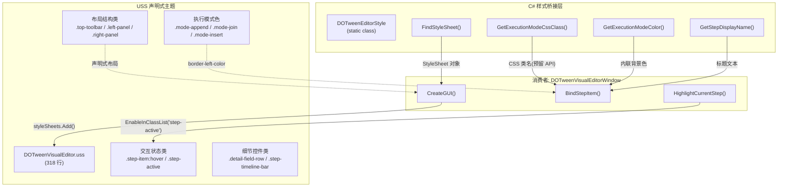
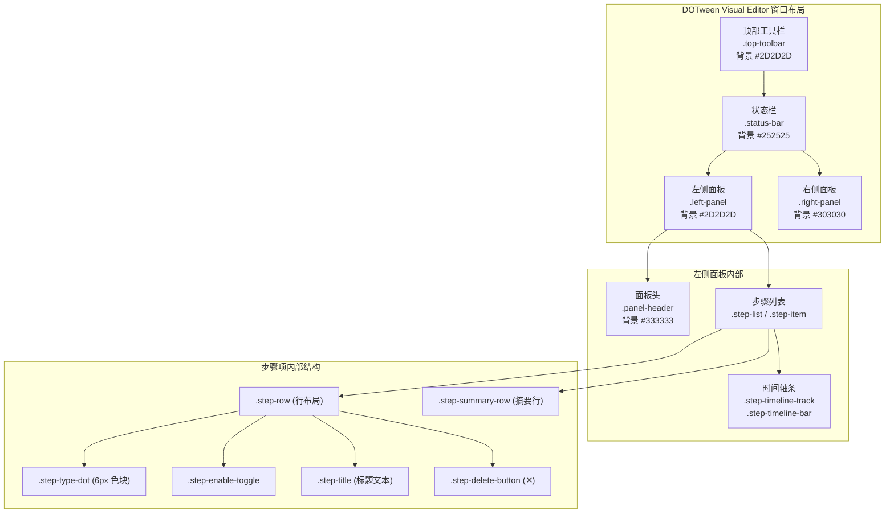
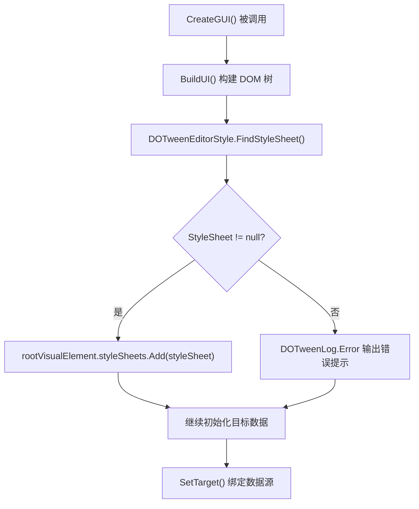

DOTween Visual Editor 的视觉呈现由**双层样式架构**驱动：C# 层的 `DOTweenEditorStyle` 静态工具类负责运行时颜色计算、CSS 类名映射和显示名称解析；USS 层的 `DOTweenVisualEditor.uss` 样式表则定义了完整的暗色主题布局与视觉规范。两层通过 UI Toolkit 的 `AddToClassList` / `EnableInClassList` 机制松耦合协作——C# 代码为元素标注语义化类名并按需注入内联样式，USS 则基于这些类名提供声明式的视觉规则。这种分离使样式逻辑集中管控、便于测试，同时保持了 UI Toolkit 的声明式设计哲学。

Sources: [DOTweenEditorStyle.cs](Editor/DOTweenEditorStyle.cs#L1-L97), [DOTweenVisualEditor.uss](Editor/USS/DOTweenVisualEditor.uss#L1-L318)

## 架构总览：C# 样式桥接层 + USS 声明式主题

在深入细节之前，理解这两层各自的职责边界至关重要。下图展示了样式系统的完整数据流：



**DOTweenEditorStyle** 作为纯粹的静态工具类，不持有任何状态，仅提供无副作用的映射函数。它的四个公开 API 各司其职：`FindStyleSheet()` 在 AssetDatabase 中定位 USS 文件；`GetStepDisplayName()` 将枚举值转换为用户可读文本；`GetExecutionModeCssClass()` 将执行模式映射为 CSS 类名；`GetExecutionModeColor()` 将执行模式映射为运行时 `Color` 结构体。所有映射均通过 C# 8 的 **switch 表达式**实现，简洁且覆盖完整。

Sources: [DOTweenEditorStyle.cs](Editor/DOTweenEditorStyle.cs#L9-L96)

## DOTweenEditorStyle 四大功能区域详解

### 样式表资源定位：FindStyleSheet()

```csharp
public static StyleSheet FindStyleSheet()
{
    var guids = AssetDatabase.FindAssets($"t:StyleSheet");
    foreach (var guid in guids)
    {
        var path = AssetDatabase.GUIDToAssetPath(guid);
        if (path.EndsWith(USS_FILE_NAME))
            return AssetDatabase.LoadAssetAtPath<StyleSheet>(path);
    }
    return null;
}
```

此方法采用**全库扫描 + 文件名匹配**策略：先检索项目中所有 `StyleSheet` 类型资源，再以文件名后缀 `DOTweenVisualEditor.uss` 精确匹配。这种设计的一个优势是**路径无关性**——无论 USS 文件被移动到哪个子目录（只要仍在 Assets 内），都能被正确找到。代价是首次加载时的全量扫描开销，但由于只在 `CreateGUI()` 中调用一次，影响可忽略。加载失败时会通过 `DOTweenLog.Error` 输出错误提示，确保开发者能快速定位缺失文件问题。

Sources: [DOTweenEditorStyle.cs](Editor/DOTweenEditorStyle.cs#L73-L91), [DOTweenVisualEditorWindow.cs](Editor/DOTweenVisualEditorWindow.cs#L270-L279)

### 显示名称映射：GetStepDisplayName()

该函数将 `TweenStepType` 枚举的 14 种动画类型映射为用户界面中显示的标题文本。映射规则遵循**枚举名即显示名**的约定——所有返回值与枚举成员名完全一致（如 `TweenStepType.Move` → `"Move"`），但通过显式映射而非 `ToString()` 实现了两个优势：其一，未来可以轻松替换为中文或其他本地化文本而无需修改调用方；其二，`default` 分支提供了安全的降级路径（调用 `type.ToString()`），即使新增了枚举成员也不会崩溃。

Sources: [DOTweenEditorStyle.cs](Editor/DOTweenEditorStyle.cs#L21-L45)

### 执行模式的双重映射：CSS 类名 + 运行时颜色

**执行模式（ExecutionMode）** 是样式系统中最精巧的设计点。`DOTweenEditorStyle` 同时维护了两种映射：

| ExecutionMode | CSS 类名 | 颜色值 (RGB) | 十六进制 | 语义含义 |
|:---|:---|:---|:---|:---|
| **Append** | `mode-append` | (0.29, 0.56, 0.85) | `#4A90D9` | 顺序追加 — 蓝色代表线性流程 |
| **Join** | `mode-join` | (0.29, 0.85, 0.29) | `#4AD94A` | 并行合并 — 绿色代表同步执行 |
| **Insert** | `mode-insert` | (0.85, 0.60, 0.29) | `#D99A4A` | 插入指定时间 — 橙色代表时间轴介入 |

`GetExecutionModeCssClass()` 返回的 CSS 类名在 USS 中对应 `border-left-color` 和 `step-timeline-bar` 的 `background-color` 规则，构成声明式的视觉反馈。`GetExecutionModeColor()` 返回的 `Color` 结构体则用于 C# 代码中直接设置 `timelineBar.style.backgroundColor`，确保即使 USS 加载失败，时间轴条的颜色信息也不会丢失——这是一种**防御性设计**。两种映射的颜色值完全一致，形成了 USS 与 C# 的**双写一致性约束**，测试中通过 `0.01f` 容差断言来验证。

Sources: [DOTweenEditorStyle.cs](Editor/DOTweenEditorStyle.cs#L47-L69)

## USS 暗色主题：318 行的完整视觉规范

`DOTweenVisualEditor.uss` 采用**分段注释 + 语义类名**的组织方式，将 318 行 CSS 规则清晰地划分为 8 个视觉区域。整体色调建立在 `#252525`–`#333333` 的深灰色基底上，文字色以 `#B4B4B4`–`#C0C0C0` 为主，确保在暗色 Unity 编辑器主题下的视觉舒适度。

### 色彩层次体系

整个 USS 文件建立了一套**三层灰度 + 彩色强调**的色彩层次：

| 层次 | 背景色范围 | 用途 | 典型色值 |
|:---|:---|:---|:---|
| **最深层** | `#252525` | 状态栏背景 | `background-color: #252525` |
| **内容层** | `#2D2D2D` | 工具栏、左侧面板、步骤列表 | `background-color: #2D2D2D` |
| **面板层** | `#303030`–`#333333` | 右侧面板、面板头 | `background-color: #303030` |
| **分割层** | `#383838`–`#404040` | 边框、分隔线、步骤底边 | `border-bottom-color: #383838` |
| **交互层** | `#404040` | hover 状态背景 | `background-color: #404040` |
| **强调色** | 三色系统 | 执行模式标识 | 蓝 / 绿 / 橙 |

### 核心视觉区域结构



Sources: [DOTweenVisualEditor.uss](Editor/USS/DOTweenVisualEditor.uss#L1-L200)

### 关键交互状态的 CSS 实现

USS 文件中有几处精巧的交互状态设计值得深入分析：

**步骤选中态**采用**双层覆盖**策略解决 ListView 内部选中机制与自定义样式的冲突。Unity 的 ListView 自动为选中行添加 `unity-collection-view__item--selected` 类，其默认背景色会覆盖自定义样式。解决方案是先为选中行设置 `#3A5A7C`（深蓝）背景，再将内部 `.step-item` 的背景设为 `transparent`，确保选中效果只出现在行容器层级而非内容层级。

**删除按钮**使用纯 CSS 实现 hover 反馈——默认状态为低调的灰色（`#808080`），hover 时变为醒目的红色（`#FF4444`）并附带 `rgba(255, 68, 68, 0.1)` 的半透明红色背景。这种"安静→醒目"的渐变遵循了**渐进式信息披露**的 UI 设计原则，减少视觉噪音的同时保留操作可达性。

**预览高亮态**（`.step-item.step-active`）以 `rgba(74, 144, 217, 0.15)` 半透明蓝色背景配合 `3px solid #4A90D9` 左侧边框标识当前正在执行的步骤。标题文字同步变为 `#7CB8F2` 浅蓝色，形成**三级视觉强化**（背景 + 边框 + 文字色），确保预览时用户的注意力被精确引导到当前帧。

Sources: [DOTweenVisualEditor.uss](Editor/USS/DOTweenVisualEditor.uss#L100-L312)

### 执行模式在 USS 中的视觉落地

三种执行模式在 USS 中通过**左边界色条**和**时间轴条颜色**双重体现。每个 `.step-item` 默认拥有 `3px border-left`，而 `.mode-append` / `.mode-join` / `.mode-insert` 类覆写 `border-left-color` 产生彩色指示。时间轴条同样遵循此色系——`.step-timeline-bar` 的背景色通过模式类后代选择器精确匹配：

```css
.mode-append .step-timeline-bar { background-color: #4A90D9; }
.mode-join   .step-timeline-bar { background-color: #4AD94A; }
.mode-insert .step-timeline-bar { background-color: #D99A4A; }
```

值得注意的是，C# 代码中 `BindStepItem()` 方法使用了**内联样式** `timelineBar.style.backgroundColor = barColor` 而非添加 CSS 类名来设置时间轴颜色。这是一种**防御性优先级策略**：内联样式的优先级高于 USS 类规则，确保即使 USS 文件加载失败或类名未正确应用，颜色信息仍然可见。这也解释了为什么 `GetExecutionModeCssClass()` 虽然是公开 API 但在当前窗口代码中未被调用——它作为**预留接口**存在，未来可用于纯声明式的样式切换场景。

Sources: [DOTweenVisualEditor.uss](Editor/USS/DOTweenVisualEditor.uss#L185-L212), [DOTweenVisualEditorWindow.cs](Editor/DOTweenVisualEditorWindow.cs#L665-L687)

## 样式加载与生命周期

样式表的加载发生在 `DOTweenVisualEditorWindow.CreateGUI()` 方法中，遵循**加载→注入→降级**三步流程：



关键设计决策：USS 注入到 `rootVisualElement` 而非子元素，这意味着样式规则对整个窗口 DOM 树全局生效。`BuildUI()` 中所有 `AddToClassList()` 调用发生在 USS 注入之前，但由于 UI Toolkit 的样式解析是**延迟合并**的（在下一帧布局时统一计算），所以类名先行注册、样式后行注入的顺序不会产生闪烁问题。当窗口被禁用（`OnDisable`）时，`rootVisualElement.Clear()` 会销毁整个 DOM 树，窗口重新启用时 `CreateGUI()` 将被再次调用，完成完整的样式重载周期。

Sources: [DOTweenVisualEditorWindow.cs](Editor/DOTweenVisualEditorWindow.cs#L266-L285), [DOTweenVisualEditorWindow.cs](Editor/DOTweenVisualEditorWindow.cs#L119-L129)

## 样式 API 在编辑器窗口中的消费模式

`DOTweenVisualEditorWindow` 消费样式系统的方式可归纳为三种模式：

**模式一：USS 类名标注（声明式）。** 在 `BuildUI()` 和 `MakeStepItem()` 中，大量使用 `AddToClassList()` 为元素标注语义类名。这些类名在 USS 文件中有对应的声明式规则，涵盖布局（`flex-direction`、`flex-grow`）、间距（`padding`、`margin`）、颜色和字体等。这种模式下，C# 代码只负责"是什么"，USS 负责"长什么样"。

**模式二：运行时颜色注入（命令式）。** 在 `BindStepItem()` 中，`DOTweenEditorStyle.GetExecutionModeColor()` 返回的 `Color` 被直接赋值给 `timelineBar.style.backgroundColor`。这种内联样式注入确保了颜色在 USS 加载失败时仍然可见，是一种**优雅降级**策略。对于 Delay 和 Callback 类型，则硬编码为 `new Color(0.44f, 0.44f, 0.44f)` 灰色，表示这两类步骤不属于动画执行范畴。

**模式三：动态类名切换（状态驱动）。** 在预览过程中，`HighlightCurrentStep()` 通过 `item.EnableInClassList("step-active", isActive)` 动态添加/移除 `step-active` 类。`EnableInClassList` 是 UI Toolkit 提供的原子操作——当第二个参数为 `true` 时添加类名，为 `false` 时移除，且不会影响元素上已有的其他类名。预览结束后，`ClearStepHighlight()` 遍历所有步骤项，统一清除高亮态。

Sources: [DOTweenVisualEditorWindow.cs](Editor/DOTweenVisualEditorWindow.cs#L618-L688), [DOTweenVisualEditorWindow.cs](Editor/DOTweenVisualEditorWindow.cs#L1941-L1976)

## 测试覆盖：三组映射的完整性验证

`DOTweenEditorStyleTests` 为样式系统提供了**全枚举覆盖**的测试保障，共分为三组：

| 测试组 | 测试方法数 | 验证内容 | 断言策略 |
|:---|:---|:---|:---|
| `GetStepDisplayName` | 14 | 每种 TweenStepType 的返回字符串 | 精确字符串匹配 (`Assert.AreEqual`) |
| `GetExecutionModeCssClass` | 3 | 三种 ExecutionMode 的 CSS 类名 | 精确字符串匹配 |
| `GetExecutionModeColor` | 3 | 三种 ExecutionMode 的 RGB 分量 | 浮点容差 0.01 (`Assert.AreEqual(expected, actual, 0.01f)`) |

颜色测试特别值得关注：每个测试用例分别断言 R、G、B 三个通道，使用 `0.01f` 容差来容纳浮点精度损失。这种**逐通道验证**而非整体验证的方式，能在颜色偏差发生时精确定位到具体通道，显著提升调试效率。CSS 类名和显示名称测试则使用精确匹配，因为这些值属于离散映射，不存在浮点精度问题。

Sources: [DOTweenEditorStyleTests.cs](Editor/Tests/DOTweenEditorStyleTests.cs#L1-L159)

## 扩展指南：如何添加新的样式映射

当需要支持新的动画类型或执行模式时，样式系统的扩展遵循**双写一致性**原则——C# 映射与 USS 规则必须同步更新：

1. **在 `DOTweenEditorStyle` 中添加映射**：在对应的 switch 表达式中新增一行，确保 `default` 分支仍能安全降级。
2. **在 USS 中添加对应规则**：如果涉及颜色类名（如新的执行模式），需在 `DOTweenVisualEditor.uss` 中添加 `.mode-xxx` 的 `border-left-color` 和 `.step-timeline-bar` 后代选择器规则，颜色值必须与 C# 映射完全一致。
3. **添加对应测试**：在 `DOTweenEditorStyleTests` 中新增测试用例，确保映射关系被持续验证。

这种"枚举→C# 映射→USS 规则→测试断言"的四步同步链路，确保了样式系统在迭代过程中的一致性和可维护性。

Sources: [DOTweenEditorStyle.cs](Editor/DOTweenEditorStyle.cs#L26-L43), [DOTweenEditorStyle.cs](Editor/DOTweenEditorStyle.cs#L52-L69)

## 延伸阅读

- 样式系统产生的执行模式颜色和 CSS 类名，最终服务于 [可视化编辑器窗口（DOTweenVisualEditorWindow）：UI Toolkit 布局与交互](14-ke-shi-hua-bian-ji-qi-chuang-kou-dotweenvisualeditorwindow-ui-toolkit-bu-ju-yu-jiao-hu) 中的步骤列表渲染
- 预览高亮态（`.step-active`）的触发逻辑详见 [预览系统（DOTweenPreviewManager）：快照保存、状态管理与编辑器预览一致性](15-yu-lan-xi-tong-dotweenpreviewmanager-kuai-zhao-bao-cun-zhuang-tai-guan-li-yu-bian-ji-qi-yu-lan-zhi-xing)
- 样式映射的测试验证策略参见 [Editor 测试策略：样式映射与窗口工具函数验证](21-editor-ce-shi-ce-lue-yang-shi-ying-she-yu-chuang-kou-gong-ju-han-shu-yan-zheng)
- 执行模式的语义含义和编排逻辑详见 [ExecutionMode 执行模式：Append / Join / Insert 编排策略](12-executionmode-zhi-xing-mo-shi-append-join-insert-bian-pai-ce-lue)