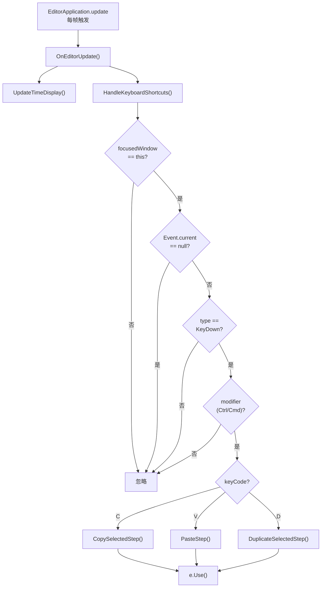
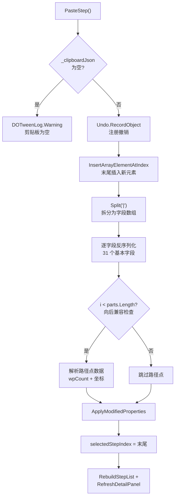

DOTween Visual Editor 为动画步骤的快速操作提供了三个键盘快捷键：**复制 (Ctrl+C)**、**粘贴 (Ctrl+V)** 和**复制并粘贴 (Ctrl+D)**。这三个操作构成了编辑器工作流中的效率核心——允许开发者在步骤列表中快速克隆、迁移配置，而无需手动逐字段重建。整个系统由三个层次组成：事件分发层（`HandleKeyboardShortcuts`）负责捕获键盘输入并路由到对应操作；数据序列化层（`CopySelectedStep` / `PasteStep`）负责将 `TweenStepData` 的 31 个可序列化字段编码为自定义文本格式；辅助工具层（`AppendVector3` / `ParseVector3` / `AppendColor` / `ParseColor`）负责 Vector3 和 Color 类型的双向转换。这种分层设计使得快捷键系统独立于 UI 布局，也与 Undo 系统正确集成。

Sources: [DOTweenVisualEditorWindow.cs](Editor/DOTweenVisualEditorWindow.cs#L159-L227)

## 事件分发机制：EditorApplication.update 驱动模型

键盘快捷键的检测并非基于 IMGUI 的 `OnGUI` 回调，而是挂载在 **`EditorApplication.update`** 帧循环上。窗口在 `OnEnable` 时注册 `OnEditorUpdate` 回调，每帧执行两个任务：更新时间显示和处理快捷键。`HandleKeyboardShortcuts` 方法的核心逻辑如下——首先检查 `focusedWindow != this` 排除非焦点状态，然后从 `Event.current` 中读取键盘事件，仅在 `EventType.KeyDown` 时响应。修饰键检测使用 `e.control || e.command` 的写法，确保 **Windows/Linux 上使用 Ctrl，macOS 上使用 Cmd**，符合平台一致性原则。事件处理后通过 `e.Use()` 消费事件，防止进一步冒泡。



Sources: [DOTweenVisualEditorWindow.cs](Editor/DOTweenVisualEditorWindow.cs#L109-L218)

## 快捷键一览

| 快捷键 | 功能 | 方法 | 描述 |
|--------|------|------|------|
| **Ctrl+C** / **Cmd+C** | 复制步骤 | `CopySelectedStep()` | 将当前选中步骤的值数据序列化到静态剪贴板 |
| **Ctrl+V** / **Cmd+V** | 粘贴步骤 | `PasteStep()` | 从剪贴板反序列化，在列表末尾创建新步骤 |
| **Ctrl+D** / **Cmd+D** | 复制并粘贴 | `DuplicateSelectedStep()` | 依次调用 Copy + Paste，等效于"原地克隆" |

`DuplicateSelectedStep` 的实现极其简洁——仅顺序调用 `CopySelectedStep()` 和 `PasteStep()`，体现了组合式设计的思路：复用而非新建。

Sources: [DOTweenVisualEditorWindow.cs](Editor/DOTweenVisualEditorWindow.cs#L192-L227)

## 剪贴板数据模型：自定义管道分隔文本格式

剪贴板使用一个 **`static string _clipboardJson`** 字段存储序列化数据。尽管变量名包含 "Json"，实际格式是**自定义管道分隔文本**（pipe-delimited text），而非标准 JSON。选择这种格式而非 JsonUtility 的原因在于：`TweenStepData` 中包含 `Transform` 对象引用和 `UnityEvent` 回调等不可序列化字段，标准 JSON 序列化无法直接处理；而自定义格式可以精确控制哪些字段参与复制，哪些被排除。

### 复制范围与排除字段

复制操作覆盖 `TweenStepData` 的全部 **值类型字段**，但明确排除以下两类：

| 排除类型 | 字段 | 排除原因 |
|----------|------|----------|
| **对象引用** | `TargetTransform` | Transform 引用具有场景上下文依赖性，跨场景粘贴无意义 |
| **Unity 事件** | `OnComplete` | UnityEvent 包含委托引用，无法通过文本序列化传递 |

被复制的完整字段列表（按序列化顺序排列）：`Type`, `IsEnabled`, `Duration`, `Delay`, `Ease`, `MoveSpace`, `RotateSpace`, `PunchTarget`, `ShakeTarget`, `UseStartValue`, `StartVector`, `TargetVector`, `IsRelative`, `UseStartColor`, `StartColor`, `TargetColor`, `UseStartFloat`, `StartFloat`, `TargetFloat`, `JumpHeight`, `JumpNum`, `Intensity`, `Vibrato`, `Elasticity`, `ShakeRandomness`, `ExecutionMode`, `InsertTime`, `UseCustomCurve`, `PathType`, `PathMode`, `PathResolution`, `PathWaypoints`（含路径点数量及坐标）。

Sources: [DOTweenVisualEditorWindow.cs](Editor/DOTweenVisualEditorWindow.cs#L89), [DOTweenVisualEditorWindow.cs](Editor/DOTweenVisualEditorWindow.cs#L1605-L1668)

## 序列化格式规范

剪贴板文本使用三层分隔符体系，自上而下为：`|` 分隔字段、`,` 分隔 Vector3/Color 分量、`;` 分隔路径点坐标。

```
字段1|字段2|...|字段31|路径点数量;wp1;wp2;...
```

具体而言，Vector3 编码为 `x,y,z`（例如 `1.5,2.5,3.5`），Color 编码为 `r,g,b,a`（例如 `1,0.5,0,1`）。路径点数据作为最后一个字段，格式为 `数量;坐标1;坐标2;...`，例如 `3;1,0,0;2,1,0;3,0,0` 表示三个路径点。所有浮点数使用 `"R"` (Round-Trip) 格式说明符配合 `CultureInfo.InvariantCulture`，确保在任何区域设置下都能正确解析——这是跨区域协作的关键设计决策。

Sources: [DOTweenVisualEditorWindow.cs](Editor/DOTweenVisualEditorWindow.cs#L1744-L1771)

### 序列化辅助方法

四个 `internal static` 方法构成了序列化的基础设施，它们同时被编辑器测试直接验证：

| 方法 | 签名 | 功能 |
|------|------|------|
| `AppendVector3` | `(StringBuilder, Vector3) → void` | 将 Vector3 写入为 `x,y,z` 格式 |
| `ParseVector3` | `(string) → Vector3` | 从 `x,y,z` 字符串还原 Vector3 |
| `AppendColor` | `(StringBuilder, Color) → Color` | 将 Color 写入为 `r,g,b,a` 格式 |
| `ParseColor` | `(string) → Color` | 从 `r,g,b,a` 字符串还原 Color |

Sources: [DOTweenVisualEditorWindow.cs](Editor/DOTweenVisualEditorWindow.cs#L1744-L1771)

## 复制流程详解

`CopySelectedStep()` 的执行过程可以分为三个阶段：**前置校验** → **逐字段序列化** → **路径点追加**。前置校验检查 `selectedStepIndex` 的有效性（>= 0 且在数组范围内）并调用 `serializedObject.Update()` 确保读取最新数据。序列化阶段使用 `StringBuilder` 逐字段追加，每个字段后紧跟 `|` 分隔符。布尔值编码为 `1`/`0`，枚举值编码为 `int`，浮点值使用 `CultureInfo.InvariantCulture`。路径点作为最后一个字段，先写入数量，再以 `;` 分隔逐点追加坐标。完成后将结果赋值给 `_clipboardJson` 并通过 `DOTweenLog.Info` 记录操作。

Sources: [DOTweenVisualEditorWindow.cs](Editor/DOTweenVisualEditorWindow.cs#L1610-L1668)

## 粘贴流程详解

`PasteStep()` 的流程更为复杂，包含**校验** → **Undo 注册** → **创建数组元素** → **逐字段反序列化** → **路径点恢复** → **UI 刷新**六个阶段。关键设计点如下：首先，粘贴前通过 `Undo.RecordObject` 注册撤销记录，确保 Ctrl+Z 可以回退操作；其次，新步骤总是插入到列表**末尾**（`stepsProperty.arraySize` 位置），而非当前选中位置之后；最后，路径点解析包含**向后兼容逻辑**——通过 `if (i < parts.Length)` 检查剪贴板是否包含路径点数据，使旧版本（不含路径点）的剪贴板文本仍可正常粘贴。粘贴完成后自动选中新步骤（`selectedStepIndex = stepsProperty.arraySize - 1`）并刷新列表和详情面板。



Sources: [DOTweenVisualEditorWindow.cs](Editor/DOTweenVisualEditorWindow.cs#L1673-L1742)

## 静态剪贴板的生命周期

`_clipboardJson` 是一个 `static string` 字段，这意味着它的生命周期与 **AppDomain** 绑定，而非与窗口实例绑定。由此产生几个值得注意的行为特征：剪贴板内容在窗口关闭后重新打开时**仍然保留**；复制的内容可以在同一编辑器会话中的**不同 DOTweenVisualEditorWindow 实例间共享**（尽管实际使用场景中通常只有一个窗口实例）；但是，**脚本重新编译**（进入 Play Mode 或修改代码）会触发 Domain Reload，导致静态字段被重置为 null。此外，剪贴板数据**不会跨 Unity 编辑器会话保留**——关闭 Unity 后数据丢失。这些行为与 Unity 编辑器原生的复制粘贴系统（如 Inspector 中的组件复制）保持一致的语义。

Sources: [DOTweenVisualEditorWindow.cs](Editor/DOTweenVisualEditorWindow.cs#L89)

## 测试覆盖：序列化往返验证

编辑器测试套件在 [DOTweenVisualEditorWindowUtilityTests.cs](Editor/Tests/DOTweenVisualEditorWindowUtilityTests.cs) 中对序列化辅助方法进行了全面覆盖，共包含 **16 个测试用例**，分为四个测试组：

| 测试组 | 用例数 | 验证内容 |
|--------|--------|----------|
| `FormatTime` | 7 | 时间格式化：零值、正值、跨分钟、小数毫秒 |
| `ParseVector3` | 4 | Vector3 解析：正值、负值、零值、小数 |
| `AppendVector3` + Roundtrip | 5 | Vector3 序列化 + 往返一致性（含精度断言 0.0001） |
| `ParseColor` + `AppendColor` + Roundtrip | 5 | Color 四通道完整验证 |

其中**往返测试 (Roundtrip)** 最为关键——它验证了 `Append → Parse → Assert` 的完整链路，确保序列化和反序列化是**无损的**。精度断言使用 `0.0001f` 容差，与 `"R"` (Round-Trip) 格式说明符的设计意图一致。

Sources: [DOTweenVisualEditorWindowUtilityTests.cs](Editor/Tests/DOTweenVisualEditorWindowUtilityTests.cs#L1-L227)

## 设计决策分析

**为何不使用 JsonUtility？** `TweenStepData` 包含 `Transform` 引用和 `UnityEvent` 回调，JsonUtility 无法处理这些类型。自定义管道格式允许精确的字段选择和增量扩展（如路径点数据的向后兼容追加），同时保持极低的序列化开销。

**为何粘贴总是插入到末尾？** 在列表中间插入会改变后续步骤的索引，可能引发用户困惑。末尾插入是最安全的默认行为，用户随后可以通过 ListView 的拖拽排序功能将步骤移动到目标位置。

**为何 `TargetTransform` 和 `OnComplete` 被排除？** `TargetTransform` 是场景对象引用，跨场景或跨 Prefab 粘贴时引用会失效。`OnComplete` 是 UnityEvent，其中可能包含运行时委托绑定，无法通过文本序列化传递。这两个字段的排除意味着粘贴后的步骤需要手动设置目标物体和回调（如果需要）。

Sources: [DOTweenVisualEditorWindow.cs](Editor/DOTweenVisualEditorWindow.cs#L1605-L1773), [TweenStepData.cs](Runtime/Data/TweenStepData.cs#L56-L174)

## 与其他系统的关联

键盘快捷键系统与编辑器的其他子系统存在多个交互点：复制/粘贴操作通过 `Undo.RecordObject` 与 [编辑器窗口使用指南](4-bian-ji-qi-chuang-kou-shi-yong-zhi-nan) 中描述的撤销系统集成；粘贴后的列表重建调用 `RebuildStepList()` 触发 [Inspector 自定义绘制器](16-inspector-zi-ding-yi-hui-zhi-qi-tweenstepdatadrawer-an-lei-xing-tiao-jian-xuan-ran-zi-duan) 的字段重新渲染；操作日志通过 [DOTweenLog 日志系统](19-dotweenlog-ri-zhi-xi-tong-si-ji-ri-zhi-yu-fa-bu-ban-ben-zi-dong-cai-jian) 输出。序列化测试则遵循 [Editor 测试策略](21-editor-ce-shi-ce-lue-yang-shi-ying-she-yu-chuang-kou-gong-ju-han-shu-yan-zheng) 中描述的 `internal static` 方法直接测试模式。