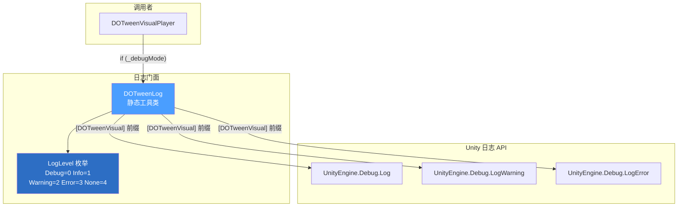
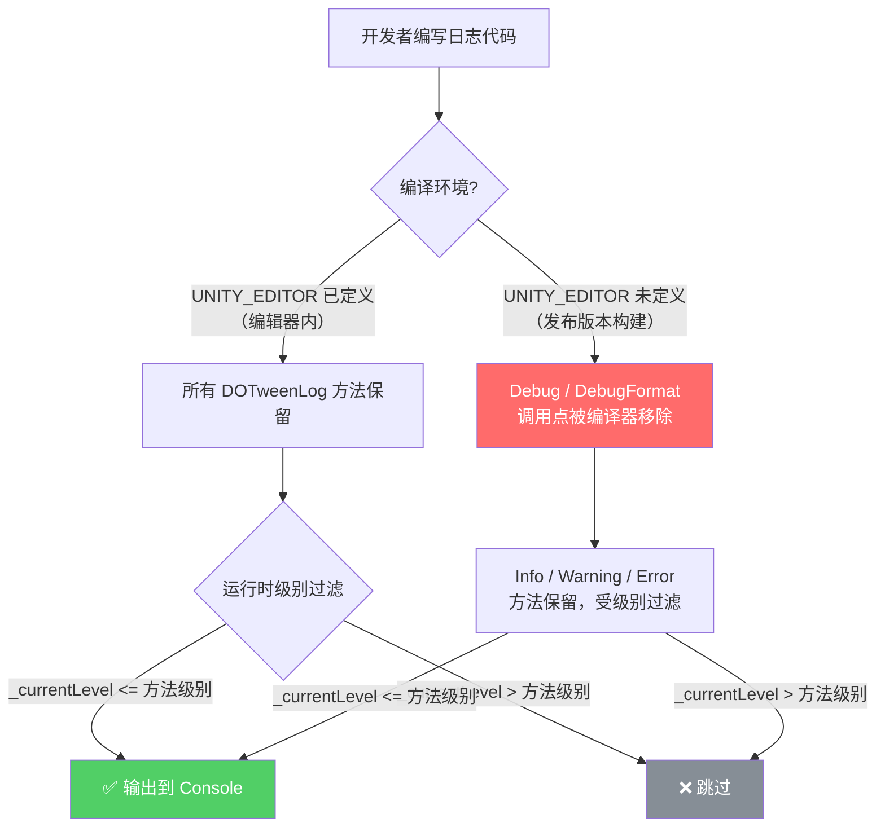

**DOTweenLog** 是 DOTween Visual Editor 的统一日志门面（Facade），它将 Unity 原生的 `UnityEngine.Debug.Log*` 系列调用封装为带有**统一标签前缀**、**四级过滤机制**和**编辑器条件编译**的结构化日志工具。对于初学者而言，理解这个系统的核心价值在于两点：**开发时你能看到清晰的调试信息，而发布时这些信息会自动消失，不产生任何性能开销。**

Sources: [DOTweenLog.cs](Runtime/Data/DOTweenLog.cs#L1-L11)

## 为什么需要自己的日志系统？

如果你在项目中直接写 `Debug.Log("动画播放了")`，会遇到三个问题：

- **日志没有身份标识**——当项目中有数十个模块同时输出日志时，你很难在 Console 窗口中分辨哪条消息来自 DOTween Visual Editor。
- **发布版本日志泄漏**——`Debug.Log` 在 Release 构建中仍然执行，产生字符串拼接和 IO 开销，对移动端性能影响尤为明显。
- **无法按级别过滤**——Unity 原生日志只有 Log / Warning / Error 三种类型，缺乏一个统一的"开关"来在运行时控制输出粒度。

DOTweenLog 通过 **统一标签 `[DOTweenVisual]`**、**`[Conditional("UNITY_EDITOR")]` 条件编译**和**枚举级别比较**三重机制，一次性解决了这三个问题。

Sources: [DOTweenLog.cs](Runtime/Data/DOTweenLog.cs#L1-L36)

## 日志级别体系：五个枚举值的设计意图

DOTweenLog 定义了五个日志级别，按照严重程度递增排列：

| 枚举值 | 整数值 | 用途 | 发布版本行为 |
|--------|--------|------|-------------|
| `Debug` | 0 | 详细调试信息，如"动画已暂停""开始播放 3 个步骤" | **整个方法调用被编译器移除** |
| `Info` | 1 | 一般运行信息，如流程状态变化 | 保留，受级别过滤 |
| `Warning` | 2 | 警告信息，如"没有启用的动画步骤可播放" | 保留，受级别过滤 |
| `Error` | 3 | 错误信息，如组件缺失等异常情况 | 保留，受级别过滤 |
| `None` | 4 | 关闭所有日志输出 | — |

这个设计遵循一个简单但关键的原则：**枚举值从小到大排列，级别比较使用 `>` 运算符**。当 `CurrentLevel` 设为 `Warning` 时，所有 `_currentLevel > LogLevel.Warning`（即 Error 和 None）的检查都会通过——不对，反过来理解：每个日志方法内部的 `if (_currentLevel > LogLevel.Xxx) return;` 意味着，**当前级别严格大于该方法的级别时，日志被跳过**。因此设置 `CurrentLevel = Warning` 时，`Debug` 和 `Info` 会被跳过，`Warning` 和 `Error` 会正常输出。

```csharp
// 级别过滤的核心逻辑——每个方法都有同样的守卫语句
if (_currentLevel > LogLevel.Warning) return;  // Warning 方法中的守卫
```

Sources: [DOTweenLog.cs](Runtime/Data/DOTweenLog.cs#L18-L30), [DOTweenLog.cs](Runtime/Data/DOTweenLog.cs#L111-L114)

## 条件编译：Debug 级别的零开销保证

这是 DOTweenLog 最关键的设计决策。`Debug` 和 `DebugFormat` 两个方法使用了 `System.Diagnostics.ConditionalAttribute`：

```csharp
[Conditional("UNITY_EDITOR")]
public static void Debug(string message)
{
    if (_currentLevel > LogLevel.Debug) return;
    UnityEngine.Debug.Log($"[{Tag}] {message}");
}
```

`[Conditional("UNITY_EDITOR")]` 的作用是：**当编译时没有定义 `UNITY_EDITOR` 符号（即发布版本构建），编译器会移除所有对该方法的调用**。注意，这不仅仅是方法体不执行——而是**调用点本身被删除**，连参数的字符串拼接都不会发生。这意味着即使在代码中写了 `DOTweenLog.Debug($"复杂计算: {ExpensiveMethod()}")`，发布版本中 `ExpensiveMethod()` 根本不会被调用。

与此形成对比的是 `Info`、`Warning`、`Error` 三个级别——它们没有 `[Conditional]` 标注，在发布版本中仍然存在。这三级日志用于记录需要在生产环境中保留的信息（如运行时错误），通过 `SetLogLevel` 在运行时控制输出粒度。

Sources: [DOTweenLog.cs](Runtime/Data/DOTweenLog.cs#L67-L86), [DOTweenLog.cs](Runtime/Data/DOTweenLog.cs#L88-L105)

## 架构关系：DOTweenLog 在系统中的位置

下面的关系图展示了 DOTweenLog 与其他模块的交互方式。注意 DOTweenVisualPlayer 中的 `_debugMode` 开关形成了一道额外的门控——即使 DOTweenLog 的级别允许输出，只有当播放器的调试模式开启时，才会实际调用日志方法。



**DOTweenVisualPlayer 的双重门控模式**值得特别说明。在该组件中，所有日志调用都被 `_debugMode` 字段保护：

```csharp
if (_debugMode) DOTweenLog.Debug("动画已暂停");
```

这形成了一个两层过滤机制：第一层是组件级别的 `_debugMode` 开关（序列化字段，可在 Inspector 中勾选），第二层是全局的 `DOTweenLog.CurrentLevel`。即使开发者忘记关闭 `_debugMode`，通过 `SetLogLevel(None)` 仍然可以静默所有日志输出。

Sources: [DOTweenVisualPlayer.cs](Runtime/Components/DOTweenVisualPlayer.cs#L36-L39), [DOTweenVisualPlayer.cs](Runtime/Components/DOTweenVisualPlayer.cs#L146-L148)

## API 速查：八个公共方法

DOTweenLog 提供了八个公共方法，每个级别配有两个变体——一个接受纯字符串，另一个接受格式化字符串加参数：

| 方法 | 级别 | 条件编译 | 说明 |
|------|------|---------|------|
| `Debug(string)` | Debug | ✅ 仅编辑器 | 输出普通调试日志 |
| `DebugFormat(string, params object[])` | Debug | ✅ 仅编辑器 | 输出格式化调试日志 |
| `Info(string)` | Info | ❌ 始终保留 | 输出普通信息日志 |
| `InfoFormat(string, params object[])` | Info | ❌ 始终保留 | 输出格式化信息日志 |
| `Warning(string)` | Warning | ❌ 始终保留 | 输出警告日志（带堆栈跟踪） |
| `WarningFormat(string, params object[])` | Warning | ❌ 始终保留 | 输出格式化警告日志（无堆栈跟踪） |
| `Error(string)` | Error | ❌ 始终保留 | 输出错误日志（带堆栈跟踪） |
| `ErrorFormat(string, params object[])` | Error | ❌ 始终保留 | 输出格式化错误日志（无堆栈跟踪） |

一个值得关注的细节：`WarningFormat` 和 `ErrorFormat` 使用了 `LogOption.NoStacktrace` 参数，而对应的非格式化版本（`Warning` 和 `Error`）则保留默认的堆栈跟踪输出。这是一个有意的区分——格式化版本通常用于输出结构化的诊断数据，此时堆栈跟踪反而会造成视觉噪声。

Sources: [DOTweenLog.cs](Runtime/Data/DOTweenLog.cs#L55-L147)

## 发布版本裁剪：完整的编译时行为

为了让你直观理解"自动裁剪"的含义，下面的流程图展示了从源代码到最终构建产物的完整裁剪过程：



**关键要点**：`[Conditional]` 特性与 `#if UNITY_EDITOR` 预处理指令有本质区别。`#if` 需要包裹每一处调用代码，而 `[Conditional]` 只需要标注在方法定义上，编译器会自动在所有调用点执行移除。这也是 DOTweenLog 选择 `ConditionalAttribute` 而非 `#if` 的原因——调用方代码保持整洁，无需额外的预编译包裹。

Sources: [DOTweenLog.cs](Runtime/Data/DOTweenLog.cs#L71-L72), [DOTweenLog.cs](Runtime/Data/DOTweenLog.cs#L81-L82)

## 测试验证：级别顺序的正确性保障

DOTweenLog 的测试套件重点验证了三个方面的正确性：

**1. 默认级别验证**——确保系统启动时日志级别为 `Debug`，即在默认状态下所有日志均可输出：

```csharp
[Test]
public void DefaultLevel_IsDebug()
{
    Assert.AreEqual(DOTweenLog.LogLevel.Debug, DOTweenLog.CurrentLevel);
}
```

**2. 级别切换验证**——确保 `SetLogLevel` 能正确设置每个级别，且能从任意级别重置回 `Debug`：

```csharp
[Test]
public void SetLogLevel_CanBeResetToDebug()
{
    DOTweenLog.SetLogLevel(DOTweenLog.LogLevel.None);
    DOTweenLog.SetLogLevel(DOTweenLog.LogLevel.Debug);
    Assert.AreEqual(DOTweenLog.LogLevel.Debug, DOTweenLog.CurrentLevel);
}
```

**3. 枚举顺序验证**——这是最关键的测试，确保 `Debug < Info < Warning < Error < None` 的整数顺序成立。因为级别过滤的 `>` 比较完全依赖枚举的整数顺序，如果顺序被打破，过滤逻辑就会出错：

```csharp
[Test]
public void LogLevel_Order_DebugLessThanInfo()
{
    Assert.Less(DOTweenLog.LogLevel.Debug, DOTweenLog.LogLevel.Info);
}
```

这种测试策略体现了一个重要原则：**对于依赖隐式约定（枚举整数顺序）的逻辑，必须通过显式测试来防止未来的意外修改破坏约定**。测试中每个相邻级别的顺序都被单独验证，而不是只测首尾两个级别。

Sources: [DOTweenLogTests.cs](Runtime/Tests/DOTweenLogTests.cs#L11-L94)

## 实际使用场景

DOTweenLog 在 [DOTweenVisualPlayer](6-dotweenvisualplayer-bo-fang-qi-zu-jian-sheng-ming-zhou-qi-yu-bo-fang-kong-zhi) 中的使用覆盖了动画播放生命周期的关键节点。下表列出了所有的调用点及其对应的播放状态：

| 调用位置 | 日志级别 | 消息内容 | 触发条件 |
|---------|---------|---------|---------|
| `Play()` | Debug | "已在播放中，忽略 Play 调用" | `_isPlaying == true` |
| `PlayAsync()` | Debug | "已在播放中，返回当前播放的等待包装器" | `_isPlaying == true` |
| `PlayAsync()` | Warning | "没有可播放的动画步骤" | `_currentSequence == null` |
| `Stop()` | Debug | "动画已停止" | 手动停止 |
| `Pause()` | Debug | "动画已暂停" | 手动暂停 |
| `Resume()` | Debug | "动画已恢复" | 手动恢复 |
| `BuildAndPlay()` | Warning | "没有启用的动画步骤可播放" | 所有步骤被禁用 |
| `OnComplete` 回调 | Debug | "动画播放完成" | 正常播放结束 |
| `OnPlay` 回调 | Debug | "开始播放 N 个步骤" | Sequence 开始播放 |

所有调用都被 `_debugMode` 保护，这意味着在 Inspector 中取消勾选"启用调试日志"即可关闭该组件的所有日志输出，无需修改代码。

Sources: [DOTweenVisualPlayer.cs](Runtime/Components/DOTweenVisualPlayer.cs#L142-L355)

## 延伸阅读

- [整体架构设计：分层与模块职责](5-zheng-ti-jia-gou-she-ji-fen-ceng-yu-mo-kuai-zhi-ze)——了解 DOTweenLog 在整个系统分层中的位置
- [DOTweenVisualPlayer 播放器组件：生命周期与播放控制](6-dotweenvisualplayer-bo-fang-qi-zu-jian-sheng-ming-zhou-qi-yu-bo-fang-kong-zhi)——查看 `_debugMode` 门控与播放状态日志的完整上下文
- [Runtime 测试策略：DOTween.ManualUpdate 同步驱动模式](20-runtime-ce-shi-ce-lue-dotween-manualupdate-tong-bu-qu-dong-mo-shi)——了解 DOTweenLog 测试在整体测试体系中的定位