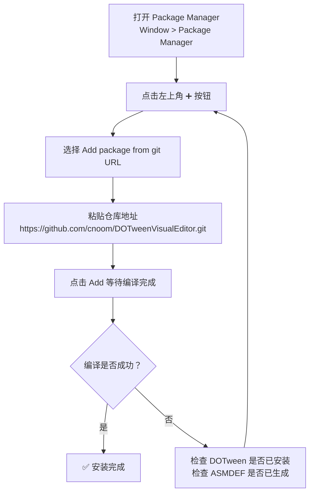
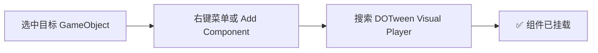

本页是一份面向初学者的实操教程，目标是在 **10 分钟内**完成 DOTween Visual Editor 的安装、项目配置，并成功播放你的第一个可视化 Tween 动画。内容覆盖环境依赖检查、包安装、组件挂载、编辑器窗口操作、动画步骤配置与运行时播放 API 调用——不涉及底层原理，只专注"让它跑起来"。

Sources: [README.md](README.md#L1-L99), [package.json](package.json#L1-L21)

---

## 前置环境要求

在安装 DOTween Visual Editor 之前，请确认你的项目满足以下两项硬性依赖：

| 依赖项 | 最低版本 | 说明 |
|--------|---------|------|
| Unity Editor | 2021.3 LTS | 包的 `unity` 字段声明最低支持版本 |
| DOTween | 1.2.765+ | 需在 DOTween Utility Panel 中生成 ASMDEF 文件 |

**关键提醒**：DOTween Visual Editor 是 DOTween 的上层封装，而非 DOTween 的替代品。安装 DOTween 后务必打开 `Tools > Demigiant > DOTween Utility Panel`，点击「Generate ASMDEF」按钮，否则脚本编译将因找不到 `DG.Tweening` 命名空间而报错。

Sources: [package.json](package.json#L5), [README.md](README.md#L29-L31)

---

## 安装步骤

DOTween Visual Editor 以 Unity Package 的形式分发，通过 Git URL 安装最为便捷。以下流程图展示了完整的安装路径：



**具体操作**：

1. 在 Unity 编辑器中打开 **Window > Package Manager**
2. 点击窗口左上角的 **"+"** 按钮，选择 **"Add package from git URL..."**
3. 在输入框中粘贴：`https://github.com/cnoom/DOTweenVisualEditor.git`
4. 点击 **Add**，等待 Unity 下载并编译完成

安装成功后，你将在项目的 `Packages` 目录下看到 `DOTween Visual Editor` 条目，同时编辑器菜单栏会新增 `Tools > DOTween Visual Editor` 入口。

Sources: [README.md](README.md#L20-L26)

---

## 项目结构总览

安装完成后，包内的文件按 **Runtime / Editor** 两层职责清晰分离。作为初学者，你只需要记住三个核心入口点：

```
DOTween Visual Editor/
├── Runtime/                          ← 运行时脚本（随游戏打包）
│   ├── Components/
│   │   ├── DOTweenVisualPlayer.cs    ← 🎯 核心入口：播放器组件
│   │   └── TweenAwaitable.cs         ← 异步等待包装器
│   └── Data/
│       ├── TweenStepData.cs          ← 动画步骤数据结构
│       ├── TweenStepType.cs          ← 14 种动画类型枚举
│       ├── ExecutionMode.cs          ← 执行模式枚举
│       ├── TransformTarget.cs        ← 坐标空间/特效目标枚举
│       ├── TweenFactory.cs           ← Tween 创建工厂
│       ├── TweenStepRequirement.cs   ← 组件需求校验
│       └── TweenValueHelper.cs       ← 多组件值访问工具
│
├── Editor/                           ← 编辑器脚本（仅编辑器环境）
│   ├── DOTweenVisualEditorWindow.cs  ← 🎯 核心入口：可视化编辑器窗口
│   ├── DOTweenPreviewManager.cs      ← 预览状态管理器
│   ├── DOTweenEditorStyle.cs         ← 样式配置
│   ├── TweenStepDataDrawer.cs        ← Inspector 自定义绘制器
│   └── USS/                          ← UI Toolkit 样式表
```

- **DOTweenVisualPlayer**：你唯一需要挂载到 GameObject 上的 MonoBehaviour 组件
- **DOTweenVisualEditorWindow**：你用来可视化配置动画的编辑器窗口

Sources: [README.md](README.md#L72-L94)

---

## 第一个动画：从零到播放

接下来，我们将通过一个经典的「物体从 A 点移动到 B 点」动画，走完整个工作流。

### 第一步：添加播放器组件



在 Hierarchy 面板中选中你想要添加动画的 GameObject（例如一个 Cube），然后通过以下任一方式添加组件：

- **方式一**：Inspector 面板底部点击 **Add Component**，搜索 `DOTween Visual Player`
- **方式二**：右键点击 GameObject，选择 **DOTween Visual > DOTween Visual Player**

添加后，Inspector 中会显示该组件的序列化字段：**动画序列**（步骤列表）、**播放设置**（PlayOnStart / Loops / LoopType）和**调试**（Debug Mode）。

Sources: [DOTweenVisualPlayer.cs](Runtime/Components/DOTweenVisualPlayer.cs#L13-L41)

### 第二步：打开可视化编辑器

通过菜单栏 **Tools > DOTween Visual Editor** 打开编辑器窗口。窗口采用经典的双栏布局：

| 区域 | 功能 |
|------|------|
| **左侧面板** | 步骤概览列表，显示所有动画步骤的序号、类型、时长，支持拖拽排序 |
| **右侧面板** | 选中步骤的详细配置，按动画类型条件显示对应字段 |
| **顶部工具栏** | 目标物体选择器 + 预览/停止/重播/重置按钮 + 添加步骤菜单 |
| **底部状态栏** | 当前播放状态与已用时间显示 |

**重要**：窗口顶部有一个 **ObjectField**，你需要将挂载了 `DOTweenVisualPlayer` 的 GameObject 拖入该字段，编辑器才能读取和编辑其动画步骤数据。

Sources: [DOTweenVisualEditorWindow.cs](Editor/DOTweenVisualEditorWindow.cs#L52-L81)

### 第三步：添加并配置一个 Move 动画

1. 在编辑器顶部工具栏，点击 **"+"** 添加步骤按钮，选择 **Move** 类型
2. 在右侧详情面板中配置以下核心参数：

| 参数 | 推荐值 | 说明 |
|------|--------|------|
| **IsEnabled** | ☑️ true | 启用此步骤 |
| **Type** | Move | 移动动画 |
| **Duration** | 1.0 | 动画持续 1 秒 |
| **Delay** | 0 | 无延迟 |
| **Ease** | OutQuad | 先快后慢的缓动曲线 |
| **TargetVector** | (3, 0, 0) | 目标位置（世界坐标 X=3） |
| **MoveSpace** | World | 使用世界坐标空间 |
| **UseStartValue** | ☐ false | 使用物体当前位置作为起始值 |
| **ExecutionMode** | Append | 顺序执行 |

3. 点击工具栏的 **▶ 预览** 按钮，在编辑器中即时看到物体从当前位置移动到 (3, 0, 0)

Sources: [TweenStepData.cs](Runtime/Data/TweenStepData.cs#L14-L178), [TweenStepType.cs](Runtime/Data/TweenStepType.cs#L7-L15)

### 第四步：运行时播放

有两种方式在游戏运行时触发动画：

**方式 A：自动播放（PlayOnStart）**

在 Inspector 中勾选 `DOTweenVisualPlayer` 组件的 **Play On Start** 选项。游戏开始时，组件会自动调用 `Play()` 播放所有已启用的动画步骤。

**方式 B：脚本控制播放**

在你的游戏脚本中获取组件引用并调用播放 API：

```csharp
using CNoom.DOTweenVisual.Components;
using UnityEngine;

public class AnimationController : MonoBehaviour
{
    private DOTweenVisualPlayer _player;

    private void Start()
    {
        _player = GetComponent<DOTweenVisualPlayer>();
        _player.Play();   // 开始播放动画序列
    }
}
```

Sources: [DOTweenVisualPlayer.cs](Runtime/Components/DOTweenVisualPlayer.cs#L111-L119), [DOTweenVisualPlayer.cs](Runtime/Components/DOTweenVisualPlayer.cs#L142-L151)

---

## 播放控制 API 速查

`DOTweenVisualPlayer` 提供了一套简洁的播放控制 API，下表汇总了所有常用方法：

| API | 返回值 | 说明 |
|-----|--------|------|
| `Play()` | void | 播放动画序列（已在播放时忽略调用） |
| `Stop()` | void | 停止并回滚到动画起始状态 |
| `Pause()` | void | 暂停当前播放 |
| `Resume()` | void | 从暂停处恢复播放 |
| `Restart()` | void | 等效于 Stop + Play，重新播放 |
| `Complete()` | void | 立即跳到动画末尾状态 |
| `PlayAsync()` | TweenAwaitable | 异步播放，支持协程 yield 和 UniTask await |

**异步等待示例**——动画播放完毕后再执行后续逻辑：

```csharp
// 协程方式
private IEnumerator PlayAndWaitCoroutine()
{
    yield return _player.PlayAsync();
    Debug.Log("动画播放完成！");
}

// UniTask 方式（需安装 UniTask）
private async UniTaskVoid PlayAndWaitAsync()
{
    await _player.PlayAsync().ToUniTask();
    Debug.Log("动画播放完成！");
}
```

Sources: [DOTweenVisualPlayer.cs](Runtime/Components/DOTweenVisualPlayer.cs#L137-L228), [README.md](README.md#L42-L68)

---

## 常见安装与配置问题排查

| 问题 | 原因 | 解决方案 |
|------|------|----------|
| 编译报错 `The type or namespace 'DG' could not be found` | DOTween 未安装或未生成 ASMDEF | 安装 DOTween 并在 Utility Panel 中点击 Generate ASMDEF |
| 菜单栏找不到 `Tools > DOTween Visual Editor` | 包未正确安装 | 在 Package Manager 中确认包已列出，或重新通过 Git URL 安装 |
| 编辑器窗口打开后 ObjectField 为空 | 未选择目标物体 | 将挂载了 Player 组件的 GameObject 拖入顶部 ObjectField |
| 添加 Color/Fade 步骤后预览无效 | 目标物体缺少对应组件 | 参见下文的组件需求说明 |
| 动画步骤存在但预览无反应 | 所有步骤的 IsEnabled 被关闭 | 确保至少一个步骤的 IsEnabled 勾选为 true |

**组件需求提示**：不同动画类型对目标物体有不同的组件依赖。`TweenStepRequirement` 系统会在编辑器中自动校验并给出提示，但了解基本规则有助于快速排错：

| 动画类型 | 必需组件 |
|----------|----------|
| Move / Rotate / Scale / Jump / Punch / Shake / DOPath | Transform（所有 GameObject 默认拥有） |
| Color | Graphic / Renderer / SpriteRenderer（任一） |
| Fade | CanvasGroup / Graphic / Renderer / SpriteRenderer（任一） |
| AnchorMove / SizeDelta | RectTransform（即 UI 物体） |
| FillAmount | Image |
| Delay / Callback | 无额外要求 |

Sources: [TweenStepRequirement.cs](Runtime/Data/TweenStepRequirement.cs#L22-L85)

---

## 组件 Inspector 配置项说明

`DOTweenVisualPlayer` 组件在 Inspector 面板中暴露了三个配置分组：

| 分组 | 字段 | 类型 | 默认值 | 说明 |
|------|------|------|--------|------|
| **动画序列** | Steps | List\<TweenStepData\> | 空 | 动画步骤列表，通过编辑器窗口管理 |
| **播放设置** | Play On Start | bool | false | 游戏开始时自动播放 |
| | Loops | int | 1 | 循环次数，-1 表示无限循环 |
| | Loop Type | LoopType | Restart | 循环方式：Restart / Yoyo / Incremental |
| **调试** | Debug Mode | bool | false | 开启后在 Console 输出播放状态日志 |

Sources: [DOTweenVisualPlayer.cs](Runtime/Components/DOTweenVisualPlayer.cs#L16-L39)

---

## 接下来读什么

恭喜你完成了第一个 DOTween Visual Editor 动画！以下是建议的阅读路径：

1. **[动画类型一览：14 种 TweenStepType 详解](3-dong-hua-lei-xing-lan-14-chong-tweensteptype-xiang-jie)** — 深入了解每种动画类型的参数配置和适用场景，解锁更多动画可能性
2. **[编辑器窗口使用指南](4-bian-ji-qi-chuang-kou-shi-yong-zhi-nan)** — 掌握编辑器的高级操作：拖拽排序、复制粘贴、快捷键、时间轴可视化等
3. **[ExecutionMode 执行模式：Append / Join / Insert 编排策略](12-executionmode-zhi-xing-mo-shi-append-join-insert-bian-pai-ce-lue)** — 学习如何组合多个步骤实现顺序、并行、定点插入等复杂动画编排

当你对基本操作熟练后，可以进入 **深入理解** 章节了解底层架构设计。