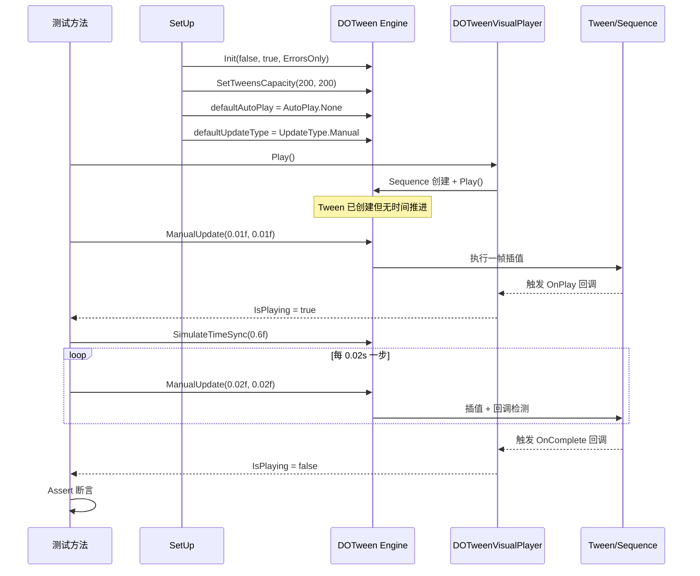
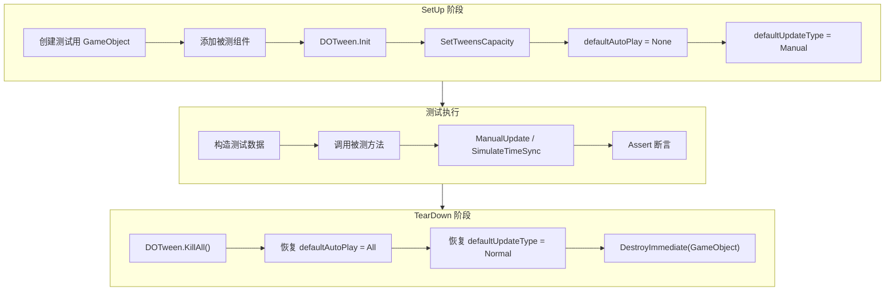

DOTween Visual Editor 的 Runtime 测试套件面临一个核心挑战：**如何在 EditMode 的同步测试环境中验证异步动画行为**。本页深入解析项目采用的 `DOTween.ManualUpdate` 同步驱动测试模式——通过手动接管 DOTween 的时间推进，将异步 Tween 动画转化为可精确控制的同步测试流程。你将看到这套策略的设计原理、基础设施模式、以及它如何在 8 个测试文件中一致地落地实践。

Sources: [DOTweenVisualPlayerTests.cs](Runtime/Tests/DOTweenVisualPlayerTests.cs#L1-L16), [TweenAwaitableTests.cs](Runtime/Tests/TweenAwaitableTests.cs#L1-L22)

## 核心问题：EditMode 下的异步动画测试困境

DOTween 的动画本质上是帧驱动的异步过程——每帧由 `UpdateType.Normal` 或 `UpdateType.LateUpdate` 等模式自动推进时间，驱动 Tween 值插值和回调触发。但 NUnit 的 `[Test]` 特性标记的是**同步测试方法**，在 EditMode 下执行时不存在 Unity 的帧循环，DOTween 的自动更新机制完全失效。这意味着如果你写了一个测试调用 `_player.Play()` 后立即断言动画状态，你会发现所有回调都不会被触发，Tween 永远停在初始帧。

传统解决方案是使用 `[UnityTest]` 配合协程 `yield return null` 等待帧，但这引入了不确定的时间延迟、测试执行速度慢、且在 EditMode 下行为不够可靠。DOTween Visual Editor 项目选择了一条更精准的路径：**完全接管 DOTween 的时间源，用 `DOTween.ManualUpdate` 同步推进**。

Sources: [DOTweenVisualPlayerTests.cs](Runtime/Tests/DOTweenVisualPlayerTests.cs#L24-L33), [TweenAwaitableTests.cs](Runtime/Tests/TweenAwaitableTests.cs#L29-L38)

## ManualUpdate 驱动模式原理

`DOTween.ManualUpdate(float deltaTime, float unscaledDeltaTime)` 是 DOTween 提供的手动更新接口。调用时，DOTween 会立即执行一帧的逻辑——计算插值、更新属性值、触发回调——整个过程是**同步且确定性的**。配合 `UpdateType.Manual` 全局设置，DOTween 将完全依赖你的显式调用来推进时间，不会自行更新。

以下流程图展示了完整的测试时序——从 DOTween 初始化到时间推进到断言验证：



关键配置参数的含义如下表所示：

| 配置项 | 值 | 作用 |
|--------|------|------|
| `DOTween.Init(false, ...)` | `recycleAllByDefault = false` | 关闭 Tween 对象池回收，避免测试间状态泄漏 |
| `LogBehaviour.ErrorsOnly` | — | 只输出错误日志，减少测试输出噪音 |
| `SetTweensCapacity(200, 200)` | — | 预分配 Tween 容量，避免测试中动态扩容 |
| `defaultAutoPlay = AutoPlay.None` | — | Tween 创建后不自动播放，等待显式 Play 或 ManualUpdate 驱动 |
| `defaultUpdateType = UpdateType.Manual` | — | 全局切换为手动更新模式，禁止 DOTween 自动推进时间 |

Sources: [DOTweenVisualPlayerTests.cs](Runtime/Tests/DOTweenVisualPlayerTests.cs#L35-L45), [TweenAwaitableTests.cs](Runtime/Tests/TweenAwaitableTests.cs#L41-L50)

## SimulateTimeSync：时间推进基础设施

测试套件中最核心的工具方法是 `SimulateTimeSync`，它将一段连续的模拟时间拆分为固定步长的离散帧，逐帧调用 `DOTween.ManualUpdate`：

```csharp
private static void SimulateTimeSync(float totalTime, float step = 0.02f)
{
    float elapsed = 0f;
    while (elapsed < totalTime)
    {
        DOTween.ManualUpdate(step, step);
        elapsed += step;
    }
}
```

这段代码虽然简洁，但蕴含着三个关键设计决策：

**步长精度选择（默认 0.02s）**。0.02 秒对应 50 FPS 的帧间隔，这是一个在精度与性能之间的平衡点。步长越小，回调触发的时序越精确，但循环次数越多、测试越慢。0.02s 足以保证绝大多数回调在预期的帧窗口内被触发。

**deltaTime 与 unscaledDeltaTime 一致**。`ManualUpdate(step, step)` 两个参数传入相同值，确保 `Time.timeScale` 不会干扰测试。在真实运行时这两个值可能不同，但测试中保持一致简化了时间推理。

**推进到 totalTime 而非精确停止**。循环条件是 `elapsed < totalTime`，最终 `elapsed` 可能略微超过 `totalTime`（因为步长是离散的），这确保了动画有足够的时间完成，避免因少最后一帧导致回调未触发的测试抖动。

Sources: [DOTweenVisualPlayerTests.cs](Runtime/Tests/DOTweenVisualPlayerTests.cs#L25-L33), [TweenAwaitableTests.cs](Runtime/Tests/TweenAwaitableTests.cs#L31-L38)

## SetUp / TearDown 生命周期契约

所有涉及 DOTween 的测试文件共享一套严格的生命周期契约，确保测试之间完全隔离。



**SetUp 阶段**每次测试前重新初始化 DOTween 全局状态。`DOTween.Init(false, true, LogBehaviour.ErrorsOnly)` 虽然在多个测试中重复调用，但 DOTween 内部对重复初始化是幂等的——第二次调用会重置核心状态，确保前一个测试的残留 Tween 不会影响当前测试。

**TearDown 阶段**的三步操作缺一不可：`DOTween.KillAll()` 清除所有活跃 Tween；恢复 `defaultAutoPlay` 和 `defaultUpdateType` 确保后续测试不受 Manual 模式影响；`DestroyImmediate` 销毁测试对象，释放 Unity 资源。

Sources: [DOTweenVisualPlayerTests.cs](Runtime/Tests/DOTweenVisualPlayerTests.cs#L35-L57), [TweenAwaitableTests.cs](Runtime/Tests/TweenAwaitableTests.cs#L41-L62), [TweenFactoryTests.cs](Runtime/Tests/TweenFactoryTests.cs#L17-L33)

## 测试分层：DOTween 依赖度三级分类

Runtime 测试套件中的 8 个测试文件并非全部依赖 `ManualUpdate` 模式。根据与 DOTween 的耦合程度，测试被清晰地分为三个层级：

| 层级 | DOTween 依赖 | ManualUpdate | 测试文件 | 测试数量 |
|------|-------------|-------------|---------|---------|
| **纯逻辑层** | 无 | 不需要 | TweenStepDataTests, DOTweenLogTests, TweenStepRequirementTests | ~35 |
| **工厂验证层** | 仅创建/销毁 | 不需要 | TweenFactoryTests, TweenValueHelperTests, TweenStepRequirementValidateTests | ~50 |
| **时序驱动层** | 完整生命周期 | **核心依赖** | DOTweenVisualPlayerTests, TweenAwaitableTests | ~25 |

### 纯逻辑层：零 DOTween 依赖

[TweenStepDataTests](Runtime/Tests/TweenStepDataTests.cs) 验证数据类的所有字段默认值，[DOTweenLogTests](Runtime/Tests/DOTweenLogTests.cs) 测试日志级别设置和顺序关系，[TweenStepRequirementTests](Runtime/Tests/TweenStepRequirementTests.cs) 检查组件需求描述文本。这些测试只需 `new TweenStepData()` 或静态方法调用，无需 DOTween 初始化，更无需时间推进。它们的 SetUp/TearDown 也最简单，甚至不需要 GameObject。

Sources: [TweenStepDataTests.cs](Runtime/Tests/TweenStepDataTests.cs#L1-L13), [DOTweenLogTests.cs](Runtime/Tests/DOTweenLogTests.cs#L1-L16), [TweenStepRequirementTests.cs](Runtime/Tests/TweenStepRequirementTests.cs#L1-L11)

### 工厂验证层：创建即断言

[TweenFactoryTests](Runtime/Tests/TweenFactoryTests.cs) 测试 Tween 的创建逻辑——给定一个 `TweenStepData` 和目标 Transform，`CreateTween` 是否返回正确的 Tween（或 null）。这类测试不需要推进时间，只需验证创建结果后立即 `Kill()` 清理。同样，[TweenValueHelperTests](Runtime/Tests/TweenValueHelperTests.cs) 测试 `TryGetColor` / `TrySetAlpha` 等值访问器的立即返回值，[TweenStepRequirementValidateTests](Runtime/Tests/TweenStepRequirementValidateTests.cs) 测试组件校验的布尔结果。

TweenFactoryTests 的 SetUp 只做了 DOTween 初始化但不设置 Manual 模式，因为测试中不需要时间推进：

```csharp
[SetUp]
public void SetUp()
{
    _gameObject = new GameObject("TestTarget");
    DOTween.Init(true, true, LogBehaviour.ErrorsOnly);
    DOTween.SetTweensCapacity(200, 200);
    // 注意：未设置 defaultAutoPlay 和 defaultUpdateType
}
```

Sources: [TweenFactoryTests.cs](Runtime/Tests/TweenFactoryTests.cs#L17-L23), [TweenValueHelperTests.cs](Runtime/Tests/TweenValueHelperTests.cs#L1-L28)

### 时序驱动层：ManualUpdate 的核心战场

这是 `DOTween.ManualUpdate` 真正发挥作用的地方。[DOTweenVisualPlayerTests](Runtime/Tests/DOTweenVisualPlayerTests.cs) 测试播放器的完整生命周期——Play、Pause、Resume、Stop、Complete、Restart——以及 OnComplete、OnDone 等回调的触发时序。[TweenAwaitableTests](Runtime/Tests/TweenAwaitableTests.cs) 测试异步等待包装器的回调路由逻辑。这些测试的核心模式是：

1. **构造步骤数据** → 2. **调用播放方法** → 3. **推进一帧（ManualUpdate 0.01s）激活 OnPlay 回调** → 4. **SimulateTimeSync 推进到完成** → 5. **断言最终状态**

其中步骤 3 的"推进一帧激活回调"是一个关键细节。DOTween 的 `OnPlay` 回调不是在调用 `.Play()` 时同步触发的，而是在第一次 `ManualUpdate` 时才被调用。因此，如果你在 `Play()` 之后立即断言 `IsPlaying`，会得到 `false`——必须先推进一帧：

```csharp
_player.Play();
// 此时 IsPlaying 仍为 false！OnPlay 回调尚未触发
DOTween.ManualUpdate(0.01f, 0.01f);
// 现在 IsPlaying = true，OnPlay 回调已执行
Assert.IsTrue(_player.IsPlaying);
```

Sources: [DOTweenVisualPlayerTests.cs](Runtime/Tests/DOTweenVisualPlayerTests.cs#L180-L198), [DOTweenVisualPlayerTests.cs](Runtime/Tests/DOTweenVisualPlayerTests.cs#L240-L265), [TweenAwaitableTests.cs](Runtime/Tests/TweenAwaitableTests.cs#L141-L159)

## 典型测试模式详解

### 回调触发验证

DOTweenVisualPlayerTests 中最精巧的测试之一是 `OnDone_Stopped_RecievesFalse`，它验证了 Stop 操作通过 OnKill 回调路径正确传递 `false` 参数：

```csharp
[Test]
public void OnDone_Stopped_RecievesFalse()
{
    bool? doneResult = null;
    _player.AddStep(new TweenStepData { Type = TweenStepType.Move, Duration = 2f });
    _player.OnDone(completed => doneResult = completed);
    _player.Play();
    
    // 关键：必须先推进一帧让 Sequence 真正启动
    DOTween.ManualUpdate(0.01f, 0.01f);
    
    _player.Stop();
    DOTween.ManualUpdate(0.01f, 0.01f); // 让 OnKill 回调执行
    
    Assert.IsTrue(doneResult.HasValue);
    Assert.IsFalse(doneResult.Value); // 被停止应传入 false
}
```

这个测试展示了两个关键手法：**启动帧**（ManualUpdate 0.01s 让 Sequence 进入活跃状态）和**回调帧**（Stop 后再 ManualUpdate 一次让 OnKill 回调执行）。缺少任何一帧都会导致断言失败。

Sources: [DOTweenVisualPlayerTests.cs](Runtime/Tests/DOTweenVisualPlayerTests.cs#L338-L361)

### Pause/Resume 状态保持

Pause 测试利用 ManualUpdate 的确定性来验证动画帧的冻结行为——暂停后继续推进时间，位置不应变化：

```csharp
_player.Play();
DOTween.ManualUpdate(0.1f, 0.1f);  // 推进到某个中间位置
float posBeforePause = _gameObject.transform.position.x;

_player.Pause();
DOTween.ManualUpdate(0.5f, 0.5f);  // 暂停后推进，位置不应变化

float posAfterPause = _gameObject.transform.position.x;
Assert.AreEqual(posBeforePause, posAfterPause, 0.01f);
```

这种"推进 → 快照 → 操作 → 再推进 → 比较快照"的模式在异步测试中几乎不可能可靠实现，但 ManualUpdate 让它变得完全确定性。

Sources: [DOTweenVisualPlayerTests.cs](Runtime/Tests/DOTweenVisualPlayerTests.cs#L241-L265)

### TweenAwaitable 回调路由

TweenAwaitableTests 中有一段值得注意的设计决策注释：

```csharp
/// 不测试的内容：
/// - 活跃 Tween 的 IsDone/IsPlaying/IsCompleted/IsActive 属性
///   这些是 DOTween API 的薄封装（一行代码），测试它们等于测试 DOTween 自身。
///   且 DOTween 在 EditMode 下内部状态属性不可靠（ManualUpdate 能触发回调但
///   IsActive()/IsComplete() 不一定正确更新）。
```

这揭示了一个重要的工程判断：**ManualUpdate 能可靠触发回调（OnPlay/OnComplete/OnKill），但不能保证 DOTween 的所有内部状态属性在 EditMode 下都正确更新**。因此，测试策略聚焦于回调行为而非属性查询——测试 `OnDone` 是否被调用以及参数值，而不是测试 `tween.IsActive()` 的返回值。

Sources: [TweenAwaitableTests.cs](Runtime/Tests/TweenAwaitableTests.cs#L9-L22)

## 测试覆盖矩阵

下表总结了所有 Runtime 测试文件的覆盖范围，标注了哪些文件使用 ManualUpdate 模式：

| 测试文件 | 被测模块 | ManualUpdate | 关键测试点 |
|---------|---------|:-----------:|-----------|
| [DOTweenVisualPlayerTests](Runtime/Tests/DOTweenVisualPlayerTests.cs) | DOTweenVisualPlayer | ✅ | 初始状态、Play/Stop/Pause/Resume/Restart/Complete、OnComplete/OnDone 回调 |
| [TweenAwaitableTests](Runtime/Tests/TweenAwaitableTests.cs) | TweenAwaitable | ✅ | Null Tween 状态属性、WaitForCompletion、OnDone 回调路由（完成/停止路径） |
| [TweenFactoryTests](Runtime/Tests/TweenFactoryTests.cs) | TweenFactory | ❌ | CreateTween 各类型返回值、TargetTransform 优先级、ApplyStartValue 各类型 |
| [TweenStepDataTests](Runtime/Tests/TweenStepDataTests.cs) | TweenStepData | ❌ | 所有字段的默认值验证 |
| [TweenValueHelperTests](Runtime/Tests/TweenValueHelperTests.cs) | TweenValueHelper | ❌ | RectTransform/Color/Alpha 读写、组件优先级顺序 |
| [DOTweenLogTests](Runtime/Tests/DOTweenLogTests.cs) | DOTweenLog | ❌ | 日志级别设置、级别顺序关系 |
| [TweenStepRequirementTests](Runtime/Tests/TweenStepRequirementTests.cs) | TweenStepRequirement | ❌ | GetRequirementDescription 返回值 |
| [TweenStepRequirementValidateTests](Runtime/Tests/TweenStepRequirementValidateTests.cs) | TweenStepRequirement | ❌ | Validate 各类型校验、HasColorTarget/HasFadeTarget/HasRectTransform 能力检测 |

Sources: [CNoom.DOTweenVisual.Runtime.Tests.asmdef](Runtime/Tests/CNoom.DOTweenVisual.Runtime.Tests.asmdef#L1-L25)

## 测试程序集配置

Runtime 测试通过专用 Assembly Definition 文件 `CNoom.DOTweenVisual.Runtime.Tests.asmdef` 独立隔离。关键配置：

- **`includePlatforms: ["Editor"]`**：测试程序集仅在编辑器环境编译，不会打入发布包
- **`references`**：引用 `CNoom.DOTweenVisual.Runtime`（被测运行时程序集）和 `UnityEngine.TestRunner`
- **`precompiledReferences: ["nunit.framework.dll", "DOTween.dll"]`**：显式引用 NUnit 框架和 DOTween 预编译 DLL
- **`defineConstraints: ["UNITY_INCLUDE_TESTS"]`**：仅在测试配置下激活

Sources: [CNoom.DOTweenVisual.Runtime.Tests.asmdef](Runtime/Tests/CNoom.DOTweenVisual.Runtime.Tests.asmdef#L1-L25)

## 设计哲学与边界意识

DOTween Visual Editor 的 Runtime 测试策略体现了三个层次的工程智慧：

**最小化 DOTween 内部知识的依赖**。测试只验证"我方代码"的行为——回调是否被路由到正确的参数、播放器状态是否在正确的时机切换、工厂是否返回了非空 Tween。至于 DOTween 内部如何插值、Ease.OutQuad 的数学是否正确，这些留给 DOTween 自己的测试覆盖。

**显式优于隐式的时间控制**。不依赖 `[UnityTest]` 的隐式帧推进，而是用 `SimulateTimeSync` 显式声明"我需要推进 0.6 秒"。这使得测试的时序意图一目了然，也消除了异步测试中的时序竞争。

**清晰的测试边界声明**。TweenAwaitableTests 的注释明确标注了"不测试的内容"及其原因，这种自觉的边界意识比盲目追求覆盖率更有价值——它告诉后续维护者哪些行为是确定性可测的，哪些在 EditMode 下不可靠。

Sources: [TweenAwaitableTests.cs](Runtime/Tests/TweenAwaitableTests.cs#L9-L22), [DOTweenVisualPlayerTests.cs](Runtime/Tests/DOTweenVisualPlayerTests.cs#L11-L16)

## 下一步阅读

- 了解编辑器层面的测试策略：[Editor 测试策略：样式映射与窗口工具函数验证](21-editor-ce-shi-ce-lue-yang-shi-ying-she-yu-chuang-kou-gong-ju-han-shu-yan-zheng)
- 理解被测播放器的完整架构：[DOTweenVisualPlayer 播放器组件：生命周期与播放控制](6-dotweenvisualplayer-bo-fang-qi-zu-jian-sheng-ming-zhou-qi-yu-bo-fang-kong-zhi)
- 理解被测异步等待机制：[异步等待机制：TweenAwaitable 与协程 / UniTask 集成](11-yi-bu-deng-dai-ji-zhi-tweenawaitable-yu-xie-cheng-unitask-ji-cheng)
- 理解被测工厂模式：[TweenFactory 工厂模式：统一运行时与编辑器预览的 Tween 创建](8-tweenfactory-gong-han-mo-shi-tong-yun-xing-shi-yu-bian-ji-qi-yu-lan-de-tween-chuang-jian)