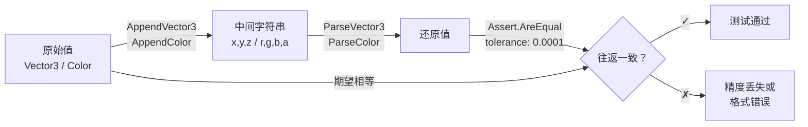

Editor 测试层是 DOTween Visual Editor 质量保障体系的第二道防线。与 Runtime 测试通过 `DOTween.ManualUpdate` 同步驱动动画引擎不同，Editor 测试聚焦于两个**纯函数领域**——样式映射系统的枚举→显示名称/CSS 类名/颜色映射，以及窗口工具函数的时间格式化与 `Vector3`/`Color` 序列化往返。这两个测试类总共 37 个测试用例，覆盖 6 个被测方法，不依赖任何 Unity 编辑器生命周期，可在 CI 环境中以极低开销运行。

Sources: [DOTweenEditorStyleTests.cs](Editor/Tests/DOTweenEditorStyleTests.cs#L1-L159), [DOTweenVisualEditorWindowUtilityTests.cs](Editor/Tests/DOTweenVisualEditorWindowUtilityTests.cs#L1-L228)

## 测试架构总览

Editor 测试项目通过独立的 Assembly Definition 与生产代码隔离。`CNoom.DOTweenVisual.Editor.Tests` 仅在 `UNITY_INCLUDE_TESTS` 条件下编译，运行平台限定为 `Editor`，引用了 `CNoom.DOTweenVisual.Editor`、`CNoom.DOTweenVisual.Runtime` 和 `UnityEngine.TestRunner` 三个程序集。预编译引用中包含 `nunit.framework.dll`、`DOTween.dll` 和 `DOTweenEditor.dll`，确保测试运行时可以正确解析 DOTween 类型。

Sources: [CNoom.DOTweenVisual.Editor.Tests.asmdef](Editor/Tests/CNoom.DOTweenVisual.Editor.Tests.asmdef#L1-L27)

### 测试分布与覆盖策略

两个测试类各自承担不同的验证职责，形成清晰的关注点分离：

| 测试类 | 被测目标 | 测试方法数 | 测试用例数 | 覆盖策略 |
|---|---|---|---|---|
| `DOTweenEditorStyleTests` | `DOTweenEditorStyle` | 3 | 20 | 枚举全值覆盖 + 精确值断言 |
| `DOTweenVisualEditorWindowUtilityTests` | `DOTweenVisualEditorWindow` 工具函数 | 5 | 17 | 边界值 + 往返一致性 |

Sources: [DOTweenEditorStyleTests.cs](Editor/Tests/DOTweenEditorStyleTests.cs#L1-L12), [DOTweenVisualEditorWindowUtilityTests.cs](Editor/Tests/DOTweenVisualEditorWindowUtilityTests.cs#L1-L12)

## 样式映射测试：DOTweenEditorStyleTests

`DOTweenEditorStyle` 是一个 `internal static` 类，集中管理编辑器中所有的样式配置——显示名称、CSS 类名和颜色常量。它使用 C# switch 表达式将枚举值映射到对应的视觉资源。测试的核心思路是**枚举穷举**：确保每个 `TweenStepType`（14 个）和每个 `ExecutionMode`（3 个）的映射结果与预期完全一致。

Sources: [DOTweenEditorStyle.cs](Editor/DOTweenEditorStyle.cs#L13-L94)

### 显示名称映射（GetStepDisplayName）

`GetStepDisplayName` 方法将 `TweenStepType` 枚举转换为用户界面中显示的英文名称字符串。测试为全部 14 个枚举值各编写一个独立测试方法，形成一一对应的映射验证矩阵。这种穷举策略确保当 `TweenStepType` 新增枚举成员时，开发者在 `DOTweenEditorStyle` 的 switch 表达式中遗漏映射后能立即被测试捕获（因为 `default` 分支走 `type.ToString()` 而非预期名称）。

| 枚举值 | 预期显示名称 | 分类 |
|---|---|---|
| `Move` | `"Move"` | Transform |
| `Rotate` | `"Rotate"` | Transform |
| `Scale` | `"Scale"` | Transform |
| `Color` | `"Color"` | 视觉 |
| `Fade` | `"Fade"` | 视觉 |
| `AnchorMove` | `"AnchorMove"` | UI |
| `SizeDelta` | `"SizeDelta"` | UI |
| `Jump` | `"Jump"` | 特效 |
| `Punch` | `"Punch"` | 特效 |
| `Shake` | `"Shake"` | 特效 |
| `FillAmount` | `"FillAmount"` | 特效 |
| `DOPath` | `"DOPath"` | 路径 |
| `Delay` | `"Delay"` | 流程控制 |
| `Callback` | `"Callback"` | 流程控制 |

Sources: [DOTweenEditorStyleTests.cs](Editor/Tests/DOTweenEditorStyleTests.cs#L14-L100), [DOTweenEditorStyle.cs](Editor/DOTweenEditorStyle.cs#L26-L43)

### CSS 类名映射（GetExecutionModeCssClass）

`GetExecutionModeCssClass` 将 `ExecutionMode` 映射为 USS 文件中定义的 CSS 类名。这些类名直接控制步骤列表左侧边框颜色和时间轴条颜色。测试验证三种执行模式的 CSS 类名与 USS 文件中的选择器完全匹配。

| ExecutionMode | CSS 类名 | USS 边框色 | 用途 |
|---|---|---|---|
| `Append` | `"mode-append"` | `#4A90D9`（蓝色） | 顺序追加 |
| `Join` | `"mode-join"` | `#4AD94A`（绿色） | 并行执行 |
| `Insert` | `"mode-insert"` | `#D99A4A`（橙色） | 定时插入 |

注意 switch 表达式的 `default` 分支返回 `"mode-append"`，这意味着未识别的执行模式会降级为 Append 的视觉效果。测试覆盖了所有三个显式分支，但未覆盖 default 分支（因为 `ExecutionMode` 目前仅定义了三个值）。

Sources: [DOTweenEditorStyleTests.cs](Editor/Tests/DOTweenEditorStyleTests.cs#L102-L122), [DOTweenEditorStyle.cs](Editor/DOTweenEditorStyle.cs#L52-L58), [DOTweenVisualEditor.uss](Editor/USS/DOTweenVisualEditor.uss#L186-L189)

### 颜色常量映射（GetExecutionModeColor）

`GetExecutionModeColor` 返回与 CSS 类名对应的 `Color` 结构体。由于浮点精度问题，颜色断言使用了 **0.01 的容差**（`Assert.AreEqual(expected, actual, 0.01f)`）而非精确相等。这是一个关键的测试设计决策——`new Color(0.29f, 0.56f, 0.85f)` 构造后的实际内存表示与字面值可能存在微小差异，容差断言既保证正确性又避免假阳性。

三个颜色分别对应：
- **Append 蓝** `(0.29, 0.56, 0.85)` → `#4A90D9` — 表示序列追加步骤
- **Join 绿** `(0.29, 0.85, 0.29)` → `#4AD94A` — 表示并行执行步骤
- **Insert 橙** `(0.85, 0.60, 0.29)` → `#D99A4A` — 表示定时插入步骤

这些颜色与 USS 文件中的 `mode-append`、`mode-join`、`mode-insert` 选择器中定义的边框色和时间轴条色完全一致，测试确保了 C# 颜色层与 CSS 颜色层的同步性。

Sources: [DOTweenEditorStyleTests.cs](Editor/Tests/DOTweenEditorStyleTests.cs#L124-L156), [DOTweenEditorStyle.cs](Editor/DOTweenEditorStyle.cs#L63-L69)

## 窗口工具函数测试：DOTweenVisualEditorWindowUtilityTests

`DOTweenVisualEditorWindow` 是一个 2000+ 行的编辑器窗口类，其中包含五个 `internal static` 的工具方法，用于步骤的复制粘贴序列化格式和预览时间显示。测试类将这些方法从窗口的 UI 生命周期中剥离出来，作为纯函数进行独立验证。

Sources: [DOTweenVisualEditorWindowUtilityTests.cs](Editor/Tests/DOTweenVisualEditorWindowUtilityTests.cs#L1-L12)

### 时间格式化（FormatTime）

`FormatTime` 将秒数转换为 `MM:SS.d` 格式（分钟:秒.十分之一秒），用于预览状态栏的时间显示。测试设计了 7 个用例，覆盖了格式化的关键边界：

| 测试用例 | 输入（秒） | 预期输出 | 验证点 |
|---|---|---|---|
| 零值 | `0f` | `"00:00.0"` | 格式化基准 |
| 小值 | `1.5f` | `"00:01.5"` | 秒内小数 |
| 半分钟 | `30f` | `"00:30.0"` | 整十秒边界 |
| 接近分钟 | `59.9f` | `"00:59.9"` | 分钟进位前 |
| 整分钟 | `60f` | `"01:00.0"` | 分钟进位 |
| 超过分钟 | `65.5f` | `"01:05.5"` | 跨分钟小数 |
| 两分钟 | `120f` | `"02:00.0"` | 多分钟 |

实现采用整数运算提取分钟（`seconds / 60`）、秒（`seconds % 60`）和十分之一秒（`(seconds * 10) % 10`），避免了浮点格式化的不稳定性。注意精度设计为**十分之一秒**而非百分之一秒，这是编辑器预览场景下的合理权衡——时间显示用于动画时间轴概览，不需要毫秒级精度。

Sources: [DOTweenVisualEditorWindowUtilityTests.cs](Editor/Tests/DOTweenVisualEditorWindowUtilityTests.cs#L14-L58), [DOTweenVisualEditorWindow.cs](Editor/DOTweenVisualEditorWindow.cs#L181-L187)

### Vector3 序列化与反序列化

`AppendVector3` 和 `ParseVector3` 是一对互补的序列化函数，使用逗号分隔格式（`x,y,z`）将 `Vector3` 转换为字符串或从字符串还原。它们服务于**步骤复制粘贴系统**——当用户复制一个动画步骤时，所有 Vector3 类型的字段（StartVector、TargetVector、Intensity 等）通过 `AppendVector3` 写入剪贴板字符串；粘贴时通过 `ParseVector3` 还原。

测试分为三层：

**格式化输出验证（AppendVector3）**：确认输出格式为 `x,y,z`（无空格），覆盖正值、零值和负值三种情况。关键实现细节是使用 `ToString("R", CultureInfo.InvariantCulture)`——`"R"` 表示 Round-Trip 格式，确保浮点数在序列化和反序列化之间不损失精度；`InvariantCulture` 避免了某些区域设置使用逗号作为小数分隔符的问题。

**解析输入验证（ParseVector3）**：确认 `ParseVector3` 能正确处理正值、负值、零值和小数值。使用 `CultureInfo.InvariantCulture` 解析，与格式化端保持一致。

**往返一致性验证（Roundtrip）**：这是最关键的测试层次。将原始 `Vector3` 通过 `AppendVector3` 序列化为字符串，再通过 `ParseVector3` 反序列化，断言还原后的值与原始值在 **0.0001 的容差**内一致。容差选择基于 `"R"` 格式的精度保证——理论上应为精确往返，但浮点运算链路的累积误差需要在测试中留出余量。

Sources: [DOTweenVisualEditorWindowUtilityTests.cs](Editor/Tests/DOTweenVisualEditorWindowUtilityTests.cs#L60-L148), [DOTweenVisualEditorWindow.cs](Editor/DOTweenVisualEditorWindow.cs#L1744-L1761)

### Color 序列化与反序列化

`AppendColor` 和 `ParseColor` 的结构与 Vector3 测试完全对称，区别在于 Color 有四个分量（r, g, b, a），格式为 `r,g,b,a`。测试同样分为格式化输出、解析输入和往返一致性三层：

**格式化输出**：验证 Color 输出为 `r,g,b,a` 格式，包括常规颜色 `(1, 0.5, 0, 1)` 和纯白 `(1,1,1,1)`。

**解析输入**：覆盖纯红 `(1,0,0,1)`、全透明白 `(1,1,1,0)` 和全透明黑 `(0,0,0,0)` 三种典型场景。

**往返一致性**：验证两个颜色——低分量颜色 `(0.1, 0.2, 0.3, 0.4)` 和混合颜色 `(0.75, 0.25, 0.5, 1)`——的序列化-反序列化往返精度，容差为 0.0001。特别值得注意的是透明度通道 `a` 的往返验证，确保复制粘贴不会改变颜色组件的 Alpha 值。

Sources: [DOTweenVisualEditorWindowUtilityTests.cs](Editor/Tests/DOTweenVisualEditorWindowUtilityTests.cs#L150-L225), [DOTweenVisualEditorWindow.cs](Editor/DOTweenVisualEditorWindow.cs#L1749-L1771)

## 测试设计模式总结

Editor 测试体现了三种核心测试设计模式，这些模式值得在扩展测试时遵循：

### 模式一：枚举穷举验证

对 `DOTweenEditorStyle` 中所有 switch 表达式的映射进行完整覆盖。当枚举新增成员时，测试应同步新增对应用例。这种模式通过**一一对应的测试方法命名**（如 `GetStepDisplayName_Move_ReturnsMove`）使得失败定位极其精确——从测试名称即可知道是哪个枚举值的映射出了问题。

Sources: [DOTweenEditorStyleTests.cs](Editor/Tests/DOTweenEditorStyleTests.cs#L14-L100)

### 模式二：边界值 + 等价类划分

`FormatTime` 的 7 个测试用例不是随机选取的，而是精心覆盖了时间格式的**等价类边界**：零值（格式化基准）、秒内小数（小数位验证）、整十秒（十位显示）、分钟进位临界点（`59.9` → `60.0`）、整分钟（进位后零值）、跨分钟小数（进位+小数组合）、多分钟（十位显示）。每个用例验证格式化逻辑的一个分支条件。

Sources: [DOTweenVisualEditorWindowUtilityTests.cs](Editor/Tests/DOTweenVisualEditorWindowUtilityTests.cs#L14-L58)

### 模式三：序列化往返一致性

对于 `Append` + `Parse` 函数对，核心验证不是单个方向的正确性，而是**往返一致性**——先序列化再反序列化后，值应与原始值在可接受容差内相等。这种模式在验证复制粘贴系统的数据完整性时特别重要，因为它同时捕获了序列化遗漏字段和解析偏移错误两类缺陷。

Sources: [DOTweenVisualEditorWindowUtilityTests.cs](Editor/Tests/DOTweenVisualEditorWindowUtilityTests.cs#L120-L148)

## 被测方法访问性设计

`DOTweenVisualEditorWindow` 中的五个工具方法使用了 `internal static` 可见性，而非 `private`。这是一个有意的设计决策——`internal` 允许同一程序集（`CNoom.DOTweenVisual.Editor`）内的测试类访问这些方法，而 `static` 确保测试无需实例化编辑器窗口即可调用。这意味着：

- **不触发 Unity 编辑器生命周期**：无需创建 `EditorWindow` 实例，不涉及 `CreateGUI`、`OnEnable` 等 Unity 回调
- **可在 CI 中运行**：不依赖编辑器 UI 渲染管线
- **测试执行速度极快**：纯函数调用，毫秒级完成

相比之下，`DOTweenEditorStyle` 本身就是 `internal static` 类，所有方法天然可被同程序集的测试类直接调用，无需额外的可访问性设计。

Sources: [DOTweenEditorStyle.cs](Editor/DOTweenEditorStyle.cs#L13), [DOTweenVisualEditorWindow.cs](Editor/DOTweenVisualEditorWindow.cs#L181), [DOTweenVisualEditorWindow.cs](Editor/DOTweenVisualEditorWindow.cs#L1744-L1771)

## 未覆盖领域与扩展方向

当前 Editor 测试的覆盖范围集中在纯函数验证，以下领域尚未覆盖，可作为扩展方向：

**USS 样式同步验证**：CSS 类名（`mode-append` 等）与 USS 文件中选择器的同步目前依赖人工审查。未来可考虑在测试中加载 USS 资源并验证对应选择器存在。

**UI Toolkit 交互测试**：步骤列表的拖拽排序、字段的条件渲染、预览状态机转换等涉及 `SerializedProperty` 和 UI 元素交互的逻辑，需要 Unity Play Mode 测试或 UI 测试框架支持。

**剪贴板完整性测试**：`CopySelectedStep` 和 `PasteStep` 方法构成完整的复制粘贴流程，目前仅测试了底层的 `Append`/`Parse` 函数，未测试上层管道字段的完整性。

Sources: [DOTweenVisualEditorWindow.cs](Editor/DOTweenVisualEditorWindow.cs#L1605-L1773)

## 延伸阅读

- 了解 Editor 层被测代码的完整架构，参阅 [可视化编辑器窗口（DOTweenVisualEditorWindow）：UI Toolkit 布局与交互](14-ke-shi-hua-bian-ji-qi-chuang-kou-dotweenvisualeditorwindow-ui-toolkit-bu-ju-yu-jiao-hu)
- 了解样式系统的完整设计，参阅 [编辑器样式系统：DOTweenEditorStyle 与 USS 暗色主题](17-bian-ji-qi-yang-shi-xi-tong-dotweeneditorstyle-yu-uss-an-se-zhu-ti)
- 对比 Runtime 层的测试策略，参阅 [Runtime 测试策略：DOTween.ManualUpdate 同步驱动模式](20-runtime-ce-shi-ce-lue-dotween-manualupdate-tong-bu-qu-dong-mo-shi)
- 了解被测试的复制粘贴系统实现，参阅 [键盘快捷键与复制粘贴系统](18-jian-pan-kuai-jie-jian-yu-fu-zhi-nian-tie-xi-tong)