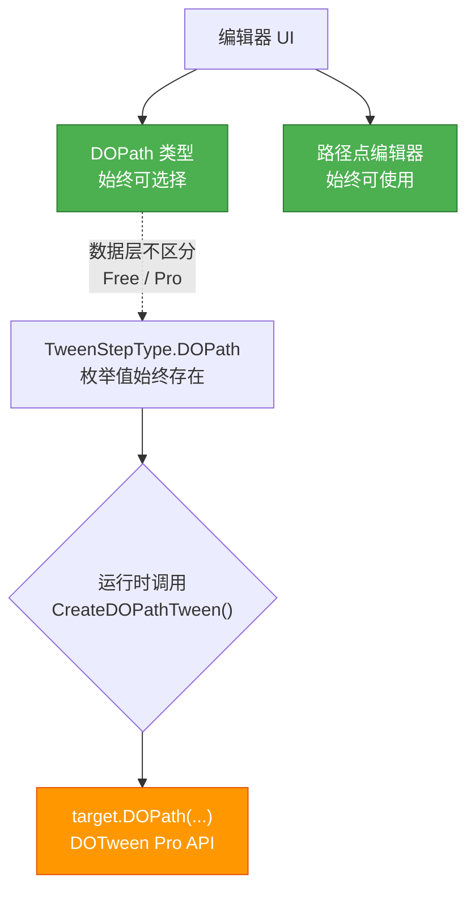
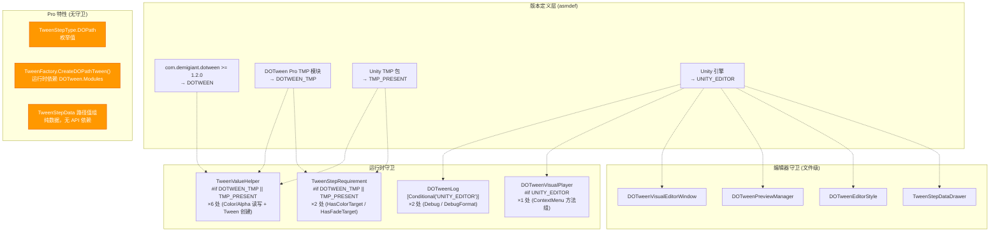

DOTween Visual Editor 在设计之初便确立了"一套代码、两种运行时"的兼容策略——无论用户安装的是 DOTween Free 还是 DOTween Pro，插件均可正常编译与运行，并在 Pro 环境下自动解锁高级功能（如 `DOPath` 路径动画）。这套策略的核心机制由三层构成：**程序集版本定义**（Assembly Definition Version Defines）负责编译期符号注入、**条件编译守卫**（Conditional Compilation Guards）负责运行时 API 可用性隔离、**组件校验系统**负责运行时功能降级提示。本文将逐层剖析其实现原理与扩展模式。

Sources: [架构设计.md](Documentation~/架构设计.md#L226-L236), [CHANGELOG.md](CHANGELOG.md#L41-L42)

## 条件编译符号体系

DOTween Visual Editor 使用以下编译符号来适配不同运行时环境：

| 编译符号 | 触发条件 | 作用范围 | 来源 |
|----------|---------|---------|------|
| `DOTWEEN` | `com.demigiant.dotween >= 1.2.0` | Runtime 程序集 | Runtime asmdef `versionDefines` |
| `DOTWEEN_TMP` | DOTween Pro 的 TMP 模块存在 | Runtime 程序集 | DOTween Pro 内部定义 |
| `TMP_PRESENT` | TextMeshPro 包存在（Unity Package） | 全局 | Unity 包管理器自动注入 |
| `UNITY_EDITOR` | 编辑器环境 | 全局 | Unity 引擎自动定义 |

其中 `DOTWEEN` 是通过 Runtime 程序集定义的 `versionDefines` 机制自动注入的。当 Unity 包管理器解析到 `com.demigiant.dotween` 包版本不低于 `1.2.0` 时，编译器会在整个 Runtime 程序集范围内自动定义 `DOTWEEN` 符号。这一机制完全由 Unity 的 Assembly Definition 系统驱动，无需用户手动配置。

Sources: [CNoom.DOTweenVisual.Runtime.asmdef](Runtime/CNoom.DOTweenVisual.Runtime.asmdef#L16-L22)

## 程序集定义与依赖关系

DOTween Visual Editor 的 Free/Pro 适配能力首先建立在精确的程序集依赖声明之上。两个核心程序集分别声明了对 DOTween DLL 的引用方式：

```
┌─────────────────────────────────────────────────────────────────┐
│                  Runtime 程序集依赖拓扑                          │
│                                                                 │
│  CNoom.DOTweenVisual.Runtime                                    │
│  ├── references: DOTween.Modules                                │
│  ├── precompiledReferences: DOTween.dll                         │
│  └── versionDefines:                                            │
│      └── com.demigiant.dotween >= 1.2.0 → DOTWEEN               │
│                                                                 │
│  CNoom.DOTweenVisual.Editor                                     │
│  ├── references: CNoom.DOTweenVisual.Runtime, DOTween.Modules   │
│  └── precompiledReferences: DOTween.dll, DOTweenEditor.dll      │
│                                                                 │
│  （测试程序集继承相同依赖结构）                                    │
└─────────────────────────────────────────────────────────────────┘
```

关键设计要点：`precompiledReferences` 中直接引用 `DOTween.dll` 而非通过 Package 引用，这使得插件能够同时兼容 Free 版（以 DLL 形式分发）和 Pro 版（以 Package 形式分发）两种安装方式。`DOTween.Modules` 的引用则覆盖了 Pro 版的扩展模块（包括 TMP、Audio、SpriteRenderer 等），在 Free 版环境中该模块不存在时也不会导致编译失败，因为 Unity 的程序集解析会自动忽略缺失的可选引用。

Sources: [CNoom.DOTweenVisual.Runtime.asmdef](Runtime/CNoom.DOTweenVisual.Runtime.asmdef#L1-L24), [CNoom.DOTweenVisual.Editor.asmdef](Editor/CNoom.DOTweenVisual.Editor.asmdef#L1-L22)

## TextMeshPro 条件编译守卫

TextMeshPro 的颜色与透明度动画是 Free/Pro 适配中最典型的条件编译场景。在 DOTween Free 中，`TMPro.TMP_Text` 的扩展方法（`DOColor`、`DOFade`）并不存在；而在 DOTween Pro 中，这些方法通过 `DOTween.Modules` 提供。DOTween Visual Editor 通过 `#if DOTWEEN_TMP || TMP_PRESENT` 双条件守卫解决这一差异：

**`DOTWEEN_TMP`** 由 DOTween Pro 内部定义——当 Pro 版的 TMP 模块被激活时，该符号被注入；**`TMP_PRESENT`** 由 Unity 的 TextMeshPro 包管理器自动定义——只要项目中安装了 TMP 包（无论 Free 还是 Pro），该符号即存在。双条件使用 `||` 组合，确保以下两种场景均能正确编译：用户安装了 DOTween Pro（含 TMP 模块），或用户安装了 DOTween Free 但项目中有 TMP 包。

Sources: [TweenValueHelper.cs](Runtime/Data/TweenValueHelper.cs#L57-L64)

### 受影响的代码位置

条件编译守卫覆盖了三个核心文件中所有涉及 `TMPro.TMP_Text` 的代码路径：

| 文件 | 方法 | 守卫条件 | 功能 |
|------|------|---------|------|
| `TweenValueHelper.cs` | `TryGetColor()` | `DOTWEEN_TMP \|\| TMP_PRESENT` | TMP 颜色读取 |
| `TweenValueHelper.cs` | `TrySetColor()` | `DOTWEEN_TMP \|\| TMP_PRESENT` | TMP 颜色写入 |
| `TweenValueHelper.cs` | `CreateColorTween()` | `DOTWEEN_TMP \|\| TMP_PRESENT` | TMP 颜色动画创建 |
| `TweenValueHelper.cs` | `TryGetAlpha()` | `DOTWEEN_TMP \|\| TMP_PRESENT` | TMP 透明度读取 |
| `TweenValueHelper.cs` | `TrySetAlpha()` | `DOTWEEN_TMP \|\| TMP_PRESENT` | TMP 透明度写入 |
| `TweenValueHelper.cs` | `CreateFadeTween()` | `DOTWEEN_TMP \|\| TMP_PRESENT` | TMP 透明度动画创建 |
| `TweenStepRequirement.cs` | `HasColorTarget()` | `DOTWEEN_TMP \|\| TMP_PRESENT` | TMP 颜色能力检测 |
| `TweenStepRequirement.cs` | `HasFadeTarget()` | `DOTWEEN_TMP \|\| TMP_PRESENT` | TMP 透明度能力检测 |

每个守卫块的模式完全一致：在组件检测链的末端，作为最后一个 `if` 分支尝试获取 `TMPro.TMP_Text` 组件。若条件编译符号未定义，整段代码被编译器裁剪，TMP 支持透明地消失。

Sources: [TweenValueHelper.cs](Runtime/Data/TweenValueHelper.cs#L57-L64), [TweenStepRequirement.cs](Runtime/Data/TweenStepRequirement.cs#L117-L119)

### 组件检测链的降级策略

`TweenValueHelper` 和 `TweenStepRequirement` 中的组件检测采用**优先级链**设计，TMP 始终位于链末端。以颜色读取 `TryGetColor()` 为例，其检测顺序为：`Graphic` → `SpriteRenderer` → `Renderer` → `TMP_Text`（条件守卫）。这种排序的意义在于：DOTween Free 的核心 API 覆盖了前三个组件类型，而 TMP 是唯一的 Pro-only 依赖。将条件编译的代码放在链末端，使得 Free 环境下被裁剪的 TMP 分支不会影响其他组件的正常检测——方法会在匹配到 Graphic/SpriteRenderer/Renderer 后提前返回 `true`。

Sources: [TweenValueHelper.cs](Runtime/Data/TweenValueHelper.cs#L32-L67)

## DOPath 路径动画与 Pro 特性

`TweenStepType.DOPath` 是 DOTween Visual Editor 中唯一与 DOTween Pro 深度绑定的动画类型。`DOPath()` 扩展方法是 DOTween Pro 独有的路径动画 API，在 Free 版中不存在。然而，**插件并未使用 `#if` 守卫来隔离 DOPath 的枚举定义和数据结构**，而是将其完整保留在 `TweenStepType` 枚举和 `TweenStepData` 数据类中。



这种设计选择背后的逻辑是：**数据层与运行时层分离**。`TweenStepData` 是纯数据类，不依赖任何 DOTween API，因此 DOPath 的数据字段（`PathWaypoints`、`PathType`、`PathMode`、`PathResolution`）在 Free 环境下安全存在。编辑器 UI 同样不直接调用 DOTween API，而是操作 `SerializedProperty`，因此 DOPath 的完整编辑体验在 Free 环境中也可用。真正需要 Pro API 的时刻仅发生在 `TweenFactory.CreateDOPathTween()` 被调用时——此时 `target.DOPath()` 方法存在于 `DOTween.Modules` 中。

Sources: [TweenStepType.cs](Runtime/Data/TweenStepType.cs#L39-L40), [TweenFactory.cs](Runtime/Data/TweenFactory.cs#L383-L397), [TweenStepData.cs](Runtime/Data/TweenStepData.cs#L139-L157)

## 编辑器隔离：UNITY_EDITOR 守卫

DOTween Visual Editor 将所有编辑器专用代码通过 `#if UNITY_EDITOR` / `#endif` 包裹，确保运行时程序集在构建发布版本时不包含任何编辑器依赖。这一机制与 Free/Pro 适配形成了正交维度——无论 DOTween 版本如何，编辑器代码始终仅在编辑器环境中编译。

| 文件 | 守卫方式 | 受隔离内容 |
|------|---------|-----------|
| `DOTweenVisualEditorWindow.cs` | 文件级 `#if UNITY_EDITOR` | 整个编辑器窗口类 |
| `DOTweenPreviewManager.cs` | 文件级 `#if UNITY_EDITOR` | 整个预览管理器类 |
| `DOTweenEditorStyle.cs` | 文件级 `#if UNITY_EDITOR` | 整个样式配置类 |
| `TweenStepDataDrawer.cs` | 文件级 `#if UNITY_EDITOR` + `#endif` | 整个 Inspector 绘制器 |
| `DOTweenVisualPlayer.cs` | 局部 `#if UNITY_EDITOR` | ContextMenu 方法组 |
| `DOTweenLog.cs` | `[Conditional("UNITY_EDITOR")]` | Debug/DebugFormat 方法 |

值得注意的是 `DOTweenLog` 中使用了 `System.Diagnostics.ConditionalAttribute` 而非 `#if` 预处理指令。`[Conditional("UNITY_EDITOR")]` 的效果是：方法签名在所有环境中均存在（保证调用点编译通过），但方法体在非编辑器构建中被 JIT 编译器完全忽略——调用代码被编译器自动移除。这比 `#if` 守卫更优雅，因为它不需要在每一处调用点都加条件编译。

Sources: [DOTweenVisualPlayer.cs](Runtime/Components/DOTweenVisualPlayer.cs#L387-L402), [DOTweenLog.cs](Runtime/Data/DOTweenLog.cs#L71-L76), [TweenStepDataDrawer.cs](Editor/TweenStepDataDrawer.cs#L1-L741)

## 完整的条件编译分布图



Sources: [TweenValueHelper.cs](Runtime/Data/TweenValueHelper.cs#L57-L64), [TweenStepRequirement.cs](Runtime/Data/TweenStepRequirement.cs#L117-L119), [DOTweenLog.cs](Runtime/Data/DOTweenLog.cs#L71-L86), [DOTweenVisualPlayer.cs](Runtime/Components/DOTweenVisualPlayer.cs#L387-L402)

## 扩展指南：添加新的条件编译特性

当需要为新 DOTween 模块（如 DOTween Audio、DOTween Physics 等）添加条件编译支持时，遵循以下三步模式：

**第一步：在 asmdef 中添加版本定义。** 仅当目标模块提供了独立的 Unity Package 时才需要此步骤。在 [CNoom.DOTweenVisual.Runtime.asmdef](Runtime/CNoom.DOTweenVisual.Runtime.asmdef#L16-L22) 的 `versionDefines` 数组中追加新条目。

**第二步：在检测链末端添加条件守卫。** 参考 `TweenValueHelper` 中的 TMP 模式——在所有现有组件检测分支之后，添加 `#if YOUR_SYMBOL` 守卫的新分支，确保 Free 环境下该分支被裁剪而不影响其他组件检测。

**第三步：同步更新 TweenStepRequirement。** 若新模块引入了新的组件类型，在 `HasColorTarget()` / `HasFadeTarget()` 或新增的检测方法中添加对应的条件编译分支。同时更新 `GetRequirementDescription()` 的返回值，确保编辑器校验提示正确反映新增组件。

Sources: [TweenValueHelper.cs](Runtime/Data/TweenValueHelper.cs#L111-L141), [TweenStepRequirement.cs](Runtime/Data/TweenStepRequirement.cs#L104-L151)

## 设计总结

DOTween Visual Editor 的 Free/Pro 适配策略遵循一个核心原则：**编译期隔离，数据层统一**。所有 Pro 特有的 API 调用均通过条件编译在编译期裁剪，而数据结构（枚举、序列化字段）和编辑器 UI 保持完整，不区分 Free/Pro。这使得同一份序列化数据在两种环境中均可读写、编辑，仅在运行时 Tween 创建环节体现出功能差异。

| 设计维度 | Free 环境 | Pro 环境 |
|---------|----------|---------|
| 13 种基础 TweenStepType | ✅ 全部可用 | ✅ 全部可用 |
| DOPath 路径动画数据编辑 | ✅ 可编辑数据 | ✅ 可编辑数据 |
| DOPath 路径动画运行时播放 | ❌ API 不存在 | ✅ 正常播放 |
| TMP 颜色/透明度动画 | ❌ 编译期裁剪 | ✅ 自动激活 |
| 编辑器可视化窗口 | ✅ 完整功能 | ✅ 完整功能 |
| Inspector 自定义绘制 | ✅ 完整功能 | ✅ 完整功能 |
| 组件校验系统 | ✅ 基础组件 | ✅ 含 TMP 组件 |

**延伸阅读**：若需了解 TMP 集成的完整实现细节，参见 [TextMeshPro 集成与跨组件动画支持](23-textmeshpro-ji-cheng-yu-kua-zu-jian-dong-hua-zhi-chi)；若需理解组件校验系统的校验逻辑与错误提示机制，参见 [TweenStepRequirement 组件校验系统](10-tweensteprequirement-zu-jian-xiao-yan-xi-tong)。