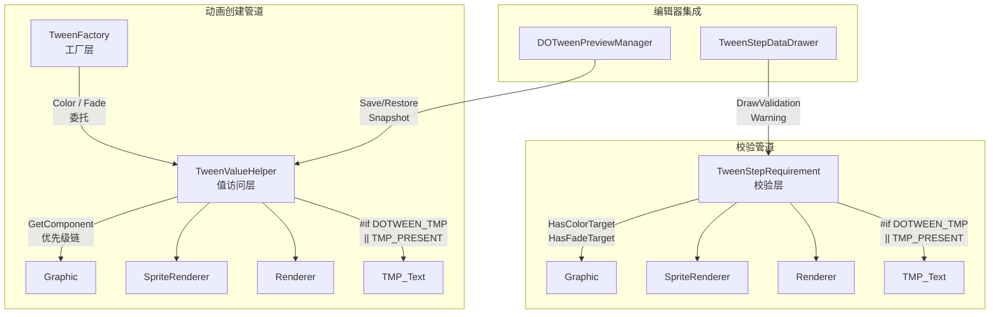

DOTween Visual Editor 的视觉动画系统（Color / Fade）并非为单一组件类型设计，而是通过 **优先级链式探测** 模式自动适配目标物体上的任意可着色/可透明组件。TextMeshPro 作为该适配链中的条件编译分支，在 `DOTWEEN_TMP` 或 `TMP_PRESENT` 宏定义存在时自动激活，无需任何额外配置。本文将从跨组件适配的整体架构出发，深入分析 TMP 集成的三层机制：值访问层（TweenValueHelper）、组件校验层（TweenStepRequirement）和工厂创建层（TweenFactory），并揭示预览系统如何通过统一的快照机制透明地支持 TMP 文本对象。

Sources: [TweenValueHelper.cs](Runtime/Data/TweenValueHelper.cs#L1-L291), [TweenStepRequirement.cs](Runtime/Data/TweenStepRequirement.cs#L1-L153), [TweenFactory.cs](Runtime/Data/TweenFactory.cs#L1-L42)

## 跨组件适配架构总览

系统通过三个协作模块实现组件无关的动画操作。每个模块承担明确的单一职责，形成从"值读写"到"需求校验"再到"动画创建"的完整管道。



**TweenValueHelper** 负责所有属性的读写和 Tween 创建，通过 `GetComponent<T>` 优先级链自动选择正确的组件类型。**TweenStepRequirement** 负责前置校验，判断目标物体是否具备动画所需的组件能力。**TweenFactory** 作为编排层，先调用校验确认合法性，再委托值访问层完成起始值设置和 Tween 创建。三个模块的 TMP 支持均通过 `#if DOTWEEN_TMP || TMP_PRESENT` 条件编译守卫实现，确保在未安装 TMP 的项目中不会产生编译错误。

Sources: [TweenValueHelper.cs](Runtime/Data/TweenValueHelper.cs#L1-L10), [TweenStepRequirement.cs](Runtime/Data/TweenStepRequirement.cs#L1-L10), [TweenFactory.cs](Runtime/Data/TweenFactory.cs#L261-L289)

## 条件编译机制

TMP 集成的激活完全依赖于 DOTween 自身定义的条件编译符号。系统不自行定义这些符号，而是被动响应 DOTween / DOTween Pro 包的版本定义。

| 条件编译符号 | 来源 | 触发条件 |
|---|---|---|
| `DOTWEEN_TMP` | DOTween Modules（TextMeshPro 模块） | 项目中安装了 `DOTween.Modules` 包含 TMP 模块 |
| `TMP_PRESENT` | Unity Package Manager / TextMeshPro 包 | 项目中安装了 `com.unity.textmeshpro` |

在代码中，两个符号通过 `||` 运算符组合使用：

```csharp
#if DOTWEEN_TMP || TMP_PRESENT
    var tmpText = target.GetComponent<TMPro.TMP_Text>();
    if (tmpText != null) { /* ... */ }
#endif
```

这种双符号设计提供了最大的兼容性：`DOTWEEN_TMP` 覆盖 DOTween Pro 用户（其 TMP 模块会定义此符号），`TMP_PRESENT` 则覆盖仅安装了 TMP 包但使用 DOTween Free 版本的场景。需要注意的是，运行时程序集定义（asmdef）的 `versionDefines` 仅声明了 `DOTWEEN` 符号（对应 `com.demigiant.dotween >= 1.2.0`），TMP 相关的符号完全由 DOTween 的 TMP 模块和 Unity Package Manager 自动注入。

Sources: [TweenValueHelper.cs](Runtime/Data/TweenValueHelper.cs#L57-L64), [CNoom.DOTweenVisual.Runtime.asmdef](Runtime/CNoom.DOTweenVisual.Runtime.asmdef#L16-L22), [架构设计.md](Documentation~/架构设计.md#L226-L235)

## TweenValueHelper：TMP 的值访问与动画创建

TweenValueHelper 是跨组件适配的核心实现层。对于 Color 和 Fade 两种动画类型，每个操作（Get / Set / CreateTween）都包含一条完整的组件优先级探测链。TMP_Text 始终位于探测链的**末端**——这是有意为之的设计决策。

### Color 操作的优先级链

| 优先级 | 组件类型 | 访问属性 | DOTween 方法 |
|---|---|---|---|
| 1 | `Graphic`（含 Image / Text） | `graphic.color` | `DOColor()` |
| 2 | `SpriteRenderer` | `spriteRenderer.color` | `DOColor()` |
| 3 | `Renderer`（Material） | `renderer.sharedMaterial.color` / `renderer.material` | `material.DOColor()` |
| 4 | `TMP_Text`（条件编译） | `tmpText.color` | `DOColor()` |

**TryGetColor** 按优先级依次尝试获取组件，找到第一个非 null 的组件后立即返回。Graphic（Unity UI 基类，Image 和 Text 均继承自它）具有最高优先级，因为 TMP 文本对象在 UI 场景中通常也会挂载 Graphic 组件（Layout 系统需要）。如果 Graphic 存在，系统会使用 Graphic 的颜色通道而非 TMP 自身的 `color` 属性。这意味着当一个 GameObject 同时挂载了 Image 和 TMP_Text 时，Color 动画将作用于 Image 而非 TMP_Text——这在实践中是合理的，因为同时存在两种视觉组件的情况极为罕见。

Sources: [TweenValueHelper.cs](Runtime/Data/TweenValueHelper.cs#L32-L67), [TweenValueHelper.cs](Runtime/Data/TweenValueHelper.cs#L111-L141)

### Fade 操作的优先级链

| 优先级 | 组件类型 | 访问属性 | DOTween 方法 |
|---|---|---|---|
| 1 | `CanvasGroup` | `canvasGroup.alpha` | `DOFade()` |
| 2 | `Graphic` | `graphic.color.a` | `DOFade()` |
| 3 | `SpriteRenderer` | `spriteRenderer.color.a` | `DOFade()` |
| 4 | `Renderer`（Material） | `renderer.sharedMaterial.color.a` | `material.DOFade()` |
| 5 | `TMP_Text`（条件编译） | `tmpText.color.a` | `DOFade()` |

Fade 操作比 Color 多了一个 **CanvasGroup** 层级。CanvasGroup 是 Unity UI 中控制子节点整体透明度的标准机制，优先级最高。这一设计确保了当 UI 元素处于 CanvasGroup 控制下时，透明度动画始终通过 CanvasGroup 统一操作，避免对单个子组件的 `color.a` 进行操作导致不一致的视觉效果。

对于纯 TMP 文本对象（无 CanvasGroup / Graphic / Renderer / SpriteRenderer），`CreateFadeTween` 最终会调用 `tmpText.DOFade()`，直接对 TMP_Text 的 `color.a` 通道执行动画插值。DOTween 的 `TMP_Text.DOFade()` 扩展方法内部会正确处理文本颜色与顶点颜色的同步更新。

Sources: [TweenValueHelper.cs](Runtime/Data/TweenValueHelper.cs#L150-L192), [TweenValueHelper.cs](Runtime/Data/TweenValueHelper.cs#L251-L287)

### 值读写与 Tween 创建的对称性

每个属性域（Color / Fade）都提供三个对称方法，形成完整的读写-动画生命周期：

```
TryGet[T]   ← 读取当前值（用于快照、起始值检测）
TrySet[T]   ← 写入指定值（用于恢复快照、应用起始值）
Create[T]Tween ← 创建 DOTween 动画（用于运行时播放和编辑器预览）
```

这三个方法共享**完全相同的组件探测链**——这不仅是代码复用，更是**语义一致性**的保证。`SaveSnapshots` 通过 `TryGetColor` 读取 TMP 文本颜色，`RestoreSnapshots` 通过 `TrySetColor` 写回，而 `CreateColorTween` 创建的动画其起始帧值与快照值完全对齐。如果三个方法的探测链不一致（例如 Get 走 Renderer 路径而 Create 走 TMP 路径），就会导致预览恢复时的属性漂移。

Sources: [TweenValueHelper.cs](Runtime/Data/TweenValueHelper.cs#L32-L105), [TweenValueHelper.cs](Runtime/Data/TweenValueHelper.cs#L247-L287)

## TweenStepRequirement：TMP 的组件能力校验

在创建 Tween 之前，TweenFactory 会先调用 TweenStepRequirement.Validate 确认目标物体满足动画的组件需求。TMP 在此系统中作为 Color 和 Fade 动画的**合法目标组件**被纳入校验逻辑。

### HasColorTarget / HasFadeTarget 的 TMP 分支

两个能力检测方法在标准组件链（Graphic → Renderer → SpriteRenderer）之后追加 TMP_Text 的条件编译检测：

```csharp
// HasColorTarget
#if DOTWEEN_TMP || TMP_PRESENT
    if (target.GetComponent<TMPro.TMP_Text>() != null) return true;
#endif
    return false;
```

当所有标准组件均不存在时，如果 TMP_Text 存在且条件编译已激活，校验将通过。这意味着一个只挂载了 TMP_Text 组件的 GameObject，在满足编译条件的前提下，可以合法地执行 Color 和 Fade 动画。

值得注意的是，校验层与值访问层的探测链**在顺序上保持一致**但**在语义上有区分**：校验层只关心"有没有"（返回 bool），值访问层关心"用哪个"（返回具体值 / Tween）。这种分离使得编辑器可以在不触发实际属性操作的情况下，提前向用户显示组件不匹配的警告。

Sources: [TweenStepRequirement.cs](Runtime/Data/TweenStepRequirement.cs#L109-L141)

### Validate 方法的 TMP 感知

对于 `TweenStepType.Color`，Validate 调用 `HasColorTarget`，其错误提示消息为 `"该物体不包含可着色组件（需要 Graphic / Renderer / SpriteRenderer）"`。这条消息**未提及 TMP_Text**——这是因为 TMP 支持是条件编译的，错误消息需要在不依赖编译条件的情况下保持有意义。在 TMP 已安装的环境中，HasColorTarget 的 TMP 分支会在消息生成之前就返回 true，因此消息中的组件列表仅列举始终可用的基础组件。

Sources: [TweenStepRequirement.cs](Runtime/Data/TweenStepRequirement.cs#L44-L58), [TweenStepRequirement.cs](Runtime/Data/TweenStepRequirement.cs#L90-L99)

## TweenFactory：TMP 在创建管道中的位置

TweenFactory 的 `CreateColorTween` 和 `CreateFadeTween` 方法展示了完整的校验-设值-创建流程：

```csharp
private static Tweener CreateColorTween(TweenStepData step, Transform target)
{
    // 1. 前置校验（包含 TMP 感知）
    if (!TweenStepRequirement.Validate(target, TweenStepType.Color, out _)) return null;
    
    // 2. 应用起始值（通过 TweenValueHelper 统一适配）
    if (step.UseStartColor)
        TweenValueHelper.TrySetColor(target, step.StartColor);
    
    // 3. 创建 Tween（委托给 TweenValueHelper）
    return TweenValueHelper.CreateColorTween(target, step.TargetColor, duration);
}
```

整个流程中，TMP 没有任何特殊分支——从工厂层的视角看，它只是 TweenValueHelper 探测链中的一种可能路径。这种"透明集成"的设计意味着：
- 添加新的组件类型支持只需修改 TweenValueHelper 和 TweenStepRequirement
- TweenFactory 和编辑器层无需感知具体的组件差异
- 预览系统自动获得 TMP 支持，因为快照保存/恢复也通过 TweenValueHelper 执行

Sources: [TweenFactory.cs](Runtime/Data/TweenFactory.cs#L263-L287)

## 编辑器集成：校验警告与预览快照

### Inspector 校验警告

在 TweenStepDataDrawer 中，Color 和 Fade 类型的字段绘制包含 `DrawValidationWarning` 调用。当用户在 Inspector 中为步骤指定了一个 TargetTransform，但该目标不满足组件需求时，绘制器会显示橙色的警告图标和错误消息：

```
⚠ 该物体不包含可着色组件（需要 Graphic / Renderer / SpriteRenderer）
```

对于 TMP 文本对象，由于 `HasColorTarget` 的 TMP 分支会在条件编译激活时返回 true，因此不会触发此警告。用户无需了解 TMP 是否被"特殊处理"——系统静默地完成了适配。

Sources: [TweenStepDataDrawer.cs](Editor/TweenStepDataDrawer.cs#L619-L648), [TweenStepDataDrawer.cs](Editor/TweenStepDataDrawer.cs#L376-L383)

### 预览快照的 TMP 支持

DOTweenPreviewManager 的快照系统通过 TweenValueHelper 保存和恢复颜色/透明度状态，因此 TMP 文本对象的颜色和透明度在预览循环中能够正确保存和恢复：

```
SaveSnapshots() → TryGetColor() / TryGetAlpha() → TMP 分支读取 tmpText.color / color.a
RestoreSnapshots() → TrySetColor() / TrySetAlpha() → TMP 分支写回 tmpText.color / color.a
```

快照的 `TransformSnapshot` 结构体使用 `Color` 和 `float` 类型存储颜色和透明度值，与具体的组件类型无关。这意味着预览系统的数据模型天然支持任意数量的组件类型——TMP 的加入无需修改快照结构体本身。

Sources: [DOTweenPreviewManager.cs](Editor/DOTweenPreviewManager.cs#L37-L49), [DOTweenPreviewManager.cs](Editor/DOTweenPreviewManager.cs#L263-L338)

## TMP 支持的动画能力矩阵

下表总结了 TextMeshPro 对象在 DOTween Visual Editor 中可以使用的全部动画类型及其实现路径：

| TweenStepType | TMP 支持 | 实现路径 | 说明 |
|---|---|---|---|
| Move | ✅ | Transform（直接） | 世界/本地坐标移动 |
| Rotate | ✅ | Transform（直接） | 四元数旋转插值 |
| Scale | ✅ | Transform（直接） | 本地缩放 |
| **Color** | ✅ | `tmpText.DOColor()` | 文本颜色过渡 |
| **Fade** | ✅ | `tmpText.DOFade()` | 文本透明度过渡 |
| AnchorMove | ✅ | RectTransform（TMP 在 UI 中有 RectTransform） | 锚点位置动画 |
| SizeDelta | ✅ | RectTransform | UI 尺寸动画 |
| Jump | ✅ | Transform（直接） | 跳跃移动 |
| Punch | ✅ | Transform（直接） | 弹性冲击 |
| Shake | ✅ | Transform（直接） | 随机震动 |
| FillAmount | ❌ | 需要特定 Image | TMP 不是 Image 组件 |
| DOPath | ✅ | Transform（直接） | 路径动画 |
| Delay | ✅ | 无目标需求 | 纯时间控制 |
| Callback | ✅ | 无目标需求 | 回调调用 |

TMP 对象作为 Unity GameObject 的合法 Transform 持有者，天然支持所有 Transform 级别的动画。Color 和 Fade 则通过条件编译的适配链获得支持。唯一的限制是 FillAmount，该类型硬编码要求 Image 组件。

Sources: [TweenStepType.cs](Runtime/Data/TweenStepType.cs#L1-L48), [TweenFactory.cs](Runtime/Data/TweenFactory.cs#L368-L381)

## 设计权衡与架构决策

### TMP 作为优先级链末端的原因

TMP_Text 在探测链中位于 Graphic / SpriteRenderer / Renderer 之后，这并非随意排列。在 Unity UI 系统中，TMP 文本对象通常继承自 `TMP_Text → TMP_UGUIProvider → Graphic`——也就是说 TMP_UGUI 组件本身就是一个 Graphic。当 Graphic 探测优先执行时，它会捕获 TMP 对象的 Graphic 层颜色，这在大多数场景下与 TMP 自身的 `color` 属性行为一致。将 TMP_Text 放在末端提供了更精确的语义控制（当用户刻意移除 TMP 的 Graphic 组件时仍可操作其颜色），同时避免了与 Graphic 层的冲突。

Sources: [TweenValueHelper.cs](Runtime/Data/TweenValueHelper.cs#L36-L67)

### 条件编译 vs 反射的选择

系统使用 `#if` 预处理指令而非运行时反射来集成 TMP。这一决策的核心考量是：

| 维度 | 条件编译 | 反射 |
|---|---|---|
| 性能 | 零开销，编译时确定 | GetType / Invoke 运行时开销 |
| 类型安全 | 编译期检查 | 运行时异常风险 |
| 依赖管理 | 编译时明确，无 TMP 则不包含 | 需要运行时判断程序集是否存在 |
| 代码可读性 | 清晰的 `#if` 块边界 | 大量字符串类型名和 null 检查 |
| 维护成本 | 需要在 `#if` 块内手动同步逻辑 | 统一代码路径，但更脆弱 |

DOTween 自身对 TMP 的集成也采用条件编译模式，因此保持一致的设计选择使得代码风格与依赖库对齐，降低了认知负担。

Sources: [TweenValueHelper.cs](Runtime/Data/TweenValueHelper.cs#L57-L64), [TweenStepRequirement.cs](Runtime/Data/TweenStepRequirement.cs#L117-L119)

### 测试策略对 TMP 的处理

现有的 TweenValueHelperTests 和 TweenStepRequirementValidateTests **不包含 TMP 专属测试用例**。这是合理的工程决策：TMP 测试需要安装 TextMeshPro 包和 DOTween TMP 模块，这些依赖在 CI 环境中并非总是可用。系统的测试策略聚焦于验证核心的优先级链逻辑（CanvasGroup > Image > SpriteRenderer），这些测试间接覆盖了 TMP 所在的同一代码路径。TMP 分支的正确性由 DOTween 的 `TMP_Text.DOColor()` / `TMP_Text.DOFade()` 扩展方法保证。

Sources: [TweenValueHelperTests.cs](Runtime/Tests/TweenValueHelperTests.cs#L211-L242), [TweenStepRequirementValidateTests.cs](Runtime/Tests/TweenStepRequirementValidateTests.cs#L246-L298)

## 延伸阅读

- 跨组件适配的完整实现细节：[TweenValueHelper 值访问层：多组件适配策略（Graphic / Renderer / SpriteRenderer / TMP）](9-tweenvaluehelper-zhi-fang-wen-ceng-duo-zu-jian-gua-pei-ce-lue-graphic-renderer-spriterenderer-tmp)
- 组件校验系统的工作原理：[TweenStepRequirement 组件校验系统](10-tweensteprequirement-zu-jian-xiao-yan-xi-tong)
- 预览系统的快照与恢复机制：[预览系统（DOTweenPreviewManager）：快照保存、状态管理与编辑器预览一致性](15-yu-lan-xi-tong-dotweenpreviewmanager-kuai-zhao-bao-cun-zhuang-tai-guan-li-yu-bian-ji-qi-yu-lan-zhi-xing)
- DOTween 版本适配的编译时策略：[DOTween Free / Pro 版本自动适配与条件编译](22-dotween-free-pro-ban-ben-zi-dong-gua-pei-yu-tiao-jian-bian-yi)