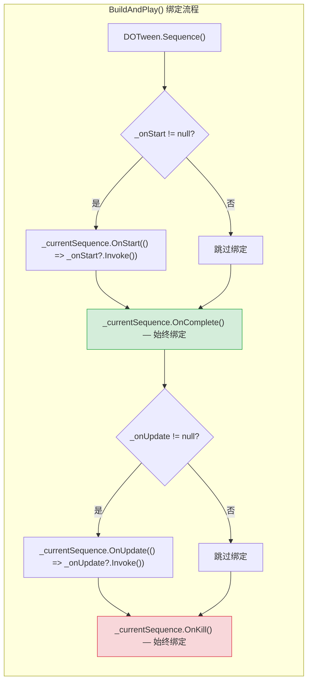
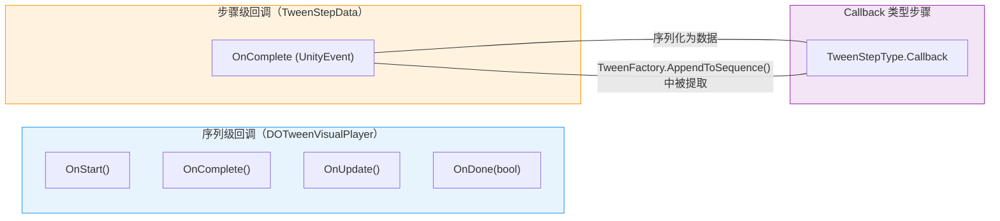
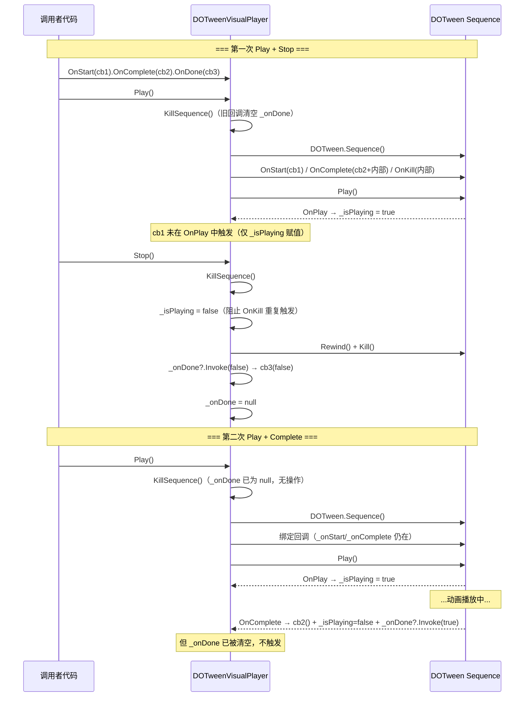

DOTween Visual Editor 的回调系统采用 **Fluent API（链式调用）** 设计模式，围绕 `DOTweenVisualPlayer` 组件提供四个语义明确的回调钩子——`OnStart`、`OnComplete`、`OnUpdate` 和 `OnDone`——覆盖动画序列从启动到终结的完整生命周期。该系统同时与 `TweenAwaitable` 异步等待机制深度集成，形成「链式注册 + 异步等待」的双轴回调架构。本文将从 API 签名分析、绑定时机、触发语义、双层回调体系、线程安全考量五个维度，对这一设计进行系统性拆解。

Sources: [DOTweenVisualPlayer.cs](Runtime/Components/DOTweenVisualPlayer.cs#L56-L99)

## API 签名与链式调用模式

四个回调方法统一遵循 Fluent API 约定：方法返回 `this`（即 `DOTweenVisualPlayer` 实例自身），使得调用者可以在单条语句中连续注册多个回调。这种设计消除了临时变量的需要，同时通过方法链的视觉线性排列，让代码的执行意图一目了然。

| 方法 | 委托类型 | 触发时机 | 返回值 |
|------|---------|---------|--------|
| `OnStart(TweenCallback)` | `DG.Tweening.TweenCallback`（无参） | Sequence 首次开始播放时 | `DOTweenVisualPlayer` |
| `OnComplete(TweenCallback)` | `DG.Tweening.TweenCallback`（无参） | Sequence 正常播放完成时 | `DOTweenVisualPlayer` |
| `OnUpdate(TweenCallback)` | `DG.Tweening.TweenCallback`（无参） | Sequence 每帧更新时 | `DOTweenVisualPlayer` |
| `OnDone(Action<bool>)` | `System.Action<bool>` | Sequence 终结时（完成或终止） | `DOTweenVisualPlayer` |

值得注意的设计差异：`OnStart`/`OnComplete`/`OnUpdate` 使用 DOTween 原生的 `TweenCallback` 委托（等价于 `Action`），而 `OnDone` 使用 `Action<bool>`——参数 `true` 表示正常完成，`false` 表示被手动终止。这一布尔语义设计使得 `OnDone` 成为**唯一能同时感知正常完成与异常终止**的回调入口。

Sources: [DOTweenVisualPlayer.cs](Runtime/Components/DOTweenVisualPlayer.cs#L56-L99)

### 链式调用示例

```csharp
player
    .OnStart(() => Debug.Log("动画开始"))
    .OnUpdate(() => Debug.Log("帧更新"))
    .OnComplete(() => Debug.Log("动画正常完成"))
    .OnDone(completed => Debug.Log(completed ? "完成" : "被终止"));
```

内部实现上，每个方法通过 `+=` 运算符将回调追加到私有 `event` 字段，而非直接赋值。这意味着**同一回调可以注册多次**，且不会覆盖先前注册的处理器——这是 `event` 相较于普通委托的语义保证。

Sources: [DOTweenVisualPlayer.cs](Runtime/Components/DOTweenVisualPlayer.cs#L58-L97)

## 内部存储结构：event 字段模型

回调注册的底层存储采用 C# `event` 机制，在私有区域声明了四个 event 字段：

```csharp
private event TweenCallback _onStart;
private event TweenCallback _onComplete;
private event TweenCallback _onUpdate;
private event Action<bool> _onDone;
```

选择 `event` 而非裸委托字段，带来两个架构层面的优势：其一，`event` 天然支持多播委托语义，多个回调注册后按注册顺序依次触发，调用者无需自行管理回调列表；其二，`event` 的外部访问受编译器约束——外部代码只能通过 `+=` 和 `-=` 操作，无法直接赋值或清空，这从语言层面保护了回调列表的完整性。

然而，当前实现中 **`event` 字段仅在同文件内被访问**，且未提供取消注册（`-=`）的公共 API。这意味着一旦回调注册，其生命周期与 Player 组件实例等同。在大多数动画场景中，这是合理的设计取舍——回调通常在初始化阶段一次性注册，无需动态卸载。

Sources: [DOTweenVisualPlayer.cs](Runtime/Components/DOTweenVisualPlayer.cs#L58-L60), [DOTweenVisualPlayer.cs](Runtime/Components/DOTweenVisualPlayer.cs#L103-L106)

## 绑定时机与回调桥接机制

回调的绑定并非发生在注册时，而是延迟到 `BuildAndPlay()` 方法中——即实际构建 DOTween Sequence 并开始播放的时刻。这种**延迟绑定策略**意味着回调注册可以在 `Play()` 调用之前的任意时刻完成，注册操作本身不会产生任何 DOTween 侧的副作用。

Sources: [DOTweenVisualPlayer.cs](Runtime/Components/DOTweenVisualPlayer.cs#L290-L355)

### 四路回调的绑定差异



上图揭示了一个关键的不对称设计：**`OnComplete` 和 `OnKill` 始终被绑定到 Sequence，而 `OnStart` 和 `OnUpdate` 仅在用户注册了回调时才绑定**。原因在于：

- **OnComplete 始终绑定**：因为它承载了双重职责——触发用户回调 `_onComplete?.Invoke()`，以及执行内部状态管理 `_isPlaying = false` 和完成通知 `_onDone?.Invoke(true)`。即使用户未注册任何回调，内部状态流转仍然需要这个钩子。

- **OnKill 始终绑定**：作为 `OnDone(false)` 的备用触发路径，处理 Sequence 被手动 Kill 的场景（如外部代码调用 `DOTween.KillAll()`）。OnKill 回调中检查 `_isPlaying` 标志，防止与 `KillSequence()` 方法的直接调用产生重复触发。

Sources: [DOTweenVisualPlayer.cs](Runtime/Components/DOTweenVisualPlayer.cs#L322-L352)

## OnDone 的双路径触发模型

`OnDone` 是四个回调中设计最为复杂的一个，它需要在两种完全不同的终结路径下都被可靠触发：

| 触发路径 | `bool` 参数值 | 触发机制 | 典型场景 |
|---------|-------------|---------|---------|
| **正常完成** | `true` | Sequence 的 `OnComplete` 回调 | 动画播放到最后一帧 |
| **手动终止** | `false` | `KillSequence()` 直接调用 | `Stop()` / `Restart()` / `OnDestroy()` |

Sources: [DOTweenVisualPlayer.cs](Runtime/Components/DOTweenVisualPlayer.cs#L327-L352)

### 防重复触发策略

当用户调用 `Stop()` 时，执行链为：`Stop()` → `KillSequence()`。在 `KillSequence()` 方法内部，设计了一套**先标记、后清理**的防御性流程：

1. 先将 `_isPlaying` 置为 `false`——这会阻止后续 `OnKill` 回调中的 `_onDone?.Invoke(false)` 再次执行（因为条件 `if (_isPlaying)` 不再满足）
2. 执行 `Rewind()` + `Kill()` 清理 DOTween Sequence
3. 直接调用 `_onDone?.Invoke(false)` 发出终止通知
4. 将 `_onDone` 置为 `null`——彻底切断后续任何可能的触发

这一设计确保了即使在 DOTween 的 `OnKill` 回调与 `KillSequence()` 方法形成竞态时，`OnDone` 也仅被触发一次。`_isPlaying` 标志在此充当了**原子性守卫**的角色。

Sources: [DOTweenVisualPlayer.cs](Runtime/Components/DOTweenVisualPlayer.cs#L357-L381)

## 双层回调体系：序列级 vs 步骤级

DOTween Visual Editor 的回调系统并非单一平面，而是分为两个层次：**序列级回调**（Player 层面）和**步骤级回调**（StepData 层面）。理解二者的关系对于正确使用回调至关重要。



### 序列级回调：代码驱动

序列级回调通过 `DOTweenVisualPlayer` 的 Fluent API 在 C# 代码中注册，作用于**整个动画序列的生命周期**。它们是运行时 API 的一部分，无法通过 Inspector 序列化——每次 `Play()` 调用时，已注册的回调会被重新绑定到新构建的 Sequence。

Sources: [DOTweenVisualPlayer.cs](Runtime/Components/DOTweenVisualPlayer.cs#L56-L99)

### 步骤级回调：数据驱动

`TweenStepData` 拥有一个 `UnityEvent OnComplete` 字段，这是一个**可在 Inspector 中序列化和编辑**的回调。但它并非作为独立的每步完成回调使用——而是被 `TweenStepType.Callback` 类型步骤复用为**回调调用的载体**：

```csharp
// TweenFactory.AppendToSequence() 中对 Callback 类型的处理
if (step.Type == TweenStepType.Callback)
{
    var callback = step.OnComplete;
    sequence.AppendCallback(() => callback?.Invoke());
    return;
}
```

这意味着 `TweenStepData.OnComplete` 的实际语义是「**Callback 步骤要执行的回调函数**」，而非「本步骤完成时的回调」。对于非 Callback 类型的步骤，此字段无实际作用。

Sources: [TweenStepData.cs](Runtime/Data/TweenStepData.cs#L170-L175), [TweenFactory.cs](Runtime/Data/TweenFactory.cs#L57-L62)

### 两层回调的对比

| 维度 | 序列级回调 | 步骤级回调 |
|------|-----------|-----------|
| **注册方式** | C# 代码链式调用 `player.OnXxx()` | Inspector 中配置 UnityEvent |
| **可序列化** | ❌ 不可 | ✅ 可 |
| **作用范围** | 整个 Sequence 生命周期 | 特定 Callback 步骤的执行时刻 |
| **回调类型** | `TweenCallback` / `Action<bool>` | `UnityEvent` |
| **触发次数** | 每次 Play 一次（或每帧） | 每次 Sequence 播放到该步骤时一次 |
| **设计意图** | 运行时编程控制 | 可视化编辑器中的数据驱动回调 |

Sources: [DOTweenVisualPlayer.cs](Runtime/Components/DOTweenVisualPlayer.cs#L56-L99), [TweenStepData.cs](Runtime/Data/TweenStepData.cs#L170-L175)

## TweenAwaitable 中的 OnDone 路由

`TweenAwaitable` 作为异步等待包装器，同样暴露了 `OnDone(Action<bool>)` 方法。但它的实现并非直接操作 DOTween Tween 对象的回调，而是**通过持有 `DOTweenVisualPlayer` 引用进行回调路由**：

```csharp
public TweenAwaitable OnDone(Action<bool> onDone)
{
    if (_tween == null || !_tween.IsActive())
    {
        onDone?.Invoke(false);    // 已失效，立即回调 false
        return this;
    }

    if (_player != null)
    {
        _player.OnDone(onDone);   // 路由到 Player 的事件系统
    }
    else
    {
        onDone?.Invoke(false);    // 无 Player，立即回调 false
    }

    return this;
}
```

这一路由设计体现了**关注点分离**原则：`TweenAwaitable` 自身不维护回调列表，它只做两件事——判断 Tween 是否仍然活跃，然后将请求委托给拥有完整回调基础设施的 Player。当 Tween 已失效或 Player 引用为空时，执行**即时回调降级**（`false`），确保调用者的 `OnDone` 永远不会被静默吞没。

Sources: [TweenAwaitable.cs](Runtime/Components/TweenAwaitable.cs#L72-L90)

## 回调与 Sequence 重建的关系

`DOTweenVisualPlayer` 每次 `Play()` 都会调用 `KillSequence()` 销毁旧 Sequence，然后构建新 Sequence。这意味着回调绑定也**随每次 Play 重建**。关键问题：已注册的 `_onStart` / `_onComplete` / `_onUpdate` / `_onDone` event 字段在 `KillSequence()` 中如何处理？

答案在于 `KillSequence()` 中的这行代码：

```csharp
_onDone = null;
```

**只有 `_onDone` 被显式清空**，而 `_onStart`、`_onComplete`、`_onUpdate` 保留已注册的回调。这是合理的设计：`OnDone` 携带「是否正常完成」的语义，旧的终结通知不应泄漏到新的播放周期；而 `OnStart`/`OnComplete`/`OnUpdate` 是纯粹的观察型回调，用户注册一次即期望每次播放都触发。

Sources: [DOTweenVisualPlayer.cs](Runtime/Components/DOTweenVisualPlayer.cs#L357-L381)

## 完整生命周期回调时序

以下时序图展示了回调在一次完整的 Play → Stop → Play → Complete 周期中的触发情况：



> **注意**：第二次 Play 时 `_onDone` 已在第一次 KillSequence 中被清空为 `null`，因此第二次正常完成不会触发任何 `OnDone` 回调。这意味着如果需要每次播放都接收 `OnDone`，需要在每次 `Play()` 前重新注册。

Sources: [DOTweenVisualPlayer.cs](Runtime/Components/DOTweenVisualPlayer.cs#L290-L381)

## 测试覆盖策略

回调系统的测试集中在两个测试文件中，使用 `DOTween.ManualUpdate` 同步驱动模式在 EditMode 下精确控制时间推进：

**DOTweenVisualPlayerTests** 验证的核心场景：

| 测试用例 | 验证行为 | 文件位置 |
|---------|---------|---------|
| `OnComplete_CallbackIsInvoked` | 动画正常完成后回调触发，`IsPlaying` 变为 false | [DOTweenVisualPlayerTests.cs](Runtime/Tests/DOTweenVisualPlayerTests.cs#L298-L316) |
| `OnDone_Completed_RecievesTrue` | 正常完成时 `OnDone` 收到 `true` | [DOTweenVisualPlayerTests.cs](Runtime/Tests/DOTweenVisualPlayerTests.cs#L319-L336) |
| `OnDone_Stopped_RecievesFalse` | 手动 Stop 后 `OnDone` 收到 `false` | [DOTweenVisualPlayerTests.cs](Runtime/Tests/DOTweenVisualPlayerTests.cs#L339-L361) |

**TweenAwaitableTests** 验证的核心场景：

| 测试用例 | 验证行为 | 文件位置 |
|---------|---------|---------|
| `OnDone_WithNullTween_InvokesCallbackWithFalse` | Tween 已失效时立即降级回调 `false` | [TweenAwaitableTests.cs](Runtime/Tests/TweenAwaitableTests.cs#L118-L126) |
| `OnDone_WithPlayer_OnCompleteInvokesCallbackWithTrue` | 通过 Player 路由的正常完成回调 | [TweenAwaitableTests.cs](Runtime/Tests/TweenAwaitableTests.cs#L141-L159) |
| `OnDone_WithPlayer_OnStopInvokesCallbackWithFalse` | 通过 Player 路由的终止回调 | [TweenAwaitableTests.cs](Runtime/Tests/TweenAwaitableTests.cs#L162-L182) |
| `OnDone_Chainable_ReturnsSameAwaitable` | 链式调用返回同一实例 | [TweenAwaitableTests.cs](Runtime/Tests/TweenAwaitableTests.cs#L185-L190) |

Sources: [DOTweenVisualPlayerTests.cs](Runtime/Tests/DOTweenVisualPlayerTests.cs#L295-L363), [TweenAwaitableTests.cs](Runtime/Tests/TweenAwaitableTests.cs#L115-L192)

## 设计决策总结

| 设计决策 | 选择 | 取舍分析 |
|---------|------|---------|
| 回调存储 | C# `event` 多播委托 | 支持多回调注册，但未暴露 `-=` 取消接口 |
| 绑定时机 | 延迟到 `BuildAndPlay()` | 注册无副作用，但每次 Play 重建绑定 |
| `OnDone` 清空策略 | `KillSequence()` 中置 `null` | 防止旧周期通知泄漏，但需每次 Play 前重新注册 |
| `OnStart`/`OnUpdate` 条件绑定 | 仅在用户注册时绑定到 Sequence | 减少 DOTween 内部回调调度开销 |
| `OnComplete` 无条件绑定 | 始终绑定，承载内部状态管理 | 保证 `_isPlaying` 状态正确流转 |
| `TweenAwaitable.OnDone` 路由 | 委托给 Player 而非直接操作 Tween | 单一回调基础设施，避免重复实现 |
| 步骤级回调复用 | `TweenStepData.OnComplete` 作为 Callback 步骤载体 | 消除额外字段，但字段命名与实际语义存在偏差 |

Sources: [DOTweenVisualPlayer.cs](Runtime/Components/DOTweenVisualPlayer.cs#L1-L407)

## 延伸阅读

- 回调绑定的上游——Sequence 的完整构建流程：[Sequence 构建流程：从步骤数据到 DOTween Sequence 的完整生命周期](25-sequence-gou-jian-liu-cheng-cong-bu-zou-shu-ju-dao-dotween-sequence-de-wan-zheng-sheng-ming-zhou-qi)
- OnDone 的异步消费方式：[异步等待机制：TweenAwaitable 与协程 / UniTask 集成](11-yi-bu-deng-dai-ji-zhi-tweenawaitable-yu-xie-cheng-unitask-ji-cheng)
- Player 组件的完整生命周期：[DOTweenVisualPlayer 播放器组件：生命周期与播放控制](6-dotweenvisualplayer-bo-fang-qi-zu-jian-sheng-ming-zhou-qi-yu-bo-fang-kong-zhi)
- 步骤级 Callback 的数据定义：[动画类型一览：14 种 TweenStepType 详解](3-dong-hua-lei-xing-lan-14-chong-tweensteptype-xiang-jie)