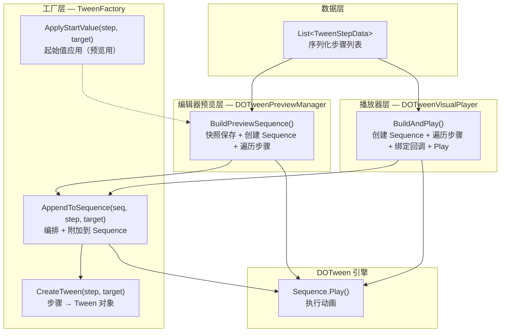
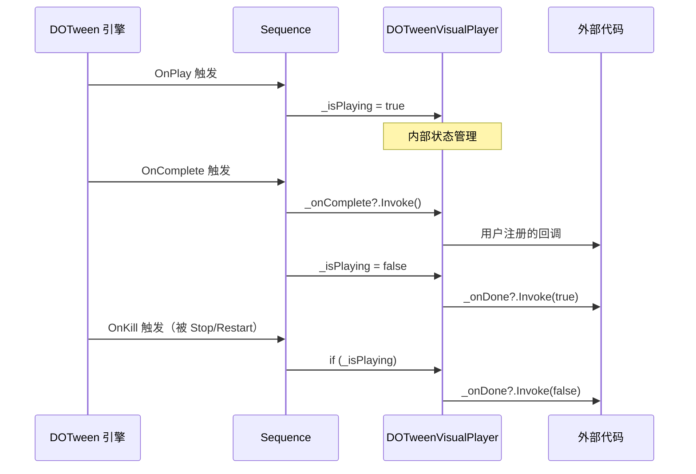
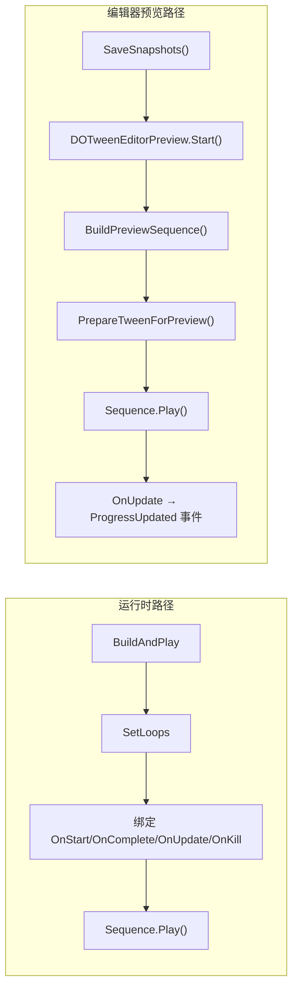

本文深入剖析 DOTween Visual Editor 中从 `TweenStepData` 序列化数据到 DOTween `Sequence` 运行时对象的完整构建流程。内容覆盖 **数据层**（TweenStepData）、**工厂层**（TweenFactory）、**编排层**（ExecutionMode 分发）、**播放器层**（DOTweenVisualPlayer）以及 **编辑器预览层**（DOTweenPreviewManager）五个层次的协作机制，揭示同一套 `TweenFactory` 如何在运行时和编辑器预览两条路径上实现零重复代码的统一 Tween 创建。

Sources: [DOTweenVisualPlayer.cs](Runtime/Components/DOTweenVisualPlayer.cs#L1-L407), [TweenFactory.cs](Runtime/Data/TweenFactory.cs#L1-L432), [DOTweenPreviewManager.cs](Editor/DOTweenPreviewManager.cs#L1-L362)

## 全局架构：五层流水线

Sequence 的构建遵循一条严格的数据流管线——从 Inspector 中编辑的序列化数据出发，经过工厂创建、编排分发、播放器装配，最终产出 DOTween 引擎可执行的 `Sequence` 对象。这条管线的核心设计原则是 **单一创建入口**：所有 Tween 创建逻辑统一收束于 `TweenFactory`，运行时播放器和编辑器预览器均通过同一接口消费。



上图中，`TweenFactory.AppendToSequence` 是整条管线的 **核心枢纽**——它同时承担 Tween 创建（内部调用 `CreateTween`）、缓动配置、执行模式分发和 Sequence 附加四项职责。运行时的 `BuildAndPlay` 和编辑器的 `BuildPreviewSequence` 均以相同的循环结构调用此方法，确保两条路径的行为一致性。

Sources: [DOTweenVisualPlayer.cs — BuildAndPlay](Runtime/Components/DOTweenVisualPlayer.cs#L290-L355), [DOTweenPreviewManager.cs — BuildPreviewSequence](Editor/DOTweenPreviewManager.cs#L236-L243), [TweenFactory.cs — AppendToSequence](Runtime/Data/TweenFactory.cs#L48-L102)

## 第一阶段：数据准备与前置校验

### 步骤启用过滤

Sequence 构建的第一步并非直接创建 Tween，而是 **前置校验**：`BuildAndPlay` 在创建 `Sequence` 之前先遍历所有步骤，检查是否存在至少一个 `IsEnabled == true` 的步骤。如果所有步骤均被禁用，方法直接返回，不产生任何 DOTween 对象。这一设计避免了创建空 Sequence 后再处理无效状态的额外开销。

Sources: [DOTweenVisualPlayer.cs — BuildAndPlay 启用检查](Runtime/Components/DOTweenVisualPlayer.cs#L292-L307)

### 旧 Sequence 清理

校验通过后，`BuildAndPlay` 调用 `KillSequence()` 清理可能存在的旧 Sequence。清理流程的执行顺序至关重要：

1. **标记 `_isPlaying = false`**：先于 `Rewind` 和 `Kill`，防止 DOTween 的 `OnKill` 回调中重复触发 `_onDone`
2. **Rewind**：将所有子 Tween 的目标属性回滚到动画开始前的状态，避免残留在中间帧的属性值（例如位移只走了一半）
3. **Kill**：销毁 Sequence 及所有子 Tween
4. **手动触发 `_onDone?.Invoke(false)`**：不依赖 DOTween 的 `OnKill` 回调，确保外部调用 `Stop` 时 `_onDone` 必然被触发
5. **置空引用**：`_currentSequence = null`

Sources: [DOTweenVisualPlayer.cs — KillSequence](Runtime/Components/DOTweenVisualPlayer.cs#L357-L381)

## 第二阶段：Sequence 创建与步骤遍历

### Sequence 实例化

清理完成后，`BuildAndPlay` 创建新的 DOTween `Sequence` 并将播放器自身设为 Target：

```csharp
_currentSequence = DOTween.Sequence();
_currentSequence.SetTarget(this);
```

`SetTarget(this)` 使得 DOTween 内部将 Sequence 与 `DOTweenVisualPlayer` 的 `MonoBehaviour` 实例关联，当 GameObject 被销毁时 DOTween 可自动回收关联的 Tween，防止悬挂引用。

Sources: [DOTweenVisualPlayer.cs — Sequence 创建](Runtime/Components/DOTweenVisualPlayer.cs#L311-L312)

### 步骤遍历循环

随后的 `foreach` 循环是构建流程的核心：

```csharp
foreach (var step in _steps)
{
    if (!step.IsEnabled) continue;
    TweenFactory.AppendToSequence(_currentSequence, step, transform);
}
```

三个关键点：**二次启用过滤**（`IsEnabled` 检查）、**委托给 TweenFactory**（播放器本身不包含任何 Tween 创建逻辑）、**传入 `transform` 作为默认目标**。当 `TweenStepData.TargetTransform` 为 `null` 时，工厂使用传入的 `defaultTarget`（即播放器所在物体的 Transform），实现「不指定目标时自动作用于自身」的语义。

Sources: [DOTweenVisualPlayer.cs — 步骤遍历](Runtime/Components/DOTweenVisualPlayer.cs#L314-L318)

## 第三阶段：TweenFactory 的双重职责

`TweenFactory` 是一个 `static` 类，提供三个公共方法，分别对应三种使用场景：

| 方法 | 职责 | 调用者 |
|---|---|---|
| `CreateTween(step, target)` | 将单个步骤数据转换为 DOTween Tweener | `AppendToSequence` 内部调用 |
| `AppendToSequence(seq, step, target)` | 创建 Tween + 配置缓动 + 按执行模式附加到 Sequence | `DOTweenVisualPlayer`、`DOTweenPreviewManager` |
| `ApplyStartValue(step, target)` | 将步骤的起始值直接应用到目标物体（预览恢复用） | `DOTweenPreviewManager` |

Sources: [TweenFactory.cs — 公共方法签名](Runtime/Data/TweenFactory.cs#L21-L102)

### AppendToSequence 的分支处理

`AppendToSequence` 内部对 `TweenStepType` 进行三层分支：

**第一层——流程控制类型（Delay / Callback）**：这两种类型不产生 Tween 对象，直接使用 Sequence 的原生 API：

- `Delay` → `sequence.AppendInterval(Mathf.Max(0.001f, step.Duration))`
- `Callback` → `sequence.AppendCallback(() => step.OnComplete?.Invoke())`

Duration 的 `Mathf.Max(0.001f, ...)` 保护是必要的——DOTween 不接受零或负值时长，传入会导致异常。

**第二层——Tween 创建与缓动配置**：对于所有动画类型，调用 `CreateTween` 获取 Tweener 后进行三项配置：

1. **缓动曲线**：当 `UseCustomCurve == true` 且 `CustomCurve != null` 时使用 `AnimationCurve`，否则使用 `Ease` 枚举。**Punch 和 Shake 例外**——它们拥有内置的振荡缓动算法，外部覆盖会破坏效果
2. **延迟**：仅当 `step.Delay > 0` 时设置 `SetDelay`
3. **可回收**：所有 Tween 统一设置 `SetRecyclable(true)`，启用 DOTween 的对象池复用机制

**第三层——执行模式分发**：

```csharp
switch (step.ExecutionMode)
{
    case ExecutionMode.Append:
        sequence.Append(tween);       // 追加到 Sequence 末尾
        break;
    case ExecutionMode.Join:
        sequence.Join(tween);         // 与上一个 Tween 同时开始
        break;
    case ExecutionMode.Insert:
        sequence.Insert(Mathf.Max(0f, step.InsertTime), tween);  // 在指定时间点插入
        break;
}
```

Sources: [TweenFactory.cs — AppendToSequence](Runtime/Data/TweenFactory.cs#L48-L102)

### CreateTween 的类型分发

`CreateTween` 通过 C# 的 `switch` 表达式将 `TweenStepType` 映射到 12 个私有工厂方法，每个方法负责一种动画类型的 DOTween API 调用：

| TweenStepType | 工厂方法 | DOTween API | 特殊处理 |
|---|---|---|---|
| Move | `CreateMoveTween` | `DOMove` / `DOLocalMove` | 坐标空间切换 + IsRelative |
| Rotate | `CreateRotateTween` | `DORotateQuaternion` / `DOLocalRotateQuaternion` | 四元数插值避免万向锁 + IsRelative |
| Scale | `CreateScaleTween` | `DOScale` | IsRelative |
| Color | `CreateColorTween` | `TweenValueHelper.CreateColorTween` | 组件校验 + 多组件适配 |
| Fade | `CreateFadeTween` | `TweenValueHelper.CreateFadeTween` | 组件校验 + 多组件适配 |
| AnchorMove | `CreateAnchorMoveTween` | `DOAnchorPos` | RectTransform 必需检查 |
| SizeDelta | `CreateSizeDeltaTween` | `DOSizeDelta` | RectTransform 必需检查 |
| Jump | `CreateJumpTween` | `DOJump` | 返回 Sequence 而非 Tweener |
| Punch | `CreatePunchTween` | `DOPunchPosition/Rotation/Scale` | PunchTarget 三选一 |
| Shake | `CreateShakeTween` | `DOShakePosition/Rotation/Scale` | ShakeTarget 三选一 |
| FillAmount | `CreateFillAmountTween` | `DOFillAmount` | Image 组件必需 |
| DOPath | `CreateDOPathTween` | `DOPath` | 至少 2 个路径点 |

`Delay` 和 `Callback` 两种类型在 `CreateTween` 的 `switch` 中命中 `_ => null` 分支——它们不创建 Tween，由 `AppendToSequence` 直接处理为 `AppendInterval` 和 `AppendCallback`。

Sources: [TweenFactory.cs — CreateTween 类型分发](Runtime/Data/TweenFactory.cs#L21-L41), [TweenFactory.cs — 各工厂方法实现](Runtime/Data/TweenFactory.cs#L192-L398)

### 起始值应用机制

每个工厂方法在创建 Tween 之前，先检查 `UseStartValue` / `UseStartColor` / `UseStartFloat` 标志。如果启用，则 **先将起始值写入目标物体的属性**，再创建从该起始值到目标值的 Tween。这确保了动画的起点可预测——无论目标物体当前处于什么状态。

例如 `CreateMoveTween` 的处理：

```csharp
if (step.UseStartValue)
{
    ApplyMoveValue(target, step.MoveSpace, step.StartVector);
}
```

`ApplyStartValue` 公共方法提供了相同能力的外部接口，供 `DOTweenPreviewManager` 在预览恢复时使用。

Sources: [TweenFactory.cs — ApplyStartValue](Runtime/Data/TweenFactory.cs#L107-L186), [TweenFactory.cs — CreateMoveTween 起始值](Runtime/Data/TweenFactory.cs#L194-L198)

## 第四阶段：Sequence 配置与回调绑定

步骤遍历完成后，`BuildAndPlay` 对 Sequence 进行全局配置和回调绑定。这个阶段的执行顺序不可随意调换——**`SetLoops` 必须先于回调绑定**，因为 DOTween 在循环模式下会复用回调列表。

### 循环配置

```csharp
_currentSequence.SetLoops(_loops, _loopType);
```

`_loops` 默认为 `1`（单次播放），设为 `-1` 时无限循环。`_loopType` 支持 `Restart`、`Yoyo`、`Incremental` 三种 DOTween 原生循环类型。

### 回调绑定策略

回调绑定采用 **事件转发模式**：DOTween 的 `OnComplete`、`OnStart`、`OnUpdate` 等回调内部触发播放器自身的事件字段，外部通过链式 API（`OnStart(callback)`、`OnComplete(callback)`）订阅。



**OnComplete 与 OnKill 的双重保险**：`OnComplete` 处理正常播放完成的场景（`_onDone(true)`），`OnKill` 处理被手动终止的场景（`_onDone(false)`）。`OnKill` 内部的 `if (_isPlaying)` 检查避免了与 `KillSequence` 中的手动 `_onDone` 调用发生重复触发。

Sources: [DOTweenVisualPlayer.cs — 回调绑定](Runtime/Components/DOTweenVisualPlayer.cs#L320-L354)

## 第五阶段：生命周期管理

Sequence 构建完成并调用 `Play()` 后进入运行时生命周期。播放器提供了完整的生命周期控制 API，每个方法都正确维护 `_isPlaying` 状态标志：

| API | 行为 | 状态变更 |
|---|---|---|
| `Play()` | 构建并播放（已播放中则忽略） | `_isPlaying = true`（由 OnPlay 回调设置） |
| `PlayAsync()` | 同 Play，但返回 `TweenAwaitable` 包装器 | 同上 |
| `Pause()` | 暂停 Sequence | 保持当前 `_isPlaying` |
| `Resume()` | 恢复播放 | 保持当前 `_isPlaying` |
| `Stop()` | Kill Sequence + Rewind 回滚属性 | `_isPlaying = false` |
| `Restart()` | Stop → Play | 先 false 后 true |
| `Complete()` | 跳到 Sequence 末尾 | `_isPlaying = false`（由 OnComplete 回调设置） |

`OnDisable` 和 `OnDestroy` 的 Unity 生命周期钩子确保了即使 GameObject 被禁用或销毁，Sequence 也能被正确清理——`OnDisable` 暂停播放，`OnDestroy` 终止并销毁 Sequence。

Sources: [DOTweenVisualPlayer.cs — 公共 API](Runtime/Components/DOTweenVisualPlayer.cs#L137-L230), [DOTweenVisualPlayer.cs — Unity 生命周期](Runtime/Components/DOTweenVisualPlayer.cs#L109-L135)

## 编辑器预览路径：同源构建与快照恢复

编辑器预览通过 `DOTweenPreviewManager.BuildPreviewSequence` 走过与运行时 **完全相同的构建路径**：

```csharp
private void BuildPreviewSequence()
{
    foreach (var step in _targetPlayer.Steps)
    {
        if (!step.IsEnabled) continue;
        TweenFactory.AppendToSequence(_previewSequence, step, _targetPlayer.transform);
    }
}
```

两者的差异不在于 Sequence 构建，而在于 **周边设施**：



**快照系统**：预览启动前，`SaveSnapshots` 为播放器所在物体及所有被 `TargetTransform` 引用的外部物体保存完整的属性快照（Position、Rotation、Scale、Color、Alpha、AnchoredPosition、SizeDelta、FillAmount）。预览结束后通过 `RestoreSnapshots` 配合 `Undo.RecordObject` 恢复到编辑前状态。

**Rewind 防残留**：预览的 `CleanupSequence` 和运行时的 `KillSequence` 都采用相同的 **Rewind → Kill** 两步清理策略。`Rewind` 回滚属性到动画起始值，避免 Kill 后目标停留在动画中间帧。

Sources: [DOTweenPreviewManager.cs — StartPreview](Editor/DOTweenPreviewManager.cs#L108-L161), [DOTweenPreviewManager.cs — BuildPreviewSequence](Editor/DOTweenPreviewManager.cs#L236-L243), [DOTweenPreviewManager.cs — SaveSnapshots](Editor/DOTweenPreviewManager.cs#L249-L298), [DOTweenPreviewManager.cs — RestoreSnapshots](Editor/DOTweenPreviewManager.cs#L301-L338)

## ExecutionMode 编排的时间轴语义

三种执行模式决定了 Tween 在 Sequence 时间轴上的放置方式。理解其语义差异对于编排复杂动画至关重要：

| 模式 | DOTween API | 时间轴行为 | 典型场景 |
|---|---|---|---|
| **Append** | `sequence.Append(tween)` | 紧接上一个 Tween 结束后开始 | 顺序播放的动画链 |
| **Join** | `sequence.Join(tween)` | 与上一个 Tween **同时**开始 | 同时移动+旋转+缩放 |
| **Insert** | `sequence.Insert(time, tween)` | 在 Sequence 的绝对时间点插入 | 背景音乐在 2 秒时触发、延迟出现的 UI 元素 |

一个常见的编排模式是「第一个步骤 Append，后续相关步骤 Join」——这样一组动画同步执行，下一组动画等上一组完成后再开始。

Sources: [ExecutionMode.cs](Runtime/Data/ExecutionMode.cs#L1-L15), [TweenFactory.cs — 执行模式分发](Runtime/Data/TweenFactory.cs#L90-L101)

## 设计决策总结

整个 Sequence 构建流程体现了几个关键的架构决策：

**1. 工厂模式统一入口**：`TweenFactory` 作为唯一的 Tween 创建点，消除了运行时与编辑器预览之间的代码重复。任何 Tween 创建逻辑的修改只需在一处进行。

**2. 数据驱动的分支策略**：`TweenStepType` 枚举驱动所有分支——从 `CreateTween` 的类型映射到 `AppendToSequence` 的特殊类型处理再到 `ApplyStartValue` 的属性应用。新增动画类型只需扩展枚举和对应的工厂方法。

**3. 防御性时长保护**：所有 `CreateXxxTween` 方法中 `duration = Mathf.Max(0.001f, step.Duration)` 确保 DOTween 永远不会收到零或负值时长。Delay 同理使用 `Mathf.Max(0.001f, ...)`。

**4. Rewind-Before-Kill 清理范式**：无论是运行时 `KillSequence` 还是编辑器 `CleanupSequence`，都先 `Rewind` 再 `Kill`，保证目标物体属性不会残留在动画中间值。

**5. 回调所有权隔离**：播放器通过内部事件字段（`_onStart`、`_onComplete`）转发 DOTween 的 Sequence 回调，外部代码无法直接访问 Sequence 对象，`PlayAsync` 返回的 `TweenAwaitable` 更是只暴露只读观察接口。这种封装确保了 Sequence 生命周期完全由播放器控制。

Sources: [TweenFactory.cs](Runtime/Data/TweenFactory.cs#L1-L432), [DOTweenVisualPlayer.cs — KillSequence](Runtime/Components/DOTweenVisualPlayer.cs#L357-L381), [TweenAwaitable.cs](Runtime/Components/TweenAwaitable.cs#L1-L95)

## 延伸阅读

- **TweenFactory 工厂模式的完整 API 设计**：[TweenFactory 工厂模式：统一运行时与编辑器预览的 Tween 创建](8-tweenfactory-gong-han-mo-shi-tong-yun-xing-shi-yu-bian-ji-qi-yu-lan-de-tween-chuang-jian)
- **播放器组件的生命周期管理**：[DOTweenVisualPlayer 播放器组件：生命周期与播放控制](6-dotweenvisualplayer-bo-fang-qi-zu-jian-sheng-ming-zhou-qi-yu-bo-fang-kong-zhi)
- **执行模式的编排策略**：[ExecutionMode 执行模式：Append / Join / Insert 编排策略](12-executionmode-zhi-xing-mo-shi-append-join-insert-bian-pai-ce-lue)
- **编辑器预览的完整流程**：[预览系统（DOTweenPreviewManager）：快照保存、状态管理与编辑器预览一致性](15-yu-lan-xi-tong-dotweenpreviewmanager-kuai-zhao-bao-cun-zhuang-tai-guan-li-yu-bian-ji-qi-yu-lan-zhi-xing)
- **数据结构的字段设计**：[TweenStepData 数据结构：多值组设计模式](7-tweenstepdata-shu-ju-jie-gou-duo-zhi-zu-she-ji-mo-shi)
- **测试中的 ManualUpdate 同步驱动**：[Runtime 测试策略：DOTween.ManualUpdate 同步驱动模式](20-runtime-ce-shi-ce-lue-dotween-manualupdate-tong-bu-qu-dong-mo-shi)