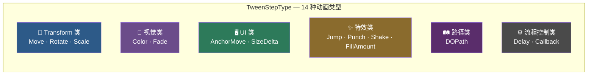
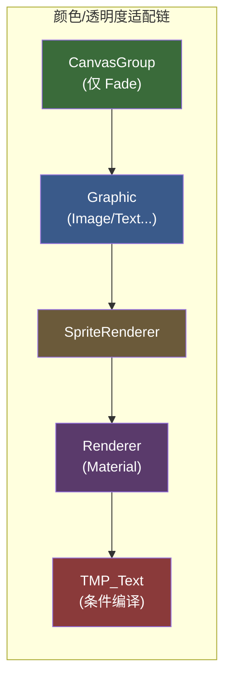
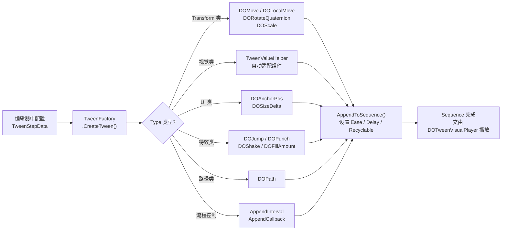

DOTween Visual Editor 通过 **TweenStepType 枚举**定义了 14 种动画步骤类型，覆盖了从基础位移到路径运动、从颜色渐变到流程控制的完整动画需求。每一种类型在编辑器中拥有独立的参数面板，在运行时由 `TweenFactory` 自动映射为对应的 DOTween API 调用。本文将按功能分类逐一拆解每种类型的**用途、参数、组件依赖与底层 DOTween 映射**，帮助你在配置动画时做出正确的类型选择。

Sources: [TweenStepType.cs](Runtime/Data/TweenStepType.cs#L1-L48)

## 六大分类总览

14 种动画类型按照功能域划分为六个分类。理解这个分类结构是掌握整个动画系统的第一步——不同分类意味着不同的值参数组、不同的组件依赖校验逻辑，以及不同的编辑器字段渲染策略。

每个分类共享同一组"值参数"（如 Transform 类共享 `StartVector` / `TargetVector` / `IsRelative`），但各自拥有独特的配置字段（如 Move 有 `MoveSpace`，Rotate 有 `RotateSpace`）。这个设计称为**多值组模式**——所有类型的字段都定义在同一个 `TweenStepData` 类中，编辑器根据 `Type` 字段的值决定显示哪些字段。

Sources: [TweenStepType.cs](Runtime/Data/TweenStepType.cs#L8-L47), [TweenStepData.cs](Runtime/Data/TweenStepData.cs#L1-L177)

## 完整参数对照表

下表汇总了 14 种类型各自使用的参数字段，以及运行时所需的组件依赖。**✅** 表示该类型使用此参数，**—** 表示不使用。

| 动画类型 | 值参数组 | 起始值字段 | 目标值字段 | 特有参数 | 组件依赖 | 支持 IsRelative |
|---------|---------|-----------|-----------|---------|---------|:----:|
| **Move** | Transform | StartVector | TargetVector | MoveSpace | Transform（无额外需求） | ✅ |
| **Rotate** | Transform | StartVector | TargetVector | RotateSpace | Transform（无额外需求） | ✅ |
| **Scale** | Transform | StartVector | TargetVector | — | Transform（无额外需求） | ✅ |
| **Color** | Color | StartColor | TargetColor | — | Graphic / Renderer / SpriteRenderer / TMP_Text | — |
| **Fade** | Float | StartFloat | TargetFloat | — | CanvasGroup / Graphic / Renderer / SpriteRenderer / TMP_Text | — |
| **AnchorMove** | Transform | StartVector | TargetVector | — | RectTransform | ✅ |
| **SizeDelta** | Transform | StartVector | TargetVector | — | RectTransform | ✅ |
| **Jump** | Transform | StartVector | TargetVector | JumpHeight, JumpNum | Transform（无额外需求） | — |
| **Punch** | 特效 | — | — | PunchTarget, Intensity, Vibrato, Elasticity | Transform（无额外需求） | — |
| **Shake** | 特效 | — | — | ShakeTarget, Intensity, Vibrato, Elasticity, ShakeRandomness | Transform（无额外需求） | — |
| **FillAmount** | Float | StartFloat | TargetFloat | — | Image | — |
| **DOPath** | 路径 | StartVector | — | PathWaypoints, PathType, PathMode, PathResolution | Transform（无额外需求） | — |
| **Delay** | — | — | — | Duration（作为间隔时长） | 无 | — |
| **Callback** | — | — | — | OnComplete（UnityEvent） | 无 | — |

> **注意**：所有类型都共享 `Duration`（时长）、`Delay`（延迟）、`Ease`（缓动曲线）和 `ExecutionMode`（执行模式）这四个通用参数，但 Punch / Shake 不使用 Ease（内置振荡缓动），Delay / Callback 不创建 Tween 对象。

Sources: [TweenStepData.cs](Runtime/Data/TweenStepData.cs#L29-L168), [TweenStepRequirement.cs](Runtime/Data/TweenStepRequirement.cs#L32-L84), [TweenFactory.cs](Runtime/Data/TweenFactory.cs#L26-L41)

---

## 🔹 Transform 类：Move / Rotate / Scale

这是最基础、使用频率最高的三个动画类型，它们操作 Unity Transform 组件的核心属性——位置、旋转和缩放。

### Move — 移动动画

**Move** 类型通过 `DOMove` 或 `DOLocalMove` 将物体从起始位置平滑移动到目标位置。你可以通过 `MoveSpace` 参数选择**世界坐标**（World）或**本地坐标**（Local）。当勾选 `IsRelative` 时，`TargetVector` 将被解释为相对于当前位置的偏移量而非绝对坐标。

**关键参数**：
- **MoveSpace**：`World`（操控 `position`）或 `Local`（操控 `localPosition`）
- **StartVector**：起始位置（仅当 `UseStartValue = true` 时生效）
- **TargetVector**：目标位置
- **IsRelative**：是否为相对偏移

**底层映射**：`MoveSpace.Local` → `target.DOLocalMove(TargetVector, duration)`，`MoveSpace.World` → `target.DOMove(TargetVector, duration)`。若 `IsRelative = true`，则追加 `tween.SetRelative(true)`。

Sources: [TweenStepType.cs](Runtime/Data/TweenStepType.cs#L10), [TweenFactory.cs](Runtime/Data/TweenFactory.cs#L192-L211)

### Rotate — 旋转动画

**Rotate** 类型始终使用**四元数插值**（`DORotateQuaternion` / `DOLocalRotateQuaternion`），这可以有效避免欧拉角带来的万向锁问题。在编辑器中你以欧拉角（度数）输入，`TweenFactory` 内部会自动转换为四元数。

**关键参数**：
- **RotateSpace**：`World`（操控 `rotation`）或 `Local`（操控 `localRotation`）
- **StartVector**：起始旋转（欧拉角，内部转四元数）
- **TargetVector**：目标旋转（欧拉角，内部转四元数）
- **IsRelative**：是否为相对旋转（相对模式下，目标四元数 = 起始四元数 × 目标四元数）

**底层映射**：通过 `Quaternion.Euler()` 将欧拉角转为四元数后调用 `DORotateQuaternion`。相对模式下使用 `startQuat * targetQuat` 的乘法组合。

Sources: [TweenStepType.cs](Runtime/Data/TweenStepType.cs#L12), [TweenFactory.cs](Runtime/Data/TweenFactory.cs#L213-L243)

### Scale — 缩放动画

**Scale** 类型操作 `localScale`，是最简单的 Transform 动画。它没有坐标空间选项（缩放只有本地空间），但支持 `IsRelative` 相对缩放。

**关键参数**：
- **StartVector**：起始缩放值
- **TargetVector**：目标缩放值（如 `(2, 2, 2)` 表示放大到两倍）
- **IsRelative**：是否为相对缩放

**底层映射**：`target.DOScale(TargetVector, duration)`。

Sources: [TweenStepType.cs](Runtime/Data/TweenStepType.cs#L14), [TweenFactory.cs](Runtime/Data/TweenFactory.cs#L245-L257)

---

## 🎨 视觉类：Color / Fade

视觉类动画通过 `TweenValueHelper` 实现了**多组件自动适配**——系统会按优先级依次检测目标物体上的组件类型，自动选择对应的 DOTween API。这意味着同一个 Color 步骤可以作用于 UI 图片、3D 渲染器、精灵或 TMP 文本，无需手动区分。

Sources: [TweenValueHelper.cs](Runtime/Data/TweenValueHelper.cs#L1-L291)

### Color — 颜色动画

**Color** 类型将物体颜色从起始色平滑过渡到目标色。系统按 **Graphic → SpriteRenderer → Renderer(Material) → TMP_Text** 的优先级检测组件，找到第一个有效组件后调用其 `DOColor` 方法。

**关键参数**：
- **UseStartColor**：是否使用自定义起始颜色（默认使用物体当前颜色）
- **StartColor**：起始颜色
- **TargetColor**：目标颜色

**组件依赖**：需要目标物体挂载 `Graphic`、`Renderer`、`SpriteRenderer` 或 `TMP_Text` 组件之一。若均不满足，`TweenStepRequirement.Validate` 会返回错误提示。

**底层映射**：`TweenValueHelper.CreateColorTween()` → 自动匹配 `graphic.DOColor()` / `spriteRenderer.DOColor()` / `renderer.material.DOColor()` / `tmpText.DOColor()`。

Sources: [TweenStepType.cs](Runtime/Data/TweenStepType.cs#L18), [TweenFactory.cs](Runtime/Data/TweenFactory.cs#L263-L274), [TweenValueHelper.cs](Runtime/Data/TweenValueHelper.cs#L111-L141)

### Fade — 透明度动画

**Fade** 类型专门控制物体的透明度（Alpha 通道值，范围 0~1）。它与 Color 的区别在于：Fade 额外支持 `CanvasGroup` 组件（可以实现整个 UI 面板的淡入淡出），且只修改 alpha 值而不影响 RGB 通道。

**关键参数**：
- **UseStartFloat**：是否使用自定义起始透明度
- **StartFloat**：起始透明度（0~1）
- **TargetFloat**：目标透明度（0~1）

**组件依赖**：需要 `CanvasGroup`、`Graphic`、`Renderer`、`SpriteRenderer` 或 `TMP_Text` 组件之一。

**底层映射**：`TweenValueHelper.CreateFadeTween()` → 自动匹配 `canvasGroup.DOFade()` / `graphic.DOFade()` / `spriteRenderer.DOFade()` / `renderer.material.DOFade()` / `tmpText.DOFade()`。

Sources: [TweenStepType.cs](Runtime/Data/TweenStepType.cs#L20), [TweenFactory.cs](Runtime/Data/TweenFactory.cs#L276-L287), [TweenValueHelper.cs](Runtime/Data/TweenValueHelper.cs#L251-L287)

---

## 🖥️ UI 类：AnchorMove / SizeDelta

UI 类动画专门服务于 Unity UI 系统，操作的是 `RectTransform` 的属性。它们要求目标物体必须是 UI 元素（拥有 `RectTransform` 组件），如果校验不通过，编辑器会显示警告信息。

### AnchorMove — UI 锚点移动

**AnchorMove** 类型通过 `DOAnchorPos` 平滑移动 UI 元素的锚点位置。这是实现 UI 弹窗滑入、按钮位移动效的首选类型。

**关键参数**：
- **StartVector**：起始锚点位置（Vector2 语义，z 分量忽略）
- **TargetVector**：目标锚点位置
- **IsRelative**：是否为相对偏移

**底层映射**：`rectTransform.DOAnchorPos(TargetVector, duration)`。

Sources: [TweenStepType.cs](Runtime/Data/TweenStepType.cs#L24), [TweenFactory.cs](Runtime/Data/TweenFactory.cs#L293-L307)

### SizeDelta — UI 尺寸动画

**SizeDelta** 类型通过 `DOSizeDelta` 控制 RectTransform 的尺寸变化，适用于展开/折叠面板、进度条伸缩等 UI 尺寸动效。

**关键参数**：
- **StartVector**：起始尺寸
- **TargetVector**：目标尺寸
- **IsRelative**：是否为相对尺寸变化

**底层映射**：`rectTransform.DOSizeDelta(TargetVector, duration)`。

Sources: [TweenStepType.cs](Runtime/Data/TweenStepType.cs#L26), [TweenFactory.cs](Runtime/Data/TweenFactory.cs#L309-L323)

---

## ✨ 特效类：Jump / Punch / Shake / FillAmount

特效类提供了一些更复杂的动画效果，它们有独特的参数（如弹性、振动次数）和特殊的缓动行为。

### Jump — 跳跃移动

**Jump** 类型让物体以抛物线弧度跳向目标位置，是制作角色跳跃、弹窗弹入等效果的最佳选择。它返回的是一个 `Sequence`（而非 `Tweener`），因为跳跃内部包含多段运动。

**关键参数**：
- **StartVector**：起始位置（世界坐标）
- **TargetVector**：目标落点位置（世界坐标）
- **JumpHeight**：跳跃高度（每次跳跃的最大高度）
- **JumpNum**：跳跃次数（最小为 1）

**底层映射**：`target.DOJump(TargetVector, JumpHeight, JumpNum, duration)`。

Sources: [TweenStepType.cs](Runtime/Data/TweenStepType.cs#L30), [TweenFactory.cs](Runtime/Data/TweenFactory.cs#L329-L338)

### Punch — 冲击弹性

**Punch** 类型产生一种"冲击后回弹"的效果——物体朝指定方向猛冲后弹性地回到原位。它可以通过 `PunchTarget` 选择冲击**位置**、**旋转**或**缩放**。

**关键参数**：
- **PunchTarget**：冲击方向，`Position`（位移冲击）/ `Rotation`（旋转冲击）/ `Scale`（缩放冲击）
- **Intensity**：冲击强度（Vector3，每个轴可独立控制）
- **Vibrato**：弹性振荡次数（默认 10，最小 1）
- **Elasticity**：回弹程度（0~1，1 表示完全弹性回弹）

**⚠️ 特别注意**：Punch 类型**不使用 Ease 缓动**（它有内置的弹性振荡曲线），因此编辑器中不会显示缓动设置。

**底层映射**：
- `PunchTarget.Position` → `target.DOPunchPosition(Intensity, duration, vibrato, elasticity)`
- `PunchTarget.Rotation` → `target.DOPunchRotation(Intensity, duration, vibrato, elasticity)`
- `PunchTarget.Scale` → `target.DOPunchScale(Intensity, duration, vibrato, elasticity)`

Sources: [TweenStepType.cs](Runtime/Data/TweenStepType.cs#L32), [TweenFactory.cs](Runtime/Data/TweenFactory.cs#L340-L352)

### Shake — 震动

**Shake** 类型让物体产生随机方向的震动效果，常用于受击反馈、屏幕抖动等场景。与 Punch 不同，Shake 的震动方向是随机的。它同样通过 `ShakeTarget` 选择震动**位置**、**旋转**或**缩放**。

**关键参数**：
- **ShakeTarget**：震动属性，`Position` / `Rotation` / `Scale`
- **Intensity**：震动强度（Vector3）
- **Vibrato**：振动次数（默认 10）
- **Elasticity**：回弹程度（0~1）
- **ShakeRandomness**：随机性角度（0~90，值越大方向越随机）

**⚠️ 特别注意**：与 Punch 相同，Shake **不使用 Ease 缓动**。

**底层映射**：
- `ShakeTarget.Position` → `target.DOShakePosition(duration, Intensity, vibrato, randomness)`
- `ShakeTarget.Rotation` → `target.DOShakeRotation(duration, Intensity, vibrato, randomness)`
- `ShakeTarget.Scale` → `target.DOShakeScale(duration, Intensity, vibrato, randomness)`

Sources: [TweenStepType.cs](Runtime/Data/TweenStepType.cs#L34), [TweenFactory.cs](Runtime/Data/TweenFactory.cs#L354-L366)

### FillAmount — 填充量动画

**FillAmount** 类型专门控制 `Image` 组件的 `fillAmount` 属性（0~1），是制作圆形进度条、血条、能量条等 UI 填充效果的专用类型。

**关键参数**：
- **UseStartFloat**：是否使用自定义起始填充量
- **StartFloat**：起始填充量（0~1）
- **TargetFloat**：目标填充量（0~1）

**组件依赖**：严格要求目标物体挂载 `Image` 组件（需设置 `Image Type = Filled`）。

**底层映射**：`image.DOFillAmount(TargetFloat, duration)`。

Sources: [TweenStepType.cs](Runtime/Data/TweenStepType.cs#L36), [TweenFactory.cs](Runtime/Data/TweenFactory.cs#L368-L381)

---

## 🛤️ 路径类：DOPath

### DOPath — 路径移动动画

**DOPath** 类型让物体沿一条由多个路径点定义的曲线移动。它支持三种路径插值算法和三种空间维度模式，能够实现复杂的巡游、轨迹飞行动画。

**关键参数**：
- **StartVector**：起始位置（世界坐标）
- **PathWaypoints**：路径点数组（至少需要 2 个点）
- **PathType**：路径插值算法，`0 = Linear`（直线）/ `1 = CatmullRom`（曲线）/ `2 = CubicBezier`（贝塞尔）
- **PathMode**：空间模式，`0 = 3D` / `1 = TopDown2D` / `2 = SideScroll2D`
- **PathResolution**：CatmullRom 曲线分辨率（每段曲线的插值点数）
- **PathGizmoColor**：编辑器中路径可视化颜色（仅调试用）

**底层映射**：`target.DOPath(PathWaypoints, duration, pathType, pathMode, PathResolution)`。

Sources: [TweenStepType.cs](Runtime/Data/TweenStepType.cs#L40), [TweenFactory.cs](Runtime/Data/TweenFactory.cs#L383-L397)

---

## ⚙️ 流程控制类：Delay / Callback

流程控制类是唯一不创建 Tween 对象的两种类型。它们不操作任何视觉属性，而是在 Sequence 时间线中插入**时间间隔**或**回调调用**，用于编排动画节奏和触发逻辑。

### Delay — 延迟等待

**Delay** 类型在 Sequence 中插入一段空等时间，用于在前后动画步骤之间制造间隔。它只有一个有效参数 `Duration`（等待秒数），不使用目标物体、不使用缓动曲线。

**底层映射**：`sequence.AppendInterval(duration)`。

Sources: [TweenStepType.cs](Runtime/Data/TweenStepType.cs#L44), [TweenFactory.cs](Runtime/Data/TweenFactory.cs#L51-L54)

### Callback — 回调调用

**Callback** 类型在 Sequence 的对应时间点触发一个 `UnityEvent`，用于在动画序列中插入自定义逻辑（如播放音效、启用/禁用物体、触发游戏事件等）。

**关键参数**：
- **OnComplete**：UnityEvent 回调，在 Sequence 执行到该步骤时被调用

**底层映射**：`sequence.AppendCallback(() => OnComplete?.Invoke())`。

> **注意**：Callback 复用了 `TweenStepData.OnComplete` 字段作为回调容器。在其他动画类型中，`OnComplete` 表示该步骤完成后的回调；而在 Callback 类型中，它本身就是被调用的内容。

Sources: [TweenStepType.cs](Runtime/Data/TweenStepType.cs#L46), [TweenFactory.cs](Runtime/Data/TweenFactory.cs#L57-L62), [TweenStepData.cs](Runtime/Data/TweenStepData.cs#L170-L175)

---

## 所有类型共享的通用参数

无论选择哪种动画类型，以下参数对所有类型（Delay 除外）通用：

| 参数 | 类型 | 说明 |
|------|------|------|
| **IsEnabled** | bool | 是否启用此步骤（禁用后该步骤在构建时被跳过） |
| **Duration** | float | 动画时长（秒），最小值 0.001 |
| **Delay** | float | 步骤延迟（秒），在步骤开始前等待 |
| **Ease** | Ease | 缓动类型，默认 `OutQuad` |
| **UseCustomCurve** | bool | 是否使用自定义 AnimationCurve 替代 Ease |
| **CustomCurve** | AnimationCurve | 自定义缓动曲线 |
| **TargetTransform** | Transform | 目标物体（null 时使用组件所在物体） |
| **ExecutionMode** | ExecutionMode | 执行模式：Append / Join / Insert |
| **InsertTime** | float | Insert 模式下的插入时间点 |
| **OnComplete** | UnityEvent | 步骤完成后触发的回调 |

Sources: [TweenStepData.cs](Runtime/Data/TweenStepData.cs#L15-L175)

---

## 组件依赖校验速查表

在运行时构建 Sequence 之前，`TweenStepRequirement.Validate()` 会对目标物体进行组件能力校验。下表清晰列出了每种类型的依赖关系：

| 分类 | 动画类型 | 组件依赖 | 校验失败提示 |
|------|---------|---------|------------|
| Transform | Move / Rotate / Scale / Jump / Punch / Shake / DOPath | **Transform**（任何 GameObject 均满足） | — |
| 视觉 | Color | Graphic / Renderer / SpriteRenderer / TMP_Text | "该物体不包含可着色组件" |
| 视觉 | Fade | CanvasGroup / Graphic / Renderer / SpriteRenderer / TMP_Text | "该物体不包含可透明组件" |
| UI | AnchorMove / SizeDelta | RectTransform | "该物体不是 UI 物体" |
| 特效 | FillAmount | Image | "该物体不包含 Image 组件" |
| 流程 | Delay / Callback | **无**（不操作任何物体） | — |

Sources: [TweenStepRequirement.cs](Runtime/Data/TweenStepRequirement.cs#L22-L84)

---

## 从类型选择到动画播放的完整流程

当你选择一个 TweenStepType 并配置好参数后，系统内部发生了什么？以下是简化版的数据流转全链路：

Sources: [TweenFactory.cs](Runtime/Data/TweenFactory.cs#L21-L102)

---

## 下一步阅读

理解了 14 种动画类型的参数和用途后，建议按以下顺序深入：

1. **[编辑器窗口使用指南](4-bian-ji-qi-chuang-kou-shi-yong-zhi-nan)** — 学习如何在可视化编辑器中实际配置这些动画步骤
2. **[TweenStepData 数据结构：多值组设计模式](7-tweenstepdata-shu-ju-jie-gou-duo-zhi-zu-she-ji-mo-shi)** — 深入理解所有类型共享一个数据类的架构设计
3. **[ExecutionMode 执行模式：Append / Join / Insert 编排策略](12-executionmode-zhi-xing-mo-shi-append-join-insert-bian-pai-ce-lue)** — 掌握多步骤动画的时间编排技巧
4. **[TweenValueHelper 值访问层：多组件适配策略](9-tweenvaluehelper-zhi-fang-wen-ceng-duo-zu-jian-gua-pei-ce-lue-graphic-renderer-spriterenderer-tmp)** — 深入理解 Color / Fade 的多组件自动适配机制