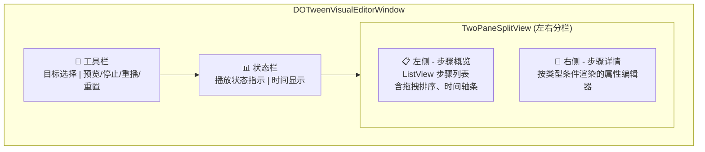
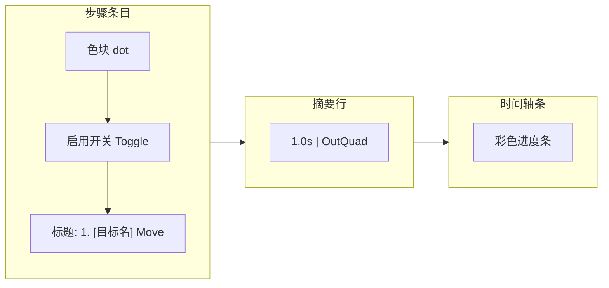
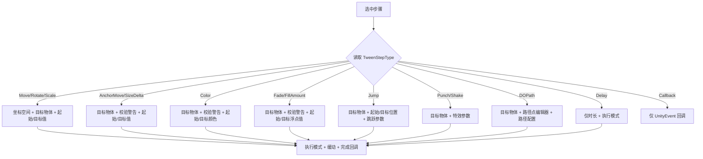
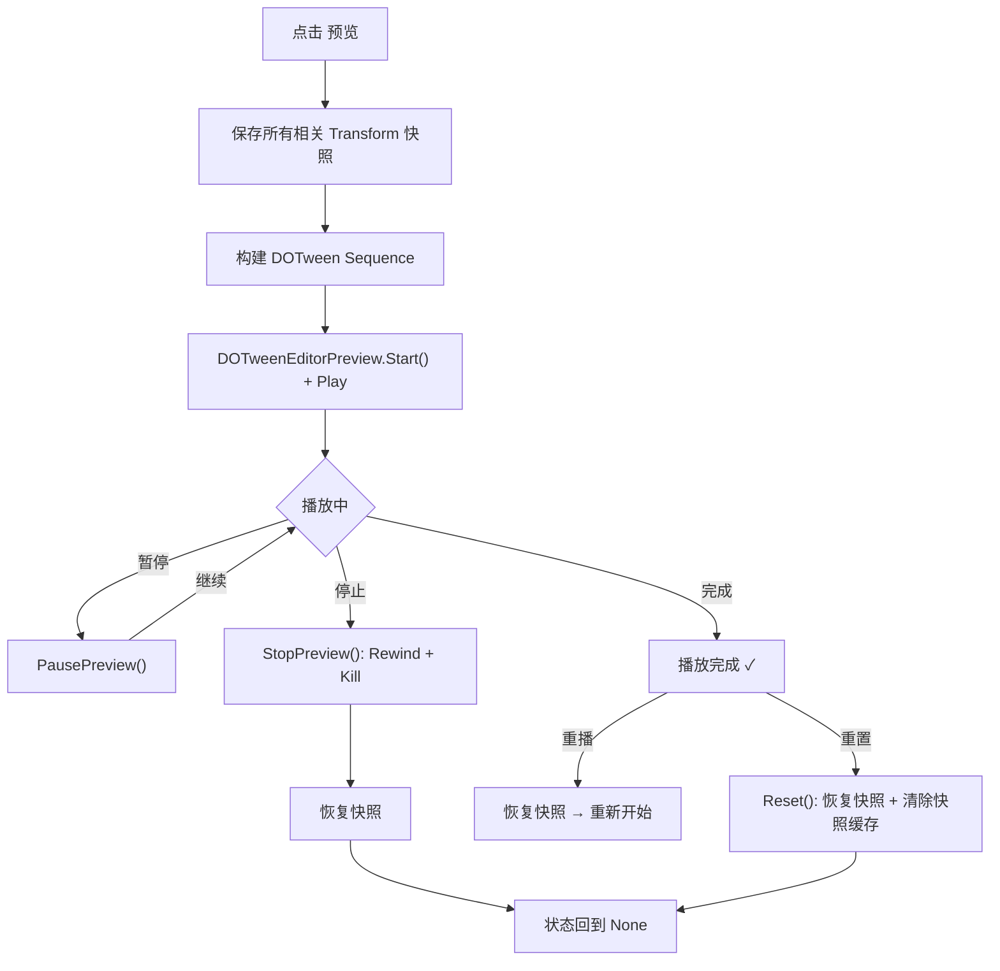

DOTween Visual Editor 的可视化编辑器窗口（`DOTweenVisualEditorWindow`）是你编排动画序列的核心工作区。它提供了一套完整的所见即所得工作流——从选择目标播放器、添加动画步骤、配置参数，到实时预览效果，全部在同一窗口内闭环完成。本文将按实际操作顺序，逐一讲解窗口各区域的功能与用法。

Sources: [DOTweenVisualEditorWindow.cs](Editor/DOTweenVisualEditorWindow.cs#L19-L27)

## 打开编辑器窗口

通过 Unity 菜单栏 **Tools → DOTween Visual Editor** 打开窗口。窗口最小尺寸为 600×400 像素，建议在 1920×1080 或更高分辨率下使用，以获得最佳的双栏布局体验。

```
[MenuItem("Tools/DOTween Visual Editor")]
```

Sources: [DOTweenVisualEditorWindow.cs](Editor/DOTweenVisualEditorWindow.cs#L101-L107)

## 窗口布局总览

编辑器窗口采用经典的**顶部工具栏 + 状态栏 + 左右双栏**布局，整体结构如下：



| 区域 | 功能 | 核心控件 |
|------|------|----------|
| **工具栏** | 选择目标播放器、控制预览 | ObjectField + 4 个操作按钮 |
| **状态栏** | 显示当前播放状态与经过时间 | stateLabel + timeLabel |
| **左侧面板** | 步骤列表概览，支持拖拽排序 | ListView（reorderable） |
| **右侧面板** | 选中步骤的详细属性编辑 | ScrollView 动态字段 |

左侧面板最小宽度 220px，右侧面板自适应剩余空间，分栏拖拽条可自由调整比例。

Sources: [DOTweenVisualEditorWindow.cs](Editor/DOTweenVisualEditorWindow.cs#L287-L421)

## 工具栏详解

### 目标物体选择

工具栏左侧的 **ObjectField** 用于拖入场景中的 `DOTweenVisualPlayer` 组件所在 GameObject。选择目标后，编辑器会自动绑定该组件的 `SerializedObject`，加载其步骤列表数据。切换目标时，若当前正在预览，会自动停止预览以避免状态冲突。

Sources: [DOTweenVisualEditorWindow.cs](Editor/DOTweenVisualEditorWindow.cs#L229-L260)

### 预览控制按钮

工具栏右侧提供四个预览控制按钮，其可用状态会根据当前预览阶段动态变化：

| 按钮 | 功能 | 可用条件 |
|------|------|----------|
| **预览 / 暂停 / 继续** | 开始播放、暂停播放、恢复播放 | 有步骤且未完成 |
| **停止** | 停止预览并恢复初始状态 | 正在播放或已暂停 |
| **重播** | 从头重新播放 | 播放完成后 |
| **重置** | 停止播放、恢复初始状态并清除快照 | 播放完成后 |

**预览按钮是三态切换**：未播放时显示"预览"（点击开始播放），播放中显示"暂停"（点击暂停），暂停后显示"继续"（点击恢复播放）。播放完成后该按钮禁用，此时使用"重播"按钮重新开始。

Sources: [DOTweenVisualEditorWindow.cs](Editor/DOTweenVisualEditorWindow.cs#L1882-L2003)

### 状态栏

状态栏位于工具栏下方，左侧显示播放状态指示灯，右侧显示经过时间：

| 状态 | 显示文本 | 指示灯颜色 |
|------|----------|------------|
| None | ● 未播放 | 灰色 `rgb(153,153,153)` |
| Playing | ● 播放中 | 绿色 `rgb(77,204,77)` |
| Paused | ● 已暂停 | 橙色 `rgb(255,179,0)` |
| Completed | ● 播放完成 | 蓝色 `rgb(77,153,255)` |

时间显示格式为 `MM:SS.s / MM:SS.s`（当前时间 / 总时长），每帧实时更新。

Sources: [DOTweenVisualEditorWindow.cs](Editor/DOTweenVisualEditorWindow.cs#L2005-L2030)

## 步骤列表（左侧面板）

### 列表项结构

每个步骤在左侧列表中占据一个条目，由以下视觉元素组成：



- **类型色块**：左侧小圆点，颜色根据执行模式（Append/Join/Insert）自动设定
- **启用开关**：Toggle 控件，取消勾选后该步骤在播放时会被跳过，条目变为半透明（opacity 0.45）
- **标题**：格式为 `序号. [目标物体名] 动画类型名`，如 `1. [Canvas] Fade`
- **删除按钮**：悬停时变红的 ✕ 按钮
- **摘要行**：显示时长和缓动曲线，如 `1.0s | OutQuad`
- **时间轴条**：按比例展示该步骤在整个序列时间轴上的位置与长度

Sources: [DOTweenVisualEditorWindow.cs](Editor/DOTweenVisualEditorWindow.cs#L532-L688)

### 时间轴可视化

时间轴条通过 `CalculateStepTimings()` 方法计算每个步骤的起始时间，根据三种执行模式呈现不同的颜色：

| 执行模式 | 颜色 | 时间轴行为 |
|----------|------|------------|
| **Append** | 蓝色 `#4A90D9` | 接在序列末尾，顺序执行 |
| **Join** | 绿色 `#4AD94A` | 与上一个 Tween 同时开始 |
| **Insert** | 橙色 `#D99A4A` | 在指定时间点插入 |
| Delay / Callback | 灰色 `#707070` | 始终视为 Append |

Sources: [DOTweenVisualEditorWindow.cs](Editor/DOTweenVisualEditorWindow.cs#L461-L527), [DOTweenEditorStyle.cs](Editor/DOTweenEditorStyle.cs#L52-L69)

### 拖拽排序

左侧 ListView 启用了 `reorderable` 属性，直接拖拽步骤条目即可调整顺序。排序完成后，编辑器会自动通过 `Undo.RecordObject` 记录操作，并将变更同步到 `SerializedProperty`，同时重新计算所有步骤的时间轴。

Sources: [DOTweenVisualEditorWindow.cs](Editor/DOTweenVisualEditorWindow.cs#L721-L739)

### 预览时步骤高亮

播放预览期间，当前正在执行的步骤会自动高亮——背景变为半透明蓝色（`rgba(74,144,217,0.15)`），左侧边框变为蓝色实线，标题文字变为亮蓝色。此高亮随进度实时切换，让你直观看到序列执行到哪一步。

Sources: [DOTweenVisualEditorWindow.cs](Editor/DOTweenVisualEditorWindow.cs#L1941-L1976), [DOTweenVisualEditor.uss](Editor/USS/DOTweenVisualEditor.uss#L304-L312)

## 步骤详情（右侧面板）

### 编辑器工作流

选中左侧某个步骤后，右侧面板会根据该步骤的 `TweenStepType` 动态渲染对应的属性字段。这个"按类型条件渲染"的设计是整个编辑器的核心交互模式：



Sources: [DOTweenVisualEditorWindow.cs](Editor/DOTweenVisualEditorWindow.cs#L841-L1111)

### 通用字段

所有步骤类型共享以下基础字段：

| 字段 | 类型 | 说明 |
|------|------|------|
| 类型 | TweenStepType 枚举 | 切换动画类型，会触发详情面板重建 |
| 启用 | Toggle | 控制该步骤是否参与播放 |
| 时长 | Float | 动画持续时间（秒），最小 0.001s |
| 延迟 | Float | 动画开始前的等待时间（秒） |

Sources: [DOTweenVisualEditorWindow.cs](Editor/DOTweenVisualEditorWindow.cs#L879-L883)

### 执行模式与缓动

除 Delay、Callback、Punch、Shake 外，大多数步骤类型都支持以下配置：

- **执行模式**（ExecutionMode）：`Append`（顺序追加）、`Join`（与前一步并行）、`Insert`（指定时间插入）
- **缓动曲线**（Ease）：DOTween 内置的全部 Ease 类型
- **自定义曲线开关**：启用后可编辑 AnimationCurve，替代内置 Ease
- **插入时间**（仅 Insert 模式）：指定该步骤在序列中的插入时间点
- **完成回调**（OnComplete）：UnityEvent，步骤动画完成时触发

Sources: [DOTweenVisualEditorWindow.cs](Editor/DOTweenVisualEditorWindow.cs#L1084-L1110)

### 各类型专属字段

| 步骤类型 | 专属字段 |
|----------|----------|
| **Move** | 坐标空间 (World/Local)、目标物体、相对模式、起始值、目标值 |
| **Rotate** | 坐标空间 (World/Local)、目标物体、相对模式、起始旋转、目标值（欧拉角） |
| **Scale** | 目标物体、相对模式、起始值、目标值 |
| **AnchorMove** | 目标物体、相对模式、起始锚点位置、目标锚点位置 |
| **SizeDelta** | 目标物体、相对模式、起始尺寸、目标尺寸 |
| **Color** | 目标物体、起始颜色、目标颜色 |
| **Fade** | 目标物体、起始透明度、目标透明度 |
| **FillAmount** | 目标物体、起始填充量、目标填充量 |
| **Jump** | 目标物体、起始位置、目标位置、跳跃高度、跳跃次数 |
| **Punch** | 目标物体、冲击目标 (Position/Rotation/Scale)、强度、震荡次数、弹性 |
| **Shake** | 目标物体、震动目标 (Position/Rotation/Scale)、强度、震荡次数、弹性、随机性 |
| **DOPath** | 目标物体、路径点列表、路径类型 (Linear/CatmullRom/CubicBezier)、路径模式、分辨率 |
| **Delay** | 无额外字段 |
| **Callback** | 仅 UnityEvent |

Sources: [DOTweenVisualEditorWindow.cs](Editor/DOTweenVisualEditorWindow.cs#L886-L1043)

### 路径点编辑器

当步骤类型为 **DOPath** 时，右侧面板会出现一个专用的路径点编辑器：

- 显示当前路径点数量和 **＋ 添加** 按钮
- 每个路径点以紧凑行显示 X/Y/Z 坐标，每个坐标轴使用微型 FloatField（宽度 32%）
- 新增路径点时自动在最后一个点的基础上偏移 (1, 0, 0)
- 至少保留一个路径点，删除最后一个时显示警告
- 所有修改均通过 `Undo.RecordObject` 记录，支持撤销

Sources: [DOTweenVisualEditorWindow.cs](Editor/DOTweenVisualEditorWindow.cs#L1341-L1502)

### 组件校验警告

对于需要特定组件的步骤类型（Color、Fade、FillAmount、AnchorMove、SizeDelta），编辑器会自动执行 `TweenStepRequirement` 校验。如果目标物体缺少必需的组件（如 `Graphic`、`Image`、`RectTransform`），会在详情面板中显示红色警告框，提示缺失的具体组件。

Sources: [DOTweenVisualEditorWindow.cs](Editor/DOTweenVisualEditorWindow.cs#L1507-L1539)

## 同步当前值

右侧面板头部的 **"同步当前值"** 按钮是一个非常实用的功能：它会读取目标物体的当前 Transform/Color/Alpha 等实时值，自动填入选中步骤的"目标值"字段。这让你可以先在 Scene 视图中调整物体到期望的最终状态，然后一键同步，省去手动输入数值的麻烦。

该按钮根据步骤类型自动选择正确的同步策略：

| 步骤类型 | 同步内容 |
|----------|----------|
| Move | `target.position` 或 `target.localPosition`（按坐标空间） |
| Rotate | `target.rotation.eulerAngles` 或 `target.localRotation.eulerAngles` |
| Scale | `target.localScale` |
| Color | 通过 TweenValueHelper 获取当前颜色 |
| Fade | 通过 TweenValueHelper 获取当前透明度 |
| AnchorMove | `rectTransform.anchoredPosition` |
| SizeDelta | `rectTransform.sizeDelta` |
| Jump / DOPath | `target.position` |
| FillAmount | `image.fillAmount` |

Sources: [DOTweenVisualEditorWindow.cs](Editor/DOTweenVisualEditorWindow.cs#L1541-L1601)

## 添加动画步骤

点击左侧面板头部的 **"＋ 添加"** 下拉菜单，按分类选择要添加的动画类型。菜单项按照功能分组：

```
Transform:    Move (World) | Move (Local) | Rotate (World) | Rotate (Local) | Scale
视觉:         Color | Fade
UI:           Anchor Move | Size Delta
特效:         Jump | Punch (Position/Rotation/Scale) | Shake (Position/Rotation/Scale) | Fill Amount | DOPath
流程控制:     Delay | Callback
```

新建步骤的默认值为：时长 1 秒、延迟 0 秒、缓动 `OutQuad`，并根据步骤类型设定合理的初始参数（如 Fade 默认从 1 到 0、Punch 默认强度 (1,1,1) 等）。步骤添加后自动选中新步骤并刷新详情面板。

Sources: [DOTweenVisualEditorWindow.cs](Editor/DOTweenVisualEditorWindow.cs#L1777-L1880)

## 键盘快捷键

编辑器窗口内置三组键盘快捷键，在窗口获得焦点时生效：

| 快捷键 | 功能 | 说明 |
|--------|------|------|
| **Ctrl + C** | 复制选中步骤 | 将步骤全部属性序列化为管道符分隔的文本格式 |
| **Ctrl + V** | 粘贴步骤 | 在列表末尾添加剪贴板中的步骤数据 |
| **Ctrl + D** | 复制并粘贴 | 等价于先 Copy 再 Paste，快速复制选中步骤 |

复制粘贴系统使用管道符 `|` 分隔的文本格式，包含所有属性字段。该格式向后兼容——如果剪贴板数据不包含路径点信息（旧格式），粘贴时会自动跳过路径点解析。

Sources: [DOTweenVisualEditorWindow.cs](Editor/DOTweenVisualEditorWindow.cs#L192-L227)

## 撤销与重做

编辑器全面集成了 Unity 的 **Undo 系统**。以下操作均支持撤销/重做：

- 添加步骤
- 删除步骤（通过 ✕ 按钮或列表操作）
- 拖拽排序
- 粘贴步骤
- 修改路径点
- 同步当前值

撤销/重做执行后，编辑器会自动重新绑定 `SerializedObject`、重建步骤列表并刷新详情面板，确保 UI 与数据始终一致。

Sources: [DOTweenVisualEditorWindow.cs](Editor/DOTweenVisualEditorWindow.cs#L145-L157)

## 预览系统工作流程

预览功能委托给 `DOTweenPreviewManager` 管理，采用**快照保存-恢复**机制确保预览不会破坏物体原始状态：



关键细节：

- **快照范围**：不仅保存播放器自身的 Transform，还保存所有步骤引用的 `TargetTransform`，包括 position、rotation、localScale、color、alpha、anchoredPosition、sizeDelta、fillAmount
- **编译安全**：编译开始时自动停止所有预览并恢复状态，防止编译导致的状态残留
- **播放模式安全**：退出 Edit Mode 进入 Play Mode 前自动重置预览

Sources: [DOTweenPreviewManager.cs](Editor/DOTweenPreviewManager.cs#L108-L221), [DOTweenVisualEditorWindow.cs](Editor/DOTweenVisualEditorWindow.cs#L30-L46)

## 常见操作流程

### 流程一：从零创建一个动画序列

1. 在场景中为 GameObject 添加 `DOTweenVisualPlayer` 组件
2. 打开 **Tools → DOTween Visual Editor**
3. 将带组件的 GameObject 拖入工具栏的 ObjectField
4. 点击 **＋ 添加**，选择动画类型（如 Move）
5. 在右侧详情面板配置参数，或使用 **同步当前值** 一键填入
6. 重复 4-5 添加更多步骤，通过拖拽调整顺序
7. 点击 **预览** 查看效果，不满意则修改参数再次预览

### 流程二：复用已有步骤

1. 选中要复制的步骤
2. 按 **Ctrl + D** 快速复制（或 Ctrl + C 后 Ctrl + V）
3. 修改粘贴后步骤的参数
4. 拖拽到合适位置

### 流程三：调试动画时序

1. 观察左侧面板中每个步骤的**时间轴条**，了解并行/串行关系
2. 点击 **预览** 播放，观察步骤高亮切换
3. 利用状态栏的时间显示精确定位时序问题
4. 切换执行模式（Append → Join）调整并行度

## 下一步阅读

- 了解 14 种动画类型的详细参数与用途 → [动画类型一览：14 种 TweenStepType 详解](3-dong-hua-lei-xing-lan-14-chong-tweensteptype-xiang-jie)
- 深入理解编辑器窗口的 UI Toolkit 架构实现 → [可视化编辑器窗口（DOTweenVisualEditorWindow）：UI Toolkit 布局与交互](14-ke-shi-hua-bian-ji-qi-chuang-kou-dotweenvisualeditorwindow-ui-toolkit-bu-ju-yu-jiao-hu)
- 了解预览系统的快照机制与状态管理细节 → [预览系统（DOTweenPreviewManager）：快照保存、状态管理与编辑器预览一致性](15-yu-lan-xi-tong-dotweenpreviewmanager-kuai-zhao-bao-cun-zhuang-tai-guan-li-yu-bian-ji-qi-yu-lan-zhi-xing)
- 了解执行模式的时序编排策略 → [ExecutionMode 执行模式：Append / Join / Insert 编排策略](12-executionmode-zhi-xing-mo-shi-append-join-insert-bian-pai-ce-lue)