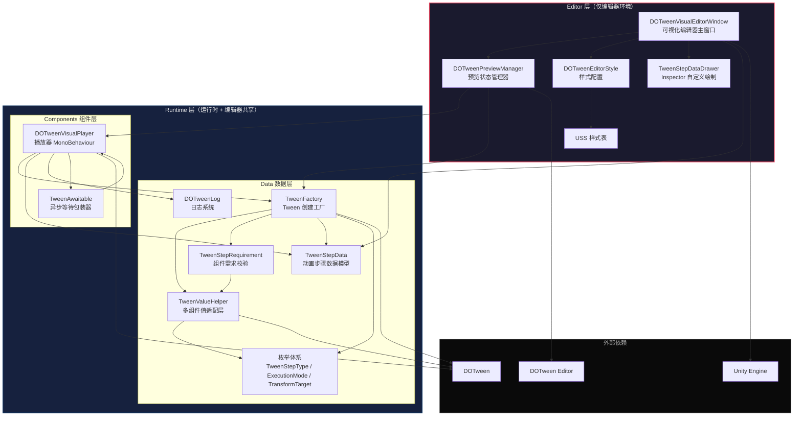
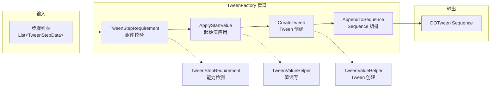

DOTween Visual Editor 采用经典的 **Runtime / Editor 双层分离架构**，通过 Unity Assembly Definition（asmdef）实现编译隔离。Runtime 层承载所有运行时动画播放逻辑，不依赖任何 UnityEditor 命名空间，确保可在构建后的玩家中正常工作；Editor 层仅运行于编辑器环境，提供可视化编辑、实时预览和 Inspector 自定义绘制能力。两层之间通过共享的 `TweenStepData` 数据模型和 `TweenFactory` 工厂方法桥接——编辑器预览与运行时播放使用完全相同的 Tween 创建路径，从根本上消除了"编辑器看到的效果与实际运行不一致"的风险。

Sources: [CNoom.DOTweenVisual.Runtime.asmdef](Runtime/CNoom.DOTweenVisual.Runtime.asmdef#L1-L24), [CNoom.DOTweenVisual.Editor.asmdef](Editor/CNoom.DOTweenVisual.Editor.asmdef#L1-L22)

## 架构全景图

在深入每个模块之前，先从宏观视角理解系统的分层关系与数据流向。下图展示了 Runtime 层和 Editor 层各自的模块组成，以及它们之间的依赖方向——所有箭头从"依赖方"指向"被依赖方"，体现了 **Editor 层单向依赖 Runtime 层**的核心约束。



Sources: [DOTweenVisualEditorWindow.cs](Editor/DOTweenVisualEditorWindow.cs#L17-L26), [DOTweenPreviewManager.cs](Editor/DOTweenPreviewManager.cs#L12-L19), [DOTweenVisualPlayer.cs](Runtime/Components/DOTweenVisualPlayer.cs#L8-L14), [TweenFactory.cs](Runtime/Data/TweenFactory.cs#L6-L11)

## Runtime 层：模块职责与协作关系

Runtime 层是整个系统的核心，负责在游戏运行时管理动画数据、创建 DOTween Tween 并控制播放生命周期。它由两个子目录组成：**Components**（Unity 组件）和 **Data**（数据模型与工具类），各司其职。

### 项目目录结构

```
Runtime/
├── CNoom.DOTweenVisual.Runtime.asmdef    # 程序集定义
├── Components/                            # MonoBehaviour 组件
│   ├── DOTweenVisualPlayer.cs            # 播放器组件（核心入口）
│   └── TweenAwaitable.cs                 # 异步等待包装器
└── Data/                                  # 数据模型与工具
    ├── TweenStepData.cs                  # 动画步骤数据模型
    ├── TweenStepType.cs                  # 动画类型枚举（14 种）
    ├── ExecutionMode.cs                  # 执行模式枚举（Append/Join/Insert）
    ├── TransformTarget.cs                # 坐标空间与特效目标枚举
    ├── TweenFactory.cs                   # Tween 创建工厂
    ├── TweenValueHelper.cs               # 多组件值适配层
    ├── TweenStepRequirement.cs           # 组件需求校验
    └── DOTweenLog.cs                     # 日志系统
```

Sources: [目录结构](Runtime)

### Components 子层：播放器与异步等待

**DOTweenVisualPlayer** 是用户与系统交互的唯一 MonoBehaviour 入口。它持有 `List<TweenStepData>` 作为动画步骤序列，在 `BuildAndPlay()` 方法中遍历所有步骤，委托 `TweenFactory.AppendToSequence()` 将每个步骤转化为 DOTween Tween 并编排进 Sequence。播放器同时提供链式回调 API（`OnStart / OnComplete / OnUpdate / OnDone`），支持外部代码以流畅接口风格注册生命周期回调。在组件销毁（`OnDestroy`）或禁用（`OnDisable`）时，播放器会自动执行 Rewind + Kill 确保资源不泄漏。

**TweenAwaitable** 继承 `CustomYieldInstruction`，是播放器暴露给外部的只读等待包装器。它封装了内部 Sequence 引用，但仅暴露观察性属性（`IsDone / IsCompleted / IsPlaying`），不允许外部修改 Tween 状态。这确保了动画生命周期的单一控制权——一切操控都通过 `DOTweenVisualPlayer` 进行，`TweenAwaitable` 只是观察者。

Sources: [DOTweenVisualPlayer.cs](Runtime/Components/DOTweenVisualPlayer.cs#L14-L55), [DOTweenVisualPlayer.cs](Runtime/Components/DOTweenVisualPlayer.cs#L290-L355), [TweenAwaitable.cs](Runtime/Components/TweenAwaitable.cs#L7-L53)

### Data 子层：数据模型、工厂与校验

Data 子层是 Runtime 层的信息密集区，包含六个职责明确的模块，以下表逐一说明其角色与协作关系：

| 模块 | 类型 | 职责 | 被谁调用 |
|------|------|------|----------|
| **TweenStepData** | 序列化数据类 | 动画步骤的完整数据模型，使用**多值组设计**：不同类型步骤共用同一数据结构，通过 `TweenStepType` 区分哪些字段生效 | Player 持有列表，Drawer 按类型渲染 |
| **TweenStepType** | 枚举 | 14 种动画类型分类：Transform（Move/Rotate/Scale）、视觉、UI（AnchorMove/SizeDelta）、特效、路径（DOPath）、流程控制（Delay/Callback） | 全局引用 |
| **ExecutionMode** | 枚举 | 三种编排模式：Append（顺序追加）、Join（与上一个并行）、Insert（指定时间点插入） | Factory 编排逻辑 |
| **TransformTarget** | 枚举组 | 坐标空间（MoveSpace/RotateSpace）和特效目标（PunchTarget/ShakeTarget）选择 | Factory 创建 Tween |
| **TweenFactory** | 静态工厂类 | **核心桥梁**：将 `TweenStepData` 转化为 DOTween `Tween`，提供 `CreateTween()`、`AppendToSequence()`、`ApplyStartValue()` 三个公共入口 | Player 运行时调用 + PreviewManager 编辑器预览调用 |
| **TweenValueHelper** | 静态工具类 | 多组件适配层：按优先级检测 Graphic → SpriteRenderer → Renderer → TMP，提供颜色/透明度的安全读写和 Tween 创建 | Factory + Requirement |
| **TweenStepRequirement** | 静态校验类 | 定义每种动画类型的组件前置需求，提供 `Validate()` 校验和 `GetRequirementDescription()` 提示文案 | Factory 创建前校验 + Drawer 编辑器提示 |
| **DOTweenLog** | 静态日志类 | 四级日志（Debug/Info/Warning/Error），Debug 级别使用 `[Conditional("UNITY_EDITOR")]` 标记，发布版本自动移除 | Player 全生命周期 |

Sources: [TweenStepData.cs](Runtime/Data/TweenStepData.cs#L6-L176), [TweenStepType.cs](Runtime/Data/TweenStepType.cs#L1-L48), [TweenFactory.cs](Runtime/Data/TweenFactory.cs#L11-L42), [TweenValueHelper.cs](Runtime/Data/TweenValueHelper.cs#L6-L141), [TweenStepRequirement.cs](Runtime/Data/TweenStepRequirement.cs#L6-L101), [DOTweenLog.cs](Runtime/Data/DOTweenLog.cs#L6-L77)

### Runtime 核心数据流

动画播放的完整数据流遵循 **"数据 → 工厂 → 引擎"** 的单向管道。`DOTweenVisualPlayer.BuildAndPlay()` 遍历步骤列表，对每个启用的步骤调用 `TweenFactory.AppendToSequence()`；Factory 先通过 `TweenStepRequirement.Validate()` 校验目标组件，再通过 `TweenValueHelper` 获取/设置起始值并创建对应的 DOTween Tweener，最终按 `ExecutionMode` 将 Tween 编入 Sequence。这条管道同时服务于运行时播放和编辑器预览，是系统一致性的根本保障。



Sources: [DOTweenVisualPlayer.cs](Runtime/Components/DOTweenVisualPlayer.cs#L290-L354), [TweenFactory.cs](Runtime/Data/TweenFactory.cs#L21-L101)

## Editor 层：模块职责与协作关系

Editor 层构建于 Runtime 层之上，为动画设计师提供可视化编辑体验。它由四个模块组成，各自承担明确的职责边界。

```
Editor/
├── CNoom.DOTweenVisual.Editor.asmdef     # 程序集定义（依赖 Runtime）
├── DOTweenVisualEditorWindow.cs         # 主编辑器窗口（~2000 行）
├── DOTweenPreviewManager.cs             # 预览状态管理器
├── TweenStepDataDrawer.cs               # Inspector 自定义绘制器
├── DOTweenEditorStyle.cs                # 样式配置
└── USS/
    └── DOTweenVisualEditor.uss          # UI Toolkit 样式表
```

Sources: [目录结构](Editor)

### DOTweenVisualEditorWindow：主窗口与 UI 编排

主窗口是 Editor 层的最大模块（约 2000 行），采用 **UI Toolkit** 技术栈构建，布局分为三个区域：顶部工具栏+状态栏、左侧步骤概览（`ListView`，内置拖拽排序）、右侧步骤详情面板。窗口自身不直接执行任何预览逻辑，而是将预览职责完全委托给 `DOTweenPreviewManager`，通过订阅后者的 `StateChanged` 和 `ProgressUpdated` 事件来驱动 UI 更新。这种**委托-事件**解耦模式使得预览管理器可以独立测试，也便于未来替换预览实现。

Sources: [DOTweenVisualEditorWindow.cs](Editor/DOTweenVisualEditorWindow.cs#L19-L26), [DOTweenVisualEditorWindow.cs](Editor/DOTweenVisualEditorWindow.cs#L109-L129)

### DOTweenPreviewManager：预览快照与状态机

预览管理器是编辑器预览的核心控制器，维护一个四状态有限状态机（`None → Playing → Paused → Completed`），并实现了一套完整的**快照保存/恢复机制**：在首次预览前保存所有相关 Transform 的位置、旋转、缩放、颜色、透明度、锚点位置、尺寸和填充量；预览结束后通过 `Undo.RecordObject` 安全恢复初始状态。关键设计决策是——预览序列的构建同样调用 `TweenFactory.AppendToSequence()`，与运行时播放路径完全一致，确保所见即所得。

Sources: [DOTweenPreviewManager.cs](Editor/DOTweenPreviewManager.cs#L19-L89), [DOTweenPreviewManager.cs](Editor/DOTweenPreviewManager.cs#L236-L243), [DOTweenPreviewManager.cs](Editor/DOTweenPreviewManager.cs#L249-L338)

### TweenStepDataDrawer 与 DOTweenEditorStyle

**TweenStepDataDrawer** 是 `TweenStepData` 的 `CustomPropertyDrawer`，实现**按类型条件渲染**：根据 `TweenStepType` 的值决定显示哪些字段组（Transform 值组、Color 值组、Float 值组、特效参数值组、路径值组），未使用的字段完全隐藏而非灰色禁用，保持 Inspector 界面简洁。**DOTweenEditorStyle** 是纯配置类，集中管理类型显示名称、执行模式对应的 CSS 类名和颜色常量，以及 USS 样式表资源查找逻辑，将样式决策从 UI 逻辑中剥离。

Sources: [TweenStepDataDrawer.cs](Editor/TweenStepDataDrawer.cs#L10-L148), [DOTweenEditorStyle.cs](Editor/DOTweenEditorStyle.cs#L9-L93)

## Assembly Definition 依赖体系

系统的编译隔离通过两个 asmdef 文件实现，依赖关系严格单向：Editor 依赖 Runtime，Runtime 依赖 DOTween，绝不反向。

| 程序集 | 平台约束 | 核心引用 | 预编译引用 |
|--------|----------|----------|-----------|
| **CNoom.DOTweenVisual.Runtime** | 全平台 | `DOTween.Modules` | `DOTween.dll` |
| **CNoom.DOTweenVisual.Editor** | Editor Only | `CNoom.DOTweenVisual.Runtime` + `DOTween.Modules` | `DOTween.dll` + `DOTweenEditor.dll` |

Runtime 程序集还通过 `versionDefines` 机制定义了 `DOTWEEN` 条件编译符号（当 `com.demigiant.dotween >= 1.2.0` 时激活），确保 DOTween 未安装时给出编译期提示而非运行时错误。

Sources: [CNoom.DOTweenVisual.Runtime.asmdef](Runtime/CNoom.DOTweenVisual.Runtime.asmdef#L1-L24), [CNoom.DOTweenVisual.Editor.asmdef](Editor/CNoom.DOTweenVisual.Editor.asmdef#L1-L22)

## 设计原则总结

整体架构遵循以下五项核心原则，理解这些原则有助于在后续深入各模块时保持正确的认知框架：

| 原则 | 实现方式 | 收益 |
|------|----------|------|
| **双层隔离** | Runtime / Editor 独立 asmdef，Editor 仅限 Editor 平台 | Runtime 可随项目构建发布，Editor 代码不进入包体 |
| **工厂统一** | `TweenFactory` 同时服务运行时播放和编辑器预览 | 消除预览与运行时效果差异 |
| **数据驱动** | `TweenStepData` 作为唯一数据源，所有行为从数据派生 | 编辑器修改即时反映到运行时，无需额外同步 |
| **职责委托** | 窗口不直接操作 Tween，预览委托 PreviewManager，创建委托 Factory | 模块可独立测试和替换 |
| **观察封装** | `TweenAwaitable` 仅暴露只读属性，Tween 生命周期由 Player 独占 | 防止外部误操作内部 Tween 状态 |

Sources: [DOTweenVisualPlayer.cs](Runtime/Components/DOTweenVisualPlayer.cs#L8-L14), [TweenFactory.cs](Runtime/Data/TweenFactory.cs#L6-L11), [DOTweenPreviewManager.cs](Editor/DOTweenPreviewManager.cs#L12-L19), [TweenAwaitable.cs](Runtime/Components/TweenAwaitable.cs#L7-L53)

## 推荐阅读路径

理解了整体分层之后，建议按以下顺序深入各模块细节：

1. [DOTweenVisualPlayer 播放器组件：生命周期与播放控制](6-dotweenvisualplayer-bo-fang-qi-zu-jian-sheng-ming-zhou-qi-yu-bo-fang-kong-zhi) — 从核心入口理解播放流程
2. [TweenStepData 数据结构：多值组设计模式](7-tweenstepdata-shu-ju-jie-gou-duo-zhi-zu-she-ji-mo-shi) — 理解数据模型如何承载 14 种动画类型
3. [TweenFactory 工厂模式：统一运行时与编辑器预览的 Tween 创建](8-tweenfactory-gong-han-mo-shi-tong-yun-xing-shi-yu-bian-ji-qi-yu-lan-de-tween-chuang-jian) — 深入工厂管道的每一步
4. [Sequence 构建流程：从步骤数据到 DOTween Sequence 的完整生命周期](25-sequence-gou-jian-liu-cheng-cong-bu-zhou-shu-ju-dao-dotween-sequence-de-wan-zheng-sheng-ming-zhou-qi) — 纵观完整构建链路