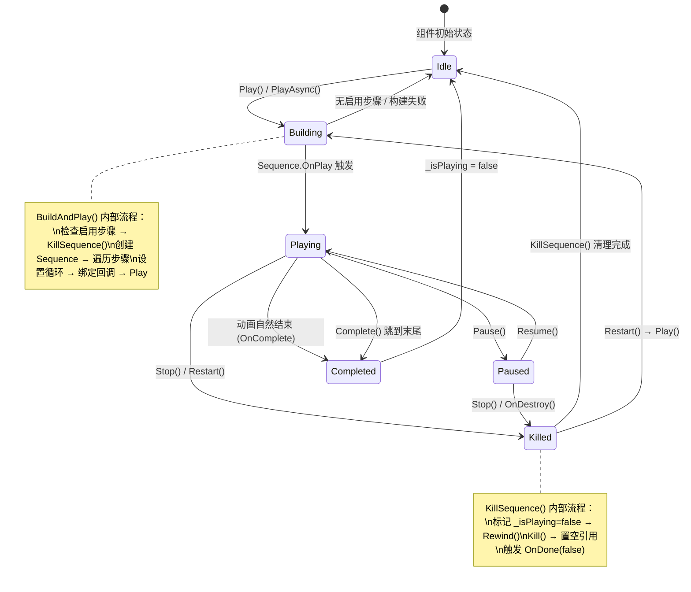

`DOTweenVisualPlayer` 是 DOTween Visual Editor 运行时架构的核心中枢——一个挂载在目标 GameObject 上的 `MonoBehaviour`，负责将可视化编辑器中编排的动画步骤数据（`List<TweenStepData>`）转化为 DOTween 的 `Sequence` 并管理其完整播放生命周期。它同时服务于两个消费者：运行时脚本通过公共 API 驱动动画播放，编辑器窗口通过编辑器 API 操作步骤数据。理解这个组件的内部机制，是掌握整个插件"从数据到动画"工作流的关键一步。

Sources: [DOTweenVisualPlayer.cs](Runtime/Components/DOTweenVisualPlayer.cs#L1-L14), [架构设计.md](Documentation~/架构设计.md#L19-L29)

---

## 组件定位与架构角色

在整体架构中，`DOTweenVisualPlayer` 位于中间层，向上承接编辑器窗口的步骤数据编辑，向下委托 `TweenFactory` 进行实际的 Tween 创建。这种分层让它专注于**播放控制与状态管理**，而无需关心每一种动画类型的具体实现细节。

```
DOTweenVisualEditorWindow（编辑器层）
        │ 编辑 SerializedProperty
        ▼
DOTweenVisualPlayer（播放控制层）  ◄── 本篇重点
        │ 构建 Sequence
        ▼
TweenFactory（Tween 创建层）
        │ 依赖
        ▼
TweenValueHelper / TweenStepRequirement（基础设施层）
```

播放器组件通过 `AddComponentMenu("DOTween Visual/DOTween Visual Player")` 注册到 Unity 的 Add Component 菜单，开发者可以在 Inspector 中直接搜索添加。组件本身持有四个序列化字段，全部暴露在 Inspector 面板中供配置。

Sources: [DOTweenVisualPlayer.cs](Runtime/Components/DOTweenVisualPlayer.cs#L13-L14), [架构设计.md](Documentation~/架构设计.md#L1-L61)

---

## 序列化配置：Inspector 可见的四个字段

| 字段 | 类型 | 默认值 | 用途 |
|------|------|--------|------|
| `_steps` | `List<TweenStepData>` | 空列表 | 动画步骤序列，由编辑器窗口维护 |
| `_playOnStart` | `bool` | `false` | 是否在 `Start()` 时自动播放 |
| `_loops` | `int` | `1` | 循环次数，`-1` 表示无限循环 |
| `_loopType` | `LoopType` | `Restart` | 循环类型（Restart / Yoyo / Incremental） |
| `_debugMode` | `bool` | `false` | 启用调试日志输出 |

`_steps` 列表是播放器的核心数据——它直接映射为 DOTween `Sequence` 中的各个 Tween。值得注意的是，`_steps` 通过 `IReadOnlyList<TweenStepData>` 暴露为只读属性，外部只能通过编辑器 API（`AddStep`、`RemoveStep`、`MoveStep`、`ClearAllSteps`）修改列表内容，这在运行时层面保护了数据完整性。`_loops` 和 `_loopType` 在 `BuildAndPlay()` 阶段通过 `SetLoops()` 一次性应用到 Sequence 上，后续播放期间修改这两个值不会影响当前正在播放的动画。

Sources: [DOTweenVisualPlayer.cs](Runtime/Components/DOTweenVisualPlayer.cs#L16-L54)

---

## Unity 生命周期钩子

`DOTweenVisualPlayer` 实现了三个 Unity 生命周期方法，它们构成了组件状态管理的底线保障。

**`Start()`** —— 初始化 DOTween 并条件触发自动播放。`DOTween.Init(true, true, LogBehaviour.Verbose)` 确保即使场景中没有其他 DOTween 初始化调用，播放器也能正常工作。当 `_playOnStart` 为 `true` 时，直接调用 `Play()` 启动动画。

**`OnDisable()`** —— 组件被禁用时自动暂停正在播放的动画。这是一个防御性设计：当 GameObject 被禁用（例如 UI 面板隐藏），动画不会在后台继续消耗资源，而是优雅地暂停，等待组件重新启用后由外部决定是否调用 `Resume()`。

**`OnDestroy()`** —— 组件销毁时执行完整的清理流程。将 `_isPlaying` 置为 `false` 后调用 `KillSequence()`，确保 DOTween Sequence 被正确回收、属性被回滚到动画起始状态，避免组件销毁后遗留悬挂的 Tween 引用。

Sources: [DOTweenVisualPlayer.cs](Runtime/Components/DOTweenVisualPlayer.cs#L109-L135)

---

## 播放控制 API：六个公共方法

播放器暴露了六个公共方法，覆盖了动画播放的完整控制面。理解它们之间的状态转换关系，是正确使用播放器的前提。

| 方法 | 行为 | 返回值 |
|------|------|--------|
| `Play()` | 构建 Sequence 并开始播放 | `void` |
| `PlayAsync()` | 同 `Play()`，但返回可等待的 `TweenAwaitable` | `TweenAwaitable` |
| `Pause()` | 暂停当前播放中的 Sequence | `void` |
| `Resume()` | 恢复已暂停的 Sequence | `void` |
| `Stop()` | 终止并回收 Sequence，回滚属性 | `void` |
| `Restart()` | 等价于 `Stop()` + `Play()` | `void` |
| `Complete()` | 跳到动画末尾立即完成 | `void` |

以下是播放器在不同 API 调用下的**状态转换图**。状态机的核心是 `_isPlaying` 布尔字段，它由 DOTween 的 `OnPlay` 和 `OnComplete`/`OnKill` 回调驱动，而非在公共 API 中直接设置——这种设计确保了播放状态与 DOTween 引擎的内部状态严格同步。



Sources: [DOTweenVisualPlayer.cs](Runtime/Components/DOTweenVisualPlayer.cs#L137-L230)

---

## BuildAndPlay()：从数据到 Sequence 的构建管线

`BuildAndPlay()` 是播放器最核心的私有方法，每一次 `Play()` 和 `PlayAsync()` 调用都会进入此方法。它的工作流程可以分解为五个阶段：

**阶段一：启用步骤检查** —— 遍历 `_steps` 列表，检查是否存在至少一个 `IsEnabled == true` 的步骤。如果没有启用步骤，方法立即返回，不会创建空的 Sequence。这一步的存在是因为编辑器允许禁用单个步骤（`IsEnabled` 字段），播放时需要跳过被禁用的步骤。

**阶段二：清理旧 Sequence** —— 调用 `KillSequence()` 终止并回收任何正在播放或残留的 Sequence。这保证了 `Play()` 可以被安全地重复调用而不会产生 Tween 堆积。

**阶段三：构建新 Sequence** —— 创建 DOTween `Sequence`，通过 `SetTarget(this)` 将播放器自身设为 Tween 的持有者。然后遍历所有启用步骤，委托 `TweenFactory.AppendToSequence()` 将每个步骤转化为 Tween 并按其 `ExecutionMode`（Append / Join / Insert）编排到 Sequence 中。关于 `TweenFactory` 如何处理不同动画类型和执行模式，详见 [TweenFactory 工厂模式：统一运行时与编辑器预览的 Tween 创建](8-tweenfactory-gong-han-mo-shi-tong-yun-xing-shi-yu-bian-ji-qi-yu-lan-de-tween-chuang-jian)。

**阶段四：配置循环与回调** —— 应用 `_loops` 和 `_loopType` 设置循环参数，然后绑定四个关键回调：

| DOTween 回调 | 触发时机 | 播放器内部行为 |
|-------------|---------|---------------|
| `OnStart` | Sequence 首次开始播放时 | 转发到用户注册的 `_onStart` 回调 |
| `OnPlay` | 每次播放（包括从暂停恢复）时 | 设置 `_isPlaying = true` |
| `OnUpdate` | 每帧更新时 | 转发到用户注册的 `_onUpdate` 回调 |
| `OnComplete` | Sequence 自然完成时 | 触发 `_onComplete`，设置 `_isPlaying = false`，触发 `_onDone(true)` |
| `OnKill` | Sequence 被杀死时 | 若仍在播放状态，设置 `_isPlaying = false`，触发 `_onDone(false)` |

**阶段五：启动播放** —— 调用 `_currentSequence.Play()` 正式开始动画。

这里有一个微妙但重要的设计细节：`_isPlaying` 的设置时机。它并非在 `Play()` 方法中直接赋值，而是在 DOTween 的 `OnPlay` 回调中被设置为 `true`。这意味着在 `Play()` 调用后、DOTween 引擎首次更新之前，`_isPlaying` 仍然是 `false`。测试代码中可以看到，验证 `IsPlaying` 之前需要先推进一帧 `DOTween.ManualUpdate(0.01f, 0.01f)` 来触发回调。

Sources: [DOTweenVisualPlayer.cs](Runtime/Components/DOTweenVisualPlayer.cs#L290-L355), [DOTweenVisualPlayerTests.cs](Runtime/Tests/DOTweenVisualPlayerTests.cs#L180-L198)

---

## KillSequence()：安全终止与属性回滚

`KillSequence()` 是播放器中最需要仔细理解的方法，它处理了三种不同场景下的 Sequence 清理，并确保不会出现回调重复触发的问题。

其执行流程为：

1. **预保存播放状态** —— `bool wasPlaying = _isPlaying`，记录当前是否在播放中
2. **前置标记** —— 将 `_isPlaying` 设为 `false`，这会阻止后续 `OnKill` 回调中重复触发 `_onDone`
3. **属性回滚** —— 如果 Sequence 仍处于激活状态，调用 `Rewind()` 将所有子 Tween 回滚到动画开始前的状态（恢复位置、颜色、缩放等属性到起始值）
4. **杀死并释放** —— 调用 `Kill()` 终止 Sequence，将 `_currentSequence` 置空
5. **触发终止回调** —— 如果之前在播放状态，直接调用 `_onDone?.Invoke(false)` 通知外部动画被非正常终止
6. **清理回调引用** —— 将 `_onDone` 置为 `null`，防止已注册的回调在下一次播放周期被意外触发

**双重保障机制**：`KillSequence()` 在步骤 5 中直接触发 `_onDone(false)`，而不依赖 DOTween 的 `OnKill` 回调。同时在 `BuildAndPlay()` 中注册的 `OnKill` 回调也包含 `_onDone` 触发逻辑，但由于步骤 2 已经将 `_isPlaying` 置为 `false`，`OnKill` 中的 `if (_isPlaying)` 检查会跳过重复触发。这种"直接调用 + 回调兜底"的双重保障确保了在任何 DOTween 内部时序下，`_onDone` 都能被可靠触发且仅触发一次。

Sources: [DOTweenVisualPlayer.cs](Runtime/Components/DOTweenVisualPlayer.cs#L357-L381)

---

## 链式回调系统：OnStart / OnComplete / OnUpdate / OnDone

播放器采用**链式 API** 设计模式注册回调——每个 `OnXxx()` 方法都返回 `this`，允许连续调用：

```csharp
player
    .OnStart(() => Debug.Log("动画开始"))
    .OnComplete(() => Debug.Log("动画完成"))
    .OnUpdate(() => Debug.Log("帧更新"))
    .OnDone(completed => Debug.Log(completed ? "正常结束" : "被终止"));
```

四个回调在语义上有清晰的分工。前三者（`OnStart`、`OnComplete`、`OnUpdate`）使用 DOTween 原生的 `TweenCallback` 委托类型，直接映射到 DOTween Sequence 的对应事件。而 `OnDone` 是播放器自身引入的更高层抽象，它使用 `Action<bool>` 签名，统一了"正常完成"和"被终止"两种结束路径：

| 回调 | 签名 | 触发条件 |
|------|------|---------|
| `OnStart` | `TweenCallback`（无参） | Sequence 首次播放时触发一次 |
| `OnComplete` | `TweenCallback`（无参） | Sequence 所有循环正常完成时触发 |
| `OnUpdate` | `TweenCallback`（无参） | 每帧触发（动画进行中） |
| `OnDone` | `Action<bool>` | 动画结束时必定触发：`true` = 正常完成，`false` = 被终止 |

**注意**：`OnDone` 回调在 `KillSequence()` 结束时会被置为 `null`。这意味着每次新的播放周期需要重新注册 `OnDone` 回调。如果需要在所有播放周期持续监听，建议在 `OnComplete` 或通过 `PlayAsync()` 的返回值来处理。

Sources: [DOTweenVisualPlayer.cs](Runtime/Components/DOTweenVisualPlayer.cs#L56-L106)

---

## PlayAsync()：异步等待与 TweenAwaitable

`PlayAsync()` 是播放器在同步 API `Play()` 之外提供的异步入口。它返回一个 `TweenAwaitable` 对象——一个继承自 `CustomYieldInstruction` 的只读包装器，支持三种等待模式：

```csharp
// 模式一：协程 yield return
yield return player.PlayAsync();

// 模式二：UniTask 等待
await player.PlayAsync().ToUniTask();

// 模式三：回调监听
player.PlayAsync().OnDone(completed => { /* 处理结果 */ });
```

`TweenAwaitable` 的核心设计原则是**最小权限**——它只暴露观察能力（`IsDone`、`IsCompleted`、`IsPlaying`、`IsActive`），不暴露任何对内部 Tween 的修改能力。`keepWaiting` 属性在 Tween 处于激活状态时返回 `true`（继续等待），在 Tween 完成或被杀死后返回 `false`（结束等待），这与 Unity 协程的 `yield return` 语义完美契合。

一个值得注意的行为：当 `PlayAsync()` 被调用时播放器已经在播放中，它不会重新构建 Sequence，而是返回一个包装当前 `_currentSequence` 的新 `TweenAwaitable`。这使得多个调用者可以同时等待同一个动画的完成，而不会产生重复播放。

Sources: [DOTweenVisualPlayer.cs](Runtime/Components/DOTweenVisualPlayer.cs#L153-L175), [TweenAwaitable.cs](Runtime/Components/TweenAwaitable.cs#L1-L94)

---

## 编辑器 API：步骤列表操作

播放器提供了一组供编辑器窗口使用的步骤管理 API。这些方法直接操作内部的 `_steps` 列表，是可视化编辑器与运行时数据之间的桥梁：

| 方法 | 签名 | 用途 |
|------|------|------|
| `AddStep` | `AddStep(TweenStepData)` | 添加步骤到列表末尾 |
| `RemoveStep` | `RemoveStep(int)` | 按索引移除步骤（越界静默忽略） |
| `MoveStep` | `MoveStep(int, int)` | 移动步骤位置（支持拖拽排序） |
| `GetOrCreateStep` | `GetOrCreateStep(int)` → `TweenStepData?` | 按索引获取步骤（越界返回 null） |
| `ClearAllSteps` | `ClearAllSteps()` | 清空全部步骤 |

所有索引操作方法都包含边界检查：`RemoveStep` 和 `MoveStep` 在索引越界时静默返回而非抛出异常，`GetOrCreateStep` 返回 `null` 而非抛出 `ArgumentOutOfRangeException`。这种防御性设计是因为编辑器 UI 操作（如删除选中步骤后立即访问列表）可能在序列化延迟期间产生临时无效索引。

Sources: [DOTweenVisualPlayer.cs](Runtime/Components/DOTweenVisualPlayer.cs#L232-L286)

---

## 调试支持：ContextMenu 与日志

在 `UNITY_EDITOR` 条件编译下，播放器注册了四个 Context Menu 快捷操作，开发者可以在 Inspector 中右键点击组件快速触发：

| 菜单项 | 对应方法 |
|--------|---------|
| 播放 | `Play()` |
| 停止 | `Stop()` |
| 暂停 | `Pause()` |
| 重播 | `Restart()` |
| 完成 | `Complete()` |

当 `_debugMode` 启用时，播放器的关键操作都会通过 `DOTweenLog.Debug()` 输出日志，覆盖了以下事件：`Play()` 被重复调用时的忽略提示、`PlayAsync()` 无可播放步骤的警告、`Stop()` / `Pause()` / `Resume()` 的状态变更确认、Sequence 开始播放时的步骤数量、Sequence 自然完成的确认。由于 `DOTweenLog.Debug()` 使用 `[Conditional("UNITY_EDITOR")]` 标注，这些日志在发布版本中会被编译器完全移除，零运行时开销。

Sources: [DOTweenVisualPlayer.cs](Runtime/Components/DOTweenVisualPlayer.cs#L385-L404), [DOTweenLog.cs](Runtime/Data/DOTweenLog.cs#L68-L76)

---

## OnDisable 的暂停语义：一个设计决策

`OnDisable()` 中选择 `Pause()` 而非 `Stop()` 是一个有意的设计决策。暂停意味着动画进度被保留，当组件重新启用后可以调用 `Resume()` 从断点继续播放。如果使用 `Stop()`，Sequence 会被 `KillSequence()` 完全回收并回滚属性，重新启用后需要从头播放。但需要注意，`OnDisable()` 不会自动调用 `Resume()`——组件重新启用后播放器保持暂停状态，由外部脚本决定是否恢复。如果期望"禁用时暂停、启用时自动恢复"的行为，需要在 `OnEnable()` 中手动调用 `Resume()`。

Sources: [DOTweenVisualPlayer.cs](Runtime/Components/DOTweenVisualPlayer.cs#L127-L133)

---

## 状态查询属性

播放器暴露了三个只读属性供外部查询当前状态：

| 属性 | 类型 | 含义 |
|------|------|------|
| `IsPlaying` | `bool` | 是否正在播放（由 DOTween `OnPlay` / `OnComplete` / `OnKill` 回调驱动） |
| `Steps` | `IReadOnlyList<TweenStepData>` | 步骤列表的只读视图 |
| `StepCount` | `int` | 步骤数量（等价于 `Steps.Count`） |

Sources: [DOTweenVisualPlayer.cs](Runtime/Components/DOTweenVisualPlayer.cs#L43-L54)

---

## 延伸阅读

- **步骤数据结构**：播放器持有的 `TweenStepData` 列表如何定义多值组字段 → [TweenStepData 数据结构：多值组设计模式](7-tweenstepdata-shu-ju-jie-gou-duo-zhi-zu-she-ji-mo-shi)
- **Tween 构建细节**：`TweenFactory.AppendToSequence()` 如何将步骤数据转化为 DOTween Tween → [TweenFactory 工厂模式](8-tweenfactory-gong-han-mo-shi-tong-yun-xing-shi-yu-bian-ji-qi-yu-lan-de-tween-chuang-jian)
- **异步等待机制**：`TweenAwaitable` 如何同时支持协程和 UniTask → [异步等待机制：TweenAwaitable 与协程 / UniTask 集成](11-yi-bu-deng-dai-ji-zhi-tweenawaitable-yu-xie-cheng-unitask-ji-cheng)
- **执行模式**：Append / Join / Insert 如何影响 Sequence 编排 → [ExecutionMode 执行模式](12-executionmode-zhi-xing-mo-shi-append-join-insert-bian-pai-ce-lue)
- **Sequence 完整构建流程**：从步骤数据到 DOTween Sequence 的端到端过程 → [Sequence 构建流程](25-sequence-gou-jian-liu-cheng-cong-bu-zou-shu-ju-dao-dotween-sequence-de-wan-zheng-sheng-ming-zhou-qi)