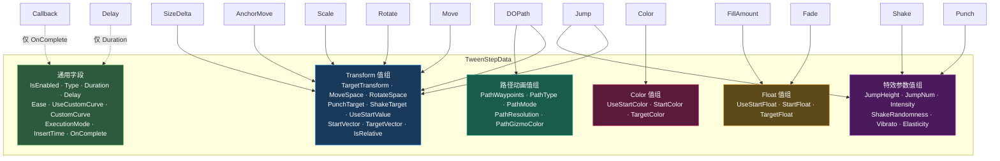
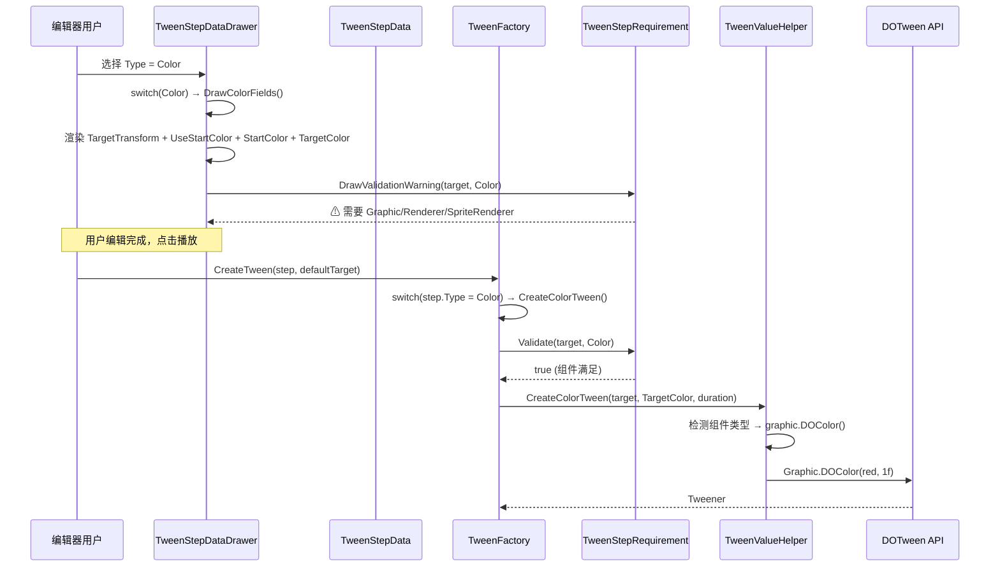
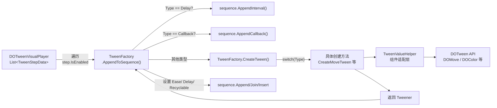

TweenStepData 是 DOTween Visual Editor 的**核心数据载体**——一个 `[Serializable]` 平铺类，用 6 个"值组"承载 14 种动画类型的全部参数。本文将深入剖析其**多值组设计模式**的内在逻辑：为什么选择单一平铺类而非继承体系？值组如何按 `TweenStepType` 映射？字段过滤机制如何在编辑器与运行时协同工作？理解了这一数据结构，你就掌握了整个插件从数据定义到 Tween 创建的完整链路。

Sources: [TweenStepData.cs](Runtime/Data/TweenStepData.cs#L1-L178), [TweenStepType.cs](Runtime/Data/TweenStepType.cs#L1-L49)

## 设计抉择：平铺多值组 vs 继承多态

面对"14 种动画类型各有不同参数"这一建模问题，最常见的两种方案是**继承多态**（基类 + MoveStepData、ColorStepData 等子类）和**平铺多值组**（一个类包含所有可能的字段，按类型选择性使用）。TweenStepData 选择了后者，这个决策背后有三重考量。

**Unity 序列化兼容性**是首要原因。Unity 的序列化系统对多态支持极为有限——`[SerializeField] List<TweenStepData>` 只能序列化声明类型的字段，子类新增字段会被静默丢弃。虽然 `SerializeReference`（Unity 2020.3+）解决了这个问题，但它引入了额外的序列化开销和 Inspector 绘制复杂度。对于一个需要在 Inspector 中直接编辑的数据结构，平铺方案提供了最无摩擦的序列化体验。

**编辑器绘制简洁性**是第二重考量。`TweenStepDataDrawer` 作为 `CustomPropertyDrawer`，通过 `switch (type)` 直接控制哪些字段可见。如果使用继承体系，PropertyDrawer 需要为每个子类单独注册，或在运行时做类型探测——无论哪种都增加了编辑器代码的复杂度。平铺方案下，Drawer 的 `OnGUI` 和 `GetPropertyHeight` 只需一次 switch 分支即可完成全部条件渲染。

**运行时零装箱零分配**是第三重优势。`TweenFactory.CreateTween()` 读取 `step.Type` 后直接访问对应值组字段，没有任何虚方法调用、类型转换或接口分派。在每帧可能创建数十个 Tween 的场景中，这种直接的字段访问模式将开销降至最低。

Sources: [TweenStepData.cs](Runtime/Data/TweenStepData.cs#L6-L14), [TweenStepDataDrawer.cs](Editor/TweenStepDataDrawer.cs#L1-L16), [TweenFactory.cs](Runtime/Data/TweenFactory.cs#L21-L42)

## 值组映射全景：6 组字段覆盖 14 种类型

TweenStepData 的 30 余个字段被组织为 6 个语义清晰的值组，每个值组服务于一个或多个 `TweenStepType`。这种"值组交叉复用"的设计使得多个动画类型可以共享同一套字段（如 `StartVector`/`TargetVector` 同时服务于 Move、Rotate、Scale、AnchorMove、SizeDelta、Jump、DOPath 七种类型），同时保持字段名的语义自描述。

上图的箭头揭示了值组复用的核心模式：Transform 值组的 `StartVector`/`TargetVector` 字段被 **7 种类型**共享，但其语义因类型而异——对 Move 表示"位置"、对 Rotate 表示"欧拉角（内部转四元数）"、对 Scale 表示"缩放比例"、对 AnchorMove 表示"锚点坐标"、对 SizeDelta 表示"尺寸"。这种复用是安全的，因为同一个 TweenStepData 实例只会被解读为一种 `Type`。

Sources: [TweenStepData.cs](Runtime/Data/TweenStepData.cs#L54-L157), [TweenStepType.cs](Runtime/Data/TweenStepType.cs#L6-L47)

## 各值组详解

### Transform 值组：七合一的向量参数集

Transform 值组是复用程度最高的值组，包含 9 个字段，服务于 Move、Rotate、Scale、AnchorMove、SizeDelta、Jump、DOPath 七种动画类型。其核心设计思路是：**所有需要 Vector3 表示的起始/目标动画值，共享同一对 `StartVector`/`TargetVector` 字段**。

| 字段 | 类型 | 默认值 | 含义 |
|------|------|--------|------|
| `TargetTransform` | `Transform` | `null` | 动画目标物体，为 null 时使用组件所在物体 |
| `MoveSpace` | `MoveSpace` | `World` | Move 专用：世界/本地坐标空间 |
| `RotateSpace` | `RotateSpace` | `World` | Rotate 专用：世界/本地旋转空间 |
| `PunchTarget` | `PunchTarget` | `Position` | Punch 专用：冲击位置/旋转/缩放 |
| `ShakeTarget` | `ShakeTarget` | `Position` | Shake 专用：震动位置/旋转/缩放 |
| `UseStartValue` | `bool` | `false` | 是否使用显式起始值（false 时取物体当前值） |
| `StartVector` | `Vector3` | `zero` | 起始值（语义随 Type 变化） |
| `TargetVector` | `Vector3` | `zero` | 目标值（语义随 Type 变化） |
| `IsRelative` | `bool` | `false` | 是否为相对值（相对当前值偏移） |

`UseStartValue` 开关是这个值组的关键设计：当它为 `false` 时，TweenFactory 不会强制设置起始状态，动画将从物体当前值平滑过渡到目标值；当它为 `true` 时，TweenFactory 先将物体设为起始值再创建动画，确保"从 A 到 B"的完整可控过渡。这种设计在 TweenFactory 中体现为统一的 `if (step.UseStartValue)` 前置检查。

Sources: [TweenStepData.cs](Runtime/Data/TweenStepData.cs#L54-L83), [TransformTarget.cs](Runtime/Data/TransformTarget.cs#L1-L50), [TweenFactory.cs](Runtime/Data/TweenFactory.cs#L192-L257)

### Color 值组与 Float 值组：单维度动画参数

Color 值组（3 个字段）和 Float 值组（3 个字段）分别服务于颜色动画和标量动画。它们的设计比 Transform 值组更简单，但遵循相同的 `UseXxx` 开关模式。

**Color 值组**用于 `TweenStepType.Color`，通过 `TweenValueHelper` 适配 Graphic、Renderer、SpriteRenderer、TMP_Text 等多种组件的颜色属性。`StartColor` 默认为 `Color.white`（全不透明白色），确保无起始值时的安全默认状态。

**Float 值组**服务于 `Fade` 和 `FillAmount` 两种类型，复用同一套 `StartFloat`/`TargetFloat` 字段。`StartFloat` 默认为 1（完全不透明/满填充），`TargetFloat` 默认为 0（完全透明/零填充）——这恰好对应了最常见的"淡出"场景。字段带有 `[Range(0f, 1f)]` 特性，在 Inspector 中以滑动条展示，约束合法值域。

| 值组 | 字段 | 类型 | 默认值 | 服务类型 |
|------|------|------|--------|----------|
| Color | `UseStartColor` | `bool` | `false` | Color |
| Color | `StartColor` | `Color` | `white` | Color |
| Color | `TargetColor` | `Color` | `white` | Color |
| Float | `UseStartFloat` | `bool` | `false` | Fade, FillAmount |
| Float | `StartFloat` | `float` | `1f` | Fade, FillAmount |
| Float | `TargetFloat` | `float` | `0f` | Fade, FillAmount |

Sources: [TweenStepData.cs](Runtime/Data/TweenStepData.cs#L85-L111), [TweenValueHelper.cs](Runtime/Data/TweenValueHelper.cs#L1-L292)

### 特效参数值组与路径动画值组：专有参数集合

特效参数值组（6 个字段）服务于 Jump、Punch、Shake 三种动画，其中 `JumpHeight`/`JumpNum` 为 Jump 专用，`Intensity`/`Vibrato`/`Elasticity` 为 Punch/Shake 共享，`ShakeRandomness` 为 Shake 专用。值得注意的是，这些字段没有 `UseStartValue` 开关——特效动画的"起始状态"由物体当前位置决定，不需要显式指定。

路径动画值组（5 个字段）是 DOPath 类型的专有参数，其中 `PathWaypoints` 是一个 `Vector3[]` 数组，默认包含 2 个路径点。`PathType` 和 `PathMode` 使用 `int` 类型而非枚举，因为它们需要映射到 DOTween 的 `PathType`/`PathMode` 枚举——这种间接映射避免了运行时程序集对 DOTween 枚举类型的硬依赖问题。`PathGizmoColor` 仅用于编辑器中绘制路径 Gizmo 的调试颜色，运行时不参与任何逻辑。

Sources: [TweenStepData.cs](Runtime/Data/TweenStepData.cs#L113-L157), [TweenFactory.cs](Runtime/Data/TweenFactory.cs#L329-L397)

## 字段过滤机制：三层协作的 switch 分发

TweenStepData 的"多值组"设计之所以可行，依赖于三层代码协作完成字段过滤——确保每种 `Type` 只读写其对应的值组字段，忽略所有无关字段。这三层分别是：**编辑器绘制层**（TweenStepDataDrawer）、**运行时创建层**（TweenFactory）、**组件校验层**（TweenStepRequirement）。

三层 switch 分发的关键映射关系如下表所示：

| TweenStepType | Drawer 绘制方法 | Factory 创建方法 | Requirement 校验 |
|:---|:---|:---|:---|
| Move | `DrawTransformFields` | `CreateMoveTween` | 无额外要求 |
| Rotate | `DrawTransformFields` | `CreateRotateTween` | 无额外要求 |
| Scale | `DrawTransformFields` | `CreateScaleTween` | 无额外要求 |
| Color | `DrawColorFields` | `CreateColorTween` | HasColorTarget |
| Fade | `DrawFadeFields` | `CreateFadeTween` | HasFadeTarget |
| AnchorMove | `DrawTransformFields` | `CreateAnchorMoveTween` | HasRectTransform |
| SizeDelta | `DrawTransformFields` | `CreateSizeDeltaTween` | HasRectTransform |
| Jump | `DrawJumpFields` | `CreateJumpTween` | 无额外要求 |
| Punch | `DrawPunchShakeFields` | `CreatePunchTween` | 无额外要求 |
| Shake | `DrawPunchShakeFields` | `CreateShakeTween` | 无额外要求 |
| FillAmount | `DrawFadeFields` | `CreateFillAmountTween` | 需要 Image |
| DOPath | `DrawDOPathFields` | `CreateDOPathTween` | 无额外要求 |
| Delay | `DrawDelayFields` | null（AppendInterval） | 无额外要求 |
| Callback | `DrawCallbackFields` | null（AppendCallback） | 无额外要求 |

Sources: [TweenStepDataDrawer.cs](Editor/TweenStepDataDrawer.cs#L82-L148), [TweenFactory.cs](Runtime/Data/TweenFactory.cs#L21-L102), [TweenStepRequirement.cs](Runtime/Data/TweenStepRequirement.cs#L22-L85)

## 通用字段：所有类型共享的基础设施

除了 6 个值组之外，TweenStepData 还有一组通用字段服务于所有动画类型，它们构成了动画的"元信息"层。

| 字段 | 类型 | 默认值 | 作用域 |
|------|------|--------|--------|
| `IsEnabled` | `bool` | `true` | 控制此步骤是否参与播放 |
| `Type` | `TweenStepType` | `Move` | 决定值组选择和 Tween 创建逻辑 |
| `Duration` | `float` | `1f` | 动画时长（秒），最小 0.001 |
| `Delay` | `float` | `0f` | 动画前延迟（秒） |
| `Ease` | `Ease` | `OutQuad` | 缓动类型（Punch/Shake 除外） |
| `UseCustomCurve` | `bool` | `false` | 是否使用自定义 AnimationCurve 替代 Ease |
| `CustomCurve` | `AnimationCurve` | `null` | 自定义缓动曲线 |
| `ExecutionMode` | `ExecutionMode` | `Append` | 序列编排模式 |
| `InsertTime` | `float` | `0f` | Insert 模式的插入时间点 |
| `OnComplete` | `UnityEvent` | `new()` | 步骤完成回调 |

**缓动字段的双重机制**值得特别说明。`Ease` 和 `UseCustomCurve`/`CustomCurve` 构成了一组互斥选项：当 `UseCustomCurve` 为 true 时，TweenFactory 使用 `CustomCurve` 调用 `tween.SetEase(AnimationCurve)`；否则使用 `Ease` 枚举调用 `tween.SetEase(Ease)`。但 Punch 和 Shake 类型是个例外——它们内置了振荡缓动，TweenFactory 通过 `skipEase` 标记跳过缓动设置，避免覆盖其内部振荡行为。

**ExecutionMode** 决定了 Tween 如何被编排进 Sequence，这一字段的完整行为在 [ExecutionMode 执行模式：Append / Join / Insert 编排策略](12-executionmode-zhi-xing-mo-shi-append-join-insert-bian-pai-ce-lue) 中有详细阐述。

Sources: [TweenStepData.cs](Runtime/Data/TweenStepData.cs#L15-L52), [TweenStepData.cs](Runtime/Data/TweenStepData.cs#L159-L175), [TweenFactory.cs](Runtime/Data/TweenFactory.cs#L67-L101)

## 消费链路：从数据到 Tween 的完整路径

一个 TweenStepData 实例从创建到最终生成 DOTween Tween，经过以下链路：

关键路径中的数据流向：

1. **DOTweenVisualPlayer** 持有 `List<TweenStepData>`，在 `BuildAndPlay()` 中遍历所有 `IsEnabled == true` 的步骤，逐一调用 `TweenFactory.AppendToSequence()`。

2. **TweenFactory.AppendToSequence()** 先处理 Delay/Callback 两个特殊类型（它们不产生 Tween，而是直接操作 Sequence），然后调用 `CreateTween()` 创建具体的 Tween。

3. **TweenFactory.CreateTween()** 通过 `switch (step.Type)` 分发到对应的创建方法，每个方法只读取属于自己值组的字段——例如 `CreateMoveTween` 读取 `MoveSpace`、`UseStartValue`、`StartVector`、`TargetVector`、`IsRelative`，而完全忽略 Color/Float/Path 值组。

4. 创建的 Tween 被 `AppendToSequence()` 根据步骤的 `ExecutionMode` 编排进 Sequence，同时应用缓动、延迟、可回收等通用配置。

Sources: [DOTweenVisualPlayer.cs](Runtime/Components/DOTweenVisualPlayer.cs#L290-L355), [TweenFactory.cs](Runtime/Data/TweenFactory.cs#L48-L102)

## 设计模式的代价与补偿

任何架构选择都有代价。多值组模式的主要代价是**字段冗余**：一个 Type=Fade 的 TweenStepData 实例中，Transform 值组的 9 个字段、Color 值组的 3 个字段、路径值组的 5 个字段全部存在但永远不会被访问。在典型使用场景中（一个 DOTweenVisualPlayer 管理 5-20 个步骤），这些冗余字段的内存开销约为每个实例 200-300 字节，完全可以忽略。

更重要的是，这种冗余带来了两个正面效果：**序列化稳定性**（Unity 不需要处理多态类型标记）和**编辑器响应速度**（切换 Type 时不需要重建序列化数据，只需重绘 Inspector）。TweenStepDataDrawer 的 `OnGUI` 方法在用户切换 Type 下拉框时，立即切换到新的 switch 分支渲染对应字段，已有数据自动保留——如果用户从 Type=Move 切换到 Type=Color 再切回 Move，之前编辑的 StartVector/TargetVector 值依然存在。

代价的另一面是**类型安全性**的削弱。编译器无法阻止你在 Type=Color 时设置 StartVector，也无法阻止你在 Type=Move 时设置 TargetColor。这种约束的缺失由三层 switch 分发机制在运行时补偿——TweenStepDataDrawer 不渲染无关字段、TweenFactory 不读取无关字段、TweenStepRequirement 校验组件依赖。测试套件（TweenStepDataTests、TweenFactoryTests）进一步保障了每种类型的完整数据路径。

Sources: [TweenStepDataTests.cs](Runtime/Tests/TweenStepDataTests.cs#L1-L300), [TweenFactoryTests.cs](Runtime/Tests/TweenFactoryTests.cs#L1-L200), [TweenStepDataDrawer.cs](Editor/TweenStepDataDrawer.cs#L82-L148)

## 延伸阅读

- 了解 TweenFactory 如何将 TweenStepData 转化为 DOTween 调用：[TweenFactory 工厂模式：统一运行时与编辑器预览的 Tween 创建](8-tweenfactory-gong-han-mo-shi-tong-yun-xing-shi-yu-bian-ji-qi-yu-lan-de-tween-chuang-jian)
- 了解编辑器如何按类型条件渲染字段：[Inspector 自定义绘制器（TweenStepDataDrawer）：按类型条件渲染字段](16-inspector-zi-ding-yi-hui-zhi-qi-tweenstepdatadrawer-an-lei-xing-tiao-jian-xuan-ran-zi-duan)
- 了解组件校验如何保护数据合法性：[TweenStepRequirement 组件校验系统](10-tweensteprequirement-zu-jian-xiao-yan-xi-tong)
- 了解 ExecutionMode 如何编排多个 TweenStepData：[ExecutionMode 执行模式：Append / Join / Insert 编排策略](12-executionmode-zhi-xing-mo-shi-append-join-insert-bian-pai-ce-lue)
- 了解多组件适配如何读取/设置 Color 和 Float 值组的实际值：[TweenValueHelper 值访问层：多组件适配策略（Graphic / Renderer / SpriteRenderer / TMP）](9-tweenvaluehelper-zhi-fang-wen-ceng-duo-zu-jian-gua-pei-ce-lue-graphic-renderer-spriterenderer-tmp)