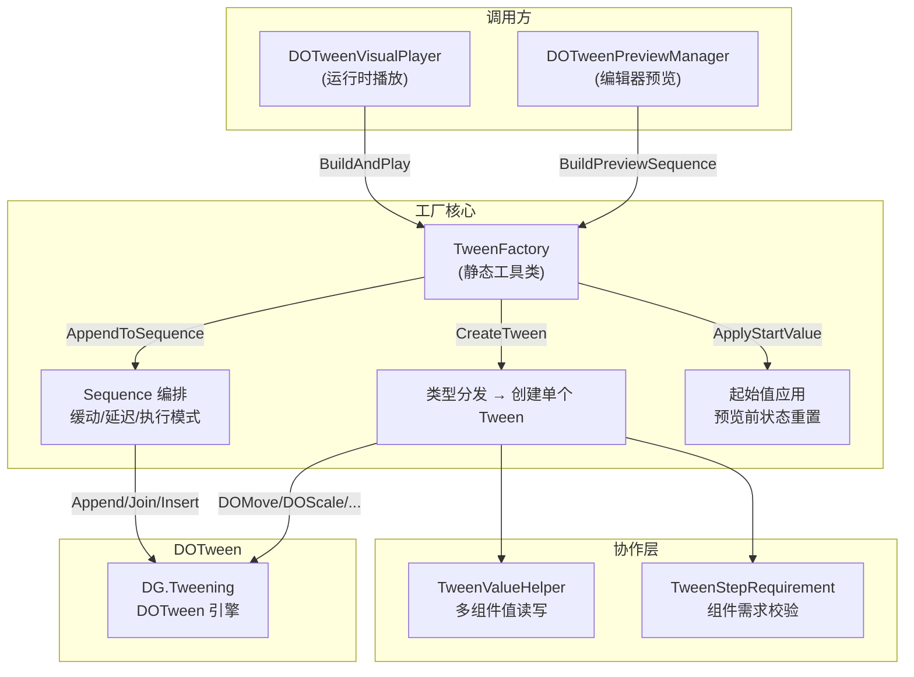
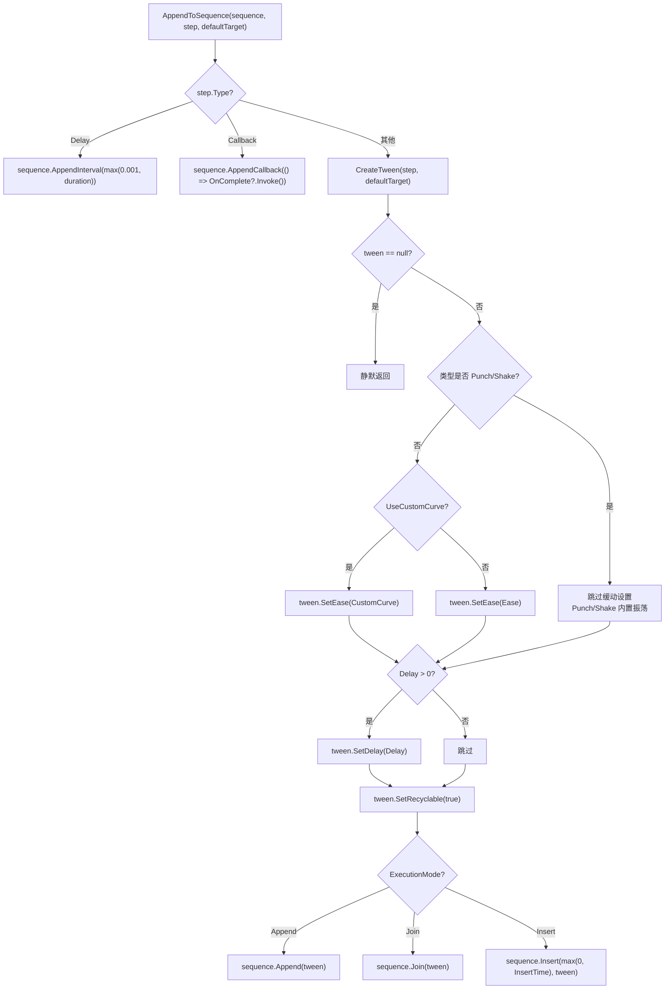
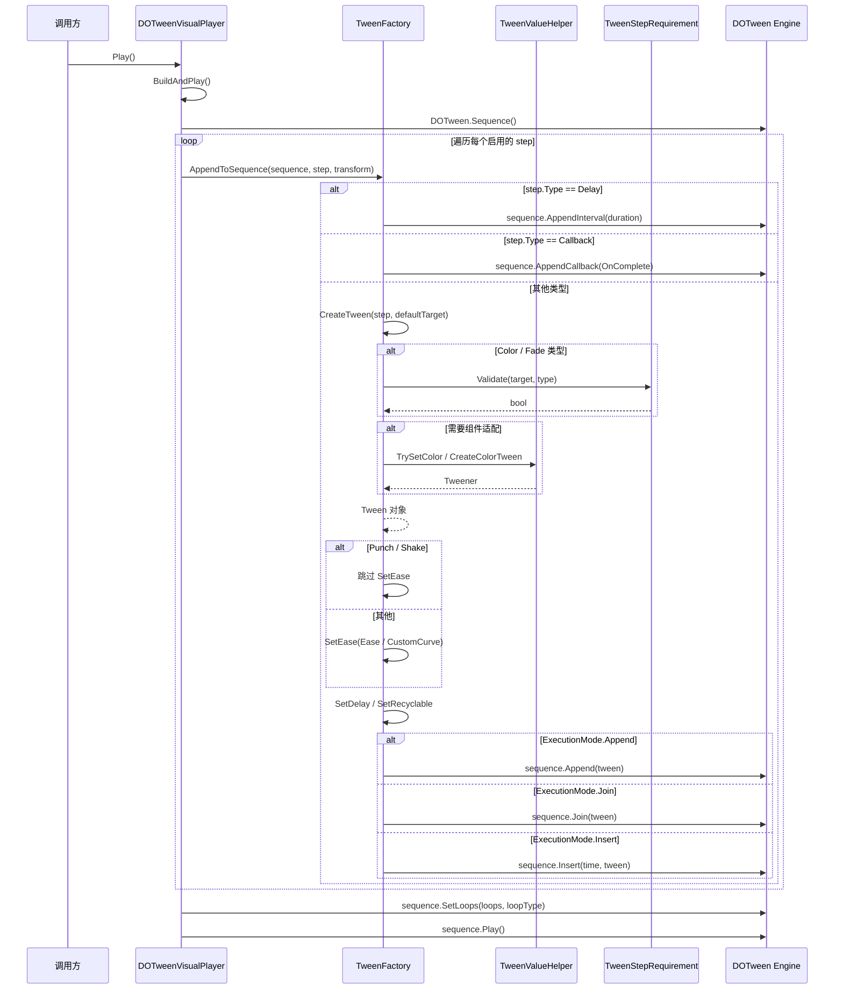

**TweenFactory** 是 DOTween Visual Editor 的核心 Tween 创建枢纽。作为一个 `static` 工具类，它承担了从数据到动画对象的全部映射职责——将声明式的 [TweenStepData 数据结构](7-tweenstepdata-shu-ju-jie-gou-duo-zhi-zu-she-ji-mo-shi) 转换为 DOTween 可执行的 `Tween`/`Sequence` 对象。它的设计动机源自一个核心问题：**运行时播放和编辑器预览使用不同的 DOTween 启动方式（`DOTween.Play()` vs `DOTweenEditorPreview.Start()`），但 Tween 的构建逻辑必须完全一致**。TweenFactory 通过将构建逻辑集中到一个单一入口，消除了两条路径之间的代码重复与行为漂移风险。

Sources: [TweenFactory.cs](Runtime/Data/TweenFactory.cs#L1-L11)

---

## 架构定位：数据层到 DOTween 的桥梁

在整体架构分层中，TweenFactory 处于**数据层**与**DOTween 引擎层**之间的关键位置。它向上承接来自播放器组件和预览管理器的调用，向下委托给 TweenValueHelper 和 TweenStepRequirement 完成组件适配与校验。以下 Mermaid 图展示了该工厂在系统中的位置及其三个核心依赖关系：



**核心架构约束**：`DOTweenVisualPlayer.BuildAndPlay()` 和 `DOTweenPreviewManager.BuildPreviewSequence()` 内部都调用同一个 `TweenFactory.AppendToSequence()` 方法，二者唯一区别在于 Sequence 的启动方式（运行时使用 `DOTween.Sequence().Play()`，编辑器使用 `DOTweenEditorPreview.PrepareTweenForPreview()`），Tween 构建逻辑完全共享。这确保了用户在编辑器中预览的效果与运行时实际播放的行为完全一致。

Sources: [DOTweenVisualPlayer.cs](Runtime/Components/DOTweenVisualPlayer.cs#L290-L318), [DOTweenPreviewManager.cs](Editor/DOTweenPreviewManager.cs#L236-L243)

---

## 三大公共 API 职责划分

TweenFactory 暴露三个公共静态方法，各自承担一个独立的职责维度：

| API | 职责 | 返回值 | 典型调用者 |
|---|---|---|---|
| `CreateTween(TweenStepData, Transform)` | 根据 `TweenStepType` 分发到对应的创建方法，生成单个 `Tween` 对象 | `Tween`（Delay/Callback 返回 `null`） | 内部被 `AppendToSequence` 调用 |
| `AppendToSequence(Sequence, TweenStepData, Transform)` | 创建 Tween + 配置缓动/延迟/可回收 + 按执行模式加入 Sequence | `void` | `DOTweenVisualPlayer`、`DOTweenPreviewManager` |
| `ApplyStartValue(TweenStepData, Transform)` | 将步骤数据中的起始值直接写入目标物体属性 | `void` | `DOTweenPreviewManager`（预览前状态设置） |

三者之间的调用关系是：`AppendToSequence` 内部调用 `CreateTween` 获取原始 Tween，然后进行配置并加入 Sequence。`ApplyStartValue` 独立运作，用于在动画启动前将物体状态重置到用户指定的起始值。

Sources: [TweenFactory.cs](Runtime/Data/TweenFactory.cs#L13-L188)

---

## CreateTween：类型分发的核心路由

`CreateTween` 方法的实现模式是**switch 表达式驱动的类型分发**——这是整个工厂最核心的分支逻辑。它接收 `TweenStepData` 和 `defaultTarget`，首先解析出实际目标 Transform（优先使用 `step.TargetTransform`，fallback 到 `defaultTarget`），然后根据 `step.Type` 枚举分发到 12 个对应的私有创建方法：

```csharp
// 目标解析：外部指定优先，否则使用组件所在物体
var target = step.TargetTransform != null ? step.TargetTransform : defaultTarget;
if (target == null) return null;

return step.Type switch
{
    TweenStepType.Move     => CreateMoveTween(step, target),
    TweenStepType.Rotate   => CreateRotateTween(step, target),
    TweenStepType.Scale    => CreateScaleTween(step, target),
    TweenStepType.Color    => CreateColorTween(step, target),
    TweenStepType.Fade     => CreateFadeTween(step, target),
    TweenStepType.AnchorMove  => CreateAnchorMoveTween(step, target),
    TweenStepType.SizeDelta   => CreateSizeDeltaTween(step, target),
    TweenStepType.Jump     => CreateJumpTween(step, target),
    TweenStepType.Punch    => CreatePunchTween(step, target),
    TweenStepType.Shake    => CreateShakeTween(step, target),
    TweenStepType.FillAmount => CreateFillAmountTween(step, target),
    TweenStepType.DOPath   => CreateDOPathTween(step, target),
    _ => null  // Delay/Callback 返回 null
};
```

**设计要点**：`Delay` 和 `Callback` 类型在 `CreateTween` 中被分发到 `_ => null` 分支。它们不是传统意义上的 Tween 对象，而是流程控制指令——`AppendToSequence` 对这两种类型进行特殊处理，分别映射为 `Sequence.AppendInterval()` 和 `Sequence.AppendCallback()`。

Sources: [TweenFactory.cs](Runtime/Data/TweenFactory.cs#L21-L42)

### 12 种类型的创建逻辑分层

所有私有创建方法遵循一个统一的两步模式：**先应用起始值（可选），再创建 DOTween 动画**。但在组件校验和值访问策略上，三种类型存在不同的依赖路径：

| 层级 | 类型 | 组件校验 | 值访问 |
|---|---|---|---|
| **Transform 直连** | Move, Rotate, Scale, Jump, Punch, Shake, DOPath | 无（所有 GameObject 都有 Transform） | 直接操作 `target.DOMove()` 等 |
| **UI 直连** | AnchorMove, SizeDelta, FillAmount | 局部校验（RectTransform/Image 检测） | 直接操作 `rectTransform.DOAnchorPos()` 等 |
| **多组件适配** | Color, Fade | 委托 `TweenStepRequirement.Validate()` | 委托 `TweenValueHelper` 读写与创建 |

Transform 直连类型的创建方法直接调用 DOTween 的 Transform 扩展方法（如 `DOMove`、`DOScale`、`DOJump`），无需额外的组件校验。UI 直连类型在方法内部自行检测组件存在性（如 `TryGetRectTransform`、`GetComponent<Image>()`）。而 Color/Fade 类型则将校验和值操作完全委托给 `TweenStepRequirement` 和 `TweenValueHelper`——这是架构中最关键的分层点。

Sources: [TweenFactory.cs](Runtime/Data/TweenFactory.cs#L190-L398)

---

## AppendToSequence：编排与配置的统一入口

`AppendToSequence` 是 TweenFactory 中最被广泛调用的公共方法——运行时和编辑器预览都通过它完成 Sequence 的构建。它的处理流程可以用以下 Mermaid 流程图清晰表达：



**关键设计决策解析**：

**Punch/Shake 缓动豁免**——`DOPunchPosition` 和 `DOShakePosition` 等方法内部已经集成了基于 vibrato/elasticity 参数的振荡缓动算法。如果外部再通过 `SetEase()` 覆盖，会破坏其物理弹性效果。因此 `AppendToSequence` 在遇到这两种类型时，显式跳过缓动设置。

**时长下限保护**——所有创建方法内部都使用 `Mathf.Max(0.001f, step.Duration)` 对时长进行下限保护。DOTween 不允许时长为 0 的 Tween，这个微小的下限值确保了零时长输入不会导致运行时异常。Delay 类型同样遵循此规则：`sequence.AppendInterval(Mathf.Max(0.001f, step.Duration))`。

**可回收标记**——每个通过 `AppendToSequence` 添加的 Tween 都被标记为 `SetRecyclable(true)`，启用 DOTween 的对象池机制，减少 GC 压力。

Sources: [TweenFactory.cs](Runtime/Data/TweenFactory.cs#L48-L102)

### ExecutionMode 编排路由

`AppendToSequence` 的最后一步是根据 `ExecutionMode` 将 Tween 添加到 Sequence。三种模式直接映射到 DOTween Sequence 的三个 API：

| ExecutionMode | DOTween API | 语义 |
|---|---|---|
| `Append` | `sequence.Append(tween)` | 顺序追加，Tween 在上一个 Tween 结束后开始 |
| `Join` | `sequence.Join(tween)` | 并行执行，Tween 与上一个 Tween 同时开始 |
| `Insert` | `sequence.Insert(time, tween)` | 定时插入，Tween 在指定时间点开始 |

Insert 模式额外使用 `Mathf.Max(0f, step.InsertTime)` 确保插入时间不为负数。这三种编排策略的详细分析请参考 [ExecutionMode 执行模式](12-executionmode-zhi-xing-mo-shi-append-join-insert-bian-pai-ce-lue)。

Sources: [TweenFactory.cs](Runtime/Data/TweenFactory.cs#L90-L101)

---

## ApplyStartValue：预览状态重置的关键方法

`ApplyStartValue` 是专为编辑器预览场景设计的辅助方法。它的职责是在动画启动前，将目标物体的属性值写入用户指定的起始值——确保预览的起点是确定的、可重复的。

该方法遵循**守卫模式**（Guard Pattern）：每个类型分支都以 `if (step.UseStartValue)` / `if (step.UseStartColor)` / `if (step.UseStartFloat)` 开头，只有当用户显式启用了起始值覆盖时才执行写入。未启用时，动画使用物体当前值作为起点。

| 类型 | 起始值控制字段 | 写入的属性 | 委托 |
|---|---|---|---|
| Move | `UseStartValue` | `position` / `localPosition`（取决于 `MoveSpace`） | `ApplyMoveValue` |
| Rotate | `UseStartValue` | `rotation` / `localRotation`（取决于 `RotateSpace`） | `ApplyRotationValue`（四元数） |
| Scale | `UseStartValue` | `localScale` | 直接赋值 |
| Color | `UseStartColor` | 颜色属性 | `TweenValueHelper.TrySetColor` |
| Fade | `UseStartFloat` | 透明度属性 | `TweenValueHelper.TrySetAlpha` |
| FillAmount | `UseStartFloat` | `Image.fillAmount` | 直接赋值 |
| AnchorMove | `UseStartValue` | `RectTransform.anchoredPosition` | 通过 `TryGetRectTransform` |
| SizeDelta | `UseStartValue` | `RectTransform.sizeDelta` | 通过 `TryGetRectTransform` |
| DOPath | `UseStartValue` | `position` | 直接赋值 |
| Jump | `UseStartValue` | `position` | 直接赋值 |

值得注意的是，`CreateMoveTween` 等创建方法内部也会调用起始值应用逻辑（如 `CreateMoveTween` 在创建 Tween 前会先 `ApplyMoveValue`）。这意味着在运行时播放中，起始值应用嵌入在 Tween 创建流程中；而在编辑器预览场景中，`ApplyStartValue` 作为独立方法被 `DOTweenPreviewManager` 调用，用于在保存快照后将状态重置到起始值。

Sources: [TweenFactory.cs](Runtime/Data/TweenFactory.cs#L107-L186)

---

## 内部创建方法详解

### Transform 动画（Move / Rotate / Scale / Jump）

**Move** 的创建逻辑根据 `MoveSpace` 分为两个分支：`Local` 调用 `DOLocalMove`，`World` 调用 `DOMove`。两者都支持 `IsRelative` 模式，通过 `SetRelative(true)` 将目标值解释为增量而非绝对值。

**Rotate** 是实现复杂度最高的创建方法。它始终使用**四元数插值**（`DORotateQuaternion` 而非 `DOLocalRotate`/`DORotate`），以避免欧拉角插值的万向锁问题。起始值和目标值都以欧拉角（`Vector3`）存储在 `TweenStepData` 中，创建时通过 `Quaternion.Euler()` 转换。相对旋转使用四元数乘法 `startQuat * targetQuat` 来合成复合旋转。

**Scale** 直接调用 `DOScale`，支持 `IsRelative` 增量模式。

**Jump** 调用 `DOJump`，接受 `TargetVector`（目标位置）、`JumpHeight`（跳跃高度）、`JumpNum`（跳跃次数）三个参数。返回类型为 `Sequence`（DOJump 内部实现需要多个子 Tween）。

Sources: [TweenFactory.cs](Runtime/Data/TweenFactory.cs#L192-L257), [TweenFactory.cs](Runtime/Data/TweenFactory.cs#L329-L338)

### 多组件适配动画（Color / Fade）

Color 和 Fade 是 TweenFactory 中唯一**不直接调用 DOTween API** 的创建方法。它们遵循一个严格的两步校验模式：

1. **组件需求校验**——调用 `TweenStepRequirement.Validate(target, type, out _)` 确认目标物体上存在所需的组件。若校验失败，返回 `null`（静默失败，不抛异常）。
2. **委托 TweenValueHelper**——起始值写入（`TrySetColor` / `TrySetAlpha`）和 Tween 创建（`CreateColorTween` / `CreateFadeTween`）全部委托给 TweenValueHelper，由后者根据目标物体上的实际组件类型（Graphic / SpriteRenderer / Renderer / TMP）选择对应的 DOTween 方法。

这种两层委托架构使得 TweenFactory 自身不关心"这个物体到底是什么组件"，只关心"这个物体能不能做颜色/透明度动画"。组件适配的全部复杂性被封装在 [TweenValueHelper 值访问层](9-tweenvaluehelper-zhi-fang-wen-ceng-duo-zu-jian-gua-pei-ce-lue-graphic-renderer-spriterenderer-tmp) 中。

Sources: [TweenFactory.cs](Runtime/Data/TweenFactory.cs#L263-L287)

### UI 动画（AnchorMove / SizeDelta / FillAmount）

UI 类型在方法内部自行处理组件检测：

- **AnchorMove / SizeDelta**：调用 `TweenValueHelper.TryGetRectTransform()` 检测并获取 RectTransform。若不存在则返回 `null`。
- **FillAmount**：调用 `GetComponent<Image>()` 获取 Image 组件。若不存在则返回 `null`。

三者都支持 `IsRelative` 增量模式（FillAmount 除外，因为其目标值范围为 `[0, 1]`，增量模式语义不适用）。

Sources: [TweenFactory.cs](Runtime/Data/TweenFactory.cs#L291-L323), [TweenFactory.cs](Runtime/Data/TweenFactory.cs#L368-L381)

### 特效动画（Punch / Shake）

Punch 和 Shake 的创建方法共享相似的结构：校验参数范围（`Vibrato ≥ 1`、`Elasticity ∈ [0, 1]`、`ShakeRandomness ∈ [0, 90]`），然后根据子目标枚举分发到对应的 DOTween 方法：

- **Punch**：`PunchTarget`（Position / Rotation / Scale）→ `DOPunchPosition` / `DOPunchRotation` / `DOPunchScale`
- **Shake**：`ShakeTarget`（Position / Rotation / Scale）→ `DOShakePosition` / `DOShakeRotation` / `DOShakeScale`

如前所述，这两种类型在 `AppendToSequence` 中被豁免了缓动设置，因为它们的 DOTween 方法内部已包含基于 vibrato 和 elasticity 的振荡算法。

Sources: [TweenFactory.cs](Runtime/Data/TweenFactory.cs#L340-L366)

### 路径动画（DOPath）

DOPath 是唯一需要数组参数的类型。创建方法首先验证 `PathWaypoints` 至少包含 2 个路径点（`null` 或长度不足均返回 `null`），然后将 `PathType` 和 `PathMode` 从 `int` 强转为 DOTween 的对应枚举类型。最终调用 `target.DOPath(waypoints, duration, pathType, pathMode, resolution)` 创建路径动画。

Sources: [TweenFactory.cs](Runtime/Data/TweenFactory.cs#L383-L397)

---

## 静默失败策略与防御性设计

TweenFactory 全局采用**静默失败**（Fail-Silent）策略——所有可能导致错误的场景都被前置检查拦截，返回 `null` 而非抛出异常：

| 防御场景 | 处理方式 | 代码位置 |
|---|---|---|
| `defaultTarget` 和 `step.TargetTransform` 均为 `null` | `CreateTween` 返回 `null` | L24 |
| 目标物体缺少所需组件（如无 RectTransform） | 创建方法返回 `null` | L295, L311, L371 |
| Color/Fade 类型校验失败 | `Validate` 失败后返回 `null` | L265, L278 |
| DOPath 路径点不足 2 个 | 返回 `null` | L385 |
| `AppendToSequence` 收到 `null` Tween | 静默跳过（`if (tween == null) return`） | L65 |

这种设计源于 TweenFactory 的调用上下文——在可视化编辑器中，用户可能随时添加/删除步骤或更改目标物体引用，异常中断会严重损害编辑体验。`AppendToSequence` 通过在 `CreateTween` 返回 `null` 时直接 return，确保一个无效步骤不会中断整个 Sequence 的构建。

Sources: [TweenFactory.cs](Runtime/Data/TweenFactory.cs#L21-L42), [TweenFactory.cs](Runtime/Data/TweenFactory.cs#L48-L66)

---

## 调用链全景：从用户数据到 DOTween 引擎

以下 Mermaid 序列图展示了一次完整的运行时播放调用链，从 `DOTweenVisualPlayer.Play()` 到最终 Tween 被加入 Sequence 的全过程：



Sources: [DOTweenVisualPlayer.cs](Runtime/Components/DOTweenVisualPlayer.cs#L290-L354), [TweenFactory.cs](Runtime/Data/TweenFactory.cs#L48-L102)

---

## 工具方法：坐标空间路由

`TweenFactory` 底部定义了两个私有工具方法 `ApplyMoveValue` 和 `ApplyRotationValue`，它们的唯一职责是**根据坐标空间枚举值路由到正确的属性**：

- `ApplyMoveValue`：`MoveSpace.World` → `target.position`，`MoveSpace.Local` → `target.localPosition`
- `ApplyRotationValue`：`RotateSpace.World` → `target.rotation`，`RotateSpace.Local` → `target.localRotation`

这两个方法被 `CreateMoveTween`/`CreateRotateTween` 和 `ApplyStartValue` 共同复用，确保起始值应用的坐标空间语义与 Tween 创建一致。

Sources: [TweenFactory.cs](Runtime/Data/TweenFactory.cs#L401-L428)

---

## 测试验证策略

`TweenFactoryTests` 针对工厂的核心行为进行了系统化的验证，测试覆盖了以下关键维度：

| 测试维度 | 验证内容 | 覆盖的类型 |
|---|---|---|
| **空目标防御** | `defaultTarget` 为 `null` 时返回 `null` | Move |
| **目标引用路由** | `TargetTransform` 非 `null` 时使用外部目标 | Move |
| **基础类型创建** | 返回非 `null` Tween | Move, Scale, Punch, Shake |
| **流程控制类型** | Delay/Callback 返回 `null` | Delay, Callback |
| **组件缺失防御** | 无所需组件时返回 `null` | AnchorMove, Color, Fade |
| **组件存在创建** | 有所需组件时返回非 `null` | Color(带 Image), Fade(带 Image) |
| **路径验证** | 路径点不足 2 个 / 为 `null` 返回 `null`，≥2 返回非 `null` | DOPath |
| **起始值应用** | 应用后属性值正确匹配 | Move(World/Local), Scale, Fade, Color |
| **UseStartValue 守卫** | `UseStartValue = false` 时不修改属性 | Move |
| **空目标安全** | `ApplyStartValue` 传入 `null` 不抛异常 | Move |

所有 Tween 创建测试在 `SetUp` 中初始化 DOTween（`DOTween.Init(true, true, LogBehaviour.ErrorsOnly)`），在 `TearDown` 中调用 `DOTween.KillAll()` 清理所有 Tween 并销毁测试 GameObject，确保测试之间无状态泄漏。

Sources: [TweenFactoryTests.cs](Runtime/Tests/TweenFactoryTests.cs#L1-L424)

---

## 设计权衡总结

| 设计决策 | 优势 | 代价 |
|---|---|---|
| **静态类 + switch 表达式** | 零分配、编译期类型安全、易于测试 | 新增类型需修改工厂（开闭原则有限违反） |
| **静默失败策略** | 编辑体验友好，不会因单个无效步骤中断整个序列 | 问题排查需要依赖 DOTweenLog 或手动断点 |
| **起始值嵌入创建方法** | 运行时无需额外调用即可设置起始状态 | 创建方法承担了"写属性 + 创建动画"两个职责 |
| **Delay/Callback 返回 null** | 统一 API 签名，调用方只需关注 `AppendToSequence` | `CreateTween` 的返回值语义不完全一致（null 可能表示"不支持"或"由 Sequence 特殊处理"） |

---

## 延伸阅读

- **数据结构基础**：[TweenStepData 数据结构：多值组设计模式](7-tweenstepdata-shu-ju-jie-gou-duo-zhi-zu-she-ji-mo-shi)——理解 TweenStepData 的字段如何被 TweenFactory 消费
- **组件适配层**：[TweenValueHelper 值访问层：多组件适配策略](9-tweenvaluehelper-zhi-fang-wen-ceng-duo-zu-jian-gua-pei-ce-lue-graphic-renderer-spriterenderer-tmp)——Color/Fade 背后的完整组件适配逻辑
- **校验体系**：[TweenStepRequirement 组件校验系统](10-tweensteprequirement-zu-jian-xiao-yan-xi-tong)——理解 Color/Fade 类型为何需要前置校验
- **编排策略**：[ExecutionMode 执行模式：Append / Join / Insert 编排策略](12-executionmode-zhi-xing-mo-shi-append-join-insert-bian-pai-ce-lue)——深入理解三种执行模式的语义差异
- **完整生命周期**：[Sequence 构建流程：从步骤数据到 DOTween Sequence 的完整生命周期](25-sequence-gou-jian-liu-cheng-cong-bu-zou-shu-ju-dao-dotween-sequence-de-wan-zheng-sheng-ming-zhou-qi)——从更高视角俯瞰 TweenFactory 在整个构建流程中的角色