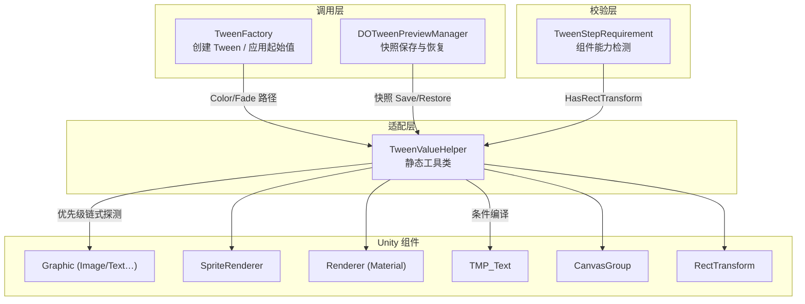
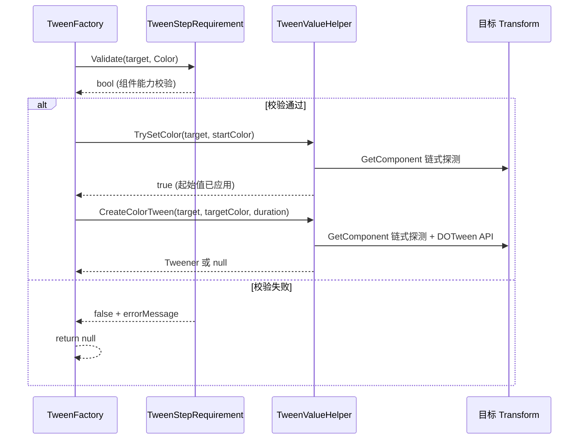

`TweenValueHelper` 是 DOTween Visual Editor 运行时数据层中的一个 **静态工具类**，承担着一个精确而关键的职责：**将 Unity 中碎片化的颜色/透明度/RectTransform 属性访问统一为一套类型无关的安全 API**。在 Unity 中，"颜色"这个概念分散在 `Graphic.color`、`SpriteRenderer.color`、`Renderer.sharedMaterial.color`、`TMP_Text.color` 等不同组件中；"透明度"进一步卷入了 `CanvasGroup.alpha` 和各组件 `color.a` 的歧义。`TweenValueHelper` 通过**优先级链式探测**策略，将这种组件多样性封装为 `TryGetColor` / `TrySetColor` / `CreateColorTween` 等统一入口，使上层 [TweenFactory 工厂模式](8-tweenfactory-gong-han-mo-shi-tong-yun-xing-shi-yu-bian-ji-qi-yu-lan-de-tween-chuang-jian) 和 [预览系统](15-yu-lan-xi-tong-dotweenpreviewmanager-kuai-zhao-bao-cun-zhuang-tai-guan-li-yu-bian-ji-qi-yu-lan-zhi-xing) 完全无需感知底层组件差异。本文将从 API 设计、组件探测优先级、Material 读写策略、TMP 条件编译以及与校验系统的协作关系五个维度展开分析。

Sources: [TweenValueHelper.cs](Runtime/Data/TweenValueHelper.cs#L1-L11)

## 架构定位：分层中的值访问抽象层

在 [整体架构设计](5-zheng-ti-jia-gou-she-ji-fen-ceng-yu-mo-kuai-zhi-ze) 中，`TweenValueHelper` 位于 TweenFactory 之下、Unity 组件 API 之上的**适配层**。它不包含任何状态、不持有任何引用，纯粹通过 `GetComponent<T>` 进行运行时探测。其调用者只有两个：

1. **TweenFactory** — 在创建 Color/Fade 类型 Tween 时，调用 `TrySetColor`/`TrySetAlpha` 应用起始值，调用 `CreateColorTween`/`CreateFadeTween` 创建动画
2. **DOTweenPreviewManager** — 在编辑器预览流程中，调用 `TryGetColor`/`TryGetAlpha` 保存快照，调用 `TrySetColor`/`TrySetAlpha` 恢复快照

此外，[TweenStepRequirement 组件校验系统](10-tweensteprequirement-zu-jian-xiao-yan-xi-tong) 中的 `HasRectTransform` 方法也委托了 `TweenValueHelper.TryGetRectTransform`，形成了校验层对值访问层的单向依赖。



Sources: [TweenValueHelper.cs](Runtime/Data/TweenValueHelper.cs#L1-L11), [TweenFactory.cs](Runtime/Data/TweenFactory.cs#L263-L287), [DOTweenPreviewManager.cs](Editor/DOTweenPreviewManager.cs#L263-L338), [TweenStepRequirement.cs](Runtime/Data/TweenStepRequirement.cs#L146-L149)

## API 设计：三类操作 × 三种值域的完整矩阵

`TweenValueHelper` 暴露的 API 可以精确映射为一个 **3×3 矩阵**——三种操作类型（读取、写入、创建动画）对应三种值域（RectTransform、Color、Alpha/Fade）：

| 值域 | 读取 (`TryGet`) | 写入 (`TrySet`) | 创建动画 (`Create`) |
|------|-----------------|-----------------|---------------------|
| **RectTransform** | `TryGetRectTransform` | — | — |
| **颜色** | `TryGetColor` | `TrySetColor` | `CreateColorTween` |
| **透明度** | `TryGetAlpha` | `TrySetAlpha` | `CreateFadeTween` |

所有方法均接受 `Transform target` 作为入参，返回 `bool` 表示操作是否成功（读取/写入）或 `Tweener` / `null`（创建动画）。**RectTransform 仅提供读取检测**，因为其写入操作（`anchoredPosition`、`sizeDelta`）由 TweenFactory 直接在各自的 `CreateAnchorMoveTween` / `CreateSizeDeltaTween` 中完成，无需经过多组件适配层。

Sources: [TweenValueHelper.cs](Runtime/Data/TweenValueHelper.cs#L13-L25), [TweenValueHelper.cs](Runtime/Data/TweenValueHelper.cs#L27-L141), [TweenValueHelper.cs](Runtime/Data/TweenValueHelper.cs#L145-L289)

## 组件探测优先级链：顺序决定语义

`TweenValueHelper` 的核心机制是 **优先级链式 `GetComponent` 探测**——按照固定顺序依次检测目标 Transform 上是否存在特定组件，命中第一个即返回。这个顺序不是随意排列的，它直接决定了在多组件共存时的行为语义。

### 颜色操作的优先级链

| 优先级 | 组件 | 属性路径 | 适用场景 |
|--------|------|----------|----------|
| 1 | `Graphic` | `.color` | UGUI 控件（Image, Text, RawImage…） |
| 2 | `SpriteRenderer` | `.color` | 2D 精灵渲染 |
| 3 | `Renderer` | `.sharedMaterial.color` | 3D 网格渲染器 |
| 4 | `TMP_Text` | `.color` | TextMeshPro 文本（条件编译） |

Sources: [TweenValueHelper.cs](Runtime/Data/TweenValueHelper.cs#L32-L67)

### 透明度操作的优先级链

| 优先级 | 组件 | 属性路径 | 适用场景 |
|--------|------|----------|----------|
| 1 | `CanvasGroup` | `.alpha` | UI 整体透明度控制 |
| 2 | `Graphic` | `.color.a` | UGUI 控件 |
| 3 | `SpriteRenderer` | `.color.a` | 2D 精灵 |
| 4 | `Renderer` | `.sharedMaterial.color.a` | 3D 网格 |
| 5 | `TMP_Text` | `.color.a` | TextMeshPro 文本（条件编译） |

Sources: [TweenValueHelper.cs](Runtime/Data/TweenValueHelper.cs#L150-L192)

### 优先级链的设计意图

透明度链比颜色链多了一个最高优先级的 **CanvasGroup**，这是一个关键的设计选择。在 Unity UI 开发中，CanvasGroup 常被用作"容器级透明度控制"——当一个 GameObject 同时挂载了 CanvasGroup 和 Image 时，开发者期望 Fade 动画驱动 CanvasGroup.alpha（影响整个子树），而非仅仅修改 Image.color.a（只影响单个控件）。测试用例明确验证了这一优先级语义：

```csharp
// CanvasGroup 应优先于 Image
_gameObject.AddComponent<UnityEngine.UI.Image>();
var cg = _gameObject.AddComponent<CanvasGroup>();
cg.alpha = 0.1f;

TweenValueHelper.TryGetAlpha(_gameObject.transform, out var alpha);
Assert.AreEqual(0.1f, alpha, 0.001f,
    "CanvasGroup 的 alpha 应优先于 Image 的 color.a");
```

Sources: [TweenValueHelperTests.cs](Runtime/Tests/TweenValueHelperTests.cs#L211-L241)

## Material 读写策略：sharedMaterial vs material 实例

在 Renderer 路径中，`TweenValueHelper` 对 Material 的读写和动画创建采用了 **不同的 Material 引用策略**，这是有意为之的精细设计：

| 操作 | Material 引用 | 原因 |
|------|---------------|------|
| **读取** (`TryGetColor` / `TryGetAlpha`) | `renderer.sharedMaterial` | 读取不应产生副作用 |
| **写入** (`TrySetColor` / `TrySetAlpha`) | `renderer.sharedMaterial` | 直接写入，精确控制 |
| **创建动画** (`CreateColorTween` / `CreateFadeTween`) | `renderer.material` | DOTween 需要独立实例避免污染 |

读取和写入使用 `sharedMaterial`，因为这发生在 **ApplyStartValue 或快照恢复** 的上下文中——这些操作需要直接修改材质属性，不希望触发 Unity 的材质实例化机制（实例化会在 Inspector 中产生 "(Instance)" 后缀的材质副本）。而创建 DOTween 动画时使用 `renderer.material`（运行时实例），这是因为 DOTween 在动画过程中会持续修改材质属性，如果操作 sharedMaterial，同一材质的所有使用者都会被影响。

Sources: [TweenValueHelper.cs](Runtime/Data/TweenValueHelper.cs#L50-L55), [TweenValueHelper.cs](Runtime/Data/TweenValueHelper.cs#L88-L93), [TweenValueHelper.cs](Runtime/Data/TweenValueHelper.cs#L125-L130), [TweenValueHelper.cs](Runtime/Data/TweenValueHelper.cs#L271-L276)

## TMP 条件编译：DOTWEEN_TMP / TMP_PRESENT

TextMeshPro 支持被包裹在 `#if DOTWEEN_TMP || TMP_PRESENT` 预处理指令中，这意味着：

- 当项目安装了 DOTween TMP 模块（定义 `DOTWEEN_TMP`）或项目中有 TMP 存在（定义 `TMP_PRESENT`）时，TMP_Text 作为最低优先级组件参与探测链
- 当未安装 TMP 时，这些代码块被完全裁剪，不会产生编译错误或运行时开销

该条件编译符号与 DOTween 自身的 TMP 集成策略保持一致，确保在没有 TextMeshPro 的项目中仍可正常编译运行。这也是为什么 TMP 处于优先级链的最末端——在 UI 场景中，TMP_Text 通常不会与 Graphic 同时存在，但以防万一，Graphic 优先匹配保证了 UGUI 控件的正确处理。

Sources: [TweenValueHelper.cs](Runtime/Data/TweenValueHelper.cs#L57-L64), [TweenValueHelper.cs](Runtime/Data/TweenValueHelper.cs#L95-L102), [TweenValueHelper.cs](Runtime/Data/TweenValueHelper.cs#L132-L138), [TweenValueHelper.cs](Runtime/Data/TweenValueHelper.cs#L233-L242), [TweenValueHelper.cs](Runtime/Data/TweenValueHelper.cs#L278-L284)

## 与 TweenFactory 的协作模式

`TweenFactory` 对 `TweenValueHelper` 的调用遵循一个固定的 **三步模式**，以 Color 类型为例：



**校验先行**（Step 1）：TweenFactory 先调用 `TweenStepRequirement.Validate` 进行组件能力检测。这避免了在目标物体不具备所需组件时执行无意义的 `TrySet` + `Create` 操作。**起始值应用**（Step 2）：仅当 `UseStartColor` / `UseStartFloat` 为 true 时才调用 `TrySet`，否则 DOTween 将自动从当前值开始插值。**动画创建**（Step 3）：委托 `CreateColorTween` / `CreateFadeTween` 完成，返回 `Tweener` 供 TweenFactory 进一步配置缓动、延迟、回收等参数。

Sources: [TweenFactory.cs](Runtime/Data/TweenFactory.cs#L263-L287)

## 与 DOTweenPreviewManager 的协作模式

在编辑器预览流程中，`DOTweenPreviewManager` 对 `TweenValueHelper` 的使用模式与运行时不同——它仅使用 **读取和写入** 操作，不涉及动画创建：

**保存快照时**（`SaveTransformSnapshot`）：调用 `TryGetColor` 和 `TryGetAlpha` 读取当前视觉状态。即使目标物体没有可着色组件，这两个方法也会安全返回 `false`（使用默认值 `Color.white` / `1f`），快照仍会保存这些默认值。

**恢复快照时**（`RestoreSnapshots`）：调用 `TrySetColor` 和 `TrySetAlpha` 将快照值写回目标物体。如果组件在预览期间被销毁（`MissingReferenceException`），外层 `try-catch` 会安全跳过。

这种 "宽容读取、安全写入" 的设计，确保了预览系统在任何组件配置下都不会崩溃，与运行时 TweenFactory 的 "校验先行、严格创建" 形成了互补。

Sources: [DOTweenPreviewManager.cs](Editor/DOTweenPreviewManager.cs#L263-L338)

## 透明度写入的结构性复制模式

在 `TrySetAlpha` 中，对于 Graphic、SpriteRenderer、Renderer、TMP_Text 这四种通过 `color.a` 控制透明度的组件，代码采用了 **结构性复制模式**（struct copy pattern）：

```csharp
var c = graphic.color;  // 拷贝整个 Color 结构体
c.a = alpha;            // 修改副本的 alpha 通道
graphic.color = c;      // 将修改后的结构体整体写回
```

这是因为 Unity 的 `Color` 是值类型（struct），直接修改 `graphic.color.a` 不会生效——它只会修改一个临时副本的 alpha 值。必须先完整读出 Color、修改其 alpha 字段、再整体赋值回去。这个模式在所有四种组件上一致使用。

Sources: [TweenValueHelper.cs](Runtime/Data/TweenValueHelper.cs#L206-L213), [TweenValueHelper.cs](Runtime/Data/TweenValueHelper.cs#L215-L222), [TweenValueHelper.cs](Runtime/Data/TweenValueHelper.cs#L224-L231), [TweenValueHelper.cs](Runtime/Data/TweenValueHelper.cs#L234-L241)

## 测试覆盖：优先级验证与边界条件

`TweenValueHelperTests` 包含 15 个测试用例，覆盖三个维度：

| 维度 | 测试内容 | 示例用例 |
|------|----------|----------|
| **基础读写** | 单组件场景下的正确读写 | `TryGetColor_WithImage_ReturnsTrue` |
| **失败路径** | 无组件时的安全降级 | `TryGetColor_PlainTransform_ReturnsFalse` |
| **优先级验证** | 多组件共存时的优先级语义 | `TryGetAlpha_CanvasGroupTakesPriorityOverImage`、`TryGetAlpha_ImageTakesPriorityOverSpriteRenderer` |

其中优先级验证测试是最具架构意义的——它确保了当 UI 控件同时挂载 CanvasGroup + Image 或 Image + SpriteRenderer 时，行为符合设计意图，而非取决于 `GetComponent` 的不确定返回顺序。

Sources: [TweenValueHelperTests.cs](Runtime/Tests/TweenValueHelperTests.cs#L1-L244)

## 设计权衡与局限性

**性能特征**：每个 `TryGet`/`TrySet`/`Create` 调用最多执行 5 次 `GetComponent<T>`（含 CanvasGroup）。在动画帧回调中这不会成为瓶颈，因为 DOTween 的 Tweener 创建是一次性的，不在 Update 循环中重复调用。

**Graphic 作为最高颜色优先级的隐含约束**：由于 `Image` 和 `Text` 等常见 UI 控件都继承自 `Graphic`，如果一个 GameObject 同时有 `Graphic` 和 `SpriteRenderer`，颜色操作将始终走 Graphic 路径。这在实践中是合理的——同时挂载这两种组件的 GameObject 属于配置错误，不应成为主流用法。

**Renderer 的 sharedMaterial 写入风险**：`TrySetColor` 和 `TrySetAlpha` 对 Renderer 使用 `sharedMaterial` 直接写入，这在编辑器预览恢复时可能影响使用同一材质的其他对象。不过由于 DOTweenPreviewManager 的快照恢复发生在预览结束时，且编辑器场景的材质状态通常由 Prefab 或 Scene 序列化保护，实际影响有限。

Sources: [TweenValueHelper.cs](Runtime/Data/TweenValueHelper.cs#L32-L67), [TweenValueHelper.cs](Runtime/Data/TweenValueHelper.cs#L72-L105)

---

**相关阅读**：了解 TweenValueHelper 的上游消费者 → [TweenFactory 工厂模式：统一运行时与编辑器预览的 Tween 创建](8-tweenfactory-gong-han-mo-shi-tong-yun-xing-shi-yu-bian-ji-qi-yu-lan-de-tween-chuang-jian)；理解组件校验如何与值访问层协作 → [TweenStepRequirement 组件校验系统](10-tweensteprequirement-zu-jian-xiao-yan-xi-tong)；TMP 集成的条件编译细节 → [TextMeshPro 集成与跨组件动画支持](23-textmeshpro-ji-cheng-yu-kua-zu-jian-dong-hua-zhi-chi)